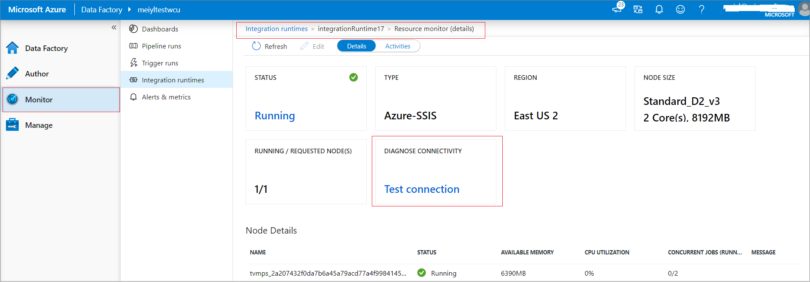

# Use the diagnose connectivity feature in the SSIS integration runtime

[!INCLUDE[appliesto-adf-xxx-md](includes/appliesto-adf-xxx-md.md)]

You might find connectivity problems while executing SQL Server Integration Services (SSIS) packages in the SSIS integration runtime. These problems occur especially if your SSIS integration runtime joins the Azure virtual network.

Troubleshoot connectivity problems by using the *diagnose connectivity* feature to test connections. The feature is located on the monitoring SSIS integration runtime page of the Azure Data Factory portal.

 

 

Use the following sections to learn about the most common errors that occur when you're testing connections. Each section describes the:

- Error code
- Error message
- Potential cause(s) of the error
- Recommended solution(s)

## Error code: InvalidInput

- **Error message**: "Please verify your input is correct."
- **Potential cause**: Your input is incorrect.
- **Recommendation**: Check your input.

## Error code: FirewallOrNetworkIssue

- **Error message**: "Please verify that this port is open on your firewall/server/NSG and the network is stable."
- **Potential causes:**
  - Your server doesn't open the port.
  - Your network security group is denied outbound traffic on the port.
  - Your NVA/Azure Firewall/on-premises firewall doesn't open the port.
- **Recommendations:**
  - Open the port on the server.
  - Update the network security group to allow outbound traffic on the port.
  - Open the port on the NVA/Azure Firewall/on-premises firewall.

## Error code: MisconfiguredDnsSettings

- **Error message**: "If you’re using your own DNS server in the VNet joined by your Azure-SSIS IR, verify that it can resolve your host name."
- **Potential causes:**
  -  There's a problem with your custom DNS.
  -  You aren't using a fully qualified domain name (FQDN) for your private host name.
- **Recommendations:**
  -  Fix your custom DNS problem to make sure it can resolve the host name.
  -  Use the FQDN. Azure-SSIS IR won't automatically append your own DNS suffix. For example, use **<your_private_server>.contoso.com** instead of **<your_private_server>**.

## Error code: ServerNotAllowRemoteConnection

- **Error message**: "Please verify that your server allows remote TCP connections through this port."
- **Potential causes:**
  -  Your server firewall doesn't allow remote TCP connections.
  -  Your server isn't online.
- **Recommendations:**
  -  Allow remote TCP connections on the server firewall.
  -  Start the server.
   
## Error code: MisconfiguredNsgSettings

- **Error message**: "Please verify that the NSG of your VNet allows outbound traffic through this port. If you’re using Azure ExpressRoute and or a UDR, please verify that this port is open on your firewall/server."
- **Potential causes:**
  -  Your network security group is denied outbound traffic on the port.
  -  Your NVA/Azure Firewall/on-premises firewall doesn't open the port.
- **Recommendation:**
  -  Update the network security group to allow outbound traffic on the port.
  -  Open the port on the NVA/Azure Firewall/on-premises firewall.

## Error code: GenericIssues

- **Error message**: "Test connection failed due to generic issues."
- **Potential cause**: The test connection encountered a general temporary problem.
- **Recommendation**: Retry the test connection later. If retrying doesn't help, contact the Azure Data Factory support team.

## Error code: PSPingExecutionTimeout

- **Error message**: "Test connection timeout, please try again later."
- **Potential cause**: Test connectivity timed out.
- **Recommendation**: Retry the test connection later. If retrying doesn't help, contact the Azure Data Factory support team.

## Error code: NetworkInstable

- **Error message**: "Test connection irregularly succeeded due to network instability."
- **Potential cause**: Transient network issue.
- **Recommendation**: Check whether the server or firewall network is stable.

## Next steps

- [Deploy an SSIS project to Azure with SSMS](/sql/integration-services/ssis-quickstart-deploy-ssms)
- [Run SSIS packages in Azure with SSMS](/sql/integration-services/ssis-quickstart-run-ssms)
- [Schedule SSIS packages in Azure](/sql/integration-services/lift-shift/ssis-azure-schedule-packages-ssms)