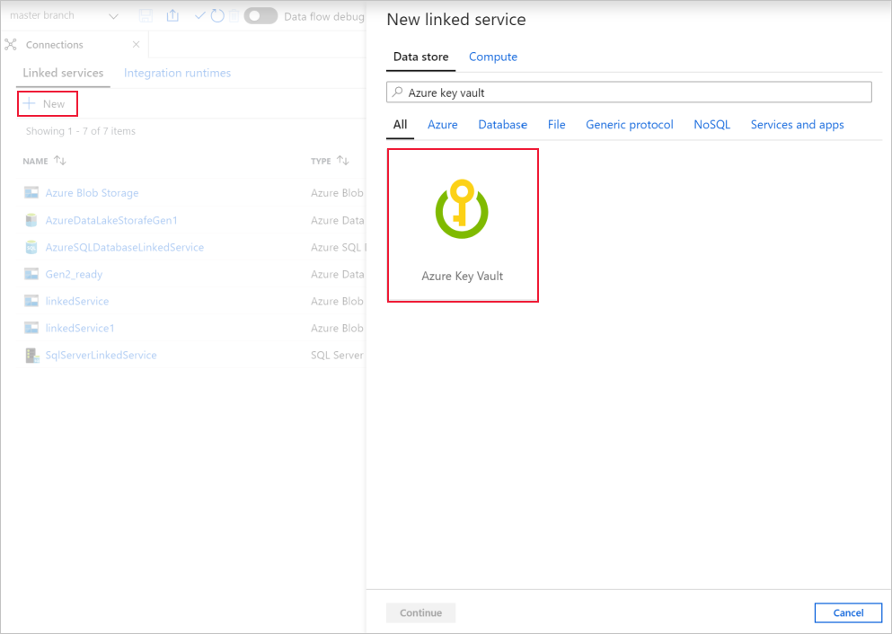
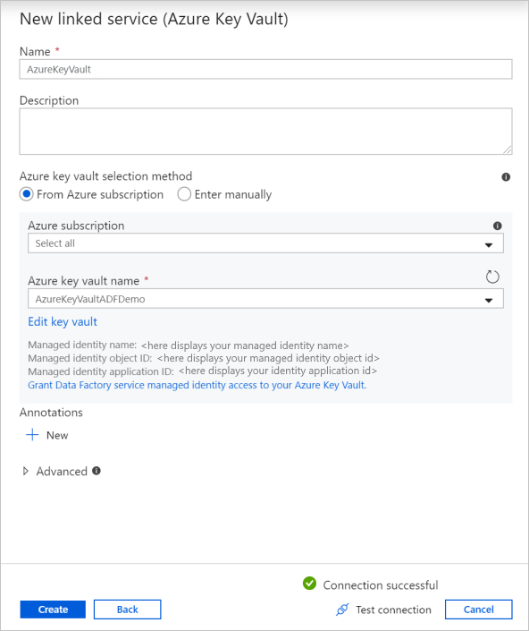
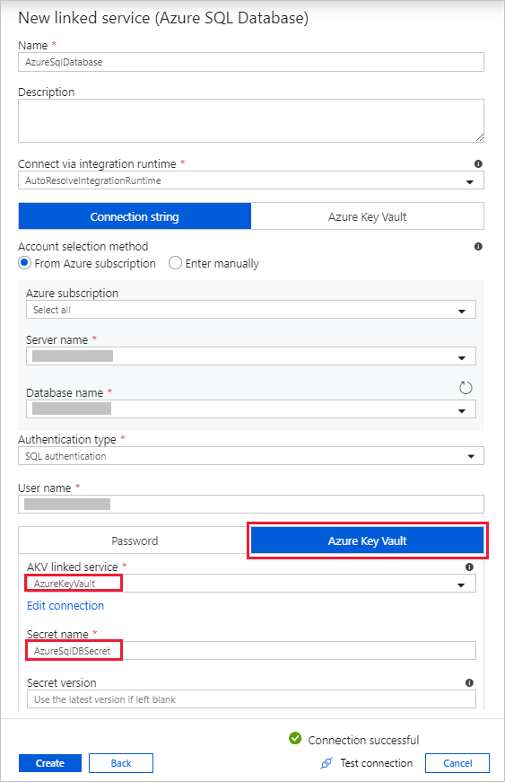

# Store credential in Azure Key Vault

You can store credentials for data stores and computes in an [Azure Key Vault](../key-vault/key-vault-overview.md). Azure Data Factory retrieves the credentials when executing an activity that uses the data store/compute.

Currently, all activity types except custom activity support this feature. For connector configuration specifically, check the "linked service properties" section in [each connector topic](copy-activity-overview.md#supported-data-stores-and-formats) for details.

## Prerequisites

This feature relies on the data factory managed identity. Learn how it works from [Managed identity for Data factory](data-factory-service-identity.md) and make sure your data factory have an associated one.

## Steps

To reference a credential stored in Azure Key Vault, you need to:

1. **Retrieve data factory managed identity** by copying the value of "Managed Identity Object ID" generated along with your factory. If you use ADF authoring UI, the managed identity object ID will be shown on the Azure Key Vault linked service creation window; you can also retrieve it from Azure portal, refer to [Retrieve data factory managed identity](data-factory-service-identity.md#retrieve-managed-identity).
2. **Grant the managed identity access to your Azure Key Vault.** In your key vault -> Access policies -> Add new -> search this managed identity to grant **Get** permission in Secret permissions dropdown. It allows this designated factory to access secret in key vault.
3. **Create a linked service pointing to your Azure Key Vault.** Refer to [Azure Key Vault linked service](#azure-key-vault-linked-service).
4. **Create data store linked service, inside which reference the corresponding secret stored in key vault.** Refer to [reference secret stored in key vault](#reference-secret-stored-in-key-vault).

## Azure Key Vault linked service

The following properties are supported for Azure Key Vault linked service:

| Property | Description | Required |
|:--- |:--- |:--- |
| type | The type property must be set to: **AzureKeyVault**. | Yes |
| baseUrl | Specify the Azure Key Vault URL. | Yes |

**Using authoring UI:**

Click **Connections** -> **Linked Services** -> **+New** -> search for "Azure Key Vault":



Select the provisioned Azure Key Vault where your credentials are stored. You can do **Test Connection** to make sure your AKV connection is valid. 



**JSON example:**

```json
{
    "name": "AzureKeyVaultLinkedService",
    "properties": {
        "type": "AzureKeyVault",
        "typeProperties": {
            "baseUrl": "https://<azureKeyVaultName>.vault.azure.net"
        }
    }
}
```

## Reference secret stored in key vault

The following properties are supported when you configure a field in linked service referencing a key vault secret:

| Property | Description | Required |
|:--- |:--- |:--- |
| type | The type property of the field must be set to: **AzureKeyVaultSecret**. | Yes |
| secretName | The name of secret in Azure Key Vault. | Yes |
| secretVersion | The version of secret in Azure Key Vault.<br/>If not specified, it always uses the latest version of the secret.<br/>If specified, then it sticks to the given version.| No |
| store | Refers to an Azure Key Vault linked service that you use to store the credential. | Yes |

**Using authoring UI:**

Select **Azure Key Vault** for secret fields while creating the connection to your data store/compute. Select the provisioned Azure Key Vault Linked Service and provide the **Secret name**. You can optionally provide a secret version as well. 

>[!TIP]
>For connectors using connection string in linked service like SQL Server, Blob storage, etc., you can choose either to store only the secret field e.g. password in AKV, or to store the entire connection string in AKV. You can find both options on the UI.



**JSON example: (see the "password" section)**

```json
{
    "name": "DynamicsLinkedService",
    "properties": {
        "type": "Dynamics",
        "typeProperties": {
            "deploymentType": "<>",
            "organizationName": "<>",
            "authenticationType": "<>",
            "username": "<>",
            "password": {
                "type": "AzureKeyVaultSecret",
                "secretName": "<secret name in AKV>",
                "store":{
                    "referenceName": "<Azure Key Vault linked service>",
                    "type": "LinkedServiceReference"
                }
            }
        }
    }
}
```

## Next steps
For a list of data stores supported as sources and sinks by the copy activity in Azure Data Factory, see [supported data stores](copy-activity-overview.md#supported-data-stores-and-formats).
