# Incrementally copy new files based on time partitioned file name by using the Copy Data tool

In this tutorial, you use the Azure portal to create a data factory. Then, you use the Copy Data tool to create a pipeline that incrementally copies new files based on time partitioned file name from Azure Blob storage to Azure Blob storage.

> [!NOTE]
> If you're new to Azure Data Factory, see [Introduction to Azure Data Factory](introduction.md).

In this tutorial, you perform the following steps:

> [!div class="checklist"]
> * Create a data factory.
> * Use the Copy Data tool to create a pipeline.
> * Monitor the pipeline and activity runs.

## Prerequisites

* **Azure subscription**: If you don't have an Azure subscription, create a [free account](https://azure.microsoft.com/free/) before you begin.
* **Azure storage account**: Use Blob storage as the _source_  and _sink_ data store. If you don't have an Azure storage account, see the instructions in [Create a storage account](../storage/common/storage-account-create.md).

### Create two containers in Blob storage

Prepare your Blob storage for the tutorial by performing these steps.

1. Create a container named **source**.  Create a folder path as **2019/02/26/14** in your container. Create an empty text file, and name it as **file1.txt**. Upload the file1.txt to the folder path **source/2019/02/26/14** in your storage account.  You can use various tools to perform these tasks, such as [Azure Storage Explorer](https://storageexplorer.com/).

	

	> [!NOTE]
	> Please adjust the folder name with your UTC time.  For example, if the current UTC time is 2:03 PM on Feb 26th, 2019, you can create the folder path as **source/2019/02/26/14/** by the rule of **source/{Year}/{Month}/{Day}/{Hour}/**.

2. Create a container named **destination**. You can use various tools to perform these tasks, such as [Azure Storage Explorer](https://storageexplorer.com/).

## Create a data factory

1. On the left menu, select **Create a resource** > **Data + Analytics** > **Data Factory**:

   

2. On the **New data factory** page, under **Name**, enter **ADFTutorialDataFactory**.

	The name for your data factory must be _globally unique_. You might receive the following error message:

   

   If you receive an error message about the name value, enter a different name for the data factory. For example, use the name _**yourname**_**ADFTutorialDataFactory**. For the naming rules for Data Factory artifacts, see [Data Factory naming rules](naming-rules.md).
3. Select the Azure **subscription** in which to create the new data factory.
4. For **Resource Group**, take one of the following steps:

    a. Select **Use existing**, and select an existing resource group from the drop-down list.

    b. Select **Create new**, and enter the name of a resource group. 
         
    To learn about resource groups, see [Use resource groups to manage your Azure resources](../azure-resource-manager/management/overview.md).

5. Under **version**, select **V2** for the version.
6. Under **location**, select the location for the data factory. Only supported locations are displayed in the drop-down list. The data stores (for example, Azure Storage and SQL Database) and computes (for example, Azure HDInsight) that are used by your data factory can be in other locations and regions.
7. Select **Pin to dashboard**.
8. Select **Create**.
9. On the dashboard, the **Deploying Data Factory** tile shows the process status.

	
10. After creation is finished, the **Data Factory** home page is displayed.

    
11. To launch the Azure Data Factory user interface (UI) in a separate tab, select the **Author & Monitor** tile.

## Use the Copy Data tool to create a pipeline

1. On the **Let's get started** page, select the **Copy Data** title to launch the Copy Data tool.

   

2. On the **Properties** page, take the following steps:

	a. Under **Task name**, enter **DeltaCopyFromBlobPipeline**.

	b. Under **Task cadence or Task schedule**, select **Run regularly on schedule**.

	c. Under **Trigger type**, select **Tumbling Window**.

	d. Under **Recurrence**, enter **1 Hour(s)**.

	e. Select **Next**.

	The Data Factory UI creates a pipeline with the specified task name.

    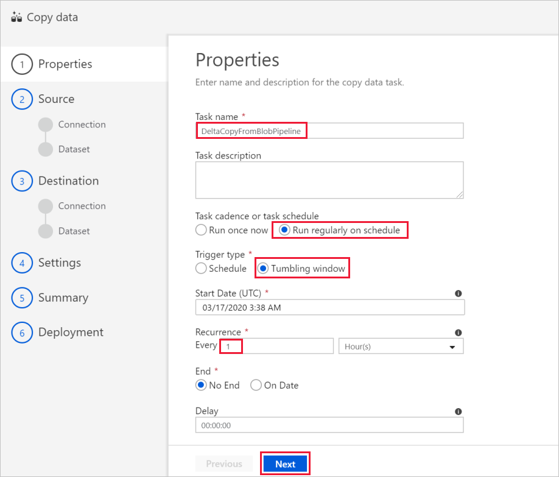
3. On the **Source data store** page, complete the following steps:

	a. Click  **+ Create new connection**, to add a connection.

	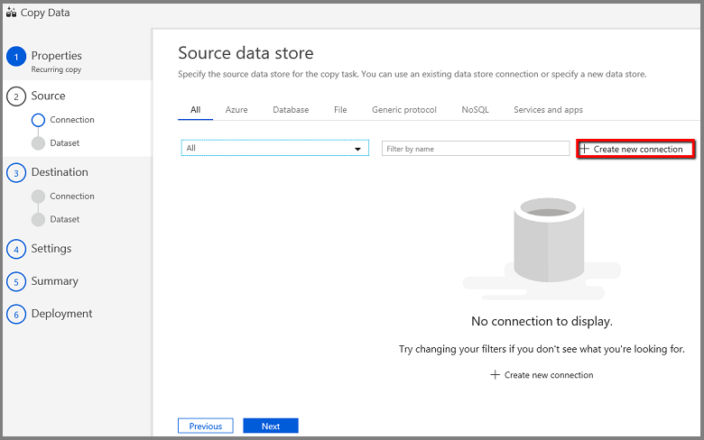

	b. Select **Azure Blob Storage** from the gallery, and then click **Continue**.

	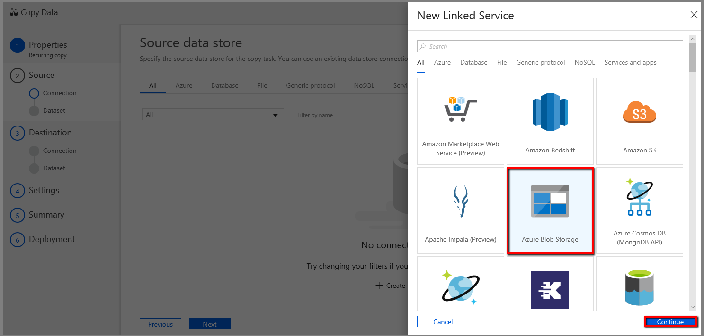

	c. On the **New Linked Service** page, select your storage account from the **Storage account name** list, and then click **Finish**.

	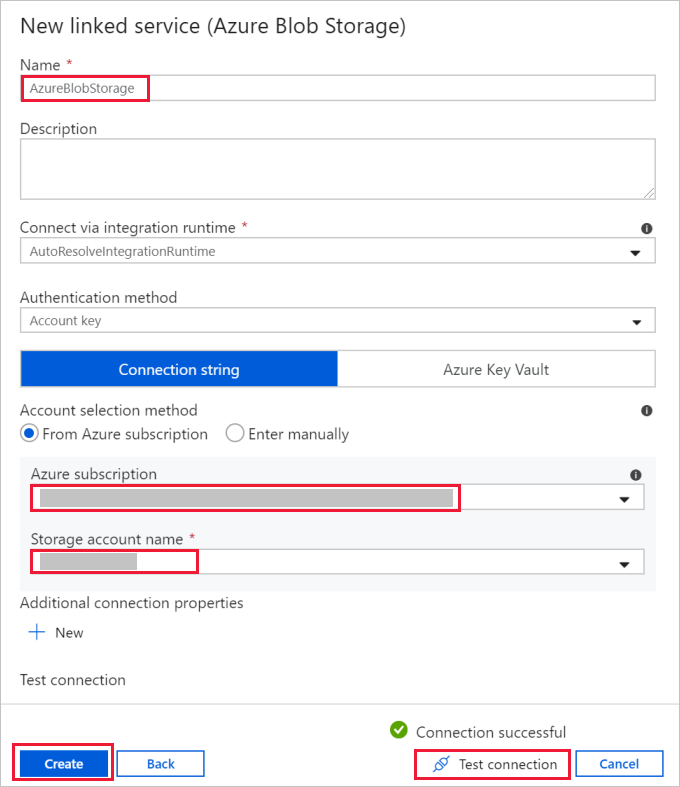

	d. Select the newly created linked service, then click **Next**.

   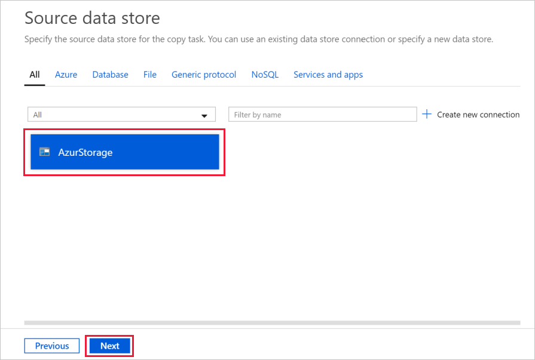
4. On the **Choose the input file or folder** page, do the following steps:

    a. Browse and select the **source** container, then select **Choose**.

	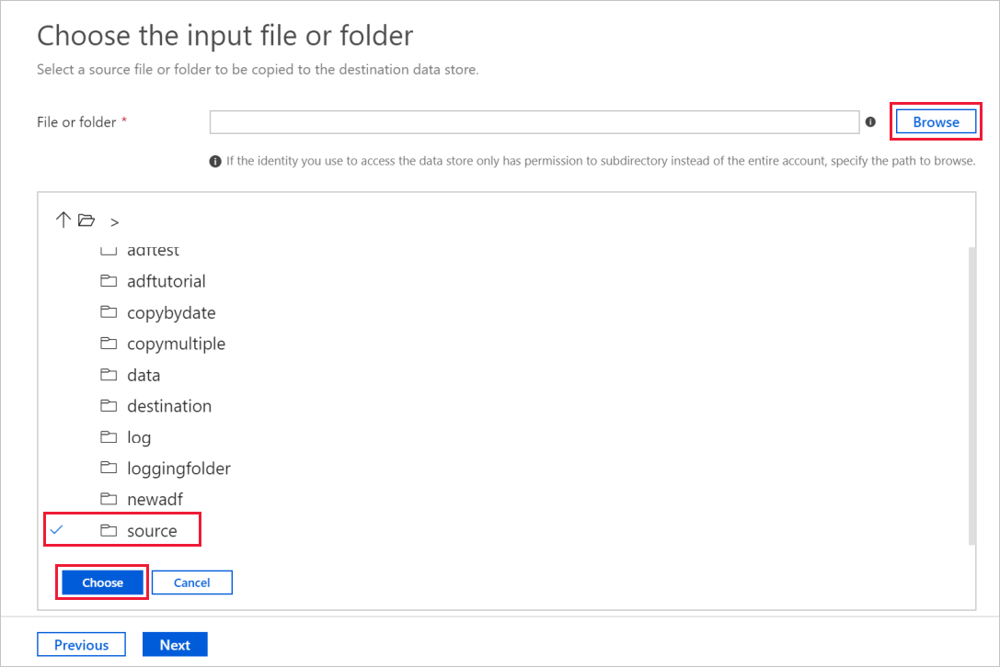

	b. Under **File loading behavior**, select **Incremental load: time-partitioned folder/file names**.

	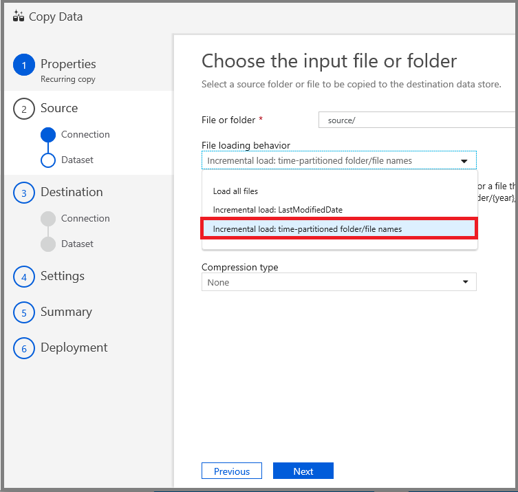

	c. Write the dynamic folder path as **source/{year}/{month}/{day}/{hour}/**, and change the format as followings:

	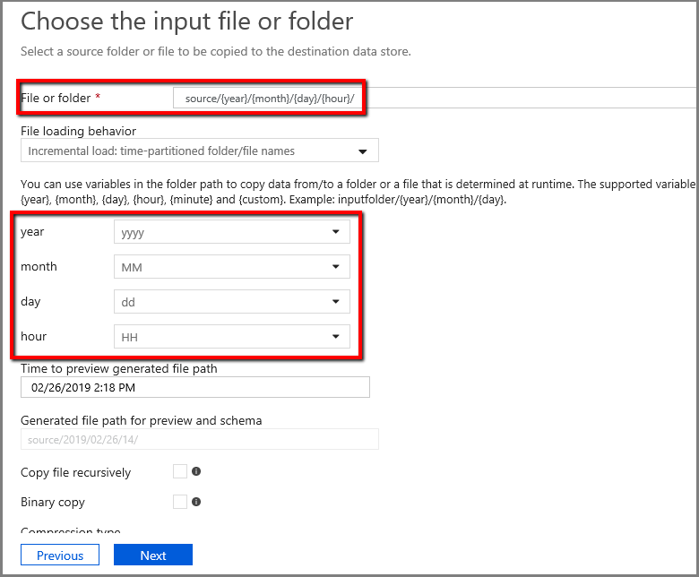

	d. Check **Binary copy** and click **Next**.

	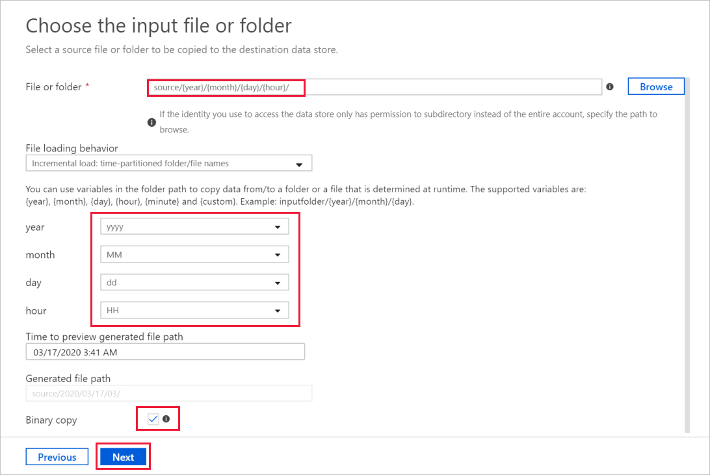	 
5. On the **Destination data store** page, select the **AzureBlobStorage**, which is the same storage account as data source store, and then click **Next**.

	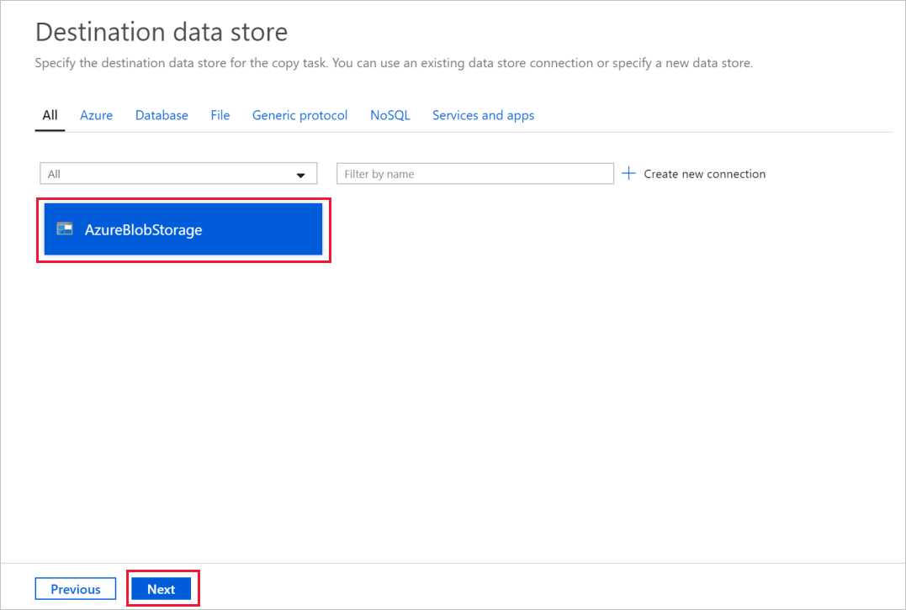
6. On the **Choose the output file or folder** page, do the following steps:

    a. Browse and select the **destination** folder, then click **Choose**.

	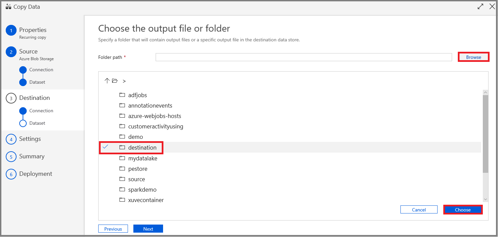

	b. Write the dynamic folder path as **source/{year}/{month}/{day}/{hour}/**, and change the format as followings:

	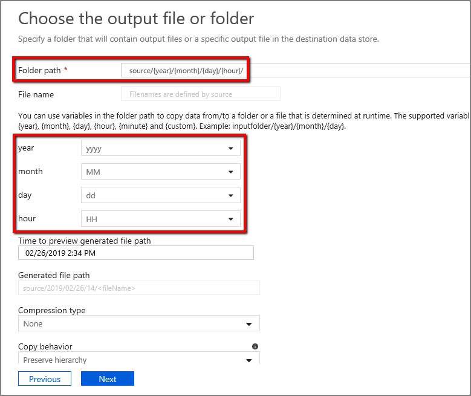

	c. Click **Next**.

	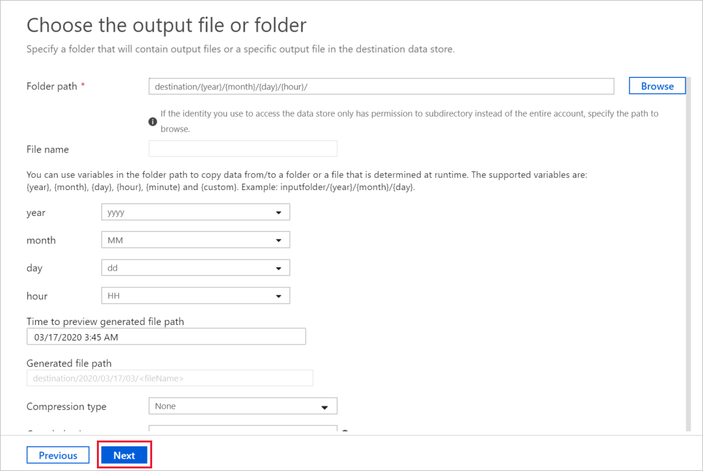
7. On the **Settings** page, select **Next**.

    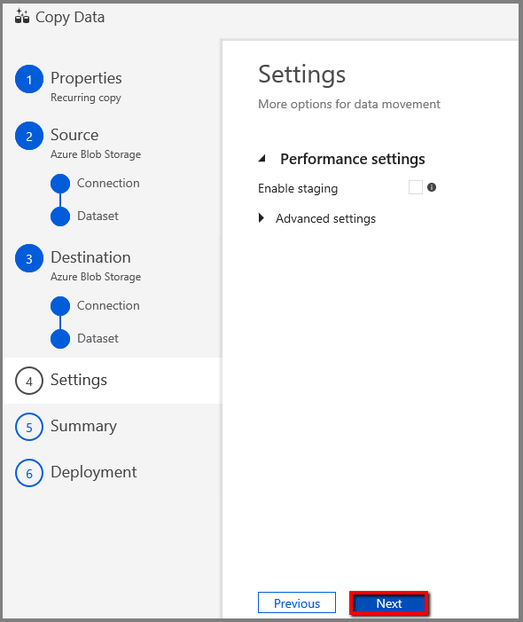
8. On the **Summary** page, review the settings, and then select **Next**.

    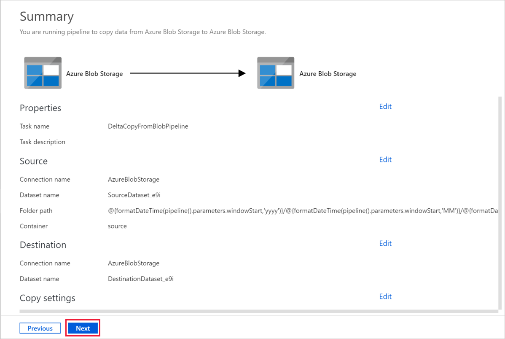

9. On the **Deployment page**, select **Monitor** to monitor the pipeline (task).
    

10. Notice that the **Monitor** tab on the left is automatically selected.  You need wait for the pipeline run when it is triggered automatically (about after one hour).  When it runs, the **Actions** column includes links to view activity run details and to rerun the pipeline. Select **Refresh** to refresh the list, and select the **View Activity Runs** link in the **Actions** column.

	
11. There's only one activity (copy activity) in the pipeline, so you see only one entry. You can see the source file (file1.txt) has been copied from  **source/2019/02/26/14/**  to **destination/2019/02/26/14/** with the same file name.  

	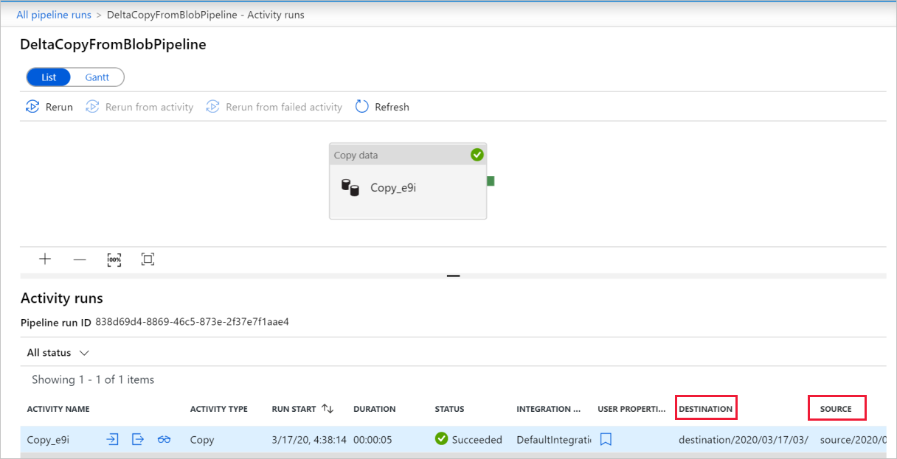

	You can also verify the same by using Azure Storage Explorer (https://storageexplorer.com/) to scan the files.

	
12. Create another empty text file with the new name as **file2.txt**. Upload the file2.txt file to the folder path **source/2019/02/26/15** in your storage account.   You can use various tools to perform these tasks, such as [Azure Storage Explorer](https://storageexplorer.com/).

	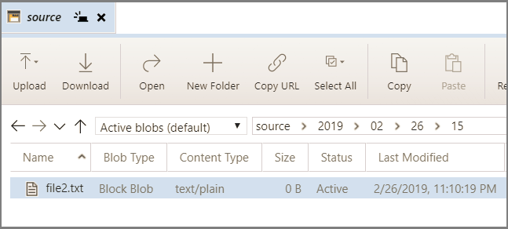

	> [!NOTE]
	> You might be aware that a new folder path is required to be created. Please adjust the folder name with your UTC time.  For example, if the current UTC time is 3:20 PM on Feb 26th, 2019, you can create the folder path as **source/2019/02/26/15/** by the rule of **{Year}/{Month}/{Day}/{Hour}/**.

13. To go back to the **Pipeline Runs** view, select **All Pipelines Runs**, and wait for the same pipeline being triggered again automatically after another one hour.  

	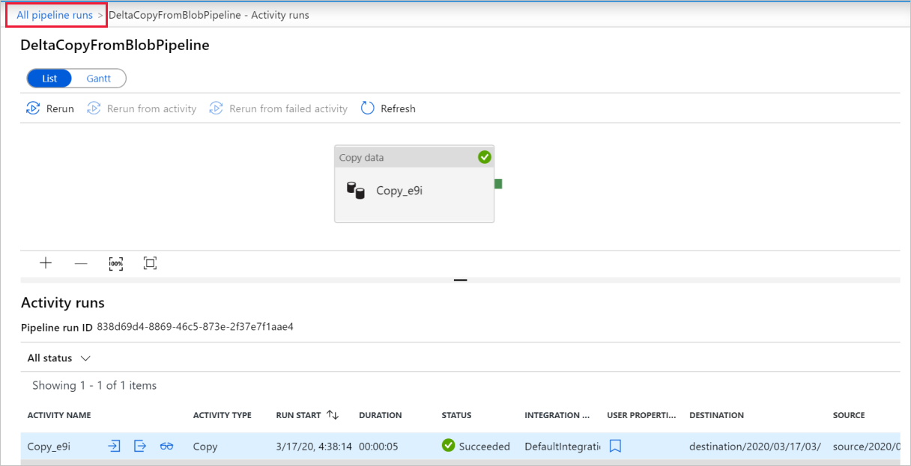

14. Select **View Activity Run** for the second pipeline run when it comes, and do the same to review details.  

	

	You can see the source file (file2.txt) has been copied from  **source/2019/02/26/15/**  to **destination/2019/02/26/15/** with the same file name.

	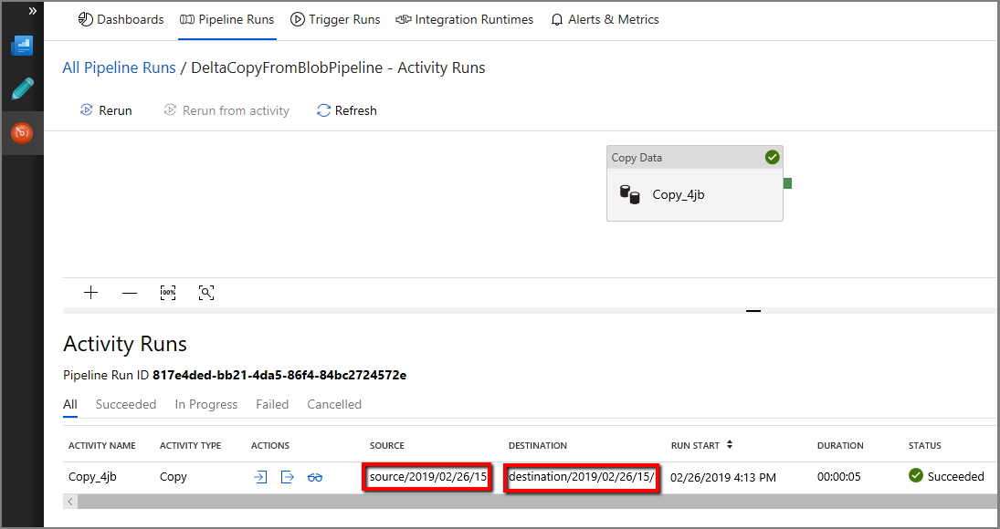

	You can also verify the same by using Azure Storage Explorer (https://storageexplorer.com/) to scan the files in **destination** container

	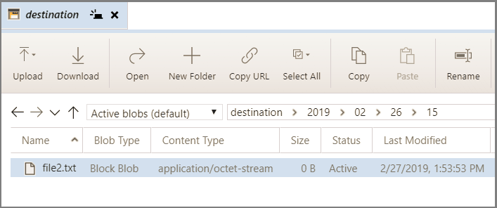

## Next steps
Advance to the following tutorial to learn about transforming data by using a Spark cluster on Azure:

> [!div class="nextstepaction"]
>[Transform data using Spark cluster in cloud](tutorial-transform-data-spark-portal.md)
