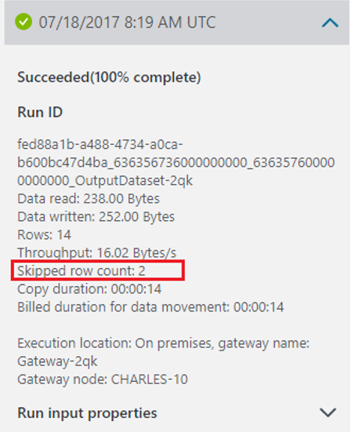

# Add fault tolerance in Copy Activity by skipping incompatible rows

> [!div class="op_single_selector" title1="Select the version of Data Factory service you are using:"]
> * [Version 1](data-factory-copy-activity-fault-tolerance.md)
> * [Version 2 (current version)](../copy-activity-fault-tolerance.md)

> [!NOTE]
> This article applies to version 1 of Data Factory. If you are using the current version of the Data Factory service, see [fault tolerance in copy activity of Data Factory](../copy-activity-fault-tolerance.md).

Azure Data Factory [Copy Activity](data-factory-data-movement-activities.md) offers you two ways to handle incompatible rows when copying data between source and sink data stores:

- You can abort and fail the copy activity when incompatible data is encountered (default behavior).
- You can continue to copy all of the data by adding fault tolerance and skipping incompatible data rows. In addition, you can log the incompatible rows in Azure Blob storage. You can then examine the log to learn the cause for the failure, fix the data on the data source, and retry the copy activity.

## Supported scenarios
Copy Activity supports three scenarios for detecting, skipping, and logging incompatible data:

- **Incompatibility between the source data type and the sink native type**

    For example: Copy data from a CSV file in Blob storage to a SQL database with a schema definition that contains three **INT** type columns. The CSV file rows that contain numeric data, such as `123,456,789` are copied successfully to the sink store. However, the rows that contain non-numeric values, such as `123,456,abc` are detected as incompatible and are skipped.

- **Mismatch in the number of columns between the source and the sink**

    For example: Copy data from a CSV file in Blob storage to a SQL database with a schema definition that contains six columns. The CSV file rows that contain six columns are copied successfully to the sink store. The CSV file rows that contain more or fewer than six columns are detected as incompatible and are skipped.

- **Primary key violation when writing to SQL Server/Azure SQL Database/Azure Cosmos DB**

    For example: Copy data from a SQL server to a SQL database. A primary key is defined in the sink SQL database, but no such primary key is defined in the source SQL server. The duplicated rows that exist in the source cannot be copied to the sink. Copy Activity copies only the first row of the source data into the sink. The subsequent source rows that contain the duplicated primary key value are detected as incompatible and are skipped.

>[!NOTE]
>This feature doesn't apply when copy activity is configured to invoke external data loading mechanism including [Azure Synapse Analytics PolyBase](data-factory-azure-sql-data-warehouse-connector.md#use-polybase-to-load-data-into-azure-synapse-analytics) or [Amazon Redshift Unload](data-factory-amazon-redshift-connector.md#use-unload-to-copy-data-from-amazon-redshift). For loading data into Azure Synapse Analytics using PolyBase, use PolyBase's native fault tolerance support by specifying "[polyBaseSettings](data-factory-azure-sql-data-warehouse-connector.md#sqldwsink)" in copy activity.

## Configuration
The following example provides a JSON definition to configure skipping the incompatible rows in Copy Activity:

```json
"typeProperties": {
    "source": {
        "type": "BlobSource"
    },
    "sink": {
        "type": "SqlSink",
    },
    "enableSkipIncompatibleRow": true,
    "redirectIncompatibleRowSettings": {
        "linkedServiceName": "BlobStorage",
        "path": "redirectcontainer/erroroutput"
    }
}
```

| Property | Description | Allowed values | Required |
| --- | --- | --- | --- |
| **enableSkipIncompatibleRow** | Enable skipping incompatible rows during copy or not. | True<br/>False (default) | No |
| **redirectIncompatibleRowSettings** | A group of properties that can be specified when you want to log the incompatible rows. | &nbsp; | No |
| **linkedServiceName** | The linked service of Azure Storage to store the log that contains the skipped rows. | The name of an [AzureStorage](data-factory-azure-blob-connector.md#azure-storage-linked-service) or [AzureStorageSas](data-factory-azure-blob-connector.md#azure-storage-sas-linked-service) linked service, which refers to the storage instance that you want to use to store the log file. | No |
| **path** | The path of the log file that contains the skipped rows. | Specify the Blob storage path that you want to use to log the incompatible data. If you do not provide a path, the service creates a container for you. | No |

## Monitoring
After the copy activity run completes, you can see the number of skipped rows in the monitoring section:



If you configure to log the incompatible rows, you can find the log file at this path: `https://[your-blob-account].blob.core.windows.net/[path-if-configured]/[copy-activity-run-id]/[auto-generated-GUID].csv` In the log file, you can see the rows that were skipped and the root cause of the incompatibility.

Both the original data and the corresponding error are logged in the file. An example of the log file content is as follows:
```
data1, data2, data3, UserErrorInvalidDataValue,Column 'Prop_2' contains an invalid value 'data3'. Cannot convert 'data3' to type 'DateTime'.,
data4, data5, data6, Violation of PRIMARY KEY constraint 'PK_tblintstrdatetimewithpk'. Cannot insert duplicate key in object 'dbo.tblintstrdatetimewithpk'. The duplicate key value is (data4).
```

## Next steps
To learn more about Azure Data Factory Copy Activity, see [Move data by using Copy Activity](data-factory-data-movement-activities.md).
