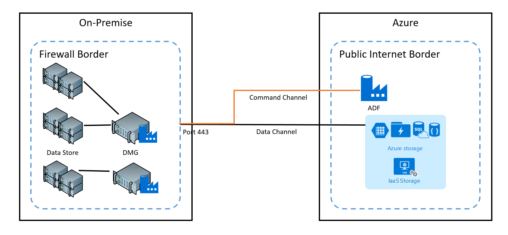
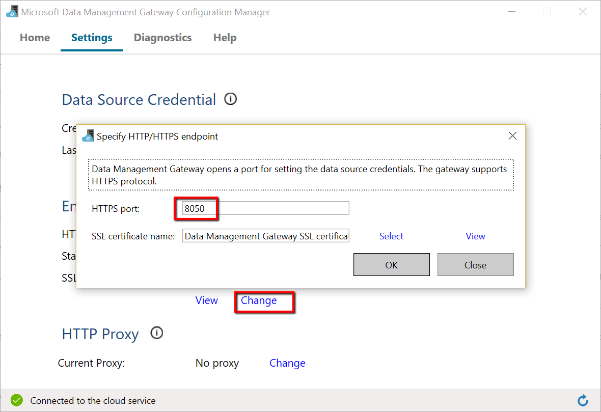
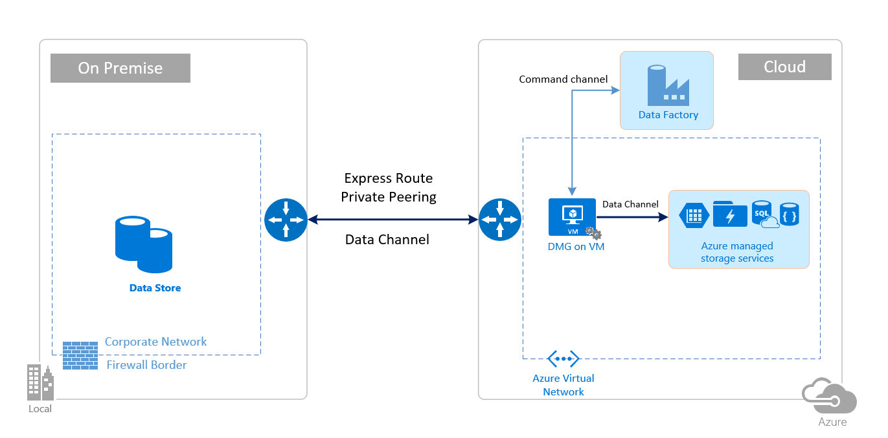
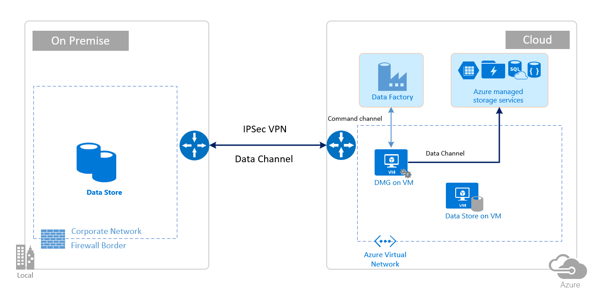
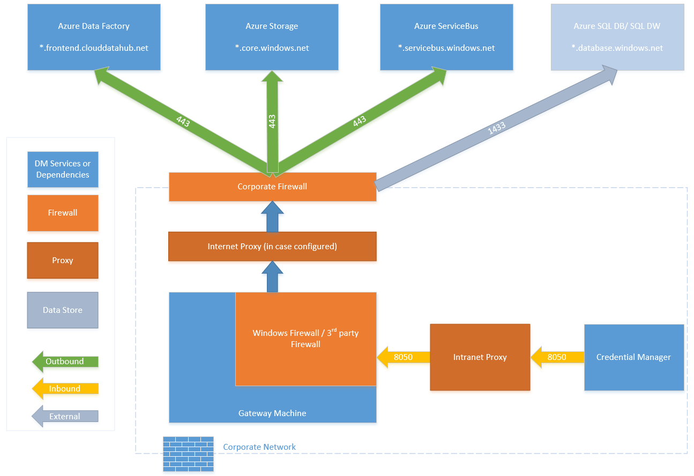

# Azure Data Factory - Security considerations for data movement

> [!NOTE]
> This article applies to version 1 of Data Factory. If you are using the current version of the Data Factory service, see [data movement security considerations for Data Factory](../data-movement-security-considerations.md).

## Introduction
This article describes basic security infrastructure that data movement services in Azure Data Factory use to secure your data. Azure Data Factory management resources are built on Azure security infrastructure and use all possible security measures offered by Azure.

In a Data Factory solution, you create one or more data [pipelines](data-factory-create-pipelines.md). A pipeline is a logical grouping of activities that together perform a task. These pipelines reside in the region where the data factory was created. 

Even though Data Factory is available in only **West US**, **East US**, and **North Europe** regions, the data movement service is available [globally in several regions](data-factory-data-movement-activities.md#global). Data Factory service ensures that data does not leave a geographical area/ region unless you explicitly instruct the service to use an alternate region if the data movement service is not yet deployed to that region. 

Azure Data Factory itself does not store any data except for linked service credentials for cloud data stores, which are encrypted using certificates. It lets you create data-driven workflows to orchestrate movement of data between [supported data stores](data-factory-data-movement-activities.md#supported-data-stores-and-formats) and processing of data using [compute services](data-factory-compute-linked-services.md) in other regions or in an on-premises environment. It also allows you to [monitor and manage workflows](data-factory-monitor-manage-pipelines.md) using both programmatic and UI mechanisms.

Data movement using Azure Data Factory has been **certified** for:
-	[HIPAA/HITECH](https://www.microsoft.com/en-us/trustcenter/Compliance/HIPAA)  
-	[ISO/IEC 27001](https://www.microsoft.com/en-us/trustcenter/Compliance/ISO-IEC-27001)  
-	[ISO/IEC 27018](https://www.microsoft.com/en-us/trustcenter/Compliance/ISO-IEC-27018) 
-	[CSA STAR](https://www.microsoft.com/en-us/trustcenter/Compliance/CSA-STAR-Certification)
	 
If you are interested in Azure compliance and how Azure secures its own infrastructure, visit the [Microsoft Trust Center](https://microsoft.com/en-us/trustcenter/default.aspx). 

In this article, we review security considerations in the following two data movement scenarios: 

- **Cloud scenario**- In this scenario, both your source and destination are publicly accessible through internet. These include managed cloud storage services like Azure Storage, Azure Synapse Analytics (formerly SQL Data Warehouse), Azure SQL Database, Azure Data Lake Store, Amazon S3, Amazon Redshift, SaaS services such as Salesforce, and web protocols such as FTP and OData. You can find a complete list of supported data sources [here](data-factory-data-movement-activities.md#supported-data-stores-and-formats).
- **Hybrid scenario**- In this scenario, either your source or destination is behind a firewall or inside an on-premises corporate network or the data store is in a private network/ virtual network (most often the source) and is not publicly accessible. Database servers hosted on virtual machines also fall under this scenario.

[!INCLUDE [updated-for-az](../../../includes/updated-for-az.md)]

## Cloud scenarios
### Securing data store credentials
Azure Data Factory protects your data store credentials by **encrypting** them by using **certificates managed by Microsoft**. These certificates are rotated every **two years** (which includes renewal of certificate and migration of credentials). These encrypted credentials are securely stored in an **Azure Storage managed by Azure Data Factory management services**. For more information about Azure Storage security, refer [Azure Storage Security Overview](../../security/fundamentals/storage-overview.md).

### Data encryption in transit
If the cloud data store supports HTTPS or TLS, all data transfers between data movement services in Data Factory and a cloud data store are via secure channel HTTPS or TLS.

> [!NOTE]
> All connections to **Azure SQL Database** and **Azure Synapse Analytics** always require encryption (SSL/TLS) while data is in transit to and from the database. While authoring a pipeline using a JSON editor, add the **encryption** property and set it to **true** in the **connection string**. When you use the [Copy Wizard](data-factory-azure-copy-wizard.md), the wizard sets this property by default. For **Azure Storage**, you can use **HTTPS** in the connection string.

### Data encryption at rest
Some data stores support encryption of data at rest. We suggest that you enable data encryption mechanism for those data stores. 

#### Azure Synapse Analytics
Transparent Data Encryption (TDE) in Azure Synapse Analytics helps with protecting against the threat of malicious activity by performing real-time encryption and decryption of your data at rest. This behavior is transparent to the client. For more information, see [Secure a database in Synapse Analytics](../../synapse-analytics/sql-data-warehouse/sql-data-warehouse-overview-manage-security.md).

#### Azure SQL Database
Azure SQL Database also supports transparent data encryption (TDE), which helps with protecting against the threat of malicious activity by performing real-time encryption and decryption of the data without requiring changes to the application. This behavior is transparent to the client. For more information, see [Transparent Data Encryption with Azure SQL Database](https://docs.microsoft.com/sql/relational-databases/security/encryption/transparent-data-encryption-with-azure-sql-database). 

#### Azure Data Lake Store
Azure Data Lake store also provides encryption for data stored in the account. When enabled, Data Lake store automatically encrypts data before persisting and decrypts before retrieval, making it transparent to the client accessing the data. For more information, see [Security in Azure Data Lake Store](../../data-lake-store/data-lake-store-security-overview.md). 

#### Azure Blob Storage and Azure Table Storage
Azure Blob Storage and Azure Table storage supports Storage Service Encryption (SSE), which automatically encrypts your data before persisting to storage and decrypts before retrieval. For more information, see [Azure Storage Service Encryption for Data at Rest](../../storage/common/storage-service-encryption.md).

#### Amazon S3
Amazon S3 supports both client and server encryption of data at Rest. For more information, see [Protecting Data Using Encryption](https://docs.aws.amazon.com/AmazonS3/latest/dev/UsingEncryption.html). Currently, Data Factory does not support Amazon S3 inside a virtual private cloud (VPC).

#### Amazon Redshift
Amazon Redshift supports cluster encryption for data at rest. For more information, see [Amazon Redshift Database Encryption](https://docs.aws.amazon.com/redshift/latest/mgmt/working-with-db-encryption.html). Currently, Data Factory does not support Amazon Redshift inside a VPC. 

#### Salesforce
Salesforce supports Shield Platform Encryption that allows encryption of all files, attachments, custom fields. For more information, see [Understanding the Web Server OAuth Authentication Flow](https://developer.salesforce.com/docs/atlas.en-us.api_rest.meta/api_rest/intro_understanding_web_server_oauth_flow.htm).  

## Hybrid Scenarios (using Data Management Gateway)
Hybrid scenarios require Data Management Gateway to be installed in an on-premises network or inside a virtual network (Azure) or a virtual private cloud (Amazon). The gateway must be able to access the local data stores. For more information about the gateway, see [Data Management Gateway](data-factory-data-management-gateway.md). 

The **command channel** allows communication between data movement services in Data Factory and Data Management Gateway. The communication contains information related to the activity. The data channel is used for transferring data between on-premises data stores and cloud data stores.    

### On-premises data store credentials
The credentials for your on-premises data stores are stored locally (not in the cloud). They can be set in three different ways. 

- Using **plain-text** (less secure) via HTTPS from Azure Portal/ Copy Wizard. The credentials are passed in plain-text to the on-premises gateway.
- Using **JavaScript Cryptography library from Copy Wizard**.
- Using **click-once based credentials manager app**. The click-once application executes on the on-premises machine that has access to the gateway and sets credentials for the data store. This option and the next one are the most secure options. The credential manager app, by default, uses the port 8050 on the machine with gateway for secure communication.  
- Use [New-AzDataFactoryEncryptValue](/powershell/module/az.datafactory/New-azDataFactoryEncryptValue) PowerShell cmdlet to encrypt credentials. The cmdlet uses the certificate that gateway is configured to use to encrypt the credentials. You can use the encrypted credentials returned by this cmdlet and add it to **EncryptedCredential** element of the **connectionString** in the JSON file that you use with the [New-AzDataFactoryLinkedService](/powershell/module/az.datafactory/new-azdatafactorylinkedservice) cmdlet or in the JSON snippet in the Data Factory Editor in the portal. This option and the click-once application are the most secure options. 

#### JavaScript cryptography library-based encryption
You can encrypt data store credentials using [JavaScript Cryptography library](https://www.microsoft.com/download/details.aspx?id=52439) from the [Copy Wizard](data-factory-copy-wizard.md). When you select this option, the Copy Wizard retrieves the public key of gateway and uses it to encrypt the data store credentials. The credentials are decrypted by the gateway machine and protected by Windows [DPAPI](https://msdn.microsoft.com/library/ms995355.aspx).

**Supported browsers:** IE8, IE9, IE10, IE11, Microsoft Edge, and latest Firefox, Chrome, Opera, Safari browsers. 

#### Click-once credentials manager app
You can launch the click-once based credential manager app from Azure portal/Copy Wizard when authoring pipelines. This application ensures that credentials are not transferred in plain text over the wire. By default, it uses the port **8050** on the machine with gateway for secure communication. If necessary, this port can be changed.  
  

Currently, Data Management Gateway uses a single **certificate**. This certificate is created during the gateway installation (applies to Data Management Gateway created after November 2016 and version 2.4.xxxx.x or later). You can replace this certificate with your own SSL/TLS certificate. This certificate is used by the click-once credential manager application to securely connect to the gateway machine for setting data store credentials. It stores data store credentials securely on-premises by using the Windows [DPAPI](https://msdn.microsoft.com/library/ms995355.aspx) on the machine with gateway. 

> [!NOTE]
> Older gateways that were installed before November 2016 or of version 2.3.xxxx.x continue to use credentials encrypted and stored on cloud. Even if you upgrade the gateway to the latest version, the credentials are not migrated to an on-premises machine    
  
| Gateway version (during creation) | Credentials Stored | Credential encryption/ security | 
| --------------------------------- | ------------------ | --------- |  
| < = 2.3.xxxx.x | On cloud | Encrypted using certificate (different from the one used by Credential manager app) | 
| > = 2.4.xxxx.x | On premises | Secured via DPAPI | 
  

### Encryption in transit
All data transfers are via secure channel **HTTPS** and **TLS over TCP** to prevent man-in-the-middle attacks during communication with Azure services.
 
You can also use [IPSec VPN](../../vpn-gateway/vpn-gateway-about-vpn-devices.md) or [Express Route](../../expressroute/expressroute-introduction.md) to further secure the communication channel between your on-premises network and Azure.

Virtual network is a logical representation of your network in the cloud. You can connect an on-premises network to your Azure virtual network (VNet) by setting up IPSec VPN (site-to-site) or Express Route (Private Peering)		

The following table summarizes the network and gateway configuration recommendations based on different combinations of source and destination locations for hybrid data movement.

| Source | Destination | Network configuration | Gateway setup |
| ------ | ----------- | --------------------- | ------------- | 
| On-premises | Virtual machines and cloud services deployed in virtual networks | IPSec VPN (point-to-site or site-to-site) | Gateway can be installed either on-premises or on an Azure virtual machine (VM) in VNet | 
| On-premises | Virtual machines and cloud services deployed in virtual networks | ExpressRoute (Private Peering) | Gateway can be installed either on-premises or on an Azure VM in VNet | 
| On-premises | Azure-based services that have a public endpoint | ExpressRoute (Public Peering) | Gateway must be installed on-premises | 

The following images show the usage of Data Management Gateway for moving data between an on-premises database and Azure services using Express route and IPSec VPN (with Virtual Network):

**Express Route:**
 
 

**IPSec VPN:**

### Firewall configurations and whitelisting IP address of gateway

#### Firewall requirements for on-premises/private network	
In an enterprise, a **corporate firewall** runs on the central router of the organization. And, **Windows firewall** runs as a daemon on the local machine on which the gateway is installed. 

The following table provides **outbound port** and domain requirements for the **corporate firewall**.

| Domain names | Outbound ports | Description |
| ------------ | -------------- | ----------- | 
| `*.servicebus.windows.net` | 443, 80 | Required by the gateway to connect to data movement services in Data Factory |
| `*.core.windows.net` | 443 | Used by the gateway to connect to Azure Storage Account when you use the [staged copy](data-factory-copy-activity-performance.md#staged-copy) feature. | 
| `*.frontend.clouddatahub.net` | 443 | Required by the gateway to connect to the Azure Data Factory service. | 
| `*.database.windows.net` | 1433	| (OPTIONAL) needed when your destination is Azure SQL Database/ Azure Synapse Analytics. Use the staged copy feature to copy data to Azure SQL Database/Azure Synapse Analytics without opening the port 1433. | 
| `*.azuredatalakestore.net` | 443 | (OPTIONAL) needed when your destination is Azure Data Lake store | 

> [!NOTE] 
> You may have to manage ports/ whitelisting domains at the corporate firewall level as required by respective data sources. This table only uses Azure SQL Database, Azure Synapse Analytics, Azure Data Lake Store as examples.   

The following table provides **inbound port** requirements for the **windows firewall**.

| Inbound ports | Description | 
| ------------- | ----------- | 
| 8050 (TCP) | Required by the credential manager application to securely set credentials for on-premises data stores on the gateway. | 

#### IP configurations/ whitelisting in data store
Some data stores in the cloud also require whitelisting of IP address of the machine accessing them. Ensure that the IP address of the gateway machine is whitelisted/ configured in firewall appropriately.

The following cloud data stores require whitelisting of IP address of the gateway machine. Some of these data stores, by default, may not require whitelisting of the IP address. 

- [Azure SQL Database](../../azure-sql/database/firewall-configure.md) 
- [Azure Synapse Analytics](../../sql-data-warehouse/sql-data-warehouse-get-started-provision.md)
- [Azure Data Lake Store](../../data-lake-store/data-lake-store-secure-data.md#set-ip-address-range-for-data-access)
- [Azure Cosmos DB](../../cosmos-db/firewall-support.md)
- [Amazon Redshift](https://docs.aws.amazon.com/redshift/latest/gsg/rs-gsg-authorize-cluster-access.html) 

## Frequently asked questions

**Question:** Can the Gateway be shared across different data factories?
**Answer:** We do not support this feature yet. We are actively working on it.

**Question:** What are the port requirements for the gateway to work?
**Answer:** Gateway makes HTTP-based connections to open internet. The **outbound ports 443 and 80** must be opened for gateway to make this connection. Open **Inbound Port 8050** only at the machine level (not at corporate firewall level) for Credential Manager application. If Azure SQL Database or Azure Synapse Analytics is used as source/ destination, then you need to open **1433** port as well. For more information, see [Firewall configurations and whitelisting IP addresses](#firewall-configurations-and-whitelisting-ip-address-of gateway) section. 

**Question:** What are certificate requirements for Gateway?
**Answer:** Current gateway requires a certificate that is used by the credential manager application for securely setting data store credentials. This certificate is a self-signed certificate created and configured by the gateway setup. You can use your own TLS/SSL certificate instead. For more information, see [click-once credential manager application](#click-once-credentials-manager-app) section. 

## Next steps
For information about performance of copy activity, see [Copy activity performance and tuning guide](data-factory-copy-activity-performance.md).

 
