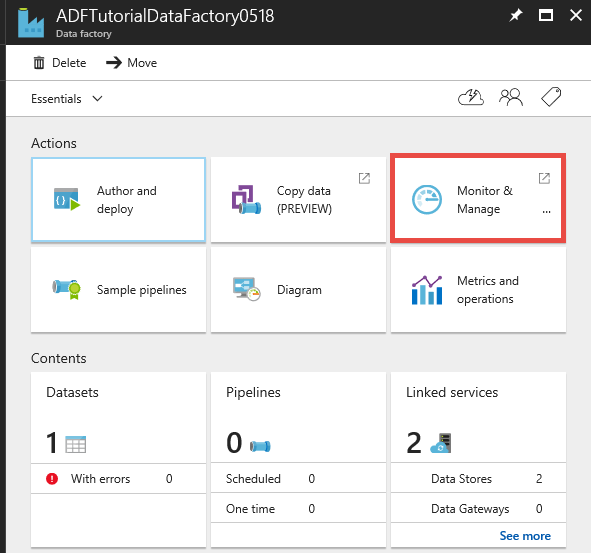
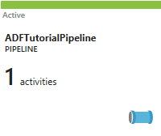
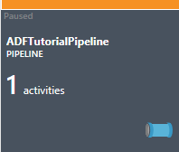
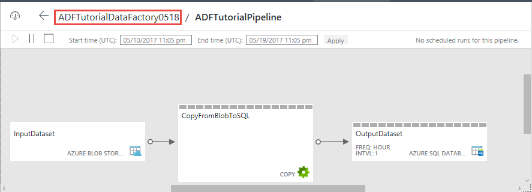
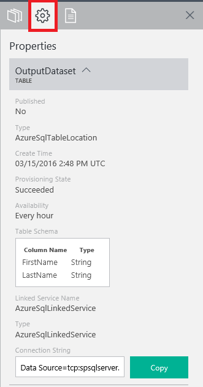
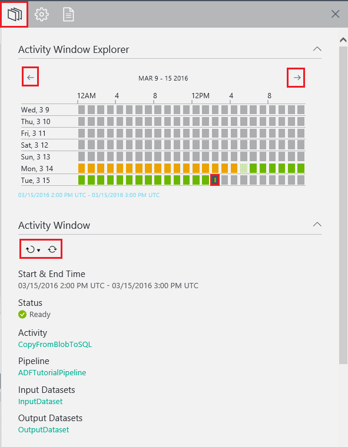

# Monitor and manage Azure Data Factory pipelines by using the Monitoring and Management app
> [!div class="op_single_selector"]
> * [Using Azure portal/Azure PowerShell](data-factory-monitor-manage-pipelines.md)
> * [Using Monitoring and Management app](data-factory-monitor-manage-app.md)
>
>

> [!NOTE]
> This article applies to version 1 of Data Factory. If you are using the current version of the Data Factory service, see [monitor and manage Data Factory pipelines in](../monitor-visually.md).

This article describes how to use the Monitoring and Management app to monitor, manage, and debug your Data Factory pipelines. You can get started with using the application by watching the following video:

> [!NOTE]
> The user interface shown in the video may not exactly match what you see in the portal. It's slightly older, but concepts remain the same. 

> [!VIDEO https://channel9.msdn.com/Shows/Azure-Friday/Azure-Data-Factory-Monitoring-and-Managing-Big-Data-Piplines/player]
>

## Launch the Monitoring and Management app
To launch the Monitor and Management app, click the **Monitor & Manage** tile on the **Data Factory** blade for your data factory.

You should see the Monitoring and Management app open in a separate window.  

> [!NOTE]
> If you see that the web browser is stuck at "Authorizing...", clear the **Block third-party cookies and site data** check box--or keep it selected, create an exception for **login.microsoftonline.com**, and then try to open the app again.

In the Activity Windows list in the middle pane, you see an activity window for each run of an activity. For example, if you have the activity scheduled to run hourly for five hours, you see five activity windows associated with five data slices. If you don't see activity windows in the list at the bottom, do the following:
 
- Update the **start time** and **end time** filters at the top to match the start and end times of your pipeline, and then click the **Apply** button.  
- The Activity Windows list is not automatically refreshed. Click the **Refresh** button on the toolbar in the **Activity Windows** list.  

If you don't have a Data Factory application to test these steps with, do the tutorial: [copy data from Blob Storage to SQL Database using Data Factory](data-factory-copy-data-from-azure-blob-storage-to-sql-database.md).

## Understand the Monitoring and Management app
There are three tabs on the left: **Resource Explorer**, **Monitoring Views**, and **Alerts**. The first tab (**Resource Explorer**) is selected by default.

### Resource Explorer
You see the following:

* The Resource Explorer **tree view** in the left pane.
* The **Diagram View** at the top in the middle pane.
* The **Activity Windows** list at the bottom in the middle pane.
* The **Properties**, **Activity Window Explorer**, and **Script** tabs in the right pane.

In Resource Explorer, you see all resources (pipelines, datasets, linked services) in the data factory in a tree view. When you select an object in Resource Explorer:

* The associated Data Factory entity is highlighted in the Diagram View.
* [Associated activity windows](data-factory-scheduling-and-execution.md) are highlighted in the Activity Windows list at the bottom.  
* The properties of the selected object are shown in the Properties window in the right pane.
* The JSON definition of the selected object is shown, if applicable. For example: a linked service, a dataset, or a pipeline.

See the [Scheduling and Execution](data-factory-scheduling-and-execution.md) article for detailed conceptual information about activity windows.

### Diagram View
The Diagram View of a data factory provides a single pane of glass to monitor and manage a data factory and its assets. When you select a Data Factory entity (dataset/pipeline) in the Diagram View:

* The data factory entity is selected in the tree view.
* The associated activity windows are highlighted in the Activity Windows list.
* The properties of the selected object are shown in the Properties window.

When the pipeline is enabled (not in a paused state), it's shown with a green line:

You can pause, resume, or terminate a pipeline by selecting it in the diagram view and using the buttons on the command bar.

 
There are three command bar buttons for the pipeline in the Diagram View. You can use the second button to pause the pipeline. Pausing doesn't terminate the currently running activities and lets them proceed to completion. The third button pauses the pipeline and terminates its existing executing activities. The first button resumes the pipeline. When your pipeline is paused, the color of the pipeline changes. For example, a paused pipeline looks like in the following image: 

You can multi-select two or more pipelines by using the Ctrl key. You can use the command bar buttons to pause/resume multiple pipelines at a time.

You can also right-click a pipeline and select options to suspend, resume, or terminate a pipeline. 

Click the **Open pipeline** option to see all the activities in the pipeline. 

In the opened pipeline view, you see all activities in the pipeline. In this example, there is only one activity: Copy Activity. 

To go back to the previous view, click the data factory name in the breadcrumb menu at the top.

In the pipeline view, when you select an output dataset or when you move your mouse over the output dataset, you see the Activity Windows pop-up window for that dataset.

You can click an activity window to see details for it in the **Properties** window in the right pane.

In the right pane, switch to the **Activity Window Explorer** tab to see more details.

You also see **resolved variables** for each run attempt for an activity in the **Attempts** section.

Switch to the **Script** tab to see the JSON script definition for the selected object.   

You can see activity windows in three places:

* The Activity Windows pop-up in the Diagram View (middle pane).
* The Activity Window Explorer in the right pane.
* The Activity Windows list in the bottom pane.

In the Activity Windows pop-up and Activity Window Explorer, you can scroll to the previous week and the next week by using the left and right arrows.

At the bottom of the Diagram View, you see these buttons: Zoom In, Zoom Out, Zoom to Fit, Zoom 100%, Lock layout. The **Lock layout** button prevents you from accidentally moving tables and pipelines in the Diagram View. It's on by default. You can turn it off and move entities around in the diagram. When you turn it off, you can use the last button to automatically position tables and pipelines. You can also zoom in or out by using the mouse wheel.

### Activity Windows list
The Activity Windows list at the bottom of the middle pane displays all activity windows for the dataset that you selected in the Resource Explorer or the Diagram View. By default, the list is in descending order, which means that you see the latest activity window at the top.

This list doesn't refresh automatically, so use the refresh button on the toolbar to manually refresh it.  

Activity windows can be in one of the following statuses:

<table>
<tr>
    <th align="left">Status</th><th align="left">Substatus</th><th align="left">Description</th>
</tr>
<tr>
    <td rowspan="8">Waiting</td><td>ScheduleTime</td><td>The time hasn't come for the activity window to run.</td>
</tr>
<tr>
<td>DatasetDependencies</td><td>The upstream dependencies aren't ready.</td>
</tr>
<tr>
<td>ComputeResources</td><td>The compute resources aren't available.</td>
</tr>
<tr>
<td>ConcurrencyLimit</td> <td>All the activity instances are busy running other activity windows.</td>
</tr>
<tr>
<td>ActivityResume</td><td>The activity is paused and can't run the activity windows until it's resumed.</td>
</tr>
<tr>
<td>Retry</td><td>The activity execution is being retried.</td>
</tr>
<tr>
<td>Validation</td><td>Validation hasn't started yet.</td>
</tr>
<tr>
<td>ValidationRetry</td><td>Validation is waiting to be retried.</td>
</tr>
<tr>
<tr>
<td rowspan="2">InProgress</td><td>Validating</td><td>Validation is in progress.</td>
</tr>
<td>-</td>
<td>The activity window is being processed.</td>
</tr>
<tr>
<td rowspan="4">Failed</td><td>TimedOut</td><td>The activity execution took longer than what is allowed by the activity.</td>
</tr>
<tr>
<td>Canceled</td><td>The activity window was canceled by user action.</td>
</tr>
<tr>
<td>Validation</td><td>Validation has failed.</td>
</tr>
<tr>
<td>-</td><td>The activity window failed to be generated or validated.</td>
</tr>
<td>Ready</td><td>-</td><td>The activity window is ready for consumption.</td>
</tr>
<tr>
<td>Skipped</td><td>-</td><td>The activity window wasn't processed.</td>
</tr>
<tr>
<td>None</td><td>-</td><td>An activity window used to exist with a different status, but has been reset.</td>
</tr>
</table>

When you click an activity window in the list, you see details about it in the **Activity Windows Explorer** or the **Properties** window on the right.

### Refresh activity windows
The details aren't automatically refreshed, so use the refresh button (the second button) on the command bar to manually refresh the activity windows list.  

### Properties window
The Properties window is in the right-most pane of the Monitoring and Management app.

It displays properties for the item that you selected in the Resource Explorer (tree view), Diagram View, or Activity Windows list.

### Activity Window Explorer
The **Activity Window Explorer** window is in the right-most pane of the Monitoring and Management app. It displays details about the activity window that you selected in the Activity Windows pop-up window or the Activity Windows list.

You can switch to another activity window by clicking it in the calendar view at the top. You can also use the left arrow/right arrow buttons at the top to see activity windows from the previous week or the next week.

You can use the toolbar buttons in the bottom pane to rerun the activity window or refresh the details in the pane.

### Script
You can use the **Script** tab to view the JSON definition of the selected Data Factory entity (linked service, dataset, or pipeline).

## Use system views
The Monitoring and Management app includes pre-built system views (**Recent activity windows**, **Failed activity windows**, **In-Progress activity windows**) that allow you to view recent/failed/in-progress activity windows for your data factory.

Switch to the **Monitoring Views** tab on the left by clicking it.

Currently, there are three system views that are supported. Select an option to see recent activity windows, failed activity windows, or in-progress activity windows in the Activity Windows list (at the bottom of the middle pane).

When you select the **Recent activity windows** option, you see all recent activity windows in descending order of the **last attempt time**.

You can use the **Failed activity windows** view to see all failed activity windows in the list. Select a failed activity window in the list to see details about it in the **Properties** window or the **Activity Window Explorer**. You can also download any logs for a failed activity window.

## Sort and filter activity windows
Change the **start time** and **end time** settings in the command bar to filter activity windows. After you change the start time and end time, click the button next to the end time to refresh the Activity Windows list.

> [!NOTE]
> Currently, all times are in UTC format in the Monitoring and Management app.
>
>

In the **Activity Windows list**, click the name of a column (for example: Status).

You can do the following:

* Sort in ascending order.
* Sort in descending order.
* Filter by one or more values (Ready, Waiting, and so on).

When you specify a filter on a column, you see the filter button enabled for that column, which indicates that the values in the column are filtered values.

You can use the same pop-up window to clear filters. To clear all filters for the Activity Windows list, click the clear filter button on the command bar.

## Perform batch actions
### Rerun selected activity windows
Select an activity window, click the down arrow for the first command bar button, and select **Rerun** / **Rerun with upstream in pipeline**. When you select the **Rerun with upstream in pipeline** option, it reruns all upstream activity windows as well.
    

You can also select multiple activity windows in the list and rerun them at the same time. You might want to filter activity windows based on the status (for example: **Failed**)--and then rerun the failed activity windows after correcting the issue that causes the activity windows to fail. See the following section for details about filtering activity windows in the list.  

### Pause/resume multiple pipelines
You can multiselect two or more pipelines by using the Ctrl key. You can use the command bar buttons (which are highlighted in the red rectangle in the following image) to pause/resume them.

