# Monitor and manage Azure Data Factory pipelines by using the Azure portal and PowerShell
> [!div class="op_single_selector"]
> * [Using Azure portal/Azure PowerShell](data-factory-monitor-manage-pipelines.md)
> * [Using Monitoring and Management app](data-factory-monitor-manage-app.md)

> [!NOTE]
> This article applies to version 1 of Data Factory. If you are using the current version of the Data Factory service, see [monitor and manage Data Factory pipelines in](../monitor-visually.md).

This article describes how to monitor, manage, and debug your pipelines by using Azure portal and PowerShell.

> [!IMPORTANT]
> The monitoring & management application provides a better support for monitoring and managing your data pipelines, and troubleshooting any issues. For details about using the application, see [monitor and manage Data Factory pipelines by using the Monitoring and Management app](data-factory-monitor-manage-app.md). 

> [!IMPORTANT]
> Azure Data Factory version 1 now uses the new [Azure Monitor alerting infrastructure](../../azure-monitor/platform/alerts-metric.md). The old alerting infrastructure is deprecated. As a result, your existing alerts configured for version 1 data factories no longer work. Your existing alerts for v1 data factories are not migrated automatically. You have to recreate these alerts on the new alerting infrastructure. Log in to the Azure portal and select **Monitor** to create new alerts on metrics (such as failed runs or successful runs) for your version 1 data factories.

[!INCLUDE [updated-for-az](../../../includes/updated-for-az.md)]

## Understand pipelines and activity states
By using the Azure portal, you can:

* View your data factory as a diagram.
* View activities in a pipeline.
* View input and output datasets.

This section also describes how a dataset slice transitions from one state to another state.   

### Navigate to your data factory
1. Sign in to the [Azure portal](https://portal.azure.com).
2. Click **Data factories** on the menu on the left. If you don't see it, click **More services >**, and then click **Data factories** under the **INTELLIGENCE + ANALYTICS** category.

   
3. On the **Data factories** blade, select the data factory that you're interested in.

    

   You should see the home page for the data factory.

   

#### Diagram view of your data factory
The **Diagram** view of a data factory provides a single pane of glass to monitor and manage the data factory and its assets. To see the **Diagram** view of your data factory, click **Diagram** on the home page for the data factory.


You can zoom in, zoom out, zoom to fit, zoom to 100%, lock the layout of the diagram, and automatically position pipelines and datasets. You can also see the data lineage information (that is, show upstream and downstream items of selected items).

### Activities inside a pipeline
1. Right-click the pipeline, and then click **Open pipeline** to see all activities in the pipeline, along with input and output datasets for the activities. This feature is useful when your pipeline includes more than one activity and you want to understand the operational lineage of a single pipeline.

         
2. In the following example, you see a copy activity in the pipeline with an input and an output. 

    
3. You can navigate back to the home page of the data factory by clicking the **Data factory** link in the breadcrumb at the top-left corner.

    

### View the state of each activity inside a pipeline
You can view the current state of an activity by viewing the status of any of the datasets that are produced by the activity.

By double-clicking the **OutputBlobTable** in the **Diagram**, you can see all the slices that are produced by different activity runs inside a pipeline. You can see that the copy activity ran successfully for the last eight hours and produced the slices in the **Ready** state.  


The dataset slices in the data factory can have one of the following statuses:

<table>
<tr>
    <th align="left">State</th><th align="left">Substate</th><th align="left">Description</th>
</tr>
<tr>
    <td rowspan="8">Waiting</td><td>ScheduleTime</td><td>The time hasn't come for the slice to run.</td>
</tr>
<tr>
<td>DatasetDependencies</td><td>The upstream dependencies aren't ready.</td>
</tr>
<tr>
<td>ComputeResources</td><td>The compute resources aren't available.</td>
</tr>
<tr>
<td>ConcurrencyLimit</td> <td>All the activity instances are busy running other slices.</td>
</tr>
<tr>
<td>ActivityResume</td><td>The activity is paused and can't run the slices until the activity is resumed.</td>
</tr>
<tr>
<td>Retry</td><td>Activity execution is being retried.</td>
</tr>
<tr>
<td>Validation</td><td>Validation hasn't started yet.</td>
</tr>
<tr>
<td>ValidationRetry</td><td>Validation is waiting to be retried.</td>
</tr>
<tr>
<tr>
<td rowspan="2">InProgress</td><td>Validating</td><td>Validation is in progress.</td>
</tr>
<td>-</td>
<td>The slice is being processed.</td>
</tr>
<tr>
<td rowspan="4">Failed</td><td>TimedOut</td><td>The activity execution took longer than what is allowed by the activity.</td>
</tr>
<tr>
<td>Canceled</td><td>The slice was canceled by user action.</td>
</tr>
<tr>
<td>Validation</td><td>Validation has failed.</td>
</tr>
<tr>
<td>-</td><td>The slice failed to be generated and/or validated.</td>
</tr>
<td>Ready</td><td>-</td><td>The slice is ready for consumption.</td>
</tr>
<tr>
<td>Skipped</td><td>None</td><td>The slice isn't being processed.</td>
</tr>
<tr>
<td>None</td><td>-</td><td>A slice used to exist with a different status, but it has been reset.</td>
</tr>
</table>


You can view the details about a slice by clicking a slice entry on the **Recently Updated Slices** blade.


If the slice has been executed multiple times, you see multiple rows in the **Activity runs** list. You can view details about an activity run by clicking the run entry in the **Activity runs** list. The list shows all the log files, along with an error message if there is one. This feature is useful to view and debug logs without having to leave your data factory.


If the slice isn't in the **Ready** state, you can see the upstream slices that aren't ready and are blocking the current slice from executing in the **Upstream slices that are not ready** list. This feature is useful when your slice is in **Waiting** state and you want to understand the upstream dependencies that the slice is waiting on.


### Dataset state diagram
After you deploy a data factory and the pipelines have a valid active period, the dataset slices transition from one state to another. Currently, the slice status follows the following state diagram:

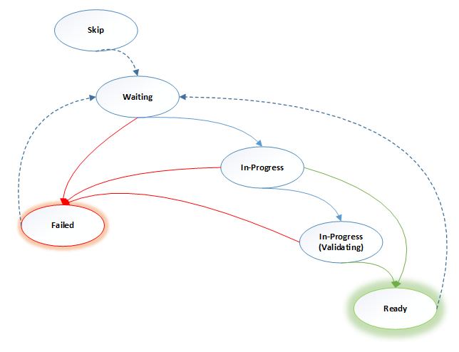

The dataset state transition flow in data factory is the following: Waiting -> In-Progress/In-Progress (Validating) -> Ready/Failed.

The slice starts in a **Waiting** state, waiting for preconditions to be met before it executes. Then, the activity starts executing, and the slice goes into an **In-Progress** state. The activity execution might succeed or fail. The slice is marked as **Ready** or **Failed**, based on the result of the execution.

You can reset the slice to go back from the **Ready** or **Failed** state to the **Waiting** state. You can also mark the slice state to **Skip**, which prevents the activity from executing and not processing the slice.

## Pause and resume pipelines
You can manage your pipelines by using Azure PowerShell. For example, you can pause and resume pipelines by running Azure PowerShell cmdlets. 

> [!NOTE] 
> The diagram view does not support pausing and resuming pipelines. If you want to use an user interface, use the monitoring and managing application. For details about using the application, see [monitor and manage Data Factory pipelines by using the Monitoring and Management app](data-factory-monitor-manage-app.md) article. 

You can pause/suspend pipelines by using the **Suspend-AzDataFactoryPipeline** PowerShell cmdlet. This cmdlet is useful when you don't want to run your pipelines until an issue is fixed. 

```powershell
Suspend-AzDataFactoryPipeline [-ResourceGroupName] <String> [-DataFactoryName] <String> [-Name] <String>
```
For example:

```powershell
Suspend-AzDataFactoryPipeline -ResourceGroupName ADF -DataFactoryName productrecgamalbox1dev -Name PartitionProductsUsagePipeline
```

After the issue has been fixed with the pipeline, you can resume the suspended pipeline by running the following PowerShell command:

```powershell
Resume-AzDataFactoryPipeline [-ResourceGroupName] <String> [-DataFactoryName] <String> [-Name] <String>
```
For example:

```powershell
Resume-AzDataFactoryPipeline -ResourceGroupName ADF -DataFactoryName productrecgamalbox1dev -Name PartitionProductsUsagePipeline
```

## Debug pipelines
Azure Data Factory provides rich capabilities for you to debug and troubleshoot pipelines by using the Azure portal and Azure PowerShell.

> [!NOTE] 
> It is much easier to troubleshot errors using the Monitoring & Management App. For details about using the application, see [monitor and manage Data Factory pipelines by using the Monitoring and Management app](data-factory-monitor-manage-app.md) article. 

### Find errors in a pipeline
If the activity run fails in a pipeline, the dataset that is produced by the pipeline is in an error state because of the failure. You can debug and troubleshoot errors in Azure Data Factory by using the following methods.

#### Use the Azure portal to debug an error
1. On the **Table** blade, click the problem slice that has the **Status** set to **Failed**.

   
2. On the **Data slice** blade, click the activity run that failed.

   
3. On the **Activity run details** blade, you can download the files that are associated with the HDInsight processing. Click **Download** for Status/stderr to download the error log file that contains details about the error.

        

#### Use PowerShell to debug an error
1. Launch **PowerShell**.
2. Run the **Get-AzDataFactorySlice** command to see the slices and their statuses. You should see a slice with the status of **Failed**.        

	```powershell   
	Get-AzDataFactorySlice [-ResourceGroupName] <String> [-DataFactoryName] <String> [-DatasetName] <String> [-StartDateTime] <DateTime> [[-EndDateTime] <DateTime> ] [-Profile <AzureProfile> ] [ <CommonParameters>]
	```   
   For example:

	```powershell   
	Get-AzDataFactorySlice -ResourceGroupName ADF -DataFactoryName LogProcessingFactory -DatasetName EnrichedGameEventsTable -StartDateTime 2014-05-04 20:00:00
	```

   Replace **StartDateTime** with start time of your pipeline. 
3. Now, run the **Get-AzDataFactoryRun** cmdlet to get details about the activity run for the slice.

	```powershell   
	Get-AzDataFactoryRun [-ResourceGroupName] <String> [-DataFactoryName] <String> [-DatasetName] <String> [-StartDateTime]
	<DateTime> [-Profile <AzureProfile> ] [ <CommonParameters>]
	```

    For example:

	```powershell   
    Get-AzDataFactoryRun -ResourceGroupName ADF -DataFactoryName LogProcessingFactory -DatasetName EnrichedGameEventsTable -StartDateTime "5/5/2014 12:00:00 AM"
	```

    The value of StartDateTime is the start time for the error/problem slice that you noted from the previous step. The date-time should be enclosed in double quotes.
4. You should see output with details about the error that is similar to the following:

	```   
    Id                      : 841b77c9-d56c-48d1-99a3-8c16c3e77d39
    ResourceGroupName       : ADF
    DataFactoryName         : LogProcessingFactory3
    DatasetName               : EnrichedGameEventsTable
    ProcessingStartTime     : 10/10/2014 3:04:52 AM
    ProcessingEndTime       : 10/10/2014 3:06:49 AM
    PercentComplete         : 0
    DataSliceStart          : 5/5/2014 12:00:00 AM
    DataSliceEnd            : 5/6/2014 12:00:00 AM
    Status                  : FailedExecution
    Timestamp               : 10/10/2014 3:04:52 AM
    RetryAttempt            : 0
    Properties              : {}
    ErrorMessage            : Pig script failed with exit code '5'. See wasb://        adfjobs@spestore.blob.core.windows.net/PigQuery
                                    Jobs/841b77c9-d56c-48d1-99a3-
                8c16c3e77d39/10_10_2014_03_04_53_277/Status/stderr' for
                more details.
    ActivityName            : PigEnrichLogs
    PipelineName            : EnrichGameLogsPipeline
    Type                    :
	```
5. You can run the **Save-AzDataFactoryLog** cmdlet with the Id value that you see from the output, and download the log files by using the **-DownloadLogsoption** for the cmdlet.

	```powershell
	Save-AzDataFactoryLog -ResourceGroupName "ADF" -DataFactoryName "LogProcessingFactory" -Id "841b77c9-d56c-48d1-99a3-8c16c3e77d39" -DownloadLogs -Output "C:\Test"
	```

## Rerun failures in a pipeline

> [!IMPORTANT]
> It's easier to troubleshoot errors and rerun failed slices by using the Monitoring & Management App. For details about using the application, see [monitor and manage Data Factory pipelines by using the Monitoring and Management app](data-factory-monitor-manage-app.md). 

### Use the Azure portal
After you troubleshoot and debug failures in a pipeline, you can rerun failures by navigating to the error slice and clicking the **Run** button on the command bar.

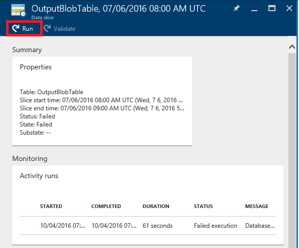

In case the slice has failed validation because of a policy failure (for example, if data isn't available), you can fix the failure and validate again by clicking the **Validate** button on the command bar.


### Use Azure PowerShell
You can rerun failures by using the **Set-AzDataFactorySliceStatus** cmdlet. See the [Set-AzDataFactorySliceStatus](/powershell/module/az.datafactory/set-azdatafactoryslicestatus) topic for syntax and other details about the cmdlet.

**Example:**

The following example sets the status of all slices for the table 'DAWikiAggregatedData' to 'Waiting' in the Azure data factory 'WikiADF'.

The 'UpdateType' is set to 'UpstreamInPipeline', which means that statuses of each slice for the table and all the dependent (upstream) tables are set to 'Waiting'. The other possible value for this parameter is 'Individual'.

```powershell
Set-AzDataFactorySliceStatus -ResourceGroupName ADF -DataFactoryName WikiADF -DatasetName DAWikiAggregatedData -Status Waiting -UpdateType UpstreamInPipeline -StartDateTime 2014-05-21T16:00:00 -EndDateTime 2014-05-21T20:00:00
```
## Create alerts in the Azure portal

1.  Log in to the Azure portal and select **Monitor -> Alerts** to open the Alerts page.

    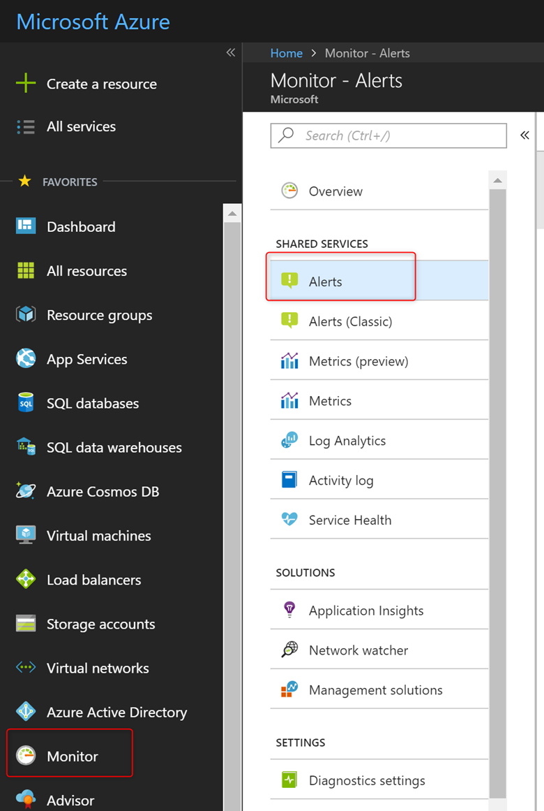

2.  Select **+ New Alert rule** to create a new alert.

    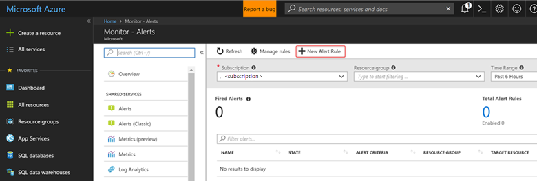

3.  Define the **Alert condition**. (Make sure to select **Data factories** in the **Filter by resource type** field.) You can also specify values for **Dimensions**.

    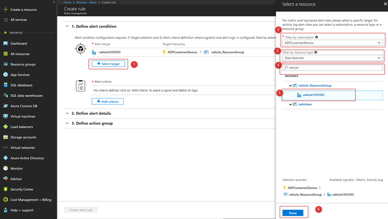

    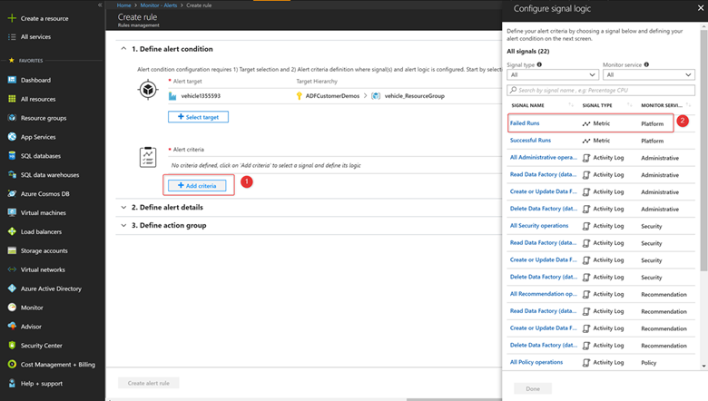

    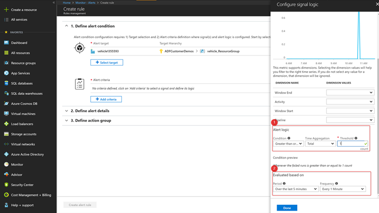

4.  Define the **Alert details**.

    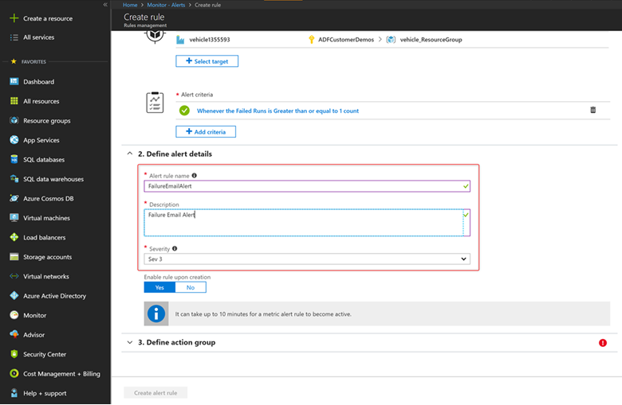

5.  Define the **Action group**.

    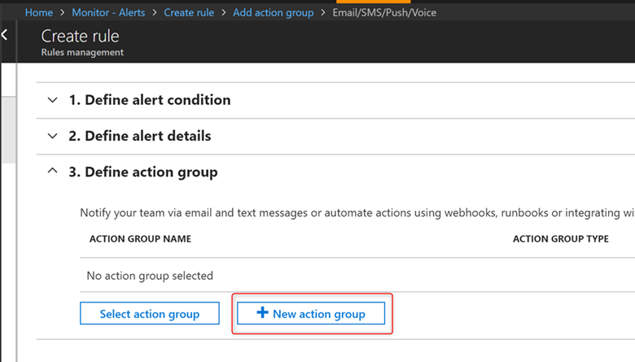

    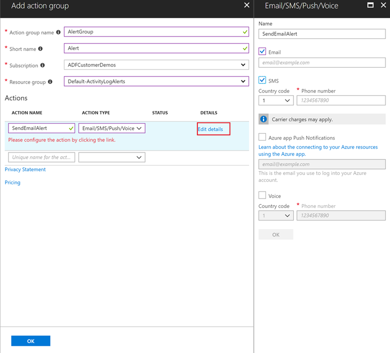

    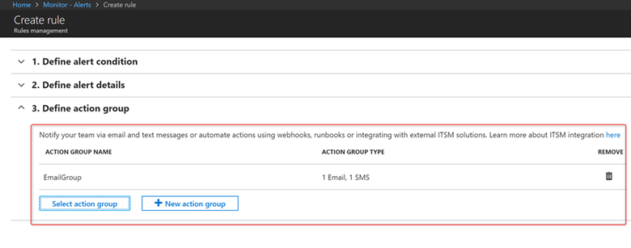

## Move a data factory to a different resource group or subscription
You can move a data factory to a different resource group or a different subscription by using the **Move** command bar button on the home page of your data factory.


You can also move any related resources (such as alerts that are associated with the data factory), along with the data factory.

