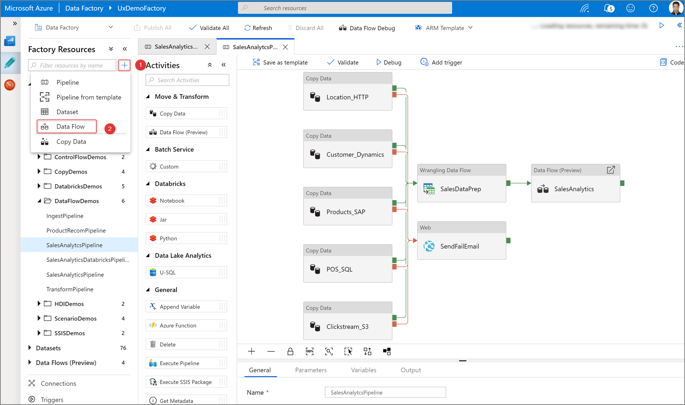
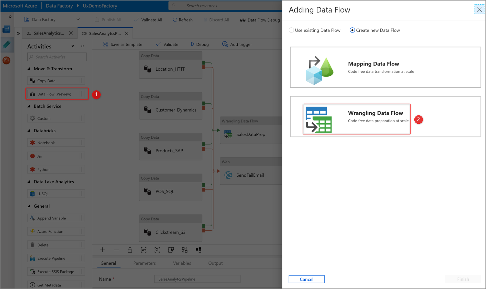
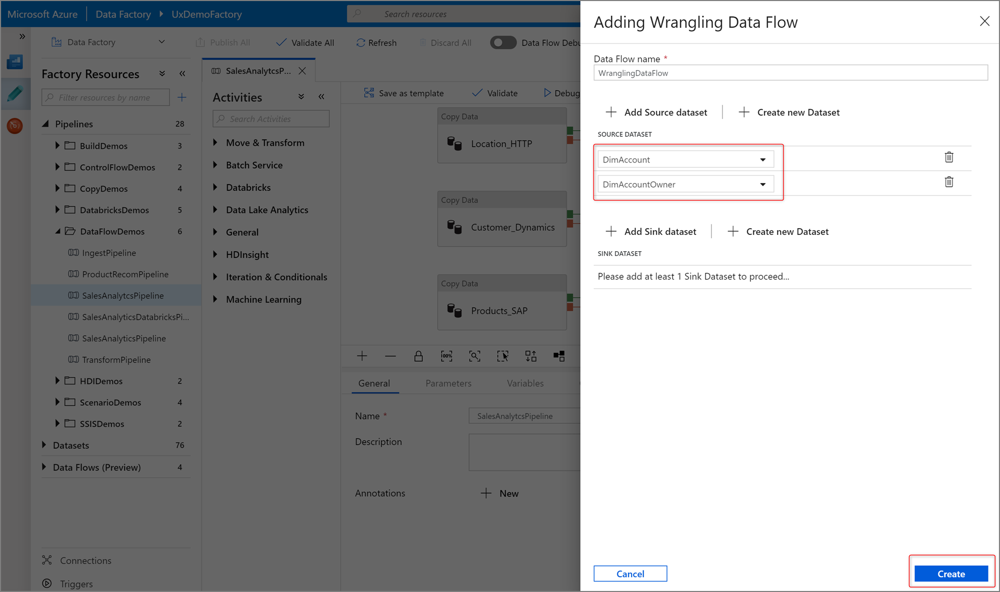
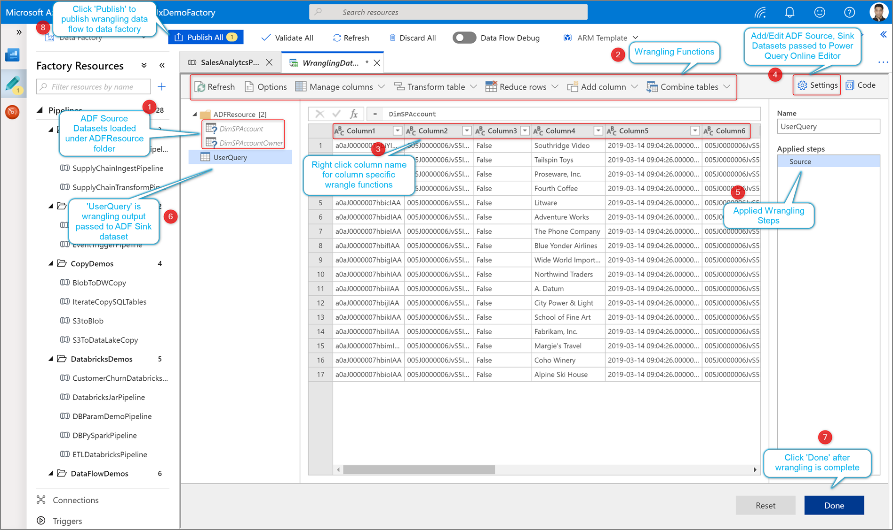
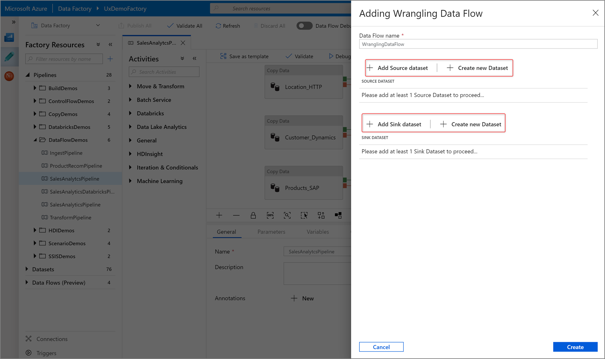

# Prepare data with wrangling data flow

## Create a wrangling data flow

There are two ways to create a wrangling data flow in Azure Data Factory. One way is to click the plus icon and select **Data Flow** in the factory resources pane.

The other method is in the activities pane of the pipeline canvas. Open the **Move and Transform** accordion and drag the **Data flow** activity onto the canvas.

In both methods, in the side pane that opens, select **Create new data flow** and choose **Wrangling data flow**. Click OK.

## Author a wrangling data flow

Add a **Source dataset** for your wrangling data flow. You can either choose an existing dataset or create a new one. You can also select a sink dataset. You can choose one or more source datasets, but only one sink is allowed at this time. Choosing a sink dataset is optional, but at least one source dataset is required.

> [!NOTE]
> Only ADLS Gen 2 Delimited Text are supported for limited preview. 

Click **Create** to open the Power Query Online mashup editor.

Author your wrangling data flow using code-free data preparation. For the list of available functions, see [transformation functions](wrangling-data-flow-functions.md)/

## Running and monitoring a wrangling data flow

To execute a pipeline debug run of a wrangling data flow, click **Debug** in the pipeline canvas. Once you publish your data flow, **Trigger now** executes an on-demand run of the last published pipeline. Wrangling data flows can be schedule with all existing Azure Data Factory triggers.

Go to the **Monitor** tab to visualize the output of a triggered wrangling data flow activity run.

## Next steps

Learn how to [create a mapping data flow](tutorial-data-flow.md).