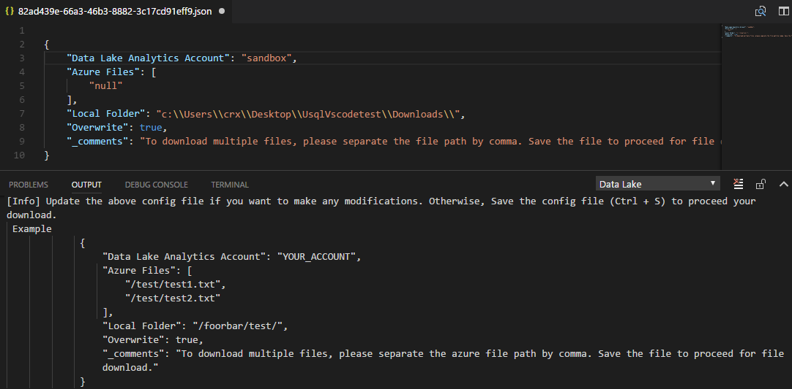
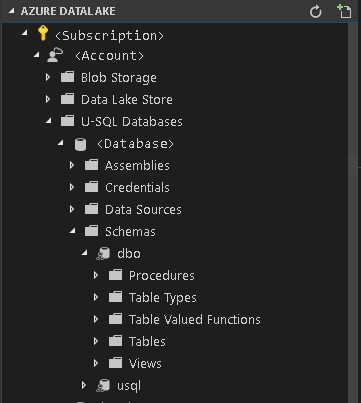
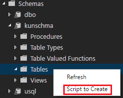
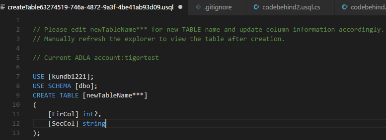
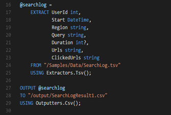

# Accessing resources with Azure Data Lake Tools

You can access Azure Data Lake Analytics resources with Azure Data Tools commands or actions in VS Code easily.

## Integrate with Azure Data Lake Analytics through a command

You can access Azure Data Lake Analytics resources to list accounts, access metadata, and view analytics jobs.

### To list the Azure Data Lake Analytics accounts under your Azure subscription

1. Select Ctrl+Shift+P to open the command palette.
2. Enter **ADL: List Accounts**. The accounts appear in the **Output** pane.

### To access Azure Data Lake Analytics metadata

1. Select Ctrl+Shift+P, and then enter **ADL: List Tables**.
2. Select one of the Data Lake Analytics accounts.
3. Select one of the Data Lake Analytics databases.
4. Select one of the schemas. You can see the list of tables.

### To view Azure Data Lake Analytics jobs

1. Open the command palette (Ctrl+Shift+P) and select **ADL: Show Jobs**.
2. Select a Data Lake Analytics or local account.
3. Wait for the job list to appear for the account.
4. Select a job from the job list. Data Lake Tools opens the job view in the right pane and displays some information in the VS Code output.

    

## Integrate with Azure Data Lake Store through a command

You can use Azure Data Lake Store-related commands to:

- [Browse through the Azure Data Lake Store resources](#list-the-storage-path)
- [Preview the Azure Data Lake Store file](#preview-the-storage-file)
- Upload the file directly to Azure Data Lake Store in VS Code
- Download the file directly from Azure Data Lake Store in VS Code

### List the storage path

### To list the storage path through the command palette

1. Right-click the script editor and select **ADL: List Path**.
2. Choose the folder in the list, or select **Enter a path** or **Browse from root path**. (We're using **Enter a path** as an example.)
3. Select your Data Lake Analytics account.
4. Browse to or enter the storage folder path (for example, /output/).  

The command palette lists the path information based on your entries.

A more convenient way to list the relative path is through the shortcut menu.

### To list the storage path through the shortcut menu

Right-click the path string and select **List Path**.

### Preview the storage file

1. Right-click the script editor and select **ADL: Preview File**.
2. Select your Data Lake Analytics account.
3. Enter an Azure Storage file path (for example, /output/SearchLog.txt).

The file opens in VS Code.

Another way to preview the file is through the shortcut menu on the file's full path or the file's relative path in the script editor.

### Upload a file or folder

1. Right-click the script editor and select **Upload File** or **Upload Folder**.
2. Choose one file or multiple files if you selected **Upload File**, or choose the whole folder if you selected **Upload Folder**. Then select **Upload**.
3. Choose the storage folder in the list, or select **Enter a path** or **Browse from root path**. (We're using **Enter a path** as an example.)
4. Select your Data Lake Analytics account.
5. Browse to or enter the storage folder path (for example, /output/).
6. Select **Choose Current Folder** to specify your upload destination.

Another way to upload files to storage is through the shortcut menu on the file's full path or the file's relative path in the script editor.

You can [monitor the upload status](#check-storage-tasks-status).

### Download a file

You can download a file by using the command **ADL: Download File** or **ADL: Download File (Advanced)**.

### To download a file through the ADL: Download File (Advanced) command

1. Right-click the script editor, and then select **Download File (Advanced)**.
2. VS Code displays a JSON file. You can enter file paths and download multiple files at the same time. Instructions are displayed in the **Output** window. To proceed to download the file or files, save (Ctrl+S) the JSON file.

    

The **Output** window displays the file download status.

You can [monitor the download status](#check-storage-tasks-status).

### To download a file through the ADL: Download File command

1. Right-click the script editor, select **Download File**, and then select the destination folder from the **Select Folder** dialog box.

1. Choose the folder in the list, or select **Enter a path** or **Browse from root path**. (We're using **Enter a path** as an example.)

1. Select your Data Lake Analytics account.

1. Browse to or enter the storage folder path (for example, /output/), and then choose a file to download.

Another way to download storage files is through the shortcut menu on the file's full path or the file's relative path in the script editor.

You can [monitor the download status](#check-storage-tasks-status).

### Check storage tasks' status

The upload and download status appears on the status bar. Select the status bar, and then the status appears on the **OUTPUT** tab.

## Integrate with Azure Data Lake Analytics from the explorer

After you log in, all the subscriptions for your Azure account are listed in the left pane, under **AZURE DATALAKE**.

### Data Lake Analytics metadata navigation

Expand your Azure subscription. Under the **U-SQL Databases** node, you can browse through your U-SQL database and view folders like **Schemas**, **Credentials**, **Assemblies**, **Tables**, and **Index**.

### Data Lake Analytics metadata entity management

Expand **U-SQL Databases**. You can create a database, schema, table, table type, index, or statistic by right-clicking the corresponding node, and then selecting **Script to Create** on the shortcut menu. On the opened script page, edit the script according to your needs. Then submit the job by right-clicking it and selecting **ADL: Submit Job**.

After you finish creating the item, right-click the node and then select **Refresh** to show the item. You can also delete the item by right-clicking it and then selecting **Delete**.

### Data Lake Analytics assembly registration

You can register an assembly in the corresponding database by right-clicking the **Assemblies** node, and then selecting **Register assembly**.

## Integrate with Azure Data Lake Store from the explorer

Browse to **Data Lake Store**:

- You can right-click the folder node and then use the **Refresh**, **Delete**, **Upload**, **Upload Folder**, **Copy Relative Path**, and **Copy Full Path** commands on the shortcut menu.

   

- You can right-click the file node and then use the **Preview**, **Download**, **Delete**, **Create EXTRACT Script** (available only for CSV, TSV, and TXT files), **Copy Relative Path**, and **Copy Full Path** commands on the shortcut menu.

   

## Integrate with Azure Blob storage from the explorer

Browse to Blob storage:

- You can right-click the blob container node and then use the **Refresh**, **Delete Blob Container**, and **Upload Blob** commands on the shortcut menu.

   

- You can right-click the folder node and then use the **Refresh** and **Upload Blob** commands on the shortcut menu.

   

- You can right-click the file node and then use the **Preview/Edit**, **Download**, **Delete**, **Create EXTRACT Script** (available only for CSV, TSV, and TXT files), **Copy Relative Path**, and **Copy Full Path** commands on the shortcut menu.

    

## Open the Data Lake explorer in the portal

1. Select Ctrl+Shift+P to open the command palette.
2. Enter **Open Web Azure Storage Explorer** or right-click a relative path or the full path in the script editor, and then select **Open Web Azure Storage Explorer**.
3. Select a Data Lake Analytics account.

Data Lake Tools opens the Azure Storage path in the Azure portal. You can find the path and preview the file from the web.

## Additional features

Data Lake Tools for VS Code supports the following features:

- **IntelliSense autocomplete**: Suggestions appear in pop-up windows around items like keywords, methods, and variables. Different icons represent different types of objects:

  - Scala data type
  - Complex data type
  - Built-in UDTs
  - .NET collection and classes
  - C# expressions
  - Built-in C# UDFs, UDOs, and UDAAGs
  - U-SQL functions
  - U-SQL windowing functions

    

- **IntelliSense autocomplete on Data Lake Analytics metadata**: Data Lake Tools downloads the Data Lake Analytics metadata information locally. The IntelliSense feature automatically populates objects from the Data Lake Analytics metadata. These objects include the database, schema, table, view, table-valued function, procedures, and C# assemblies.

  

- **IntelliSense error marker**: Data Lake Tools underlines editing errors for U-SQL and C#.
- **Syntax highlights**: Data Lake Tools uses colors to differentiate items like variables, keywords, data types, and functions.

    

> [!NOTE]
> We recommend that you upgrade to Azure Data Lake Tools for Visual Studio version 2.3.3000.4 or later. The previous versions are no longer available for download and are now deprecated.  

## Next steps

- [Develop U-SQL with Python, R, and C Sharp for Azure Data Lake Analytics in VS Code](data-lake-analytics-u-sql-develop-with-python-r-csharp-in-vscode.md)
- [U-SQL local run and local debug with Visual Studio Code](data-lake-tools-for-vscode-local-run-and-debug.md)
- [Tutorial: Get started with Azure Data Lake Analytics](data-lake-analytics-get-started-portal.md)
- [Tutorial: Develop U-SQL scripts by using Data Lake Tools for Visual Studio](data-lake-analytics-data-lake-tools-get-started.md)