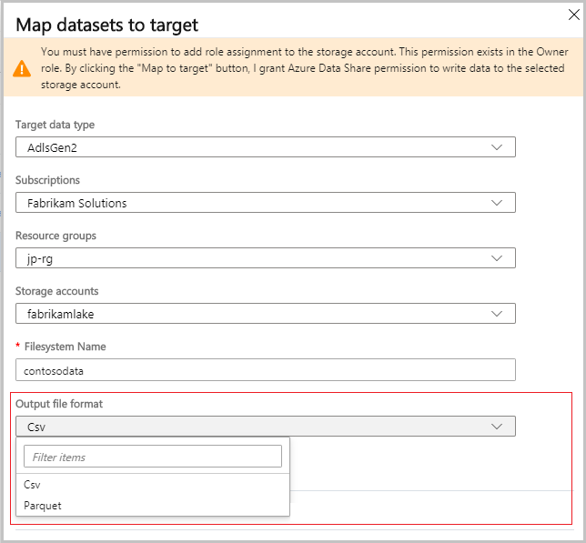

# How to configure a dataset mapping for a received share in Azure Data Share

This article explains how to configure a dataset mapping for a Received Share using Azure Data Share. You'll want to do this if you accepted a data share invitation but opted to "Accept and configure later". You may want to configure a dataset mapping if you need to change the destination for data being shared with you, or if you want to receive data into a SQL Server. 

## Navigate to a received data share

In the Azure Data Share service, navigate to your received share and select the **Details** tab. 

 

Check the box next to the dataset you'd like to assign a destination to. Select **Unmap** to unmap the existing mapping. Select **+ Map to target** to choose a new destination store. 

 

## Select a new destination store

Select a target data type that you'd like the data to land in. Note that any data that already exists in any previously mapped storage accounts will not be automatically moved to the new destination.

 

## Select a file format (SQL sources only)

If the source data is from a SQL-based source, you can choose which format it is received in. 

## Next steps

To learn how to start sharing data, continue to the [share your data](share-your-data.md) tutorial.

