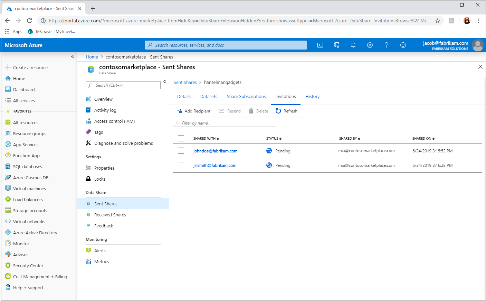
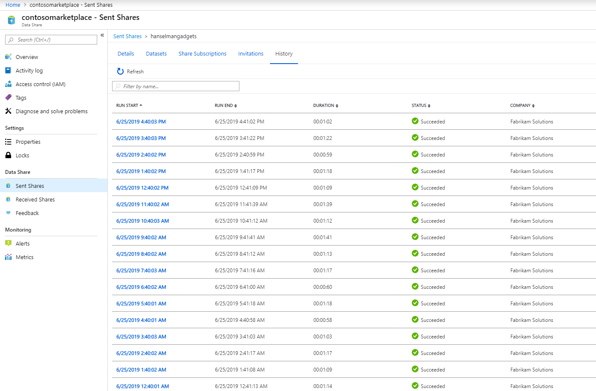

# Monitor Azure Data Share Preview 

This article explains how you can monitor your data shares using Azure Data Share Preview. As a data provider, you are able to monitor various aspects of your data sharing relationships. Details such as whether your data consumers have accepted your invitation to the data share, as well as whether they have created a share subscription and started to use your data are all available to monitor. 

As a data consumer, you can monitor the snapshots that have been triggered into your Azure subscription. 

## Monitor invitation status

View the status of your data share invitations by navigating to Sent shares -> Invitations. 

 

There are three states that your invitation can be in:

* Pending - Data share recipient has not yet accepted the invitation.
* Accepted - Data share recipient has accepted the invitation.
* Rejected - Data share recipient has rejected the invitation.

> [!IMPORTANT]
> If you delete an invitation after it has already been accepted, it is not equivalent to revoking access. If you would like to stop future snapshots from being copied into your data consumers storage account, you must revoke access through the *Share subscriptions* tab. 

## Monitor share subscriptions

View the status of your share subscriptions by navigating to Sent Shares -> Share Subscriptions. This will give you details about active subscriptions created by your data consumers after accepting your invitation. You can stop future updates to your data consumer by selecting the share subscription and selecting *Revoke*. 

## Snapshot history 

In the history tab, you are able to view the snapshots that have been copied in to your data consumer's tenant. You are able to monitor the frequency and duration of each snapshot interval. 

 

You can view more details about each snapshot run by clicking on the run start date. 

Up to 30 days of snapshot history is displayed by default. If you need to see more than 30 days worth of history, navigate to Monitoring -> Diagnostic settings and select **Add diagnostic setting**. You will be required to select a storage account to store these logs into. 

 

## Next Steps 

Learn more about [Azure Data Share terminology](terminology.md)