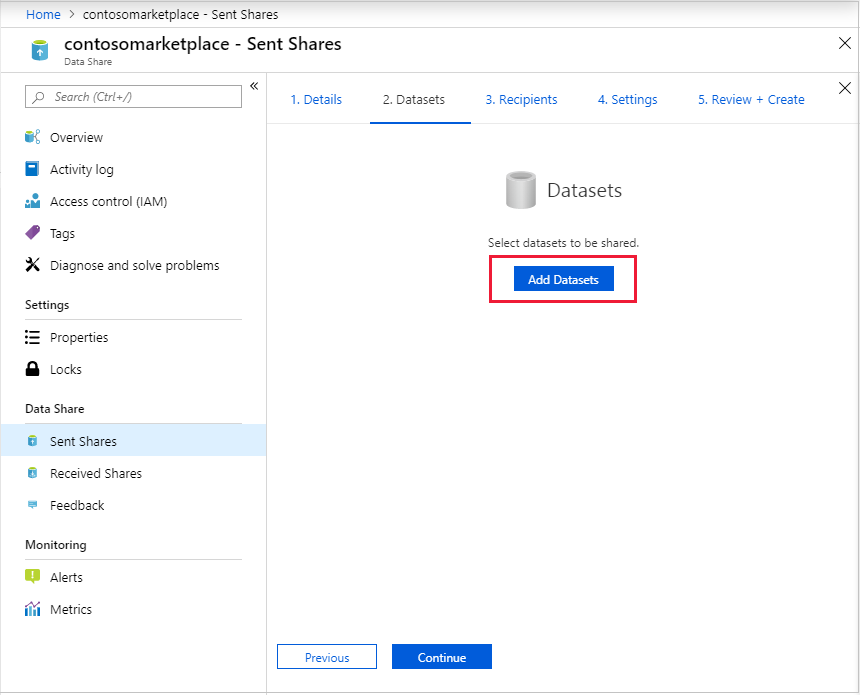
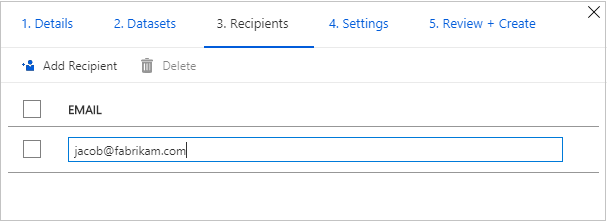
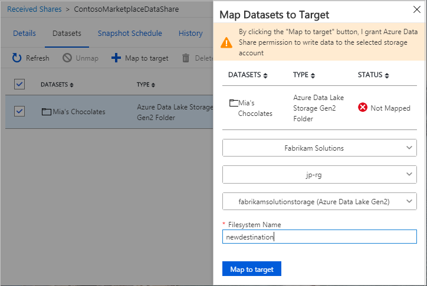
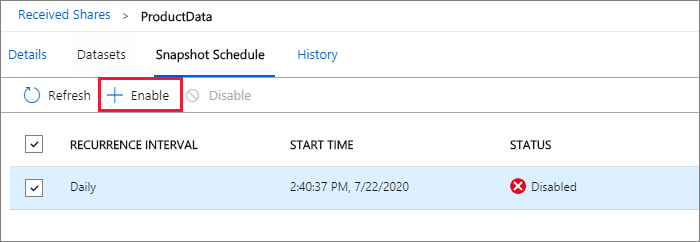

# Share and receive data from Azure Blob Storage and Azure Data Lake Storage

[!INCLUDE[appliesto-storage](includes/appliesto-storage.md)]

Azure Data Share supports snapshot-based sharing from a storage account. This article explains how to share and receive data from Azure Blob Storage, Azure Data Lake Storage Gen1, and Azure Data Lake Storage Gen2.

Azure Data Share supports the sharing of files, folders, and file systems from Azure Data Lake Gen1 and Azure Data Lake Gen2. It also supports the sharing of blobs, folders, and containers from Azure Blob Storage. Only block blobs are currently supported. Data shared from these sources can be received by Azure Data Lake Gen2 or Azure Blob Storage.

When file systems, containers, or folders are shared in snapshot-based sharing, data consumers can choose to make a full copy of the share data. Or they can use the incremental snapshot capability to copy only new or updated files. The incremental snapshot capability is based on the last modified time of the files. 

Existing files that have the same name are overwritten during a snapshot. A file that is deleted from the source isn't deleted on the target. Empty subfolders at the source aren't copied over to the target. 

## Share data

Use the information in the following sections to share data by using Azure Data Share. 
### Prerequisites to share data

* If you don't have an Azure subscription, create a [free account](https://azure.microsoft.com/free/) before you begin.
* Find your recipient's Azure sign-in email address. The recipient's email alias won't work for your purposes.
* If the source Azure data store is in a different Azure subscription than the one where you'll create the Data Share resource, register the [Microsoft.DataShare resource provider](concepts-roles-permissions.md#resource-provider-registration) in the subscription where the Azure data store is located. 

### Prerequisites for the source storage account

* An Azure Storage account. If you don't already have an account, [create one](../storage/common/storage-account-create.md).
* Permission to write to the storage account. Write permission is in *Microsoft.Storage/storageAccounts/write*. It's part of the Contributor role.
* Permission to add role assignment to the storage account. This permission is in *Microsoft.Authorization/role assignments/write*. It's part of the Owner role. 

### Sign in to the Azure portal

Sign in to the [Azure portal](https://portal.azure.com/).

### Create a Data Share account

Create an Azure Data Share resource in an Azure resource group.

1. In the upper-left corner of the portal, open the menu and then select **Create a resource** (+).

1. Search for *Data Share*.

1. Select **Data Share** and **Create**.

1. Provide the basic details of your Azure Data Share resource: 

     **Setting** | **Suggested value** | **Field description**
    |---|---|---|
    | Subscription | Your subscription | Select an Azure subscription for your data share account.|
    | Resource group | *test-resource-group* | Use an existing resource group or create a resource group. |
    | Location | *East US 2* | Select a region for your data share account.
    | Name | *datashareaccount* | Name your data share account. |
    | | |

1. Select **Review + create** > **Create** to provision your data share account. Provisioning a new data share account typically takes about 2 minutes. 

1. When the deployment finishes, select **Go to resource**.

### Create a share

1. Go to your data share **Overview** page.

   :::image type="content" source="./media/share-receive-data.png" alt-text="Screenshot showing the data share overview.":::

1. Select **Start sharing your data**.

1. Select **Create**.   

1. Provide the details for your share. Specify a name, share type, description of share contents, and terms of use (optional). 

     

1. Select **Continue**.

1. To add datasets to your share, select **Add Datasets**. 

    

1. Select a dataset type to add. The list of dataset types depends on whether you selected snapshot-based sharing or in-place sharing in the previous step. 

        

1. Go to the object you want to share. Then select **Add Datasets**. 

        

1. On the **Recipients** tab, add the email address of your data consumer by selecting **Add Recipient**. 

     

1. Select **Continue**.

1. If you selected a snapshot share type, you can set up the snapshot schedule to update your data for the data consumer. 

     

1. Select a start time and recurrence interval. 

1. Select **Continue**.

1. On the **Review + Create** tab, review your package contents, settings, recipients, and synchronization settings. Then select **Create**.

You've now created your Azure data share. The recipient of your data share can accept your invitation. 

## Receive data

The following sections describe how to receive shared data.
### Prerequisites to receive data
Before you accept a data share invitation, make sure you have the following prerequisites: 

* An Azure subscription. If you don't have a subscription, create a [free account](https://azure.microsoft.com/free/).
* An invitation from Azure. The email subject should be "Azure Data Share invitation from *\<yourdataprovider\@domain.com>*".
* A registered [Microsoft.DataShare resource provider](concepts-roles-permissions.md#resource-provider-registration) in:
    * The Azure subscription where you'll create a Data Share resource.
    * The Azure subscription where your target Azure data stores are located.

### Prerequisites for a target storage account

* An Azure Storage account. If you don't already have one, [create an account](../storage/common/storage-account-create.md). 
* Permission to write to the storage account. This permission is in *Microsoft.Storage/storageAccounts/write*. It's part of the Contributor role. 
* Permission to add role assignment to the storage account. This assignment is in *Microsoft.Authorization/role assignments/write*. It's part of the Owner role.  

### Sign in to the Azure portal

Sign in to the [Azure portal](https://portal.azure.com/).

### Open an invitation

You can open an invitation from email or directly from the Azure portal.

1. To open an invitation from email, check your inbox for an invitation from your data provider. The invitation from Microsoft Azure is titled "Azure Data Share invitation from *\<yourdataprovider\@domain.com>*". Select **View invitation** to see your invitation in Azure. 

   To open an invitation from the Azure portal, search for *Data Share invitations*. You see a list of Data Share invitations.

    

1. Select the share you want to view. 

### Accept an invitation
1. Review all of the fields, including the **Terms of use**. If you agree to the terms, select the check box. 

    

1. Under **Target Data Share account**, select the subscription and resource group where you'll deploy your Data Share. Then fill in the following fields:

   * In the **Data share account** field, select **Create new** if you don't have a Data Share account. Otherwise, select an existing Data Share account that will accept your data share. 

   * In the **Received share name** field, either leave the default that the data provider specified or specify a new name for the received share. 

1. Select **Accept and configure**. A share subscription is created. 

    

    The received share appears in your Data Share account. 

    If you don't want to accept the invitation, select **Reject**. 

### Configure a received share
Follow the steps in this section to configure a location to receive data.

1. On the **Datasets** tab, select the check box next to the dataset where you want to assign a destination. Select **Map to target** to choose a target data store. 

    

1. Select a target data store for the data. Files in the target data store that have the same path and name as files in the received data will be overwritten. 

    

1. For snapshot-based sharing, if the data provider uses a snapshot schedule to regularly update the data, you can enable the schedule from the **Snapshot Schedule** tab. Select the box next to the snapshot schedule. Then select **Enable**.

   

### Trigger a snapshot
The steps in this section apply only to snapshot-based sharing.

1. You can trigger a snapshot from the **Details** tab. On the tab, select **Trigger snapshot**. You can choose to trigger a full snapshot or incremental snapshot of your data. If you're receiving data from your data provider for the first time, select **Full copy**. When a snapshot is executing, subsequent snapshots will not start until the previous one complete.

    

1. When the last run status is *successful*, go to the target data store to view the received data. Select **Datasets**, and then select the target path link. 

    

### View history
You can view the history of your snapshots only in snapshot-based sharing. To view the history, open the **History** tab. Here you see the history of all of the snapshots that were generated in the past 30 days. 

## Storage snapshot performance
Storage snapshot performance is impacted by a number of factors in addition to number of files and size of the shared data. It is always recommended to conduct your own performance testing. Below are some example factors impacting performance.

* Concurrent access to the source and target data stores.  
* Location of source and target data stores. 
* For incremental snapshot, number of files in the shared dataset can impact the time takes to find the list of files with last modified time after the last successful snapshot. 

## Next steps
You've learned how to share and receive data from a storage account by using the Azure Data Share service. To learn about sharing from other data sources, see [Supported data stores](supported-data-stores.md).