# Update your Azure Stack Edge Pro GPU 

This article describes the steps required to install update on your Azure Stack Edge Pro with GPU via the local web UI and via the Azure portal. You apply the software updates or hotfixes to keep your Azure Stack Edge Pro device and the associated Kubernetes cluster on the device up-to-date. 

The procedure described in this article was performed using a different version of software, but the process remains the same for the current software version.

> [!IMPORTANT]
> - Update **2010** corresponds to **2.1.1377.2170** software version on your device. For information on this update, go to [Release notes](azure-stack-edge-gpu-2009-release-notes.md).
>
> - Keep in mind that installing an update or hotfix restarts your device. This update requires you to apply two updates sequentially. First you apply the device software updates and then Kubernetes updates. Given that the Azure Stack Edge Pro is a single node device, any I/O in progress is disrupted and your device experiences a downtime of up to 30 minutes for the device software update.

To install updates on your device, you first need to configure the location of the update server. After the update server is configured, you can apply the updates via the Azure portal UI or the local web UI.

Each of these steps is described in the following sections.

## Configure update server

1. In the local web UI, go to **Configuration** > **Update server**. 
   
    

2. In **Select update server type**, from the dropdown list, choose from Microsoft Update server (default) or Windows Server Update Services.  
   
    If updating from the Windows Server Update Services, specify the server URI. The server at that URI will deploy the updates on all the devices connected to this server.

    
    
    The WSUS server is used to manage and distribute updates through a management console. A WSUS server can also be the update source for other WSUS servers within the organization. The WSUS server that acts as an update source is called an upstream server. In a WSUS implementation, at least one WSUS server on your network must be able to connect to Microsoft Update to get available update information. As an administrator, you can determine - based on network security and configuration - how many other WSUS servers connect directly to Microsoft Update.
    
    For more information, go to [Windows Server Update Services (WSUS)](https://docs.microsoft.com/windows-server/administration/windows-server-update-services/get-started/windows-server-update-services-wsus)

## Use the Azure portal

We recommend that you install updates through the Azure portal. The device automatically scans for updates once a day. Once the updates are available, you see a notification in the portal. You can then download and install the updates. 

> [!NOTE]
> Make sure that the device is healthy and status shows as **Online** before you proceed to install the updates.

1. When the updates are available for your device, you see a notification. Select the notification or from the top command bar, **Update device**. This will allow you to apply device software updates.

    

2. In the **Device updates** blade, check that you have reviewed the license terms associated with new features in the release notes.

    You can choose to **Download and install** the updates or just **Download** the updates. You can then choose to install these updates later.

        

    If you want to download and install the updates, check the option that updates install automatically after the download completes.

    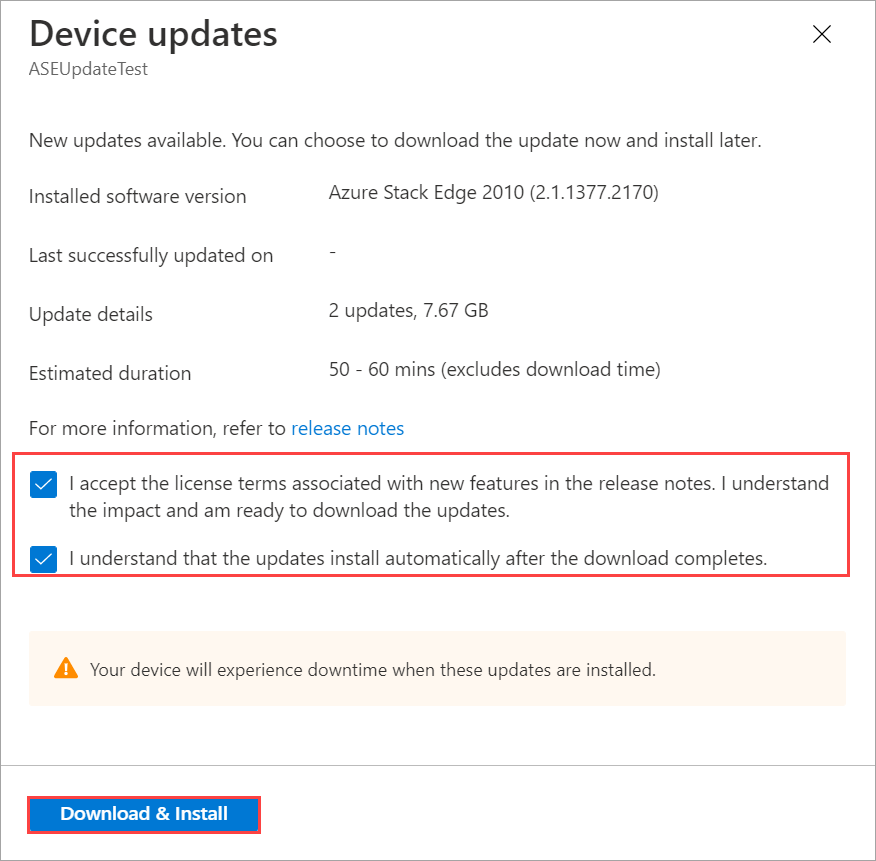

3. The download of updates starts. You see a notification that the download is in progress.

    

    A notification banner is also displayed in the Azure portal. This indicates the download progress. 

    

    You can select this notification or select **Update device** to see the detailed status of the update.

    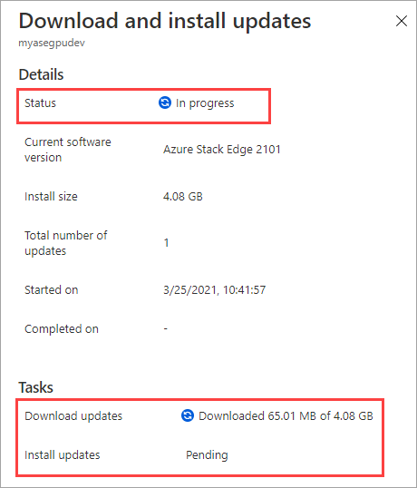   

4. After the download is complete, the notification banner updates to indicate the completion. If you chose to download and install the updates, the installation will begin automatically.

    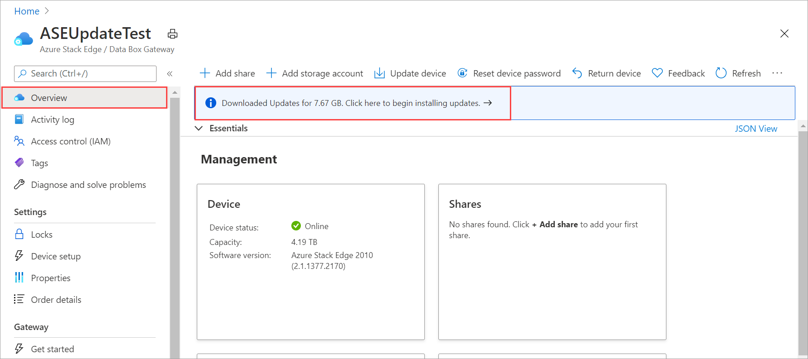

    If you chose to download updates only, then select the notification to open the **Device updates** blade. Select **Install**.
  
    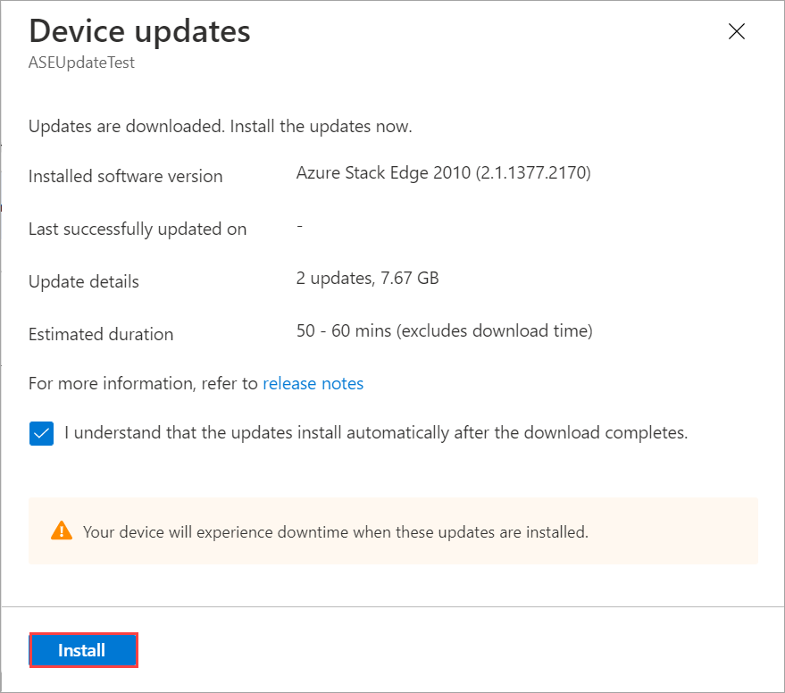

5. You see a notification that the install is in progress.

    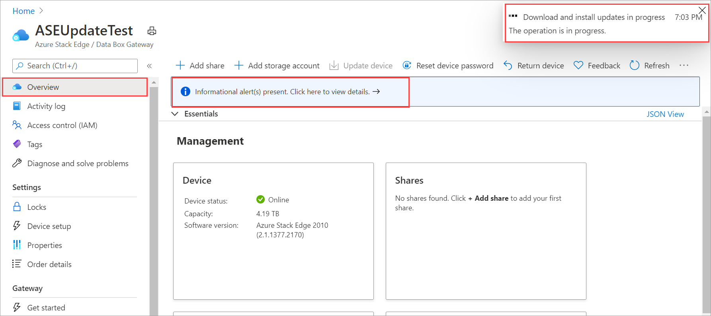

    The portal also displays an informational alert to indicate that the install is in progress. The device goes offline and is in maintenance mode.
    
    

6. As this is a 1-node device, the device will restart after the updates are installed. The critical alert during the restart will indicate that the device heartbeat is lost.

    

    Select the alert to see the corresponding device event.
    
    

7. After the restart, the device is again put in the maintenance mode and an informational alert is displayed to indicate that.

    If you select the **Update device** from the top command bar, you can see the progress of the updates.   

8. The device status updates to **Online** after the updates are installed. 

    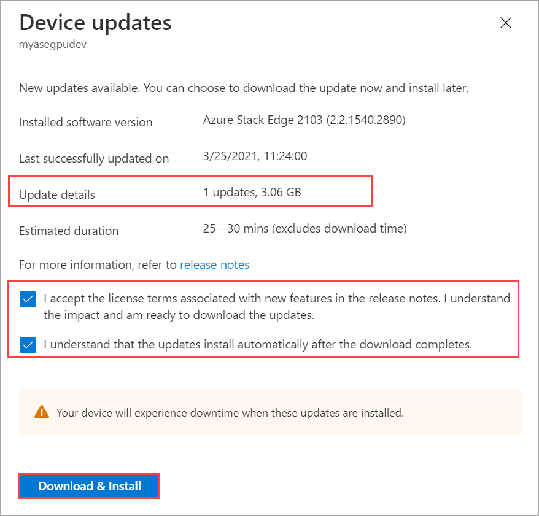

    From the top command bar, select **Device updates**. Verify that update has successfully installed and the device software version reflects that.

    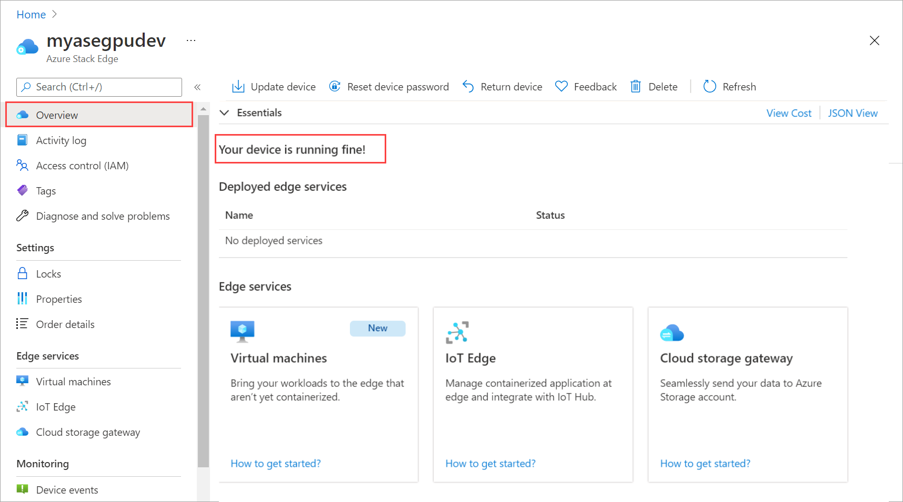

9. You will again see a notification that updates are available. These are the Kubernetes updates. Select the notification or select **Update device** from the top command bar.

    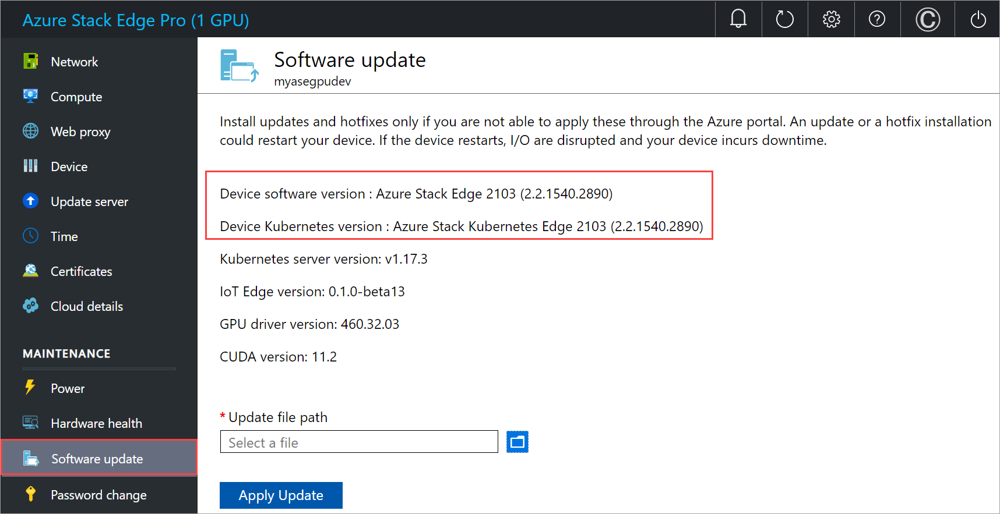

10. Download the Kubernetes updates. You can see that the package size is different when compared to the previous update package.

    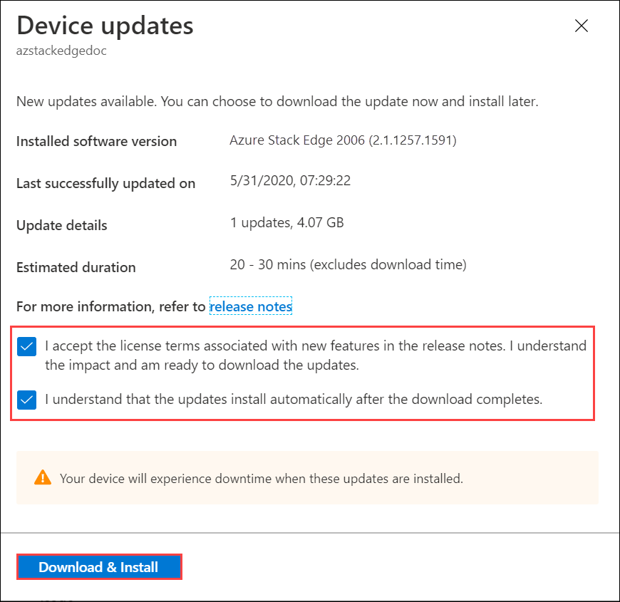

    The process of installation is identical to that of device updates. First the updates are downloaded.

    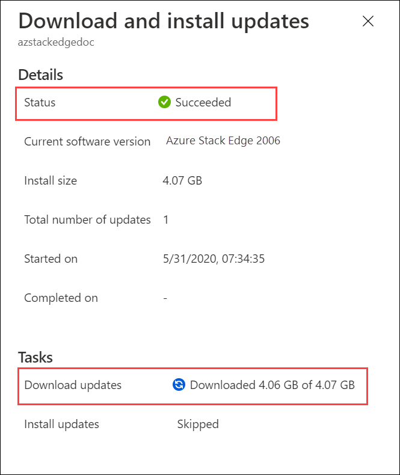    
    
11. Once the updates are downloaded, you can then install the updates. 

    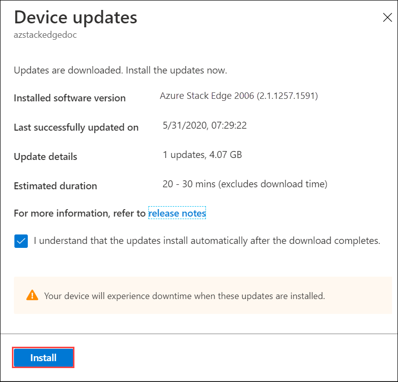

    As the updates are installed, the device is put into maintenance mode. The device does not restart for the Kubernetes updates. 

    Once the Kubernetes updates are successfully installed, the banner notification disappears as no further updates are needed. Your device has now the latest version of device software and Kubernetes.

    

## Use the local web UI

There are two steps when using the local web UI:

* Download the update or the hotfix
* Install the update or the hotfix

Each of these steps is described in detail in the following sections.

### Download the update or the hotfix

Perform the following steps to download the update. You can download the update from the Microsoft-supplied location or from the Microsoft Update Catalog.

Do the following steps to download the update from the Microsoft Update Catalog.

1. Start the browser and navigate to [https://catalog.update.microsoft.com](https://catalog.update.microsoft.com).

    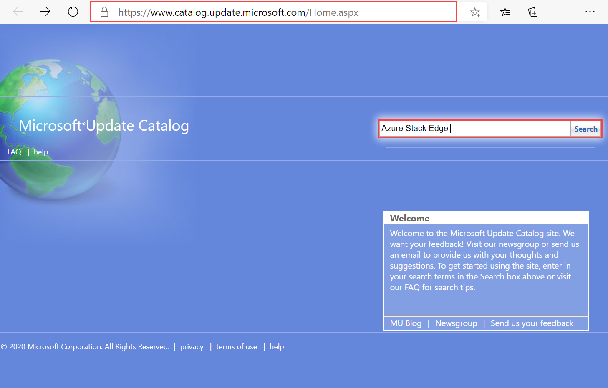

2. In the search box of the Microsoft Update Catalog, enter the Knowledge Base (KB) number of the hotfix or terms for the update you want to download. For example, enter **Azure Stack Edge Pro**, and then click **Search**.
   
    The update listing appears as **Azure Stack Edge Update 2010**.
   
    <!--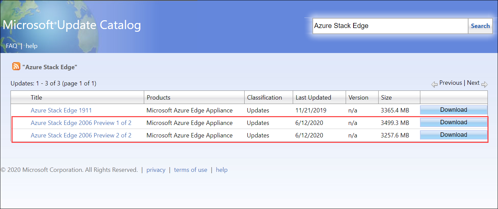-->

4. Select **Download**. There are two files to download with *SoftwareUpdatePackage.exe* and *Kubernetes_Package.exe* suffixes that correspond to device software updates and Kubernetes updates respectively. Download the files to a folder on the local system. You can also copy the folder to a network share that is reachable from the device.

### Install the update or the hotfix

Prior to the update or hotfix installation, make sure that:

 - You have the update or the hotfix downloaded either locally on your host or accessible via a network share.
 - Your device status is healthy as shown in the **Overview** page of the local web UI.

   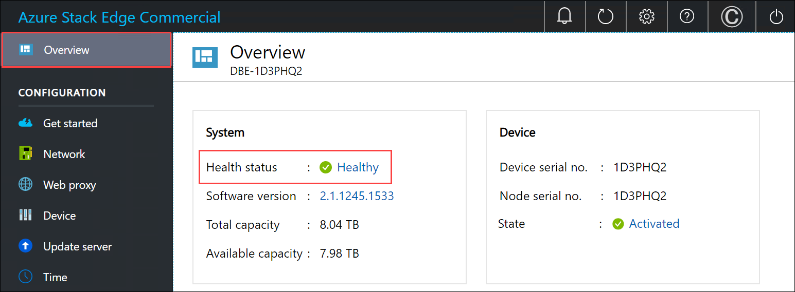 

This procedure takes around 20 minutes to complete. Perform the following steps to install the update or hotfix.

1. In the local web UI, go to **Maintenance** > **Software update**. Make a note of the software version that you are running. 
   
   

2. Provide the path to the update file. You can also browse to the update installation file if placed on a network share. Select the software update file with *SoftwareUpdatePackage.exe* suffix.

   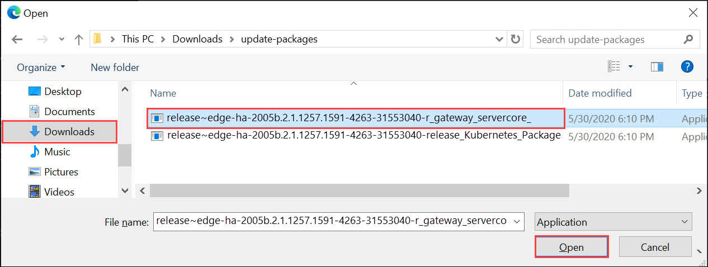

3. Select **Apply**. 

   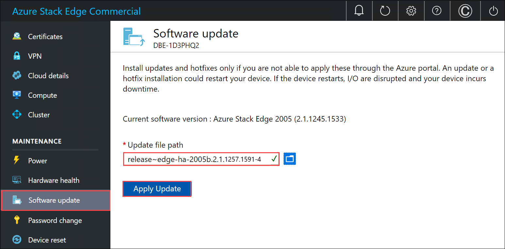

4. When prompted for confirmation, select **Yes** to proceed. Given the device is a single node device, after the update is applied, the device restarts and there is downtime. 
   
   

5. The update starts. After the device is successfully updated, it restarts. The local UI is not accessible in this duration.
   
6. After the restart is complete, you are taken to the **Sign in** page. To verify that the device software has updated, in the local web UI, go to **Maintenance** > **Software update**. For the current release, the displayed software version should be **2.1.1377.2170**.

   <!--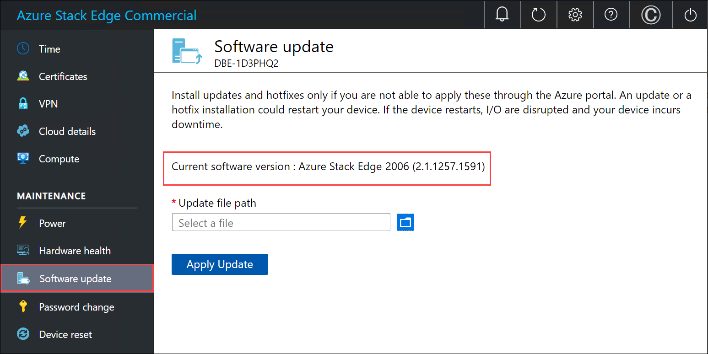--> 

7. You will now update the Kubernetes software version. Repeat the above steps. Provide a path to the Kubernetes update file with the *Kubernetes_Package.exe* suffix.  

   <!--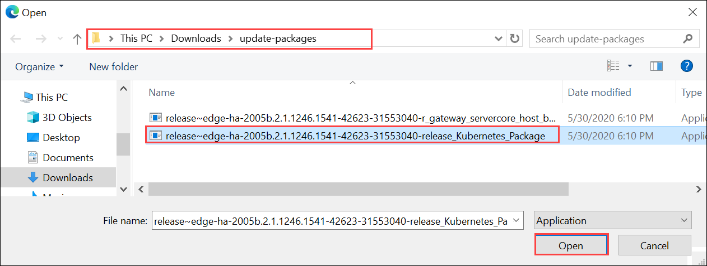--> 

8. Select **Apply**. 

   

9. When prompted for confirmation, select **Yes** to proceed. 

10. After the Kubernetes update is successfully installed, there is no change to the displayed software in **Maintenance** > **Software update**. 

## Next steps

Learn more about [administering your Azure Stack Edge Pro](azure-stack-edge-manage-access-power-connectivity-mode.md).
