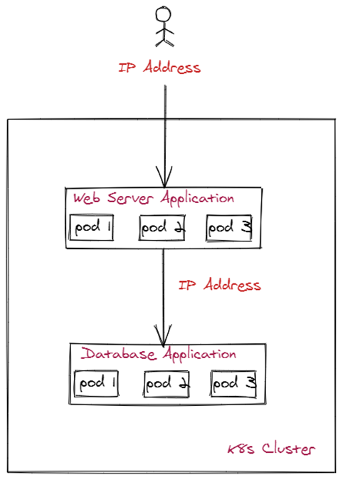

# Kubernetes networking in your Azure Stack Edge Pro GPU device

On your Azure Stack Edge Pro device, a Kubernetes cluster is created when you configure compute role. Once the Kubernetes cluster is created, then containerized applications can be deployed on the Kubernetes cluster in Pods. There are distinct ways that networking is used for the Pods in your Kubernetes cluster. 

This article describes the networking in a Kubernetes cluster in general and specifically in the context of your Azure Stack Edge Pro device. 

## Networking requirements

Here is an example of a typical 2-tier app that is deployed to the Kubernetes cluster.

- The app has a web server front end and a database application in the backend. 
- Every pod is assigned an IP but these IPs can change on restart and failover of the pod. 
- Each app is made up of multiple pods and there should be load balancing of the traffic across all the pod replicas. 

The above scenario results in the following networking requirements:

 - There is a need for the external facing application to be accessed by an application user outside of the Kubernetes cluster via a name or an IP address. 
 - The applications within the Kubernetes cluster, for example, front end and the backend pods here should be able to talk to each other.

To solve both the above needs, we introduce a Kubernetes service. 

## Networking services

There are two types of Kubernetes services: 

- **Cluster IP service** - think of this as providing a constant endpoint for the application pods. Any pod associated with these services cannot be accessed from outside of the Kubernetes cluster. The IP address used with these services comes from the address space in the private network. 
- **Load balancer IP** - like the cluster IP service but the associated IP comes from the external network and can be accessed from outside of the Kubernetes cluster.

<!--## Networking example for an app

Each of these applications pods has a label associated with it. For example, the web server application pods have a label `app = WS` and the service has a label selector which the same as `app = WS`. Whenever a service of type load balancer or cluster IP is created, there is a control loop that runs in the master and publishes an endpoint corresponding to this service. This service uses a combination of labels and label selectors to discover the pods associated with this service. As a pod gets created, the new endpoint for the pod is added to the endpoint mapping. Whenever a pod is deleted, it gets deleted from the endpoint mapping. Using this endpoint controller, the service has a most up-to-date view of the pods that make up this application.

For discovery of applications within the cluster, Kubernetes cluster has an inbuilt DNS server pod. This is a cluster DNS that resolves service names to cluster IP. Anytime a cluster IP service is created, a DNS record is added to the DNS server that maps the name of the service to the cluster internal IP. That is how the applications within the cluster can discover each other. For load balancing, there is also the `kube-proxy`. This runs on every node and captures the traffic that comes in through the cluster IP and then distributes the traffic across the pods. 

When an application or the end user would first use the IP address associated with the service of type load balancer to discover the service. Then it would use the label select `app = WS` to discover the pods associated with the application. The `kube-proxy` component would then distribute the traffic and ensure that it hits one of the web server application pods. If the web server app wanted to talk to the database app, then it would simply use the name of the service and using the name and the DNS server pod, resolve the name to an IP address. Again using labels and label selector, it would discover the pods associated with the database application. The `kube-proxy` would then distribute the traffic across each of the database app nodes.-->

## Kubernetes networking on Azure Stack Edge Pro

Calico, Metallb, and Core DNS are all the components that are installed for networking on your Azure Stack Edge Pro. 

- **Calico** assigns an IP address from a private IP range to every pod and configure networking for these pods so that pod on one node can communicate with the pod on another node. 
- **Metallb** runs on an in-cluster pod and assigns IP address to services of type load balancer. Load balancer IP addresses are chosen from the service Ip range provided via the local UI. 
- **Core DNS** - This add-on configures DNS records mapping service name to cluster IP address.

The IP addresses used for Kubernetes nodes and the external services are provided via the **Compute network** page in the local UI of the device.

The IP assignment is for:

- **Kubernetes node IPs**: This IP range is used for Kubernetes master and worker nodes. These IP are used when Kubernetes nodes communicate with each other.

- **Kubernetes external service IPs**: This IP range is used for external services (also known as the Load Balancer services) that are exposed outside of the Kubernetes cluster.  

## Next steps

To configure Kubernetes networking on your Azure Stack Edge Pro see:

- [Expose a stateless application externally on your Azure Stack Edge Pro via IoT Edge](azure-stack-edge-gpu-deploy-stateless-application-iot-edge-module.md).

- [Expose a stateless application externally on your Azure Stack Edge Pro via kuebctl](azure-stack-edge-j-series-deploy-stateless-application-kubernetes.md).
