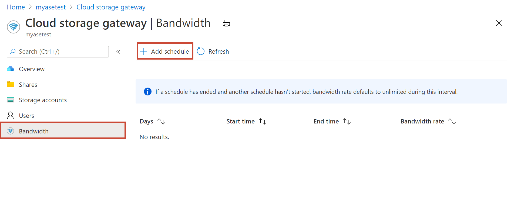
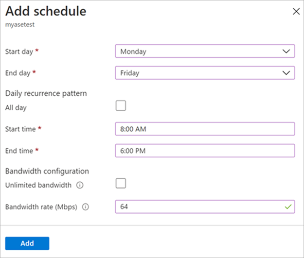
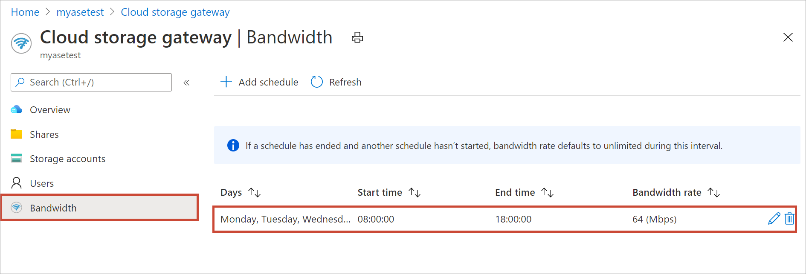
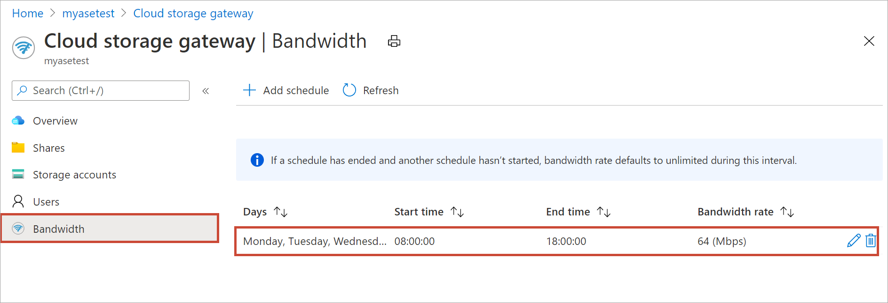
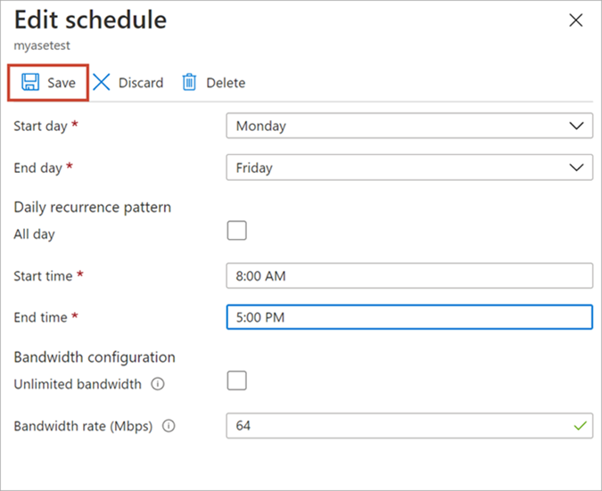
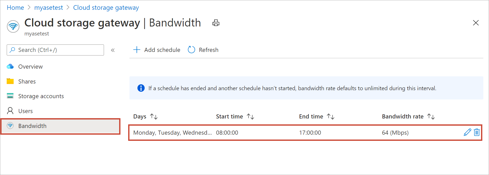
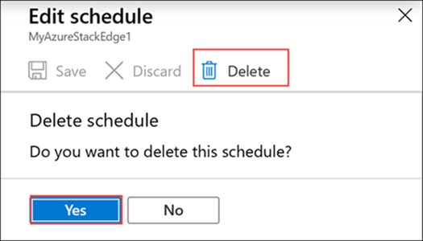

# Use the Azure portal to manage bandwidth schedules on your Azure Stack Edge GPU 

<!--[!INCLUDE [applies-to-skus](../../includes/azure-stack-edge-applies-to-all-sku.md)]-->

This article describes how to manage bandwidth schedules on your Azure Stack Edge. Bandwidth schedules allow you to configure network bandwidth usage across multiple time-of-day schedules. These schedules can be applied to the upload and download operations from your device to the cloud.

You can add, modify, or delete the bandwidth schedules for your Azure Stack Edge via the Azure portal.

In this article, you learn how to:

> [!div class="checklist"]
> * Add a schedule
> * Modify schedule
> * Delete a schedule

## Add a schedule

Do the following steps in the Azure portal to add a schedule.

1. In the Azure portal for your Azure Stack Edge resource, go to **Bandwidth**.
2. In the right-pane, select **+ Add schedule**.

    

3. In the **Add schedule**: 

   1. Provide the **Start day**, **End day**, **Start time**, and **End time** of the schedule.
   2. Check the **All day** option if this schedule should run all day.
   3. **Bandwidth rate** is the bandwidth in Megabits per second (Mbps) used by your device in operations involving the cloud (both uploads and downloads). Supply a number between 20 and 2,147,483,647 for this field.
   4. Check **Unlimited** bandwidth if you do not want to throttle the date upload and download.
   5. Select **Add**.

      

3. A schedule is created with the specified parameters. This schedule is then displayed in the list of bandwidth schedules in the portal.

    

## Edit schedule

Do the following steps to edit a bandwidth schedule.

1. In the Azure portal, go to your Azure Stack Edge resource and then go to **Bandwidth**. 
2. From the list of bandwidth schedules, select a schedule that you want to modify.
    

3. Make the desired changes and save the changes.

    

4. After the schedule is modified, the list of schedules is updated to reflect the modified schedule.

    

## Delete a schedule

Do the following steps to delete a bandwidth schedule associated with your Azure Stack Edge device.

1. In the Azure portal, go to your Azure Stack Edge resource and then go to **Bandwidth**.  

2. From the list of bandwidth schedules, select a schedule that you want to delete. In the **Edit schedule**, select **Delete**. When prompted for confirmation, select **Yes**.

   

3. After the schedule is deleted, the list of schedules is updated.

## Next steps

- Learn how to [Manage shares](azure-stack-edge-j-series-manage-shares.md).
