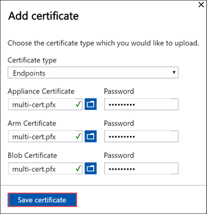
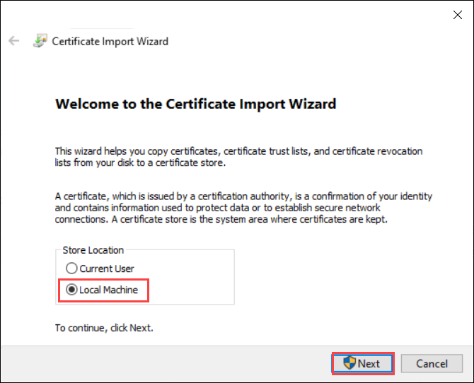
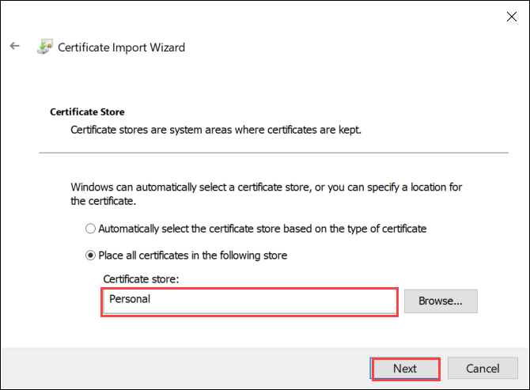
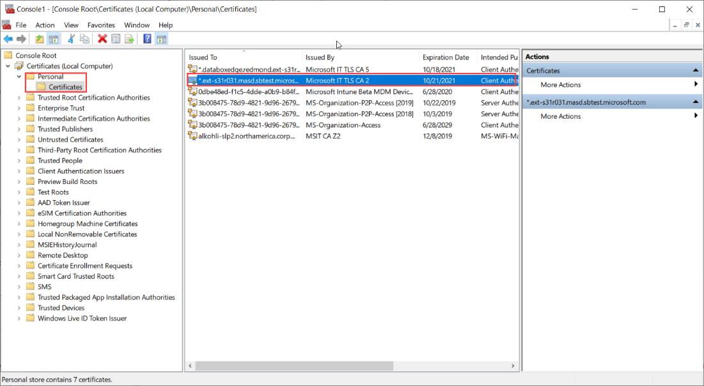
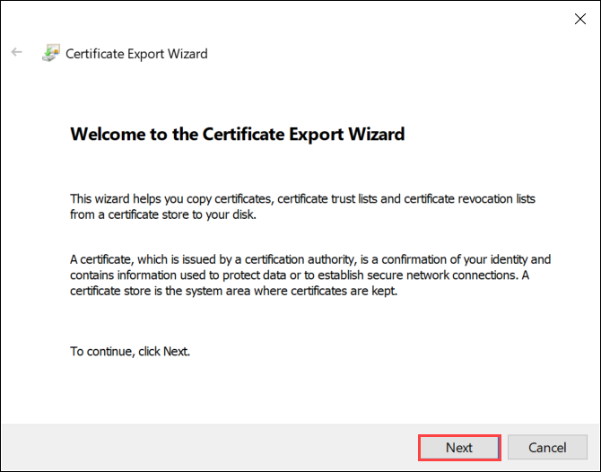

# Use certificates with Azure Stack Edge Pro GPU device

<!--[!INCLUDE [applies-to-skus](../../includes/azure-stack-edge-applies-to-all-sku.md)]-->

This article describes the types of certificates that can be installed on your Azure Stack Edge Pro device. The article also includes the details for each certificate type along with the procedure to install and identify the expiration date. 

## About certificates

A certificate provides a link between a **public key** and an entity (such as domain name) that has been **signed** (verified) by a trusted third party (such as a **certificate authority**).  A certificate provides a convenient way of distributing trusted public encryption keys. Certificates thereby ensure that your communication is trusted and that you're sending encrypted information to the right server. 

When your Azure Stack Edge Pro device is initially configured, self-signed certificates are automatically generated. Optionally, you can bring your own certificates. There are guidelines that you need to follow if you plan to bring your own certificates.

## Types of certificates

The various types of certificates that are used on your Azure Stack Edge Pro device are as follows: 
- Signing certificates
    - Root CA
    - Intermediate

- Endpoint certificates
    - Node certificate
    - Local UI certificates
    - Azure Resource Manager certificates
    - Blob storage certificates
    - IoT device certificates
    <!--- WiFi certificates
    - VPN certificates-->

- Encryption certificates
    - Support session certificates

Each of these certificates are described in detail in the following sections.

## Signing chain certificates

These are the certificates for the authority that signs the certificates or the signing certificate authority. 

### Types

These certificates could be root certificates or the intermediate certificates. The root certificates are always self-signed (or signed by itself). The intermediate certificates are not self-signed and are signed by the signing authority.

### Caveats

- The root certificates should be signing chain certificates.
- The root certificates can be uploaded on your device in the following format: 
    - **DER** – These are available as a `.cer` file extension.
    - **Base-64 encoded or PEM** – These are available as `.cer` extension also.
    - **P7b** – This format is used only for signing chain certificates that includes the root and intermediate certificates.
- Signing chain certificates are always uploaded before you upload any other certificates.


## Node certificates

<!--Your Azure Stack Edge Pro device could be a 1-node device or a 4-node device.--> All the nodes in the device are constantly communicating with each other and therefore need to have a trust relationship. Node certificates provide a way to establish that trust. Node certificates also come into play when you are connecting to the device node using a remote PowerShell session over https.

### Caveats

- The node certificate should be provided in `.pfx` format with a private key that can be exported. 
- You can create and upload 1 wildcard node certificate or 4 individual node certificates. 
- A node certificate must be changed if the DNS domain changes but the device name does not change. If you are bringing your own node certificate, then you can't change the device serial number, you can only change the domain name.
- Use the following table to guide you when creating a node certificate.
   
    |Type |Subject name (SN)  |Subject alternative name (SAN)  |Subject name example |
    |---------|---------|---------|---------|
    |Node|`<NodeSerialNo>.<DnsDomain>`|`*.<DnsDomain>`<br><br>`<NodeSerialNo>.<DnsDomain>`|`mydevice1.microsoftdatabox.com` |
   

## Endpoint certificates

For any endpoints that the device exposes, a certificate is required for trusted communication. The endpoint certificates include those required when accessing the Azure Resource Manager and the blob storage via the REST APIs. 

When you bring in a signed certificate of your own, you also need the corresponding signing chain of the certificate. For the signing chain, Azure Resource Manager, and the blob certificates on the device, you will need the corresponding certificates on the client machine also to authenticate and communicate with the device.

### Caveats

- The endpoint certificates need to be in `.pfx` format with a private key. Signing chain should be DER format (`.cer` file extension). 
- When you bring your own endpoint certificates, these can be as individual certificates or multidomain certificates. 
- If you are bringing in signing chain, the signing chain certificate must be uploaded before you upload an endpoint certificate.
- These certificates must be changed if the device name or the DNS domain names change.
- A wildcard endpoint certificate can be used.
- The properties of the endpoint certificates are similar to those of a typical SSL certificate. 
- Use the following table when creating an endpoint certificate:

    |Type |Subject name (SN)  |Subject alternative name (SAN)  |Subject name example |
    |---------|---------|---------|---------|
    |Azure Resource Manager|`management.<Device name>.<Dns Domain>`|`login.<Device name>.<Dns Domain>`<br>`management.<Device name>.<Dns Domain>`|`management.mydevice1.microsoftdatabox.com` |
    |Blob storage|`*.blob.<Device name>.<Dns Domain>`|`*.blob.< Device name>.<Dns Domain>`|`*.blob.mydevice1.microsoftdatabox.com` |
    |Multi-SAN single certificate for both endpoints|`<Device name>.<dnsdomain>`|`<Device name>.<dnsdomain>`<br>`login.<Device name>.<Dns Domain>`<br>`management.<Device name>.<Dns Domain>`<br>`*.blob.<Device name>.<Dns Domain>`|`mydevice1.microsoftdatabox.com` |


## Local UI certificates

You can access the local web UI of your device via a browser. To ensure that this communication is secure, you can upload your own certificate. 

### Caveats

- The local UI certificate is also uploaded in a `.pfx` format with a private key that can be exported.
- After you upload the local UI certificate, you will need to restart the browser and clear the cache. Refer to the specific instructions for your browser.

    |Type |Subject name (SN)  |Subject alternative name (SAN)  |Subject name example |
    |---------|---------|---------|---------|
    |Local UI| `<Device name>.<DnsDomain>`|`<Device name>.<DnsDomain>`| `mydevice1.microsoftdatabox.com` |
   

## IoT Edge device certificates

Your Azure Stack Edge Pro device is also an IoT device with the compute enabled by an IoT Edge device connected to it. For any secure communication between this IoT Edge device and the downstream devices that may connect to it, you can also upload IoT Edge certificates. 

The device has self-signed certificates that can be used if you want to use only the compute scenario with the device. If the Azure Stack Edge Pro device is however connected to downstream devices, then you'll need to bring your own certificates.

There are three IoT Edge certificates that you need to install to enable this trust relation:

- **Root certificate authority or the owner certificate authority**
- **Device certificate authority** 
- **Device key certificate**

### Caveats

- The IoT Edge certificates are uploaded in `.pem` format. 


For more information on IoT Edge certificates, see [Azure IoT Edge certificate details](../iot-edge/iot-edge-certs.md#iot-edge-certificates).

## Support session certificates

If your Azure Stack Edge Pro device is experiencing any issues, then to troubleshoot those issues, a remote PowerShell Support session may be opened on the device. To enable a secure, encrypted communication over this Support session, you can upload a certificate.

### Caveats

- Make sure that the corresponding `.pfx` certificate with private key is installed on the client machine using the decryption tool.
- Verify that the **Key Usage** field for the certificate is not **Certificate Signing**. To verify this, right-click the certificate, choose **Open** and in the **Details** tab, find **Key Usage**. 


### Caveats

- The Support session certificate must be provided as DER format with a `.cer` extension.


<!--## VPN certificates

If VPN is configured on your Azure Stack Edge Pro device, then you will also need a certificate for any communication that occurs over the VPN channel. You can bring your own VPN certificate to ensure the communication is trusted.

### Caveats

- The VPN certificate must be uploaded as a pfx format with a  private key.
- The VPN certificate is not dependant on the device name, device serial number, or device configuration. It only requires the external FQDN.
- Make sure that the client OID is set.-->

<!--## WiFi certificates

If your device is configured to operate on a wireless network, then you will also need a WiFi certificate for any communication that occurs over the wireless network. 

### Caveats

- The WiFi certificate must be uploaded as a pfx format with a private key.
- Make sure that the client OID is set.-->


## Create certificates (optional)

The following section describes the procedure to create signing chain and endpoint certificates.

### Certificate workflow

You will have a defined way to create the certificates for the devices operating in your environment. You can use the certificates provided to you by your IT administrator. 

**For development or test purposes only, you can also use Windows PowerShell to create certificates on your local system.** While creating the certificates for the client, follow these guidelines:

1. You can create any of the following types of certificates:

    - Create a single certificate valid for use with a single fully qualified domain name (FQDN). For example, *mydomain.com*.
    - Create a wildcard certificate to secure the main domain name and multiple sub domains as well. For example, **.mydomain.com*.
    - Create a subject alternative name (SAN) certificate that will cover multiple domain names in a single certificate. 

2. If you are bringing your own certificate, you will need a root certificate for the signing chain. See steps to [Create signing chain certificates](#create-signing-chain-certificate).

3. You can next create the endpoint certificates for the local UI of the appliance, blob, and Azure Resource Manager. You can create 3 separate certificates for the appliance, blob, and Azure Resource Manager, or you can create one certificate for all the 3 endpoints. For detailed steps, see [Create signing and endpoint certificates](#create-signed-endpoint-certificates).

4. Whether you are creating 3 separate certificates or one certificate, specify the subject names (SN) and subject alternative names (SAN) as per the guidance provided for each certificate type. 

### Create signing chain certificate

Create these certificates via Windows PowerShell running in administrator mode. **The certificates created this way should be used for development or test purposes only.**

The signing chain certificate needs to be created only once. The other end point certificates will refer to this certificate for signing.
 

```azurepowershell
$cert = New-SelfSignedCertificate -Type Custom -KeySpec Signature -Subject "CN=RootCert" -HashAlgorithm sha256 -KeyLength 2048 -CertStoreLocation "Cert:\LocalMachine\My" -KeyUsageProperty Sign -KeyUsage CertSign
```


### Create signed endpoint certificates

Create these certificates via Windows PowerShell running in administrator mode.

In these examples, endpoints certificates are created for a device with:
    - Device name: `DBE-HWDC1T2`
    - DNS domain: `microsoftdatabox.com`

Replace with the name and DNS domain for your device to create certificates for your device.
 
**Blob endpoint certificate**

Create a certificate for the Blob endpoint in your personal store.

```azurepowershell
$AppName = "DBE-HWDC1T2"
$domain = "microsoftdatabox.com"

New-SelfSignedCertificate -Type Custom -DnsName "*.blob.$AppName.$domain" -Subject "CN=*.blob.$AppName.$domain" -KeyExportPolicy Exportable  -HashAlgorithm sha256 -KeyLength 2048  -CertStoreLocation "Cert:\LocalMachine\My" -Signer $cert -KeySpec KeyExchange -TextExtension @("2.5.29.37={text}1.3.6.1.5.5.7.3.1")
```

**Azure Resource Manager endpoint certificate**

Create a certificate for the Azure Resource Manager endpoints in your personal store.

```azurepowershell
$AppName = "DBE-HWDC1T2"
$domain = "microsoftdatabox.com"

New-SelfSignedCertificate -Type Custom -DnsName "management.$AppName.$domain","login.$AppName.$domain" -Subject "CN=management.$AppName.$domain" -KeyExportPolicy Exportable  -HashAlgorithm sha256 -KeyLength 2048  -CertStoreLocation "Cert:\LocalMachine\My" -Signer $cert -KeySpec KeyExchange -TextExtension @("2.5.29.37={text}1.3.6.1.5.5.7.3.1")
```

**Device local web UI certificate**

Create a certificate for the local web UI of the device in your personal store.

```azurepowershell
$AppName = "DBE-HWDC1T2"
$domain = "microsoftdatabox.com"

New-SelfSignedCertificate -Type Custom -DnsName "$AppName.$domain" -Subject "CN=$AppName.$domain" -KeyExportPolicy Exportable  -HashAlgorithm sha256 -KeyLength 2048  -CertStoreLocation "Cert:\LocalMachine\My" -Signer $cert -KeySpec KeyExchange -TextExtension @("2.5.29.37={text}1.3.6.1.5.5.7.3.1")
```

**Single multi-SAN certificate for all endpoints**

Create a single certificate for all the endpoints in your personal store.

```azurepowershell
$AppName = "DBE-HWDC1T2"
$domain = "microsoftdatabox.com"
$DeviceSerial = "HWDC1T2"

New-SelfSignedCertificate -Type Custom -DnsName "$AppName.$domain","$DeviceSerial.$domain","management.$AppName.$domain","login.$AppName.$domain","*.blob.$AppName.$domain" -Subject "CN=$AppName.$domain" -KeyExportPolicy Exportable  -HashAlgorithm sha256 -KeyLength 2048  -CertStoreLocation "Cert:\LocalMachine\My" -Signer $cert -KeySpec KeyExchange -TextExtension @("2.5.29.37={text}1.3.6.1.5.5.7.3.1")
```

Once the certificates are created, the next step is to upload the certificates on your Azure Stack Edge Pro device


## Upload certificates 

The certificates that you created for your device by default reside in the **Personal store** on your client. These certificates need to be exported on your client into appropriate format files that can then be uploaded to your device.

1. The root certificate must be exported as DER format with `.cer` extension. For detailed steps, see [Export certificates as DER format](#export-certificates-as-der-format).
2. The endpoint certificates must be exported as *.pfx* files with private keys. For detailed steps, see [Export certificates as *.pfx* file with private keys](#export-certificates-as-pfx-format-with-private-key). 
3. The root and endpoint certificates are then uploaded on the device using the **+ Add certificate** option on the Certificates page in the local web UI. 

    1. Upload the root certificates first. In the local web UI, go to **Certificates > + Add certificate**.

        

    2. Next upload the endpoint certificates. 

        

        Choose the certificate files in *.pfx* format and enter the password you supplied when you exported the certificate. The Azure Resource Manager certificate may take a few minutes to apply.

        If the signing chain is not updated first, and you try to upload the endpoint certificates, then you will get an error.

        

        Go back and upload the signing chain certificate and then upload and apply the endpoint certificates.

> [!IMPORTANT]
> If the device name or the DNS domain are changed, new certificates must be created. The client certificates and the device certificates should then be updated with the new device name and DNS domain. 

## Import certificates on the client accessing the device

The certificates that you created and uploaded to your device must be imported on your Windows client (accessing the device) into the appropriate certificate store.

1. The root certificate that you exported as the DER should now be imported in the **Trusted Root Certificate Authorities** on your client system. For detailed steps, see [Import certificates into the Trusted Root Certificate Authorities store](#import-certificates-as-der-format).

2. The endpoint certificates that you exported as the `.pfx` must be exported as DER with `.cer` extension. This `.cer` is then imported in the **Personal certificate store** on your system. For detailed steps, see [Import certificates into the Personal certificate store](#import-certificates-as-der-format).

### Import certificates as DER format

To import certificates on a Windows client, take the following steps:

1. Right-click the file and select **Install certificate**. This action starts the Certificate Import Wizard.

    

2. For **Store location**, select **Local Machine**, and then select **Next**.

    

3. Select **Place all certificates in the following store**, and then select **Browse**. 

    - To import into personal store, navigate to the Personal store of your remote host, and then select **Next**.

        


    - To import into trusted store, navigate to the Trusted Root Certificate Authority, and then select **Next**.

        

 
4. Select **Finish**. A message to the effect that the import was successful appears.

### Export certificates as .pfx format with private key

Take the following steps to export an SSL certificate with private key on a Windows machine. 

> [!IMPORTANT]
> Perform these steps on the same machine that you used to create the certificate. 

1. Run *certlm.msc* to launch the local machine certificate store.

1. Double click on the **Personal** folder, and then on **Certificates**.

    
 
2. Right-click on the certificate you would like to back up and choose **All tasks > Export...**

    

3. Follow the Certificate Export Wizard to back up your certificate to a .pfx file.

    

4. Choose **Yes, export the private key**.

    

5. Choose **Include all certificates in certificate path if possible**, **Export all extended properties** and **Enable certificate privacy**. 

    > [!IMPORTANT]
    > DO NOT select the **Delete Private Key option if export is successful**.

    

6. Enter a password you will remember. Confirm the password. The password protects the private key.

    

7. Choose to save file on a set location.

    
  
8. Select **Finish**.

    

9. You receive a message The export was successful. Select **OK**.

    

The .pfx file backup is now saved in the location you selected and is ready to be moved or stored for your safe keeping.


### Export certificates as DER format

1. Run *certlm.msc* to launch the local machine certificate store.

1. In the Personal certificate store, select the root certificate. Right-click and select **All Tasks > Export...**

    

2. The certificate wizard opens up. Select the format as **DER encoded binary X.509 (.cer)**. Select **Next**.

    

3. Browse and select the location where you want to export the .cer format file.

    


4. Select **Finish**.

    


## Supported certificate algorithms

 Only the Rivest–Shamir–Adleman (RSA) certificates are supported with your Azure Stack Edge Pro device. If Elliptic Curve Digital Signature Algorithm (ECDSA) certificates are used, then the device behavior is indeterminate.

 Certificates that contain an RSA public key are referred to as RSA certificates. Certificates that contain an Elliptic Curve Cryptographic (ECC) public key are referred to as ECDSA (Elliptic Curve Digital Signature Algorithm) certificates. 


## View certificate expiry

If you bring in your own certificates, the certificates will expire typically in 1 year or 6 months. To view the expiration date on your certificate, go to the **Certificates** page in the local web UI of your device. If you select a specific certificate, you can view the expiration date on your certificate.

## Rotate certificates

Rotation of certificates is not implemented in this release. You are also not notified of the pending expiration date on your certificate. 

View the certificate expiration date on the **Certificates** page in the local web UI of your device. Once the certificate expiration is approaching, create and upload new certificates as per the detailed instructions in [Create and upload certificates](azure-stack-edge-j-series-manage-certificates.md).

## Next steps

[Deploy your Azure Stack Edge Pro device](azure-stack-edge-gpu-deploy-prep.md)
