# Use Azure portal to manage shares on your Azure Stack Edge Pro

<!--[!INCLUDE [applies-to-skus](../../includes/azure-stack-edge-applies-to-all-sku.md)]-->

This article describes how to manage shares on your Azure Stack Edge Pro. You can manage the Azure Stack Edge Pro via the Azure portal or via the local web UI. Use the Azure portal to add, delete, refresh shares, or sync storage key for storage account associated with the shares.

## About shares

To transfer data to Azure, you need to create shares on your Azure Stack Edge Pro. The shares that you add on the Azure Stack Edge Pro device can be local shares or shares that push data to cloud.

 - **Local shares**: Use these shares when you want the data to be processed locally on the device.
 - **Shares**: Use these shares when you want the device data to be automatically pushed to your storage account in the cloud. All the cloud functions such as **Refresh** and **Sync storage keys** apply to the shares.

## Add a share

Do the following steps in the Azure portal to create a share.

1. In the Azure portal, go to your Azure Stack Edge resource and then go to **Gateway > Shares**. Select **+ Add share** on the command bar.

    

2. In **Add Share**, specify the share settings. Provide a unique name for your share.
    
    Share names can only contain numbers, lowercase letters, and hyphens. The share name must be between 3 and 63 characters long and begin with a letter or a number. Each hyphen must be preceded and followed by a non-hyphen character.

3. Select a **Type** for the share. The type can be **SMB** or **NFS**, with SMB being the default. SMB is the standard for Windows clients, and NFS is used for Linux clients. Depending upon whether you choose SMB or NFS shares, options presented are slightly different.

4. Provide a **Storage account** where the share lives. A container is created in the storage account with the share name if the container already does not exist. If the container already exists, then the existing container is used.

5. From the dropdown list, choose the **Storage service** from block blob, page blob, or files. The type of the service chosen depends on which format you want the data to reside in Azure. For example, in this instance, we want the data to reside as block blobs in Azure, hence we select **Block Blob**. If choosing **Page Blob**, you must ensure that your data is 512 bytes aligned. Use **Page blob** for VHDs or VHDX that are always 512 bytes aligned.

6. This step depends on whether you are creating an SMB or an NFS share.
    - **If creating an SMB share** - In the **All privilege local user** field, choose from **Create new** or **Use existing**. If creating a new local user, provide the **username**, **password**, and then confirm password. This assigns the permissions to the local user. After you have assigned the permissions here, you can then use File Explorer to modify these permissions.

        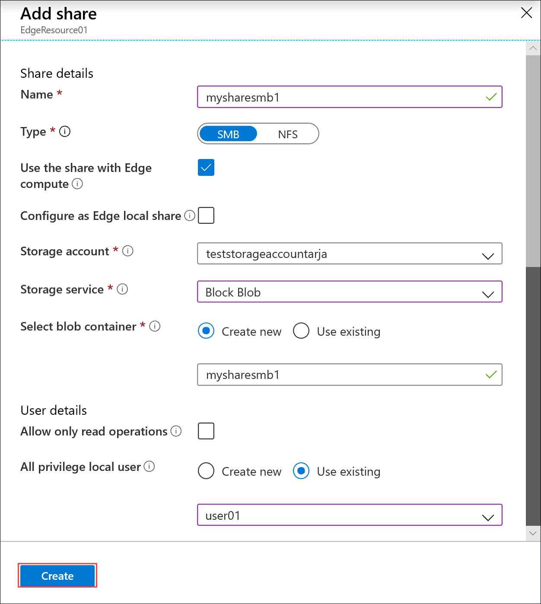

        If you check allow only read operations for this share data, you can specify read-only users.
    - **If creating an NFS share** - You need to supply the **IP addresses of the allowed clients** that can access the share.

        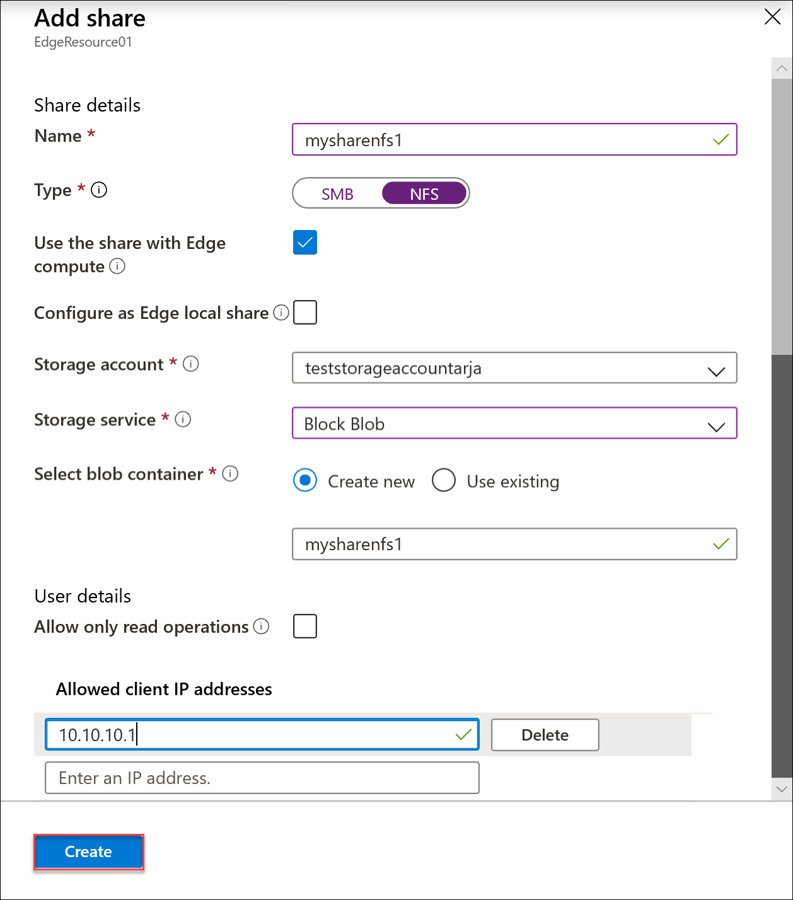

7. To easily access the shares from Edge compute modules, use the local mount point. Select **Use the share with Edge compute** so that the share is automatically mounted after it is created. When this option is selected, the Edge module can also use the compute with the local mount point.

8. Click **Create** to create the share. You are notified that the share creation is in progress. After the share is created with the specified settings, the **Shares** blade updates to reflect the new share.

## Add a local share

1. In the Azure portal, go to your Azure Stack Edge resource and then go to **Gateway > Shares**. Select **+ Add share** on the command bar.

    

2. In **Add Share**, specify the share settings. Provide a unique name for your share.
    
    Share names can only contain numbers, lowercase and uppercase letters, and hyphens. The share name must be between 3 and 63 characters long and begin with a letter or a number. Each hyphen must be preceded and followed by a non-hyphen character.

3. Select a **Type** for the share. The type can be **SMB** or **NFS**, with SMB being the default. SMB is the standard for Windows clients, and NFS is used for Linux clients. Depending upon whether you choose SMB or NFS shares, options presented are slightly different.

   > [!IMPORTANT]
   > Make sure that the Azure Storage account that you use does not have immutability policies set on it if you are using it with a Azure Stack Edge Pro or Data Box Gateway device. For more information, see [Set and manage immutability policies for blob storage](../storage/blobs/storage-blob-immutability-policies-manage.md).

4. To easily access the shares from Edge compute modules, use the local mount point. Select **Use the share with Edge compute** so that the Edge module can use the compute with the local mount point.

5. Select **Configure as Edge local shares**. The data in local shares will stay locally on the device. You can process this data locally.

6. In the **All privilege local user** field, choose from **Create new** or **Use existing**.

7. Select **Create**. 

    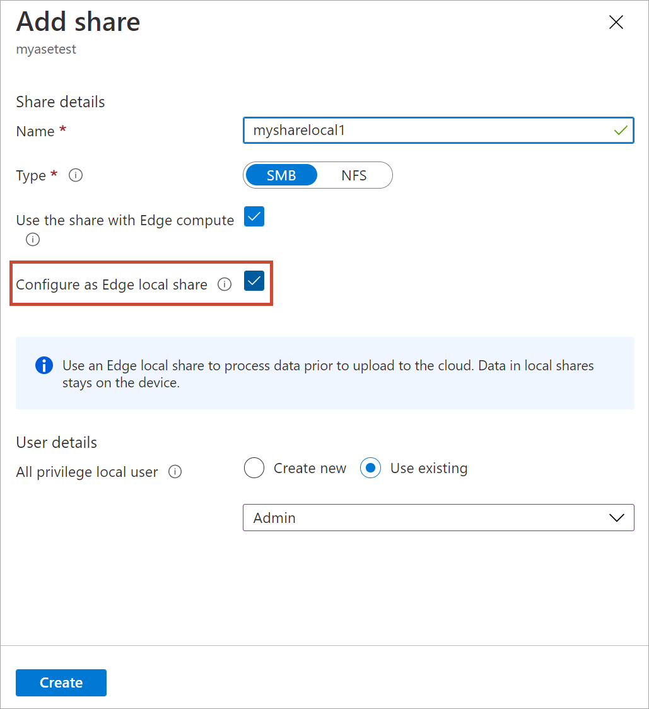

    You see a notification that the share creation is in progress. After the share is created with the specified settings, the **Shares** blade updates to reflect the new share.

    
    
    Select the share to view the local mountpoint for the Edge compute modules for this share.

    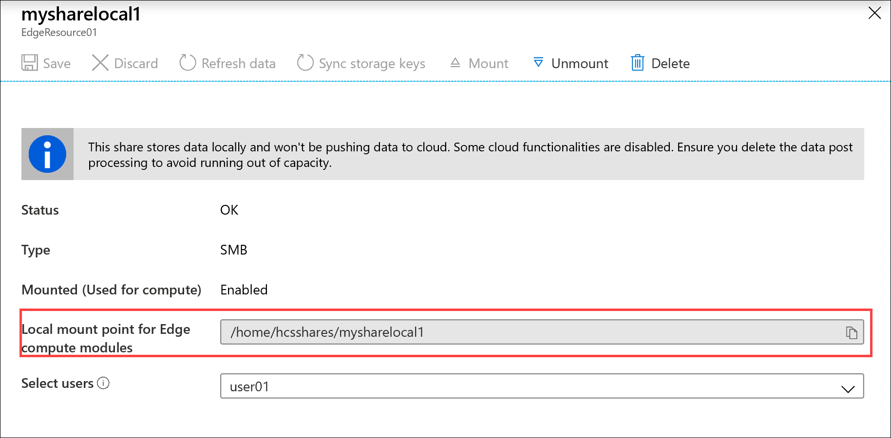

## Mount a share

If you created a share before you configured compute on your Azure Stack Edge Pro device, you will need to mount the share. Take the following steps to mount a share.

1. In the Azure portal, go to your Azure Stack Edge resource and then go to **Gateway > Shares**. From the list of the shares, select the share you want to mount. The **Used for compute** column will show the status as **Disabled** for the selected share.

    

2. Select **Mount**.

    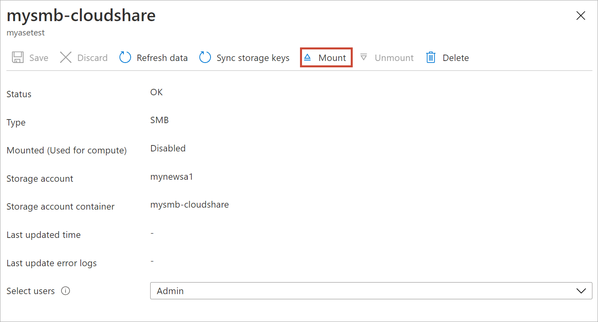

3. When prompted for confirmation, select **Yes**. This will mount the share.

    

4. After the share is mounted, go to the list of shares. You'll see that the **Used for compute** column shows the share status as **Enabled**.

    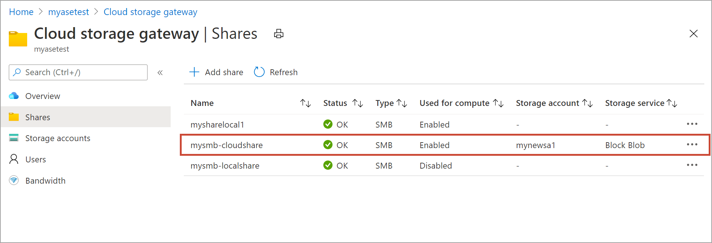

5. Select the share again to view the local mountpoint for the share. Edge compute module uses this local mountpoint for the share.

    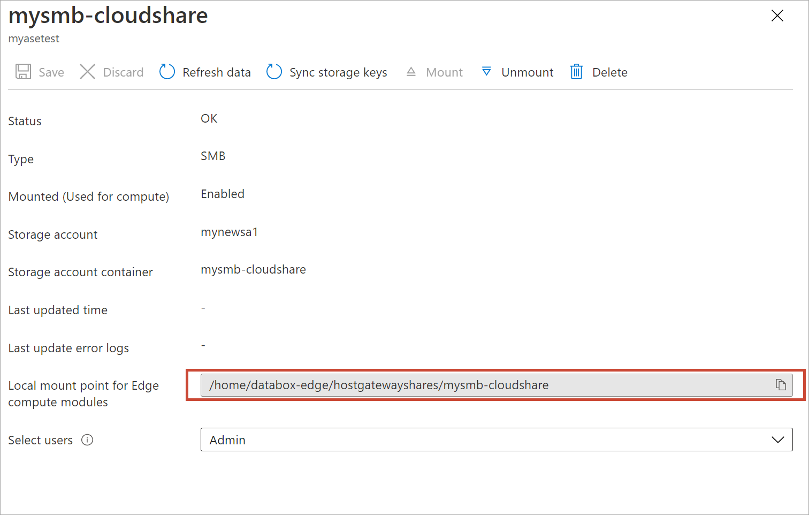

## Unmount a share

Do the following steps in the Azure portal to unmount a share.

1. In the Azure portal, go to your Azure Stack Edge resource and then go to **Gateway > Shares**.

    

2. From the list of the shares, select the share that you want to unmount. You want to make sure that the share you unmount is not used by any modules. If the share is used by a module, then you will see issues with the corresponding module. Select **Unmount**.

    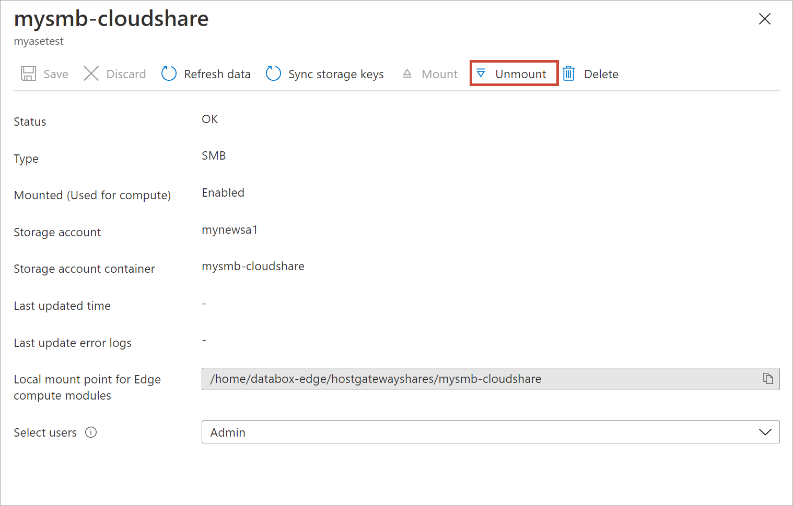

3. When prompted for confirmation, select **Yes**. This will unmount the share.

    

4. After the share is unmounted, go to the list of shares. You'll see that **Used for compute** column shows the share status as **Disabled**.

    

## Delete a share

Do the following steps in the Azure portal to delete a share.

1. From the list of shares, select and click the share that you want to delete.

    

2. Click **Delete**.

    

3. When prompted for confirmation, click **Yes**.

    

The list of shares updates to reflect the deletion.

## Refresh shares

The refresh feature allows you to refresh the contents of a share. When you refresh a share, a search is initiated to find all the Azure objects including blobs and files that were added to the cloud since the last refresh. These additional files are then downloaded to refresh the contents of the share on the device.

> [!IMPORTANT]
> - You can't refresh local shares.
> - Permissions and access control lists (ACLs) are not preserved across a refresh operation. 

Do the following steps in the Azure portal to refresh a share.

1.  In the Azure portal, go to **Shares**. Select and click the share that you want to refresh.

    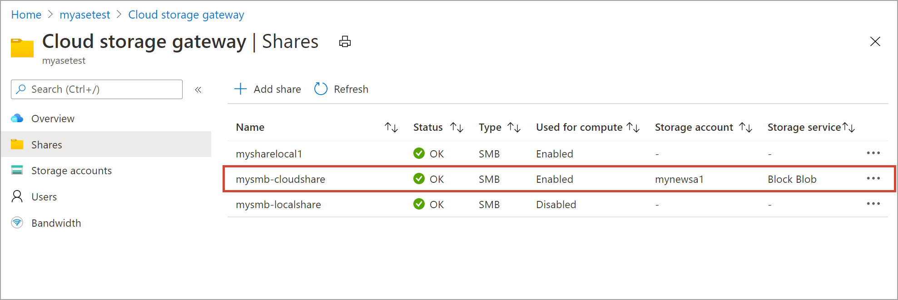

2.  Click **Refresh**. 

    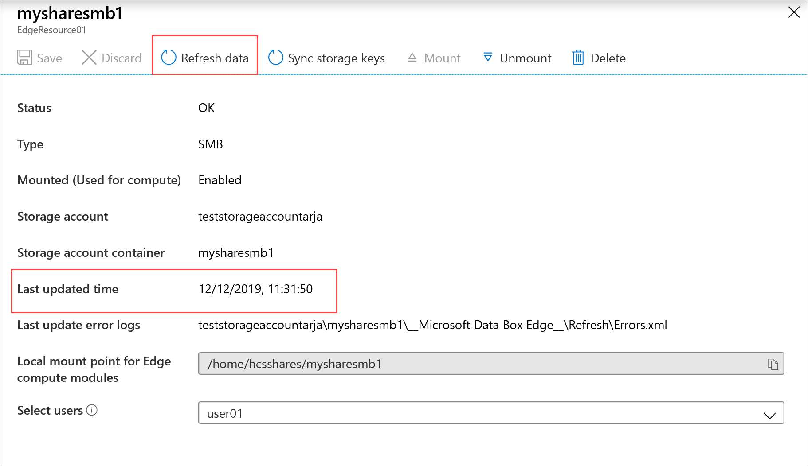
 
3.  When prompted for confirmation, click **Yes**. A job starts to refresh the contents of the on-premises share.

    
 
4.   While the refresh is in progress, the refresh option is grayed out in the context menu. Click the job notification to view the refresh job status.

5.   The time to refresh depends on the number of files in the Azure container as well as the files on the device. Once the refresh has successfully completed, the share timestamp is updated. Even if the refresh has partial failures, the operation is considered successful and the timestamp is updated. The refresh error logs are also updated.

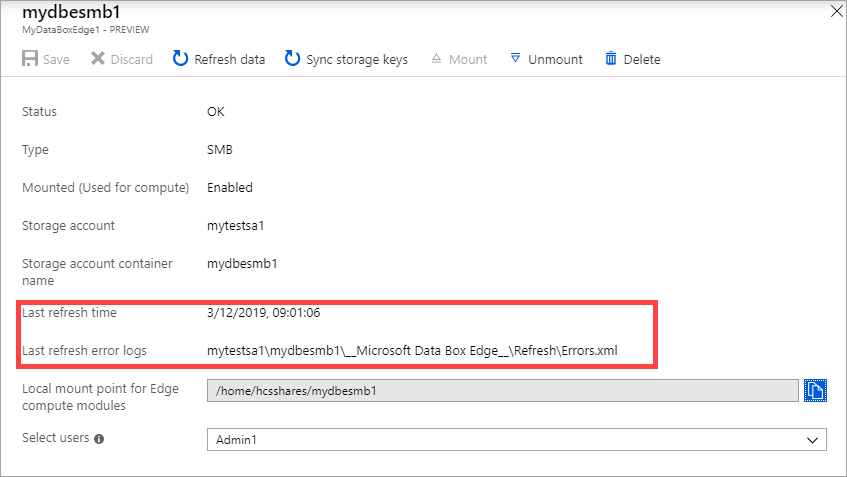
 
If there is a failure, an alert is raised. The alert details the cause and the recommendation to fix the issue. The alert also links to a file that has the complete summary of the failures including the files that failed to update or delete.

## Sync pinned files 

To automatically sync up pinned files, do the following steps in the Azure portal:
 
1. Select an existing Azure storage account. 

2. Go to **Containers** and select **+ Container** to create a container. Name this container as *newcontainer*. Set the **Public access level** to Container.

    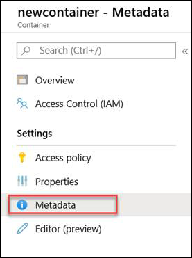

3. Select the container name and set the following metadata:  

    - Name = "Pinned" 
    - Value = "True" 

    
 
4. Create a new share on your device. Map it to the pinned container by choosing the existing container option. Mark the share as read only. Create a new user and specify the user name and a corresponding password for this share.  

    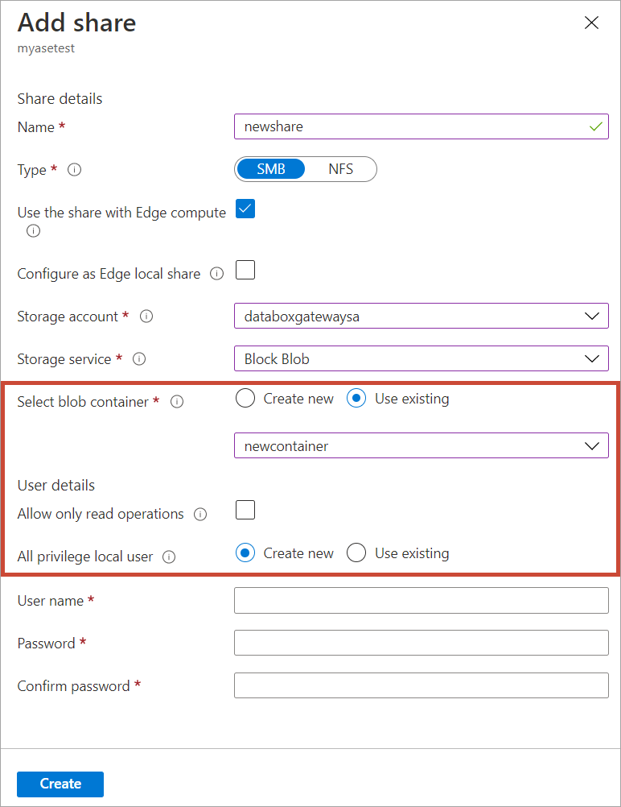
 
5. From the Azure portal, browse to the container which you created. Upload the file which you want to be pinned into the newcontainer which has the metadata set to pinned. 

6. Select **Refresh data** in Azure portal for the device to download the pinning policy for that particular Azure Storage container.  

    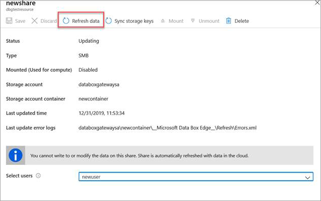
 
7. Access the new share that was created on the device. The file that was uploaded to the storage account is now downloaded to the local share. 

    Anytime the device is disconnected or reconnected, it triggers refresh. Refresh will bring down only those files that have changed. 

## Sync storage keys

If your storage account keys have been rotated, then you need to sync the storage access keys. The sync helps the device get the latest keys for your storage account.

Do the following steps in the Azure portal to sync your storage access key.

1. Go to **Overview** in your resource. From the list of shares, choose and click a share associated with the storage account that you need to sync.

    

2. Click **Sync storage key**. Click **Yes** when prompted for confirmation.

     

3. Exit out of the dialog once the sync is complete.

>[!NOTE]
> You only have to do this once for a given storage account. You don't need to repeat this action for all the shares associated with the same storage account.

## Next steps

- Learn how to [Manage users via Azure portal](azure-stack-edge-j-series-manage-users.md).