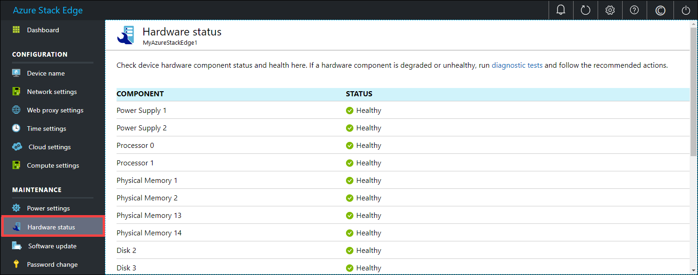

# Monitor your Azure Stack Edge Pro

This article describes how to monitor your Azure Stack Edge Pro. To monitor your device, you can use Azure portal or the local web UI. Use the Azure portal to view device events, configure and manage alerts, and view metrics. Use the local web UI on your physical device to view the hardware status of the various device components.

In this article, you learn how to:

> [!div class="checklist"]
>
> * View device events and the corresponding alerts
> * View hardware status of device components
> * View capacity and transaction metrics for your device
> * Configure and manage alerts

## View device events

[!INCLUDE [Supported OS for clients connected to device](../../includes/data-box-edge-gateway-view-device-events.md)]

## View hardware status

Take the following steps in the local web UI to view the hardware status of your device components.

1. Connect to the local web UI of your device.
2. Go to **Maintenance > Hardware status**. You can view the health of the various device components.

    

## View metrics

[!INCLUDE [Supported OS for clients connected to device](../../includes/data-box-edge-gateway-view-metrics.md)]

### Metrics on your device

This section describes the monitoring metrics on your device. The metrics can be:

* Capacity metrics. The capacity metrics are related to the capacity of the device.

* Transaction metrics. The transaction metrics are related to the read and write operations to Azure Storage.

* Edge compute metrics. The Edge compute metrics are related to the usage of the Edge compute on your device.

A full list of the metrics is shown in the following table:

|Capacity metrics                     |Description  |
|-------------------------------------|-------------|
|**Available capacity**               | Refers to the size of the data that can be written to the device. In other words, this is the capacity that can be made available on the device.   You can free up the device capacity by deleting the local copy of files that have a copy on both the device as well as the cloud.        |
|**Total capacity**                   | Refers to the total bytes on the device to write data to. This is also referred to as the total size of the local cache.    You can now increase the capacity of an existing virtual device by adding a data disk. Add a data disk through the hypervisor management for the VM and then restart your VM. The local storage pool of the Gateway device will expand to accommodate the newly added data disk.   For more information, go to [Add a hard drive for Hyper-V virtual machine](https://www.youtube.com/watch?v=EWdqUw9tTe4). |

|Transaction metrics              | Description         |
|-------------------------------------|---------|
|**Cloud bytes uploaded (device)**    | Sum of all the bytes uploaded across all the shares on your device        |
|**Cloud bytes uploaded (share)**     | Bytes uploaded per share. This can be:    Avg, which is the (Sum of all the bytes uploaded per share / Number of shares),    Max, which is the maximum number of bytes uploaded from a share   Min, which is the minimum number of bytes uploaded from a share      |
|**Cloud download throughput (share)**| Bytes downloaded per share. This can be:    Avg, which is the (Sum of all bytes read or downloaded to a share / Number of shares)    Max, which is the maximum number of bytes downloaded from a share   and Min, which is the minimum number of bytes downloaded from a share  |
|**Cloud read throughput**            | Sum of all the bytes read from the cloud across all the shares on your device     |
|**Cloud upload throughput**          | Sum of all the bytes written to the cloud across all the shares on your device     |
|**Cloud upload throughput (share)**  | Sum of all bytes written to the cloud from a share / # of shares is average, max, and min per share      |
|**Read throughput (network)**           | Includes the system network throughput for all the bytes read from the cloud. This view can include data that is not restricted to shares.   Splitting will show the traffic over all the network adapters on the device. This includes adapters that are not connected or enabled.      |
|**Write throughput (network)**       | Includes the system network throughput for all the bytes written to the cloud. This view can include data that is not restricted to shares.   Splitting will show the traffic over all the network adapters on the device. This includes adapters that are not connected or enabled.          |

| Edge compute metrics              | Description         |
|-------------------------------------|---------|
|**Edge compute - memory usage**      |           |
|**Edge compute - percentage CPU**    |         |

## Manage alerts

[!INCLUDE [Supported OS for clients connected to device](../../includes/data-box-edge-gateway-manage-alerts.md)]

## Next steps

Learn how to [Manage bandwidth](azure-stack-edge-manage-bandwidth-schedules.md).
