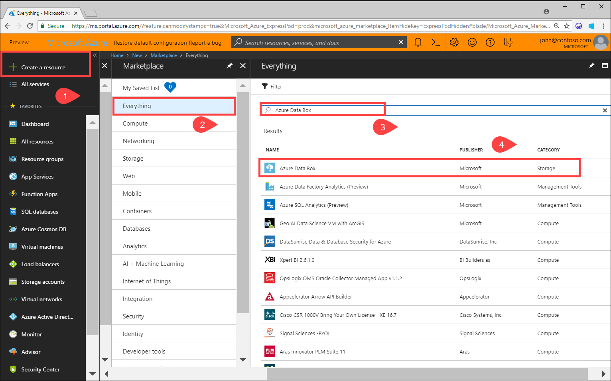
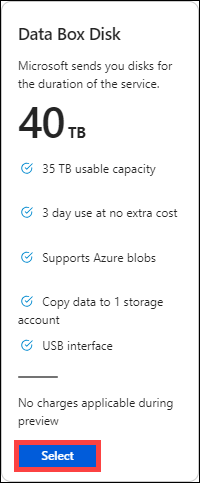
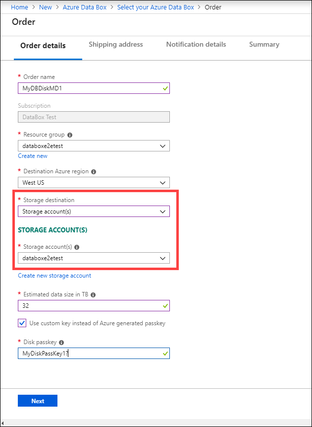
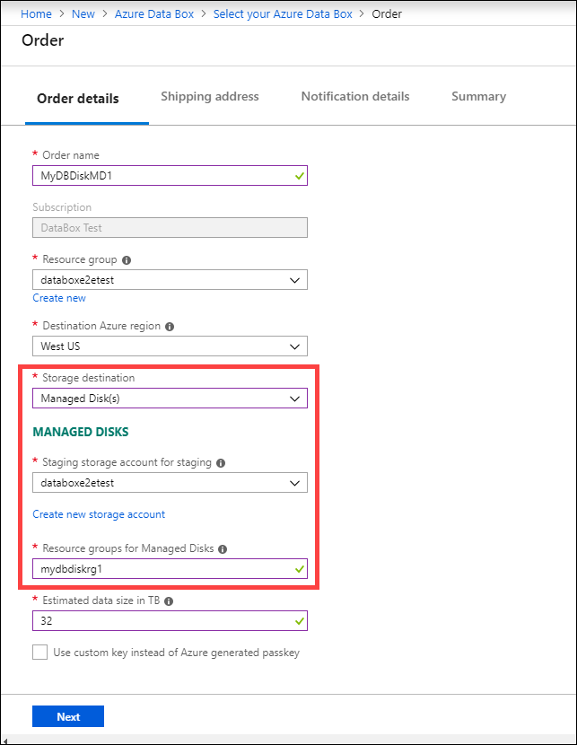
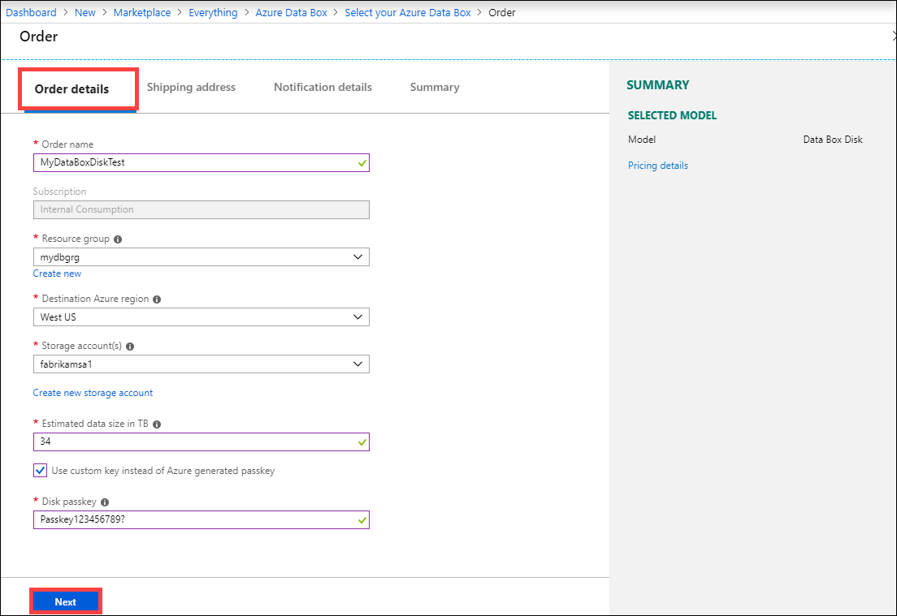
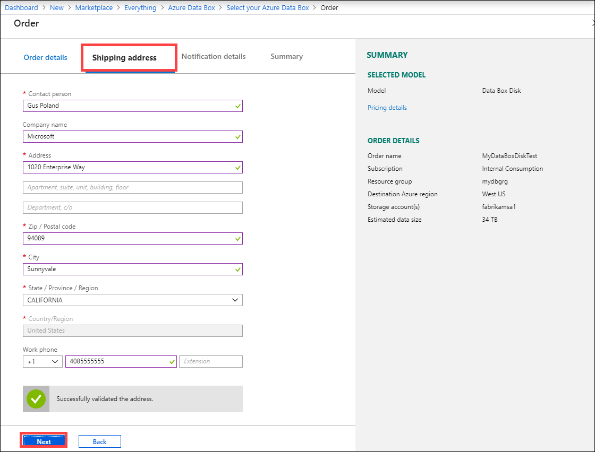
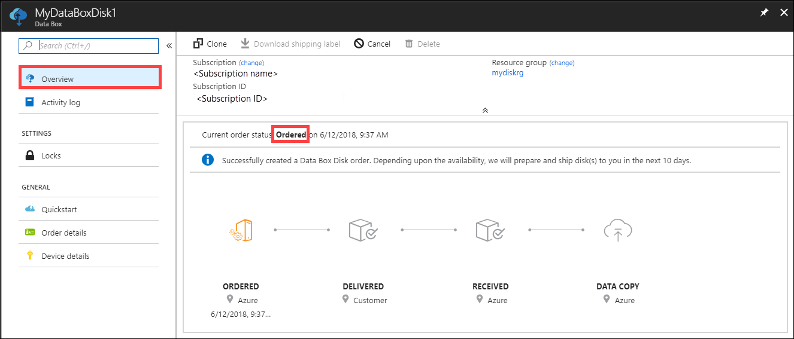

# Tutorial: Order an Azure Data Box Disk

Azure Data Box Disk is a hybrid cloud solution that allows you to import your on-premises data into Azure in a quick, easy, and reliable way. You transfer your data to solid-state disks (SSDs) supplied by Microsoft and ship the disks back. This data is then uploaded to Azure.

This tutorial describes how you can order an Azure Data Box Disk. In this tutorial, you learn about:

> [!div class="checklist"]
> * Order a Data Box Disk
> * Track the order
> * Cancel the order

## Prerequisites

Before you deploy, complete the following configuration prerequisites for Data Box service and Data Box Disk.

### For service

[!INCLUDE [Data Box service prerequisites](../../includes/data-box-supported-subscriptions.md)]

### For device

Before you begin, make sure that:
- You have a client computer available from which you can copy the data. Your client computer must:
    - Run a [Supported operating system](data-box-disk-system-requirements.md#supported-operating-systems-for-clients).
    - Have other [required software](data-box-disk-system-requirements.md#other-required-software-for-windows-clients) installed if it is a Windows client.  

## Order Data Box Disk

Sign in to:

- The Azure portal at this URL: https://portal.azure.com to order Data Box Disk.
- Or, the Azure Government portal at this URL: https://portal.azure.us. For more details, go to [Connect to Azure Government using the portal](https://docs.microsoft.com/azure/azure-government/documentation-government-get-started-connect-with-portal).

Take the following steps to order Data Box Disk.

1. In the upper left corner of the portal, click **+ Create a resource**, and search for *Azure Data Box*. Click **Azure Data Box**.
    
   

2. Click **Create**.

3. Check if Data Box service is available in your region. Enter or select the following information and click **Apply**.

    

    |Setting|Value|
    |---|---|
    |Subscription|Select the subscription for which Data Box service is enabled.  The subscription is linked to your billing account. |
    |Transfer type| Import to Azure|
    |Source country | Select the country/region where your data currently resides.|
    |Destination Azure region|Select the Azure region where you want to transfer data.|

  
5.  Select **Data Box Disk**. The maximum capacity of the solution for a single order of 5 disks is 35 TB. You could create multiple orders for larger data sizes.

     

6.  In **Order**, specify the **Order details**. Enter or select the following information.

    |Setting|Value|
    |---|---|
    |Name|Provide a friendly name to track the order.  The name can have between 3 and 24 characters that can be letters, numbers, and hyphens.   The name must start and end with a letter or a number. |
    |Resource group| Use an existing or create a new one.   A resource group is a logical container for the resources that can be managed or deployed together. |
    |Destination Azure region| Select a region for your storage account.  Currently, storage accounts in all regions in US, West and North Europe, Canada, and Australia are supported. |
    |Estimated data size in TB| Enter an estimate in TB.  Based on the data size, Microsoft sends you an appropriate number of 8 TB SSDs (7 TB usable capacity).  The maximum usable capacity of 5 disks is up to 35 TB. |
    |Disk passkey| Supply the disk passkey if you check **Use custom key instead of Azure generated passkey**.   Provide a 12 to 32 character alphanumeric key that has at least one numeric and one special character. The allowed special characters are `@?_+`.   You can choose to skip this option and use the Azure generated passkey to unlock your disks.|
    |Storage destination     | Choose from storage account or managed disks or both.   Based on the specified Azure region, select a storage account from the filtered list of an existing storage account. Data Box Disk can be linked with only 1 storage account.   You can also create a new **General-purpose v1**, **General-purpose v2**, or **Blob storage account**.  Storage accounts with virtual networks are supported. To allow Data Box service to work with secured storage accounts, enable the trusted services within the storage account network firewall settings. For more information, see how to [Add Azure Data Box as a trusted service](https://docs.microsoft.com/azure/storage/common/storage-network-security#exceptions).|

    If using storage account as the storage destination, you see the following screenshot:

    

    If using Data Box Disk to create managed disks from the on-premises VHDs, you also need to provide the following information:

    |Setting  |Value  |
    |---------|---------|
    |Resource group     | Create a new resource group if you intend to create managed disks from on-premises VHDs. Use an existing resource group only if it was created for Data Box Disk order for managed disk by Data Box service.   Only one resource group is supported.|

    

    The storage account specified for managed disks is used as a staging storage account. The Data Box service uploads the VHDs to the staging storage account and then converts those into managed disks and moves to the resource groups. For more information, see [Verify data upload to Azure](data-box-disk-deploy-upload-verify.md#verify-data-upload-to-azure).

13. Click **Next**.

    

14. In the **Shipping address** tab, provide your first and last name, name and postal address of the company and a valid phone number. Click **Validate address**. The service validates the shipping address for service availability. If the service is available for the specified shipping address, you receive a notification to that effect. Customers using the service in Japan, Singapore, Korea, and West Europe have the option to select self-managed shipping while placing the order. After the order is placed successfully, you will receive an email with instructions to pick up the device from the designated Azure Datacenter.

    
15. In the **Notification details**, specify email addresses. The service sends email notifications regarding any updates to the order status to the specified email addresses. 

    We recommend that you use a group email so that you continue to receive notifications if an admin in the group leaves.

16. Review the information **Summary** related to the order, contact, notification, and privacy terms. Check the box corresponding to the agreement to privacy terms.

17. Click **Order**. The order takes a few minutes to be created.

 
## Track the order

After you have placed the order, you can track the status of the order from Azure portal. Go to your order and then go to **Overview** to view the status. The portal shows the job in **Ordered** state.

 

If the disks are not available, you receive a notification. If the disks are available, Microsoft identifies the disks for shipment and prepares the disk package. During disk preparation, following actions occur:

- Disks are encrypted using AES-128 BitLocker encryption.  
- Disks are locked to prevent an unauthorized access to the disks.
- The passkey that unlocks the disks is generated during this process.

When the disk preparation is complete, the portal shows the order in **Processed** state.

Microsoft then prepares and dispatches your disks via a regional carrier. You receive a tracking number once the disks are shipped. The portal shows the order in **Dispatched** state.

## Cancel the order

To cancel this order, in the Azure portal, go to **Overview** and click **Cancel** from the command bar.

You can only cancel when the disks are ordered and the order is being processed for shipment. Once the order is processed, you can no longer cancel the order.

To delete a canceled order, go to **Overview** and click **Delete** from the command bar.

## Next steps

In this tutorial, you learned about Azure Data Box topics such as:

> [!div class="checklist"]
> * Order Data Box Disk
> * Track the order
> * Cancel the order

Advance to the next tutorial to learn how to set up your Data Box Disk.

> [!div class="nextstepaction"]
> [Set up your Azure Data Box Disk](./data-box-disk-deploy-set-up.md)
