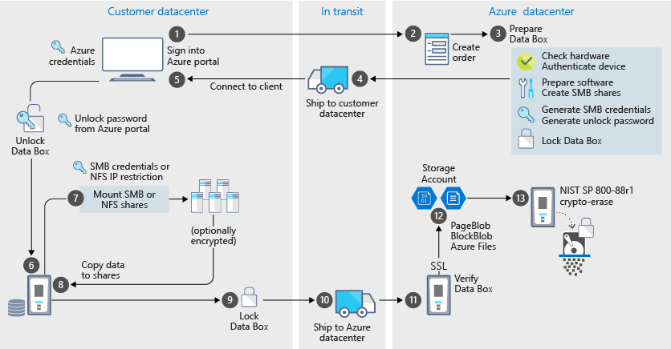

# Azure Data Box security and data protection

Data Box provides a secure solution for data protection by ensuring that only authorized entities can view, modify, or delete your data. This article describes the Azure Data Box security features that help protect each of the Data Box solution components and the data stored on them. 

[!INCLUDE [GDPR-related guidance](../../includes/gdpr-intro-sentence.md)]

## Data flow through components

The Microsoft Azure Data Box solution consists of four main components that interact with each other:

- **Azure Data Box service hosted in Azure** – The management service that you use to create the device order, configure the device, and then track the order to completion.
- **Data Box device** – The transfer device that is shipped to you to import your on-premises data into Azure. 
- **Clients/hosts connected to the device** – The clients in your infrastructure that connect to the Data Box device and contain data that needs to be protected.
- **Cloud storage** – The location in the Azure cloud where data is stored. This is typically the storage account linked to the Azure Data Box resource that you created.

The following diagram indicates the flow of data through the Azure Data Box solution from on-premises to Azure. This flow is for an import order for your Data Box.

As the data flows through this solution, events are logged and logs are generated. For more information, go to:

- [Tracking and event logging for your Azure Data Box import orders](data-box-logs.md).
- [Tracking and event logging for your Azure Data Box export orders](data-box-export-logs.md)

## Security features

Data Box provides a secure solution for data protection by ensuring that only authorized entities can view, modify, or delete your data. The security features for this solution are for the disk and for the associated service ensuring the security of the data stored on them. 

### Data Box device protection

The Data Box device is protected by the following features:

- A rugged device casing that withstands shocks, adverse transportation, and environmental conditions. 
- Hardware and software tampering detection that prevents further device operations.
- Runs only Data Box-specific software.
- Boots up in a locked state.
- Controls device access via device unlock password.
- Access credentials to copy data in and out of the device. All access to the **Device credentials** page in Azure portal are logged in the [activity logs](data-box-logs.md#query-activity-logs-during-setup).

### Data Box data protection

The data that flows in and out of Data Box is protected by the following features:

- AES 256-bit encryption for Data-at-rest.
- Encrypted protocols can be used for data-in-flight. We recommend that you use SMB 3.0 with encryption to protect data when you copy it from your data servers.
- Secure erasure of data from device once upload to Azure is complete. Data erasure is in accordance with guidelines in [Appendix A for ATA Hard Disk Drives in NIST 800-88r1 standards](https://nvlpubs.nist.gov/nistpubs/SpecialPublications/NIST.SP.800-88r1.pdf). The data erasure event is recorded in the [order history](data-box-logs.md#download-order-history).

### Data Box service protection

The Data Box service is protected by the following features.

- Access to the Data Box service requires that your organization has an Azure subscription that includes Data Box. Your subscription governs the features that you can access in the Azure portal.
- Because the Data Box service is hosted in Azure, it is protected by the Azure security features. For more information about the security features provided by Microsoft Azure, go to the [Microsoft Azure Trust Center](https://www.microsoft.com/TrustCenter/Security/default.aspx).
- Access to the Data Box order can be controlled via the use of Azure roles. For more information, see [Set up access control for Data Box order](data-box-logs.md#set-up-access-control-on-the-order)
- The Data Box service stores unlock password that is used to unlock the device in the service.
- The Data box service stores order details and status in the service. This information is deleted when the order is deleted.

## Managing personal data

Azure Data Box collects and displays personal information in the following key instances in the service:

- **Notification settings** - When you create an order, you configure the email address of users under notification settings. This information can be viewed by the administrator. This information is deleted by the service when the job reaches the terminal state or when you delete the order.

- **Order details** – Once the order is created, the shipping address, email, contact information of users is stored in the Azure portal. The information saved includes:

  - Contact name
  - Phone number
  - Email
  - Street address
  - City
  - Zip/postal code
  - State
  - Country/Province/Region
  - Carrier account number
  - Shipping tracking number

    The order details are deleted by the Data Box service when the job completes or when you delete the order.

- **Shipping address** – After the order is placed, Data Box service provides the shipping address to third-party carriers such as UPS or DHL. 

For more information, review the Microsoft Privacy policy at [Trust Center](https://www.microsoft.com/trustcenter).

## Security guidelines reference

The following security guidelines are implemented in Data Box: 

|Guideline   |Description   |
|---------|---------|
|[IEC 60529 IP52](https://www.iec.ch/)    | For water and dust protection         |
|[ISTA 2A](https://ista.org/docs/2Aoverview.pdf)     | For adverse transport conditions endurance          |
|[NIST SP 800-147](https://nvlpubs.nist.gov/nistpubs/Legacy/SP/nistspecialpublication800-147.pdf)      | For secure firmware update         |
|[FIPS 140-2 Level 2](https://csrc.nist.gov/csrc/media/publications/fips/140/2/final/documents/fips1402.pdf)      | For data protection         |
|Appendix A, for ATA Hard Disk Drives in [NIST SP 800-88r1](https://nvlpubs.nist.gov/nistpubs/SpecialPublications/NIST.SP.800-88r1.pdf)      | For data sanitization         |

## Next steps

- Review the [Data Box requirements](data-box-system-requirements.md).
- Understand the [Data Box limits](data-box-limits.md).
- Quickly deploy [Azure Data Box](data-box-quickstart-portal.md) in Azure portal.
