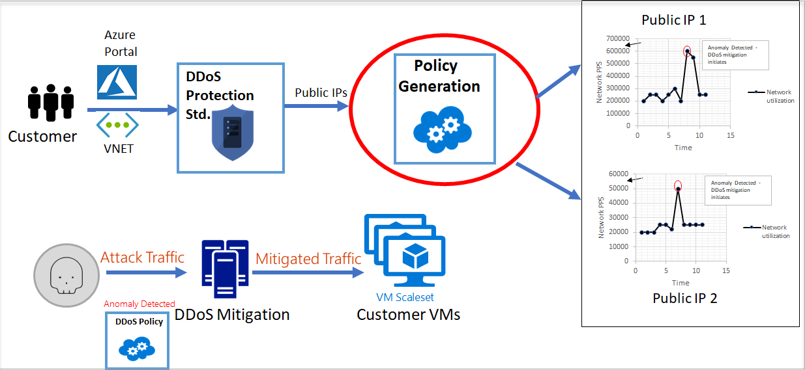
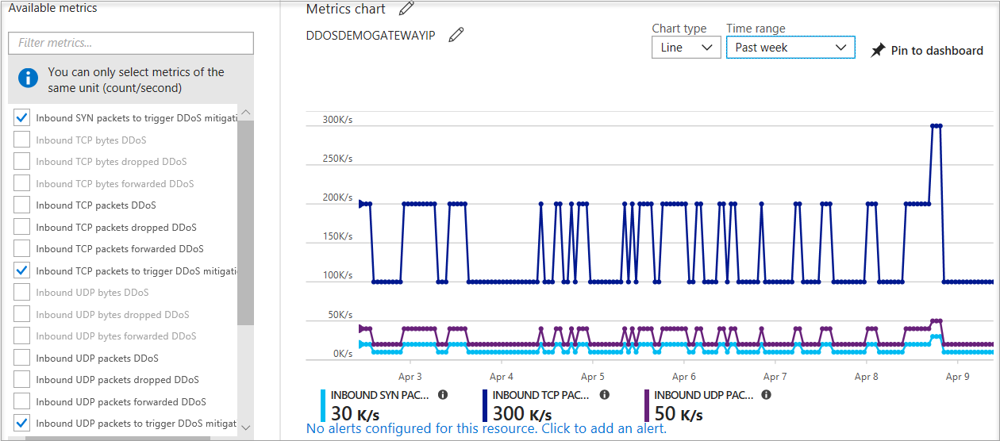

# Azure DDoS Protection Standard features

The following sections outline the key features of the Azure DDoS Protection Standard service.

## Always-on traffic monitoring

DDoS Protection Standard monitors actual traffic utilization and constantly compares it against the thresholds defined in the DDoS Policy. When the traffic threshold is exceeded, DDoS mitigation is initiated automatically. When traffic returns below the thresholds, the mitigation is stopped.

During mitigation, traffic sent to the protected resource is redirected by the DDoS protection service and several checks are performed, such as:

- Ensure packets conform to internet specifications and are not malformed.
- Interact with the client to determine if the traffic is potentially a spoofed packet (e.g: SYN Auth or SYN Cookie or by dropping a packet for the source to retransmit it).
- Rate-limit packets, if no other enforcement method can be performed.

DDoS protection drops attack traffic and forwards the remaining traffic to its intended destination. Within a few minutes of attack detection, you are notified using Azure Monitor metrics. By configuring logging on DDoS Protection Standard telemetry, you can write the logs to available options for future analysis. Metric data in Azure Monitor for DDoS Protection Standard is retained for 30 days.

## Adaptive real time tuning

The Azure DDoS Protection Basic service helps protect customers and prevent impacts to other customers. For example, if a service is provisioned for a typical volume of legitimate incoming traffic that's smaller than the *trigger rate* of the infrastructure-wide DDoS Protection policy, a DDoS attack on that customer’s resources might go unnoticed. More generally, the complexity of recent attacks (for example, multi-vector DDoS) and the application-specific behaviors of tenants call for per-customer, tailored protection policies. The service accomplishes this by using two insights:

- Automatic learning of per-customer (per- Public IP) traffic patterns for Layer 3 and 4.

- Minimizing false positives, considering that the scale of Azure allows it to absorb a significant amount of traffic.

## DDoS Protection telemetry, monitoring, and alerting

DDoS Protection Standard exposes rich telemetry via [Azure Monitor](../azure-monitor/overview.md). You can configure alerts for any of the Azure Monitor metrics that DDoS Protection uses. You can integrate logging with Splunk (Azure Event Hubs), Azure Monitor logs, and Azure Storage for advanced analysis via the Azure Monitor Diagnostics interface.

### DDoS mitigation policies

In the Azure portal, select **Monitor** > **Metrics**. In the **Metrics** pane, select the resource group, select a resource type of **Public IP Address**, and select your Azure public IP address. DDoS metrics are visible in the **Available metrics** pane.

DDoS Protection Standard applies three autotuned mitigation policies (TCP SYN, TCP, and UDP) for each public IP of the protected resource, in the virtual network that has DDoS enabled. You can view the policy thresholds by selecting the metric **Inbound packets to trigger DDoS mitigation**.

The policy thresholds are autoconfigured via machine learning-based network traffic profiling. DDoS mitigation occurs for an IP address under attack only when the policy threshold is exceeded.

### Metric for an IP address under DDoS attack

If the public IP address is under attack, the value for the metric **Under DDoS attack or not** changes to 1 as DDoS Protection performs mitigation on the attack traffic.

We recommend configuring an alert on this metric. You'll then be notified when there’s an active DDoS mitigation performed on your public IP address.

For more information, see [Manage Azure DDoS Protection Standard using the Azure portal](manage-ddos-protection.md).

## Web application firewall for resource attacks

Specific to resource attacks at the application layer, you should configure a web application firewall (WAF) to help secure web applications. A WAF inspects inbound web traffic to block SQL injections, cross-site scripting, DDoS, and other Layer 7 attacks. Azure provides [WAF as a feature of Application Gateway](../web-application-firewall/ag/ag-overview.md) for centralized protection of your web applications from common exploits and vulnerabilities. There are other WAF offerings available from Azure partners that might be more suitable for your needs via the [Azure Marketplace](https://azuremarketplace.microsoft.com/marketplace/apps?search=WAF&page=1).

Even web application firewalls are susceptible to volumetric and state exhaustion attacks. We strongly recommend enabling DDoS Protection Standard on the WAF virtual network to help protect from volumetric and protocol attacks. For more information, see the [DDoS Protection reference architectures](ddos-protection-reference-architectures.md) section.

## Protection Planning

Planning and preparation are crucial to understand how a system will perform during a DDoS attack. Designing an incident management response plan is part of this effort.

If you have DDoS Protection Standard, make sure that it's enabled on the virtual network of internet-facing endpoints. Configuring DDoS alerts helps you constantly watch for any potential attacks on your infrastructure. 

Monitor your applications independently. Understand the normal behavior of an application. Prepare to act if the application is not behaving as expected during a DDoS attack. 

Learn how your services will respond to an attack by [testing through simulations](test-through-simulations.md).

## Next steps

- Learn how to [create a DDoS protection plan](manage-ddos-protection.md).
