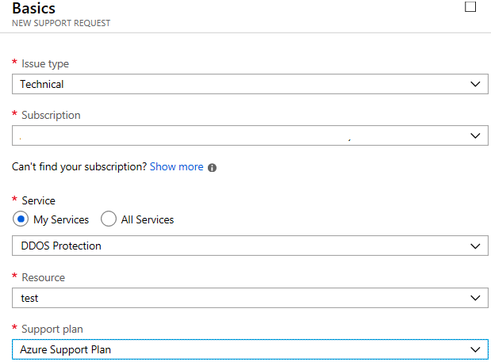
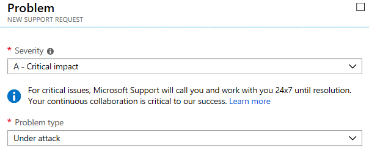

# Azure DDoS Rapid Response

During an active access, Azure DDoS Protection Standard customers have access to the DDoS Rapid Response (DRR) team, who can help with attack investigation during an attack and post-attack analysis.

## Prerequisites

- Before you can complete the steps in this tutorial, you must first create a [Azure DDoS Standard protection plan](manage-ddos-protection.md).

## When to engage DRR

You should only engage DRR if: 

- During a DDoS attack if you find that the performance of the protected resource is severely degraded, or the resource is not available. 
- You think your resource is under DDoS attack, but DDoS Protection service is not mitigating the attack effectively.
- You're planning a viral event that will significantly increase your network traffic.
- For attacks that have a critical business impact.

## Engage DRR during an active attack

1. From Azure portal while creating a new support request, choose **Issue Type** as Technical.
2. Choose **Service** as **DDOS Protection**.
3. Choose a resource in the resource drop-down menu. _You must select a DDoS Plan that’s linked to the virtual network being protected by DDoS Protection Standard to engage DRR._

    

4. On the next **Problem** page select the **severity** as A -Critical Impact and **Problem Type** as ‘Under attack.’

    

5. Complete additional details and submit the support request.

DRR follows the Azure Rapid Response support model. Refer to [Support scope and responsiveness](https://azure.microsoft.com/en-us/support/plans/response/) for more information on Rapid Response.

To learn more, read the [DDoS Protection Standard documentation](./ddos-protection-overview.md).

## Next steps

- Learn how to [test through simulations](test-through-simulations.md).
- Learn how to [view and configure DDoS protection telemetry](telemetry.md).
- Learn how to [view and configure DDoS diagnostic logging](diagnostic-logging.md).
