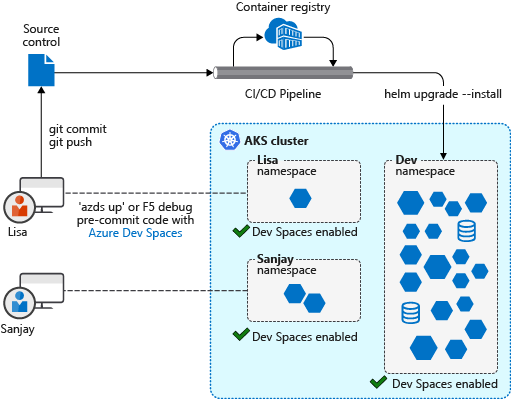
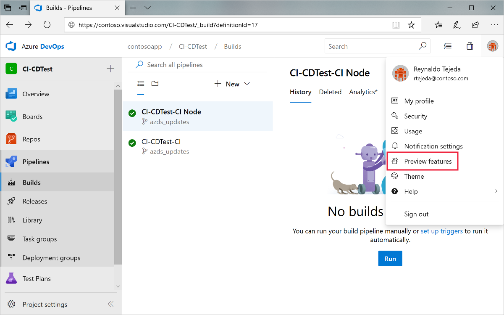
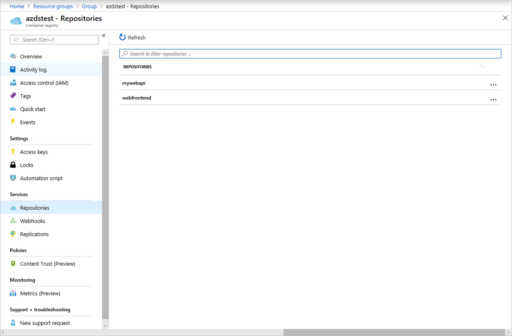

# Use CI/CD with Azure Dev Spaces

[!INCLUDE [Azure Dev Spaces deprecation](../../../includes/dev-spaces-deprecation.md)]

This article guides you through setting up continuous integration/continuous deployment (CI/CD) to Azure Kubernetes Service (AKS) with Dev Spaces enabled. CI/CD to AKS allows app updates to be automatically deployed whenever committed code is pushed to your source repository. Using CI/CD in conjunction with a Dev Spaces enabled cluster is useful because it can keep a baseline of the application up-to-date for the team to work with.



Although this article guides you with Azure DevOps, the same concepts would apply to CI/CD systems like Jenkins, TeamCity, etc.

## Prerequisites
* Azure Kubernetes Service (AKS) cluster with Azure Dev Spaces enabled
* [Azure Dev Spaces CLI installed](upgrade-tools.md)
* [Azure DevOps organization with a project](/azure/devops/user-guide/sign-up-invite-teammates)
* [Azure Container Registry (ACR)](../../container-registry/container-registry-get-started-azure-cli.md)
    * Azure Container Registry [administrator account](../../container-registry/container-registry-authentication.md#admin-account) details available
* [Authorize your AKS cluster to pull from your Azure Container Registry](../../aks/cluster-container-registry-integration.md)

## Download sample code
For the sake of time, let's create a fork of our sample code GitHub repository. Go to https://github.com/Azure/dev-spaces and select **Fork**. Once the fork process is complete, **Clone** your forked version of the repository locally. By default the _master_ branch will be checked out, but we've included some time-saving changes in the _azds_updates_ branch, which should also have been transferred during your fork. The _azds_updates_ branch contains updates we ask you to make manually in the Dev Spaces tutorial sections, as well as some pre-made YAML and JSON files for streamlining the deployment of the CI/CD system. You can use a command like `git checkout -b azds_updates origin/azds_updates` to check out the _azds_updates_ branch in your local repository.

## Dev Spaces setup
Create a new space called _dev_ using the `azds space select` command. The _dev_ space will be used by your CI/CD pipeline to push your code changes. It will also be used to create _child spaces_ based on _dev_.

```cmd
azds space select -n dev
```

When prompted to select a parent dev space, select _\<none\>_.

After your dev space has been created, you need to determine the host suffix. Use the `azds show-context` command to show the host suffix of the Azure Dev Spaces Ingress Controller.

```cmd
$ azds show-context
Name   ResourceGroup    DevSpace  HostSuffix
-----  ---------------  --------  ----------------------
MyAKS  MyResourceGroup  dev       fedcba098.eus.azds.io
```

In the above example, the host suffix is _fedcba098.eus.azds.io_. This value is used later when creating your release definition.

The _dev_ space will always contain the latest state of the repository, a baseline, so that developers can create _child spaces_ from _dev_ to test their isolated changes within the context of the larger app. This concept is discussed in more detail in the Dev Spaces tutorials.

## Creating the build definition
Open your Azure DevOps team project in a web browser and navigate to the _Pipelines_ section. First, click on your profile photo in the upper right of the Azure DevOps site, open the preview features pane, and disable the _New YAML pipeline creation experience_:



The option to disable:


> [!Note]
> The Azure DevOps _New YAML pipeline creation experience_ preview feature conflicts with creating pre-defined build pipelines at this time. You need to disable it for now in order to deploy our pre-defined build pipeline.

In the _azds_updates_ branch we've included a simple [Azure Pipeline YAML](/azure/devops/pipelines/yaml-schema?tabs=schema) that defines the build steps required for *mywebapi* and *webfrontend*.

Depending on the language you've chosen, the pipeline YAML has been checked-in at a path similar to: `samples/dotnetcore/getting-started/azure-pipelines.dotnetcore.yml`

To create a Pipeline from this file:
1. On your DevOps project main page, navigate to Pipelines > Builds.
1. Select the option to create a **New** build pipeline.
1. Select **GitHub** as the source, authorize with your GitHub account if necessary, and select the _azds_updates_ branch from your forked version of the _dev-spaces_ sample application repository.
1. Select **Configuration as code**, or **YAML**, as your template.
1. You are now presented with a configuration page for your build pipeline. As mentioned above navigate to the language-specific path for the **YAML file path** using the **...** button. For example, `samples/dotnetcore/getting-started/azure-pipelines.dotnet.yml`.
1. Go to the **Variables** tab.
1. Manually add _dockerId_ as a variable, which is the username of your [Azure Container Registry administrator account](../../container-registry/container-registry-authentication.md#admin-account). (Mentioned in the article prerequisites)
1. Manually add _dockerPassword_ as a variable, which is the password of your [Azure Container Registry administrator account](../../container-registry/container-registry-authentication.md#admin-account). Be sure to specify _dockerPassword_ as a Secret (by selecting the lock icon) for security purposes.
1. Select **Save & queue**.

You now have a CI solution that will automatically build *mywebapi* and *webfrontend* for any update pushed to the _azds_updates_ branch of your GitHub fork. You can verify the Docker images have been pushed by navigating to the Azure portal, selecting your Azure Container Registry, and browsing the **Repositories** tab. It may take several minutes for the images to build and appear in your container registry.



## Creating the release definition

1. On your DevOps project main page, navigate to Pipelines > Releases
1. If you're working in a brand-new DevOps Project that doesn't yet contain a release definition, you'll need to first create an empty release definition before proceeding. The Import option doesn't display in the UI until you have an existing release definition.
1. On the left, click the **+ New** button, then click **Import a pipeline**.
1. Click **Browse** and select `samples/release.json` from your project.
1. Click **OK**. Notice the Pipeline pane has loaded with the release definition edit page. Also notice there are some red warning icons indicating cluster-specific details that still must be configured.
1. On the left of the Pipeline pane, click the **Add an artifact** bubble.
1. In the **Source** dropdown, select the build pipeline you created earlier.
1. For the **Default version**, choose **Latest from the build pipeline default branch with tags**.
1. Leave **Tags** empty.
1. Set the **Source alias** to `drop`. The **Source alias** value is used by the predefined release tasks so it must be set.
1. Click **Add**.
1. Now click the lightning bolt icon on the newly created `drop` artifact source, as shown below:

    
1. Enable the **Continuous deployment trigger**.
1. Hover over the **Tasks** tab next to **Pipeline** and click _dev_ to edit the _dev_ stage tasks.
1. Verify **Azure Resource Manager** is selected under **Connection Type.** and you see the three dropdown controls highlighted in red:
    
1. Select the Azure subscription you're using with Azure Dev Spaces. You also may need to click **Authorize**.
1. Select the resource group and cluster you're using with Azure Dev Spaces.
1. Click on **Agent job**.
1. Select **Hosted Ubuntu 1604** under **Agent pool**.
1. Hover over the **Tasks** selector at the top, click _prod_ to edit the _prod_ stage tasks.
1. Verify **Azure Resource Manager** is selected under **Connection Type.** and select the Azure subscription, resource group, and cluster you're using with Azure Dev Spaces.
1. Click on **Agent job**.
1. Select **Hosted Ubuntu 1604** under **Agent pool**.
1. Click the **Variables** tab to update the variables for your release.
1. Update the value of **DevSpacesHostSuffix** from **UPDATE_ME** to your host suffix. The host suffix is displayed when you ran the `azds show-context` command earlier.
1. Click **Save** in the upper-right, and **OK**.
1. Click **+ Release** (next to the Save button), and **Create a release**.
1. Under **Artifacts**, verify the latest build from your build pipeline is selected.
1. Click **Create**.

An automated release process will now begin, deploying the *mywebapi* and *webfrontend* charts to your Kubernetes cluster in the _dev_ top-level space. You can monitor the progress of your release on the Azure DevOps web portal:

1. Navigate to the **Releases** section under **Pipelines**.
1. Click on the release pipeline for the sample application.
1. Click on the name of the latest release.
1. Hover over **dev** box under **Stages** and click **Logs**.

The release is done when all tasks are complete.

> [!TIP]
> If your release fails with an error message like *UPGRADE FAILED: timed out waiting for the condition*, try inspecting the pods in your cluster [using the Kubernetes dashboard](../../aks/kubernetes-dashboard.md). If you see the pods are failing to start with error messages like *Failed to pull image "azdsexample.azurecr.io/mywebapi:122": rpc error: code = Unknown desc = Error response from daemon: Get https:\//azdsexample.azurecr.io/v2/mywebapi/manifests/122: unauthorized: authentication required*, it may be because your cluster has not been authorized to pull from your Azure Container Registry. Make sure you have completed the [Authorize your AKS cluster to pull from your Azure Container Registry](../../aks/cluster-container-registry-integration.md) prerequisite.

You now have a fully automated CI/CD pipeline for your GitHub fork of the Dev Spaces sample apps. Each time you commit and push code, the build pipeline will build and push the *mywebapi* and *webfrontend* images to your custom ACR instance. Then the release pipeline will deploy the Helm chart for each app into the _dev_ space on your Dev Spaces-enabled cluster.

## Accessing your _dev_ services
After deployment, the _dev_ version of *webfrontend* can be accessed with a public URL like: `http://dev.webfrontend.fedcba098.eus.azds.io`. You can find this URL by running the `azds list-uri` command: 

```cmd
$ azds list-uris

Uri                                           Status
--------------------------------------------  ---------
http://dev.webfrontend.fedcba098.eus.azds.io  Available
```

## Deploying to Production

To manually promote a particular release to _prod_ using the CI/CD system created in this tutorial:
1. Navigate to the **Releases** section under **Pipelines**.
1. Click on the release pipeline for the sample application.
1. Click on the name of the latest release.
1. Hover over the **prod** box under **Stages** and click **Deploy**.
    
1. Hover over **prod** box again under **Stages** and click **Logs**.

The release is done when all tasks are complete.

The _prod_ stage of the CI/CD pipeline uses a load balancer instead of the Dev Spaces Ingress controller to provide access to _prod_ services. Services deployed in the _prod_ stage are accessible as IP addresses instead of DNS names. In a production environment, you may choose to create your own Ingress controller to host your services based on your own DNS configuration.

To determine the IP of the webfrontend service, click on the  **Print webfrontend public IP** step to expand the log output. Use the IP displayed in the log output to access the **webfrontend** application.

```cmd
...
2019-02-25T22:53:02.3237187Z webfrontend can be accessed at http://52.170.231.44
2019-02-25T22:53:02.3320366Z ##[section]Finishing: Print webfrontend public IP
...
```

## Dev Spaces instrumentation in production
Although Dev Spaces instrumentation has been designed _not_ to get in the way of normal operation of your application, we recommend running your production workloads in a Kubernetes namespace that is not enabled with Dev Spaces. Using this type of Kubernetes namespace means you should either create your production namespace using the `kubectl` CLI, or allow your CI/CD system to create it during the first Helm deployment. _Selecting_ or otherwise creating a space using Dev Spaces tooling will add Dev Spaces instrumentation to that namespace.

Here is an example namespace structure that supports feature development, the 'dev' environment, _and_ production, all in a single Kubernetes cluster:


> [!Tip]
> If you've already created a `prod` space, and would simply like to exclude it from Dev Spaces instrumentation (without deleting it!), you can do so with the following Dev Spaces CLI command:
>
> `azds space remove -n prod --no-delete`
>
> You may need to delete all pods in the `prod` namespace after doing this so they can be recreated without Dev Spaces instrumentation.

## Next steps

Learn more about how Azure Dev Spaces works.

> [!div class="nextstepaction"]
> [How Azure Dev Spaces works](../how-dev-spaces-works.md)
