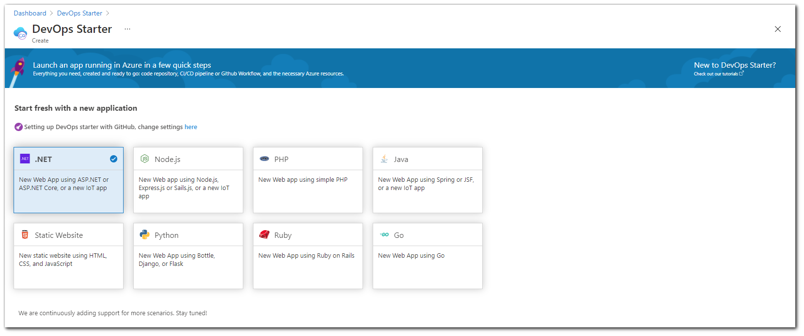
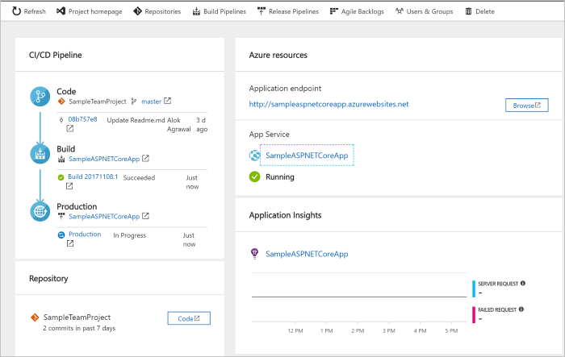
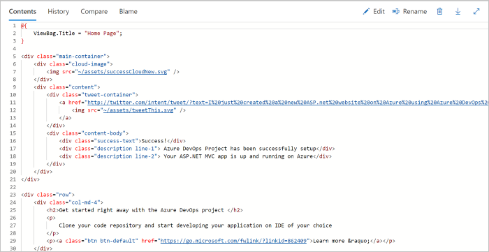
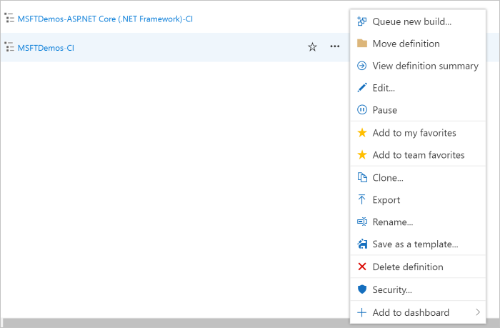

# Create a CI/CD pipeline for .NET with Azure DevOps Starter

Configure continuous integration (CI) and continuous delivery (CD) for your .NET core or ASP.NET application with DevOps Starter. DevOps Starter simplifies the initial configuration of a build and release pipeline in Azure Pipelines.

If you don't have an Azure subscription, you can get one free through [Visual Studio Dev Essentials](https://visualstudio.microsoft.com/dev-essentials/).

## Sign in to the Azure portal

DevOps Starter creates a CI/CD pipeline in Azure DevOps. You can create a new Azure DevOps organization or use an  existing organization. DevOps Starter also creates Azure resources in the Azure subscription of your choice.

1. Sign in to the [Microsoft Azure portal](https://portal.azure.com).

1. In the search box, type **DevOps Starter**, and then select. Click on **Add** to create a new one. 

    

## Select a sample application and Azure service

1. Select the **.NET** sample application. The .NET samples include a choice of either the open-source ASP.NET framework or the cross-platform .NET Core framework.

   

2. This sample is an ASP.NET Core MVC application. Select the **.NET Core** application framework, then select **Next**.    
    
3. Select **Windows Web App** as a deployment target, then select **Next**. Optionally, you can choose other Azure services for your deployment. The application framework, which you chose previously, dictates the type of Azure service deployment target's available here.

## Configure Azure DevOps and an Azure subscription 

1. Enter a **Project name**.

2. Create a new free **Azure DevOps Organization** or choose an existing organization from the dropdown.

3. Select your **Azure Subscription**, enter a name for your **Web app** or take the default, then select **Done**. After a few minutes, the DevOps Starter Deployment Overview is displayed in the Azure portal. 

4. Select **Go to resource** to view the DevOps Starter dashboard. In the upper right corner, pin the **Project** to your dashboard for quick access. A sample app is set up in a repo in your **Azure DevOps Organization**. A build is executed, and your app is deployed to Azure.

5. The dashboard provides visibility into your code repo, your CI/CD pipeline, and your app in Azure. At the right under Azure resources, select **Browse** to view your running app.

    

## Commit code changes and execute CI/CD

DevOps Starter created a Git repository in Azure Repos or GitHub. To view the repository and make code changes to your application, do the following:

1. On the left of the DevOps Starter dashboard, select the link for your **master** branch. This link opens a view to the newly created Git repository.

2. In the next few steps, you can use the web browser to make and commit code changes directly to the **master** branch. You can also clone your Git repository in your favorite IDE by selecting **Clone** from the top right of the repository page. 

3. On the left, navigate the application file structure to **Application/aspnet-core-dotnet-core/Pages/Index.cshtml**.

4. Select **Edit**, and then make a change to the h2 heading. For example, type **Get started right away with the Azure DevOps Starter** or make some other change.

      

5. Select **Commit**, leave a comment and select **Commit** again.

6. In your browser, go to the Azure DevOps Starter dashboard.  You should now see a build is in progress. The changes you made are automatically built and deployed via a CI/CD pipeline.

## Examine the CI/CD pipeline

In the previous step, Azure DevOps Starter automatically configured a full CI/CD pipeline. Explore and customize the pipeline as needed. Take the following steps to familiarize yourself with the Azure DevOps build and release pipelines.

1. At the top of the DevOps Starter dashboard, select **Build Pipelines**. This link opens a browser tab and the Azure DevOps build pipeline for your new project.

1. Select the ellipsis (...).  This action opens a menu where you can start several activities such as queuing a new build, pausing a build, and editing the build pipeline.

1. Select **Edit**.

    

1. In this pane, you can examine the various tasks for your build pipeline. The build performs various tasks, such as fetching sources from the Git repository, restoring dependencies, and publishing outputs used that are used for deployments.

1. At the top of the build pipeline, select the build pipeline name.

1. Change the name of your build pipeline to something more descriptive, select **Save & queue**, and then select **Save**.

1. Under your build pipeline name, select **History**.   
In the **History** pane, you see an audit trail of your recent changes for the build.  Azure Pipelines keeps track of any changes that are made to the build pipeline, and it allows you to compare versions.

1. Select **Triggers**. DevOps Starter automatically created a CI trigger, and every commit to the repository starts a new build. You can optionally choose to include or exclude branches from the CI process.

1. Select **Retention**. Depending on your scenario, you can specify policies to keep or remove a certain number of builds.

1. Select **Build and Release**, then select **Releases**.  
DevOps Starter creates a release pipeline to manage deployments to Azure.

1.  On the left, select the ellipsis (...) next to your release pipeline, and then select **Edit**. The release pipeline contains a pipeline, which defines the release process.  

1. Under **Artifacts**, select **Drop**. The build pipeline you examined in the previous steps produces the output used for the artifact. 

1. Next to the **Drop** icon, select the **Continuous deployment trigger**. This release pipeline has an enabled CD trigger, which runs a deployment every time there is a new build artifact available. Optionally, you can disable the trigger so that your deployments require manual execution.  

1. On the left, select **Tasks**.  The tasks are the activities that your deployment process performs. In this example, a task was created to deploy to Azure App Service.

1. On the right, select **View releases**. This view shows a history of releases.

1. Select the ellipsis (...) next to one of your releases, and then select **Open**. There are several menus to explore, such as a release summary, associated work items, and tests.

1. Select **Commits**. This view shows code commits that are associated with the specific deployment. 

1. Select **Logs**. The logs contain useful information about the deployment process. They can be viewed both during and after deployments.

## Clean up resources

You can delete Azure App Service and other related resources that you created when you don't need them anymore. Use the **Delete** functionality on the DevOps Starter dashboard.

## Next steps

To learn more about modifying the build and release pipelines to meet the needs of your team, see this tutorial:

> [!div class="nextstepaction"]
> [Customize CD process](https://docs.microsoft.com/azure/devops/pipelines/release/define-multistage-release-process?view=vsts)

## Videos

> [!VIDEO https://www.youtube.com/embed/itwqMf9aR0w]
