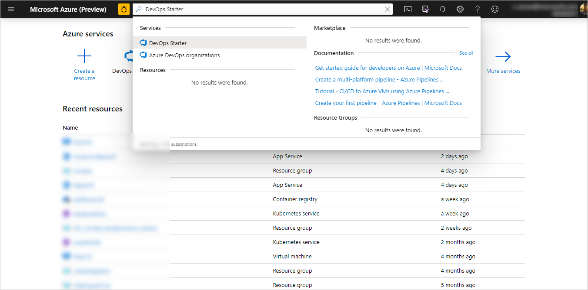
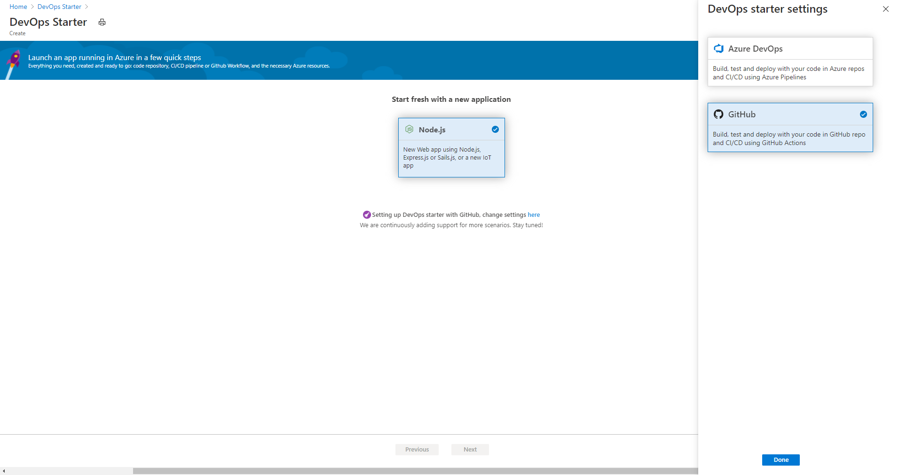
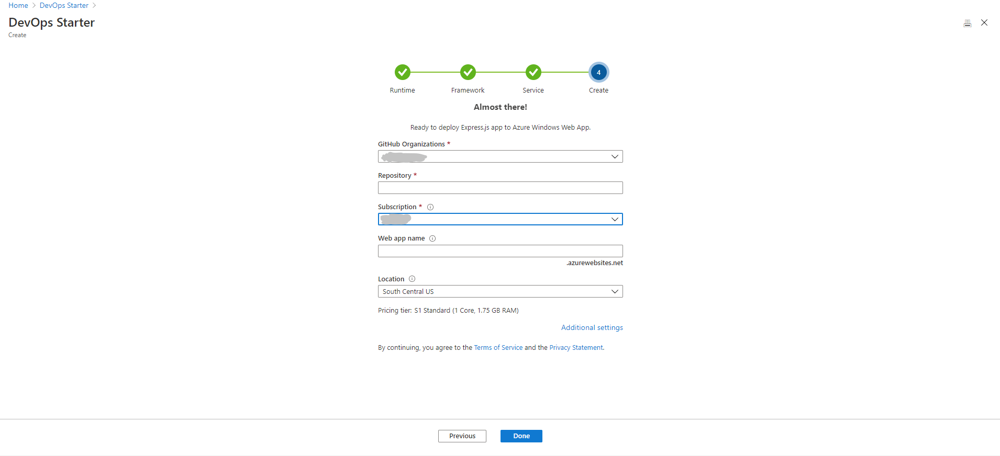

# Set up CI/CD for a Node.js app with DevOps Starter using GitHub Actions

In this quickstart, you use the simplified DevOps Starter experience to set up a continuous integration (CI) and continuous delivery (CD) workflow for your Node.js app using GitHub Actions. You can use DevOps Starter to set up everything you need for developing, deploying, and monitoring your app. 

## Prerequisites

- An Azure account with an active subscription. [Create an account for free](https://azure.microsoft.com/free/?ref=microsoft.com&utm_source=microsoft.com&utm_medium=docs&utm_campaign=visualstudio). 
- A [GitHub](https://github.com/) account.

## Sign in to the Azure portal

DevOps Starter creates a CI/CD workflow using GitHub actions. DevOps Starter also creates Azure resources in the Azure subscription of your choice.

1. Sign in to the [Azure portal](https://portal.azure.com).

1. In the search box, type **DevOps Starter**, and then select. Click on **Add** to create a new one.

    

## Select a sample application and Azure service

1. Click on **Set up DevOps starter with GitHub** on the right side banner.

    

1. Ensure that the CI/CD provider is selected as **GitHub Actions**.

    

1. Select the **Node.js** sample application. The Node.js samples include a choice of several application frameworks.

1. The default sample framework is **Express.js**. Leave the default setting, and then select **Next**.   

2. Windows Web App is the default deployment target. The application framework, which you chose previously, dictates the type of Azure service deployment target available here. Leave the default service, and then select **Next**.
 
## Configure GitHub account and an Azure subscription 

1. Authenticate with GitHub.

   1. Click on the **Authorize** button. 
   
   1. Sign in to GitHub. If you don't have a GitHub account, you can sign up here as well.

2. Choose an existing **GitHub organization**. 
   
   1. Choose a name for your GitHub repository. 
   
   1. Select your Azure subscription and location, choose a name for your application, and then select **Done**.
    
       

    After a few minutes, the DevOps Starter dashboard is displayed in the Azure portal. A sample application is set up in a repository in your Azure DevOps organization, a GitHub workflow is triggered, and your application is deployed to Azure. This dashboard provides visibility into your code repository, the  GitHub workflow, and your application in Azure.
   
3. Select **Browse** to view your running application.
    
    The dashboard contains details of GitHub workflow and Azure resources. To view the details of GitHub workflow like latest run, commits, and job status you will need to **Authorize to GitHub**.
   
   

DevOps Starter automatically configured a GitHub workflow with build and deploy jobs using GitHub actions. You're now ready to collaborate with a team on a Node.js app with a CI/CD process that automatically deploys your latest work to your web site.

   

## Commit code changes and execute CI/CD

DevOps Starter creates a repository in GitHub. To view the repository and make code changes to your application, do the following:

1. On the left of the DevOps Starter dashboard, select the link for your main branch. This link opens a view to the newly created GitHub repository.

1. To view the repository clone URL, select **Clone** on the top right of the browser. You can clone your Git repository in your favorite IDE. In the next few steps, you can use the web browser to make and commit code changes directly to the main branch.

1. On the left side of the browser, go to the **/Application/views/index.pug** file.

1. Select **Edit**, and then make a change to some of the text.
    For example, change some of the text for one of the tags.

1. Select **Commit**, and then save your changes.

1. In your browser, go to the DevOps Starter dashboard.   
You should now see a GitHub workflow build job in progress. The changes you made are automatically built and deployed via a GitHub workflow.

## View the GitHub workflow

In the previous step, DevOps Starter automatically configured a full GitHub workflow. Explore and customize the workflow as needed. Take the following steps to familiarize yourself with the workflow.

1. On the left of the DevOps Starter dashboard, select **GitHub workflow**. This link opens a browser tab and the GitHub workflow for your new project.
    > [!NOTE]
    > Do not rename the workflow file. The name of the workflow file should be **devops-starter-workflow.yml** for the dashboard to reflect the changes

1. The workflow yaml file contains all the GitHub Actions required to build and deploy the application. Click on **edit file** option to customize your workflow file.

1. Under the **Code** tab of the repo click on **commits**. This view shows code commits that are associated with the specific deployment.

1. Under the **Actions** tab of the repo, you can view the history of all the workflow runs of your repository.

1. Select the **latest run** to view all the jobs that ran in the workflow.

1. Click on the **jobs** to view the detailed logs of the workflow run. The logs contain useful information about the deployment process. They can be viewed both during and after deployments.

1. Click on the **Pull request** tab to view all the pull requests on your repository

## Clean up resources

You can delete Azure App Service and other related resources when you don't need them anymore. Use the **Delete** functionality on the DevOps Starter dashboard.

## Next steps

When you configured your CI/CD process, GitHub workflow was automatically created. You can modify this workflow to meet the needs of your team. To learn more about the GitHub Actions and workflow, see:

> [!div class="nextstepaction"]
> [Customize GitHub workflow](https://docs.github.com/actions/configuring-and-managing-workflows/configuring-and-managing-workflow-files-and-runs)
