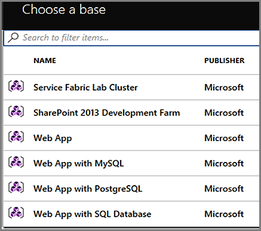

# Configure and use public environments in Azure DevTest Labs
Azure DevTest Labs has a [public repository of Azure Resource Manager templates](https://github.com/Azure/azure-devtestlab/tree/master/Environments) that you can use to create environments without having to connect to an external GitHub source by yourself. This repository includes frequently used templates such as Azure Web Apps, Service Fabric Cluster, and development SharePoint Farm environment. This feature is similar to the public repository of artifacts that is included for every lab that you create. The environment repository allows you to quickly get started with pre-authored environment templates with minimum input parameters to provide you with a smooth getting started experience for PaaS resources within labs. 

## Configuring public environments
As a lab owner, you can enable the public environment repository for your lab during the lab creation. To enable public environments for your lab, select **On** for the **Public environments** field while creating a lab. 

For existing labs, the public environment repository is not enabled. Manually enable it to use templates in the repository. For labs created using Resource Manager templates, the repository is disabled by default as well.

You can enable/disable public environments for your lab, and also make only specific environments available to lab users by using the following steps: 

1. Select **Configuration and policies** for your lab. 
2. In the **VIRTUAL MACHINE BASES** section, select **Public environments**.
3. To enable public environments for the lab, select **Yes**. Otherwise, select **No**. 
4. If you enabled public environments, all the environments in the repository are enabled by defaults. You can de-select an environment to make it not available to your lab users. 

## Use environment templates as a lab user
As a lab user, you can create a new environment from the enabled list of environment templates by simply selecting **+Add** from the tool bar in the lab page. The list of bases includes the public environments templates enabled by your lab admin at the top of the list.

## Next steps
This repository is an open-source repository that you can contribute to add frequently used and helpful Resource Manager templates of your own. To contribute, simply submit a pull request against the repository.  
