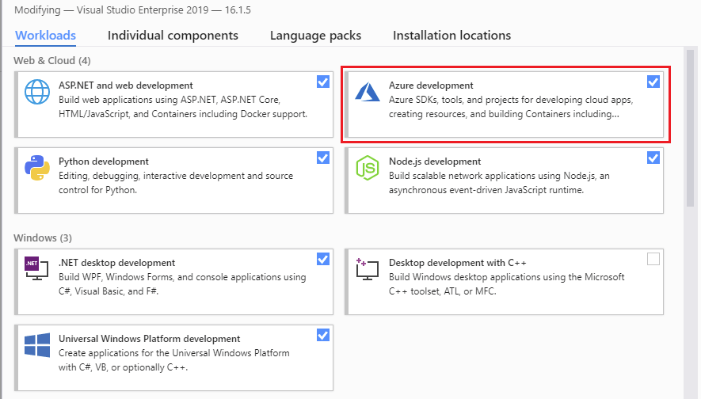
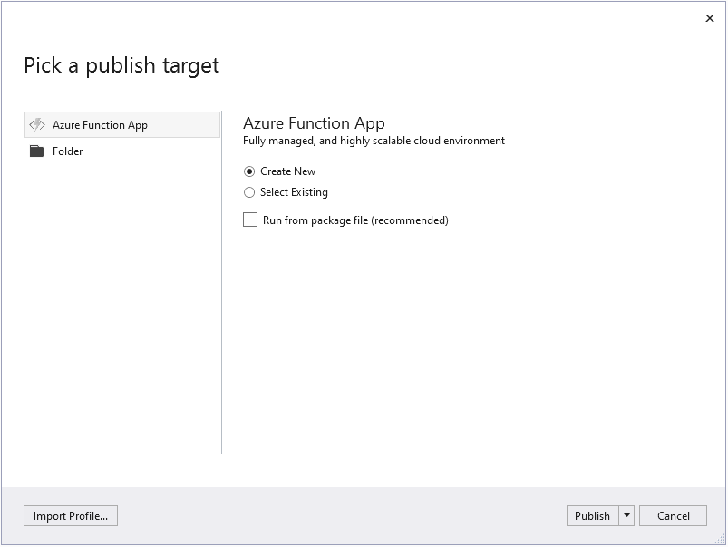
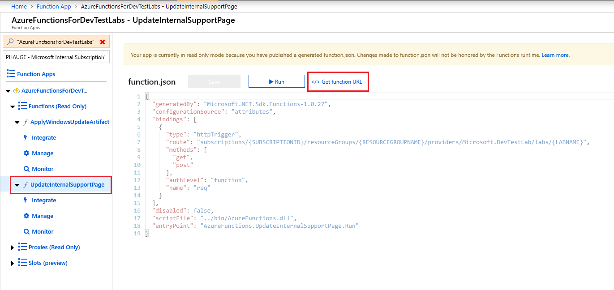
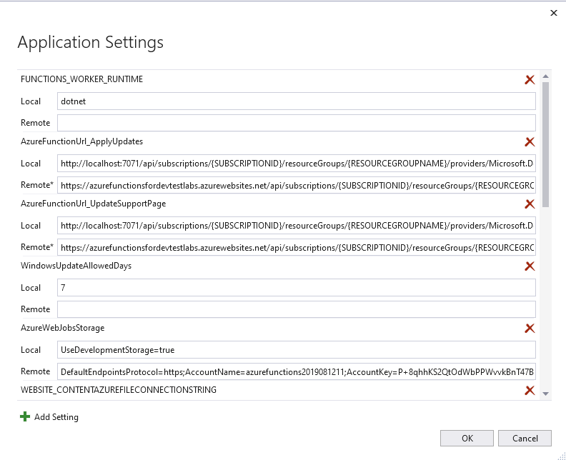
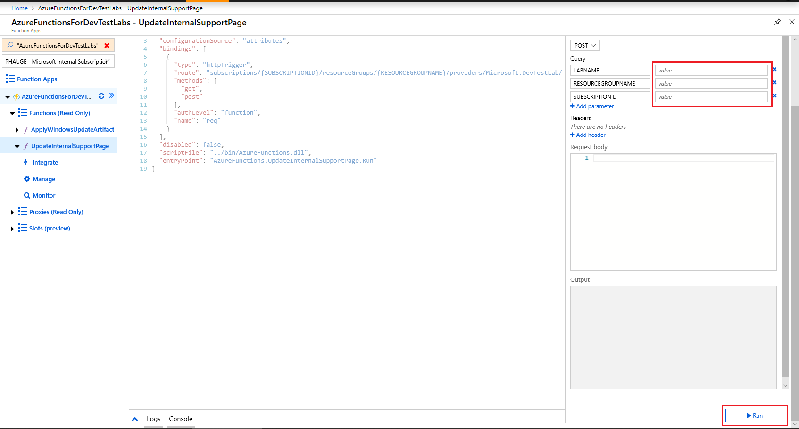

# Use Azure Functions to extend DevTest Labs
You can use Azure Functions to support additional scenarios beyond the ones that are already supported by DevTest Labs. Azure Functions can be used to extend the built-in functionality of the service to meet your business-specific needs. The following list provides some of the possible scenarios. This article shows you how to implement one of these sample scenarios.

- Provide a top-level summary of virtual machines (VMs) in the Lab
- [Configure a lab to use a remote desktop gateway](configure-lab-remote-desktop-gateway.md)
- Compliance reporting on the internal support page
- Enable users to complete operations that require increased permissions in the subscription
- [Starting workflows based on DevTest Labs events](https://github.com/RogerBestMsft/DTL-SecureArtifactData)

## Overview
[Azure Functions](../azure-functions/functions-overview.md) is a serverless computing platform in Azure. Using Azure Functions in a solution with DevTest Labs enables us to augment the existing features with our own custom code. For more information on Azure Functions, see [Azure Functions documentation](../azure-functions/functions-overview.md). To illustrate how Azure Functions can help fulfill your requirements or complete scenarios in DevTest Labs, this article uses an example of providing a top-level summary of VMs in the Lab as follows:

**Example requirement/scenario**: Users can see details about all VMs in a lab including the operating system, owner, and any applied artifacts.  In addition, if the **Apply Windows Updates** artifact hasn't been recently applied, there is an easy way to apply it.

To complete the scenario, you will use two functions as described in the following diagram:  

The source code for these sample functions is located in the [DevTest Labs GitHub repository](https://github.com/Azure/azure-devtestlab/tree/master/samples/DevTestLabs/AzureFunctions) (both C# and PowerShell implementations are available).

- **UpdateInternalSupportPage**: This function queries DevTest Labs and updates the internal support page directly with details about the virtual machines.
- **ApplyWindowsUpdateArtifact**: For a VM in a lab, this function applies the **Windows update** artifact.

## How it works
When users select the **Internal support** page in DevTest Labs, they have a pre-populated page with information about VMs, lab owners, and support contacts.  

When you select the **Select here to refresh** button, the page calls the first Azure function: **UpdateInternalSupportPage**. The function queries DevTest Labs for information and then rewrites the **Internal support** page with the new information.

There’s an additional action that can be taken, for any VMs on which the Windows Update artifacts hasn't been applied recently, there will be a button to apply windows updates to the VM. When you select the ***Run Windows update** button for a VM, the page calls the second Azure Function: **ApplyWindowsUpdateArtifact**. This function checks whether the virtual machine is running and if so, applies the [Windows Update](https://github.com/Azure/azure-devtestlab/tree/master/Artifacts/windows-install-windows-updates) artifact directly.

## Step-by-step walkthrough
This section provides step-by-step instructions for setting up Azure Resources needed to update the **Internal support** page. This walkthrough provides one example of extending DevTest Labs. You can use use this pattern for other scenarios.

### Step 1: Create a service principal 
The first step is to get a service principal with permission to the subscription that contains the lab. The service principal must use the password-based authentication. It can be done with [Azure CLI](/cli/azure/create-an-azure-service-principal-azure-cli), [Azure PowerShell](/powershell/azure/create-azure-service-principal-azureps), or the [Azure portal](../active-directory/develop/howto-create-service-principal-portal.md). If you already have a service principal to use, you can skip this step.

Note down the **application ID**, **key**, and **tenant ID** for the service principal. You will need them later in this walkthrough. 

### Step 2: Download the sample and open in Visual Studio 2019
Download a copy of the [C# Azure Functions sample](https://github.com/Azure/azure-devtestlab/tree/master/samples/DevTestLabs/AzureFunctions/CSharp) locally (either by cloning the repository or downloading the repository from [here](https://github.com/Azure/azure-devtestlab/archive/master.zip)).  

1. Open the sample solution with Visual Studio 2019.  
1. Install the **Azure development** workload for Visual Studio if you don't have it already installed. It can be installed via **Tools** -> **Get Tools and Features** menu item).

    
1. Build the solution. Select **Build** and then **Build Solution** menu item.

### Step 3: Deploy the sample to Azure
In Visual Studio, In the **Solution Explorer** window, right-click the **AzureFunctions** project, and then select **Publish**. Follow the wizard to complete publishing to either a new or an existing Azure Function App. For detailed information on developing and deploying Azure functions using Visual Studio, see [Develop Azure Functions using Visual Studio](../azure-functions/functions-develop-vs.md).

### Step 4:  Gather application settings
Once the functions are published, you need to get URLs for these functions from the Azure portal. 

1. Navigate to the [Azure portal](https://portal.azure.com). 
1. Find the function app.
1. On the **Function Apps** page, select the function. 
1. Select **Get function URL** as shown in the following image. 

    
4. Copy and save the URL. Repeat these steps for the other Azure function. 

You will also need additional information about the service principal such as application ID, key, and tenant ID.

### Step 5:  Update Application Settings
In Visual Studio, after publishing the Azure Function, select the **Edit Azure App Service Settings** under **Actions**. Update the following application settings (remote):

- AzureFunctionUrl_ApplyUpdates
- AzureFunctionUrl_UpdateSupportPage
- WindowsUpdateAllowedDays (default to 7)
- ServicePrincipal_AppId
- ServicePrincipal_Key
- ServicePrincipal_Tenant

    

### Step 6: Test the Azure function
The last step in this walkthrough is to test the Azure function.  

1. Navigate to the **UpdateInternalSupportPage** function in the function app created in the step 3. 
1. Select **Test** on the right side of the page. 
1. Enter in the route properties (LABNAME, RESOURCEGROUPNAME, and SUBSCRIPTIONID).
1. Select **Run** to execute the function.  

    This function will update the internal support page of the specified lab. It also includes a button for users to directly call the function next time

    

## Next steps
Azure Functions can help extend the functionality of DevTest Labs beyond what’s already built-in and help customers meet their unique requirements for their teams. This pattern can be extended & expanded further to cover even more.  To learn more about DevTest Labs, see the following articles: 

- [DevTest Labs Enterprise Reference Architecture](devtest-lab-reference-architecture.md)
- [Frequently Asked Questions](devtest-lab-faq.md)
- [Scaling up DevTest Labs](devtest-lab-guidance-scale.md)
- [Automating DevTest Labs with PowerShell](https://github.com/Azure/azure-devtestlab/tree/master/samples/DevTestLabs/Modules/Library/Tests)

