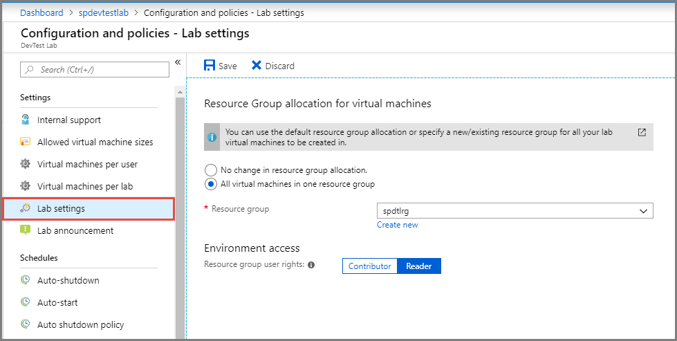

# Specify a resource group for lab virtual machines in Azure DevTest Labs

As a lab owner, you can configure your lab virtual machines to be created in a specific resource group. This feature helps you in the following scenarios:

- Have fewer resource groups created by labs in your subscription.
- Have your labs operate within a fixed set of resource groups that you configure.
- Work around restrictions and approvals required for creating resource groups within your Azure subscription.
- Consolidate all your lab resources within a single resource group to simplify tracking those resources and applying [policies](../governance/policy/overview.md) to manage resources at the resource group level.

With this feature, you can use a script to specify a new or existing resource group within your Azure subscription for all your lab VMs. Currently, Azure DevTest Labs supports this feature through an API.

> [!NOTE]
> All subscription limits apply when you create labs in DevTest Labs. Think of a lab as any other resource in your subscription. In case of resource groups, the limit is [980 resource groups per subscription](../azure-resource-manager/management/azure-subscription-service-limits.md#subscription-limits). 

## Use Azure portal
Follow these steps to specify a resource group for all VMs created in the lab. 

1. Sign in to the [Azure portal](https://portal.azure.com).
2. Select **All Services** on the left navigational menu. 
3. Select **DevTest Labs** from the list.
4. From the list of labs, select your **lab**.  
5. Select **Configuration and policies** in the **Settings** section on the left menu. 
6. Select **Lab settings** on the left menu. 
7. Select **All virtual machines in one resource group**. 
8. Select an existing resource group in the drop-down list (or) select **Create new**, enter a **name** for the resource group, and select **OK**. 

    

## Use PowerShell 
The following example shows how to use a PowerShell script to create all lab virtual machines in a new resource group.

```powershell
[CmdletBinding()]
Param(
    $subId,
    $labRg,
    $labName,
    $vmRg
)

az login | out-null

az account set --subscription $subId | out-null

$rgId = "/subscriptions/"+$subId+"/resourceGroups/"+$vmRg

"Updating lab '$labName' with vm rg '$rgId'..."

az resource update -g $labRg -n $labName --resource-type "Microsoft.DevTestLab/labs" --api-version 2018-10-15-preview --set properties.vmCreationResourceGroupId=$rgId

"Done. New virtual machines will now be created in the resource group '$vmRg'."
```

Invoke the script by using the following command. ResourceGroup.ps1 is the file that contains the preceding script:

```powershell
.\ResourceGroup.ps1 -subId <subscriptionID> -labRg <labRGNAme> -labName <LanName> -vmRg <RGName> 
```

## Use an Azure Resource Manager template
If you're using an Azure Resource Manager template to create a lab, use the **vmCreationResourceGroupId** property in the lab properties section of your template, as shown in the following example:

```json
        {
            "type": "microsoft.devtestlab/labs",
            "name": "[parameters('lab_name')]",
            "apiVersion": "2018-10-15-preview",
            "location": "eastus",
            "tags": {},
            "scale": null,
            "properties": {
                "vmCreationResourceGroupId": "/subscriptions/<SubscriptionID>/resourcegroups/<ResourceGroupName>",
                "labStorageType": "Premium",
                "premiumDataDisks": "Disabled",
                "provisioningState": "Succeeded",
                "uniqueIdentifier": "000000000f-0000-0000-0000-00000000000000"
            },
            "dependsOn": []
        },
```


## API to configure a resource group for lab VMs
You have the following options as a lab owner when using this API:

- Choose the **lab’s resource group** for all virtual machines.
- Choose an **existing resource group** other than the lab's resource group for all virtual machines.
- Enter a **new resource group** name for all virtual machines.
- Continue using the existing behavior, in which a resource group is created for each VM in the lab.
 
This setting applies to new virtual machines created in the lab. The older VMs in your lab that were created in their own resource groups remain unaffected. Environments that are created in your lab continue to remain in their own resource groups.

How to use this API:
- Use API version **2018-10-15-preview**.
- If you specify a new resource group, ensure that you have **write permissions on resource groups** in your subscription. If you lack write permissions, creating new virtual machines in the specified resource group will fail.
- While using the API, pass in the **full resource group ID**. For example: `/subscriptions/<SubscriptionID>/resourceGroups/<ResourceGroupName>`. Ensure that the resource group is in the same subscription as the lab. 


## Next steps
See the following articles: 

- [Set policies for a lab](devtest-lab-set-lab-policy.md)
- [Frequently asked questions](devtest-lab-faq.md)
