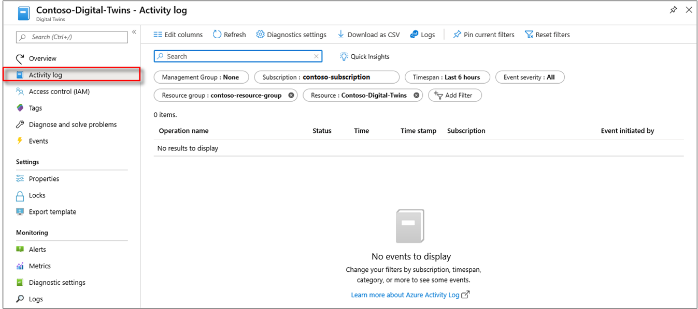
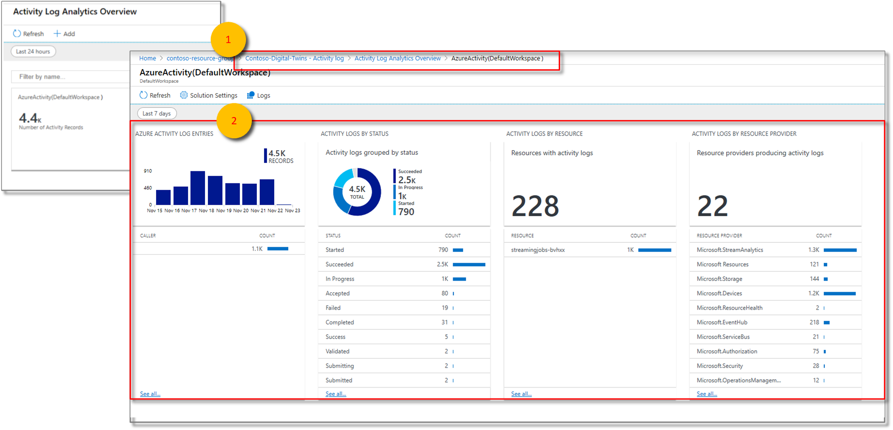
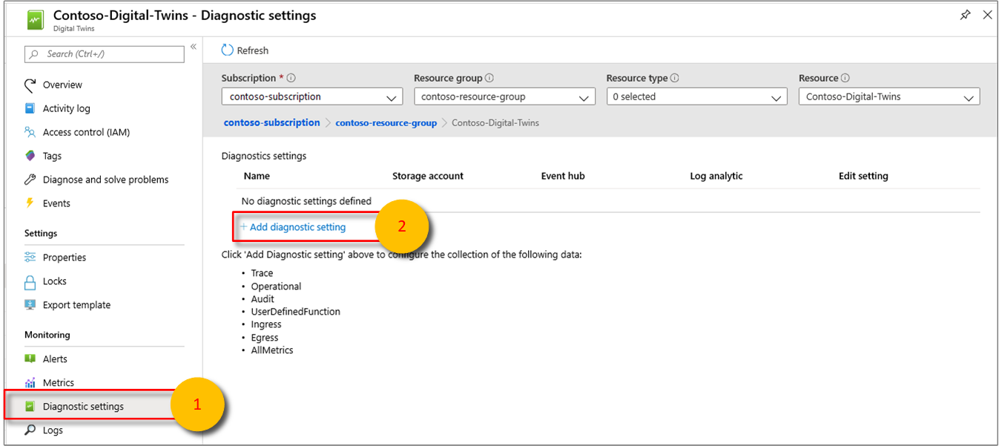
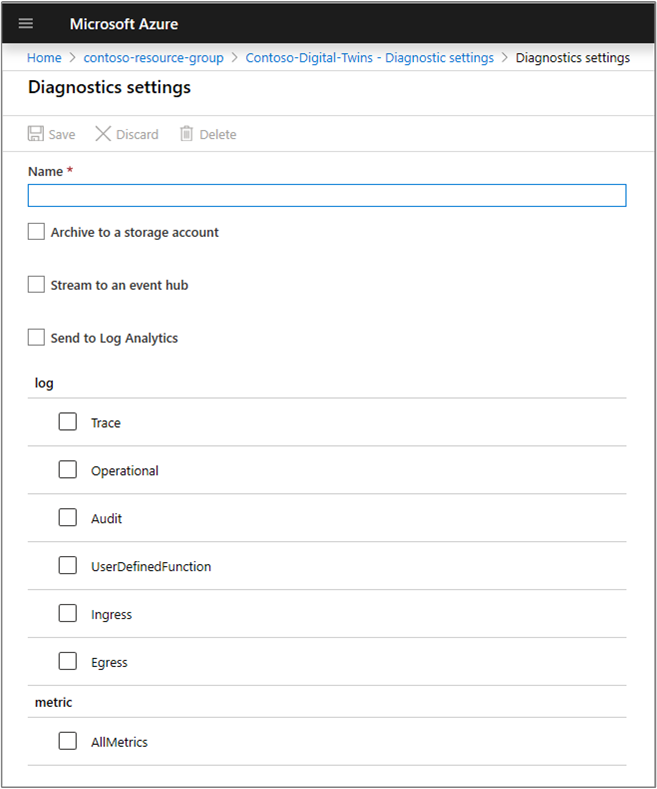
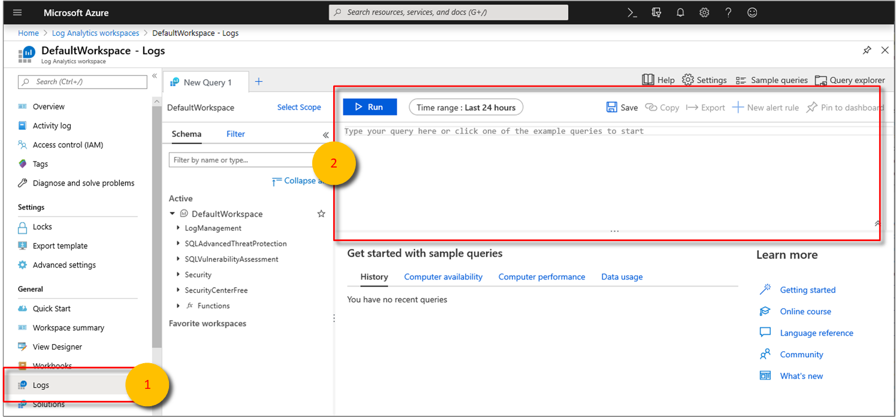
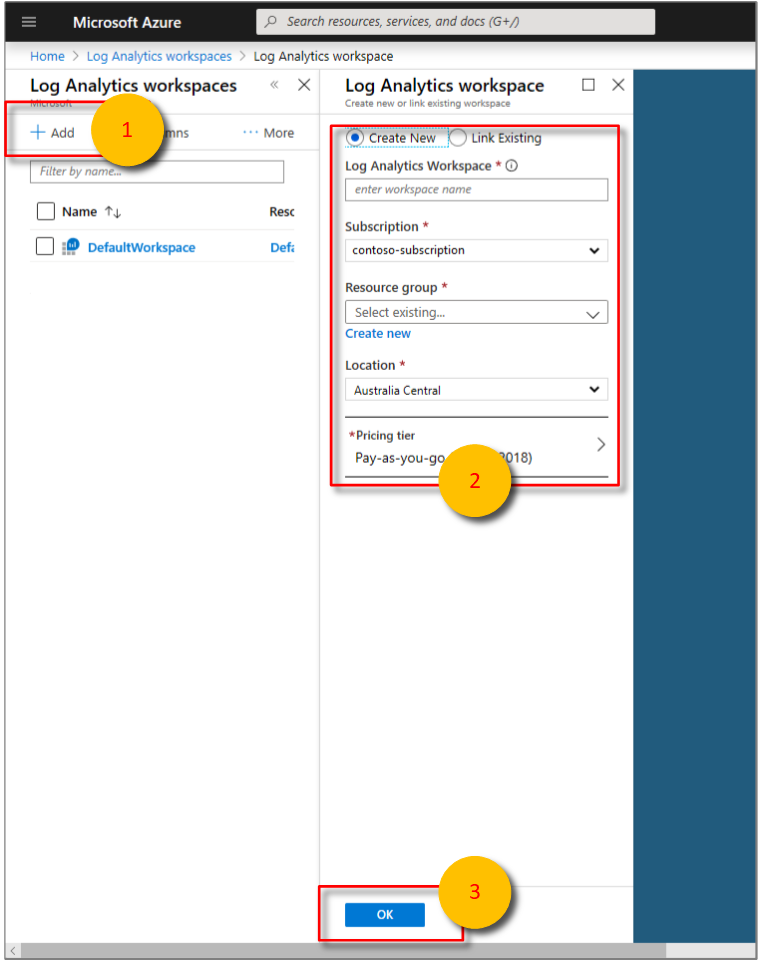
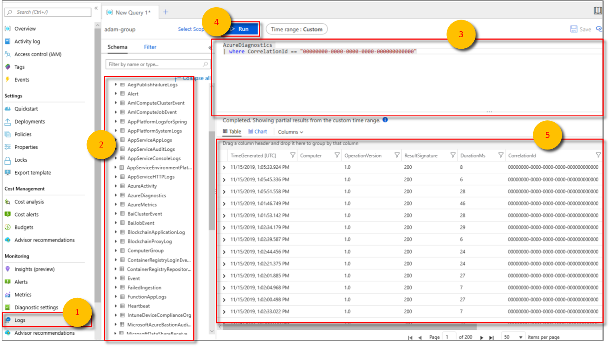
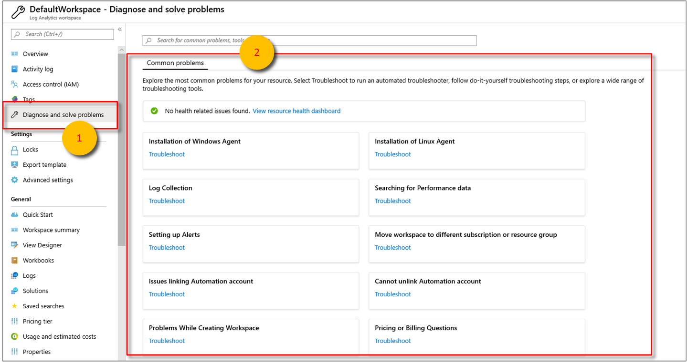

# How to configure monitoring in Azure Digital Twins

Azure Digital Twins supports robust logging, monitoring, and analytics. Solutions developers can use Azure Monitor logs, diagnostic logs, activity logging, and other services to support the complex monitoring needs of an IoT app. Logging options can be combined to query or display records across several services and to provide granular logging coverage for many services.

This article summarizes logging and monitoring options and how to combine them in ways specific to Azure Digital Twins.

[!INCLUDE [azure-monitor-log-analytics-rebrand](../../includes/azure-monitor-log-analytics-rebrand.md)]

## Review activity logs

Azure [activity logs](../azure-monitor/platform/activity-logs-overview.md) provide quick insights into subscription-level event and operation histories for each Azure service instance.

Subscription-level events include:

* Resource creation
* Resource removal
* Creating app secrets
* Integrating with other services

Activity logging for Azure Digital Twins is enabled by default and can be found through the Azure portal by:

1. Selecting your Azure Digital Twins instance.
1. Choosing **Activity log** to bring up the display panel:

    

For advanced activity logging:

1. Select the **Logs** option to display the **Activity Log Analytics Overview**:

    

1. The **Activity Log Analytics Overview** summarizes essential activity log data:

    

>[!TIP]
>Use **activity logs** for quick insights into subscription-level events.

## Enable customer diagnostic logs

Azure [diagnostic settings](../azure-monitor/platform/resource-logs-overview.md) can be set for each Azure instance to supplement activity logging. While activity logs pertain to subscription-level events, diagnostic logging provides insights into the operational history of the resources themselves.

Examples of diagnostic logging include:

* The execution time for a user-defined function
* The response status code of a successful API request
* Retrieving an app key from a vault

To enable diagnostic logs for an instance:

1. Bring up the resource in Azure portal.
1. Select **Diagnostic settings**:

    

1. Select **Turn on diagnostics** to collect data (if not previously enabled).
1. Fill in the requested fields and select how and where data will be saved:

    

    Diagnostic logs are often saved using [Azure File Storage](../storage/files/storage-files-deployment-guide.md) and shared with [Azure Monitor logs](../azure-monitor/log-query/get-started-portal.md). Both options can be selected.

>[!TIP]
>Use **diagnostic logs** for insights into resource operations.

## Azure monitor and log analytics

IoT applications unite disparate resources, devices, locations, and data into one. Fine-grained logging provides detailed information about each specific piece, service, or component of the overall application architecture but a unified overview is often required for maintenance and debugging.

Azure Monitor includes the powerful log analytics service, which allows logging sources to be viewed and analyzed in one location. Azure Monitor is therefore highly useful for analyzing logs within sophisticated IoT apps.

Examples of use include:

* Querying multiple diagnostic log histories
* Seeing logs for several user-defined functions
* Displaying logs for two or more services within a specific time-frame

Full log querying is provided through [Azure Monitor logs](../azure-monitor/log-query/log-query-overview.md). To set up these powerful features:

1. Search for **Log Analytics** in the Azure portal.
1. You will see your available **Log Analytics workspace** instances. Choose one and select **Logs** to query:

    

1. If you don't already have a **Log Analytics workspace** instance, you can create a workspace by selecting the **Add** button:

    

Once your **Log Analytics workspace** instance is provisioned, you may use powerful queries to find entries in multiples logs or search using specific criteria using **Log Management**:

   

For more information about powerful query operations, see [getting started with queries](../azure-monitor/log-query/get-started-queries.md).

> [!NOTE]
> You may experience a 5 minute delay when sending events to **Log Analytics workspace** for the first time.

Azure Monitor logs also provide powerful error and alert notification services, which can be viewed by selecting **Diagnose and solve problems**:

   

>[!TIP]
>Use **Log Analytics workspace** to query log histories for multiple app functionalities, subscriptions, or services.

## Other options

Azure Digital Twins also supports application-specific logging and security auditing. For a thorough overview of all Azure logging options available to your Azure Digital Twins instance, see the [Azure log audit](../security/fundamentals/log-audit.md) article.

## Next steps

- Learn more about Azure [activity logs](../azure-monitor/platform/activity-logs-overview.md).

- Dive deeper into Azure diagnostic settings by reading an [overview of diagnostic logs](../azure-monitor/platform/resource-logs-overview.md).

- Read more about [Azure Monitor logs](../azure-monitor/log-query/get-started-portal.md).
