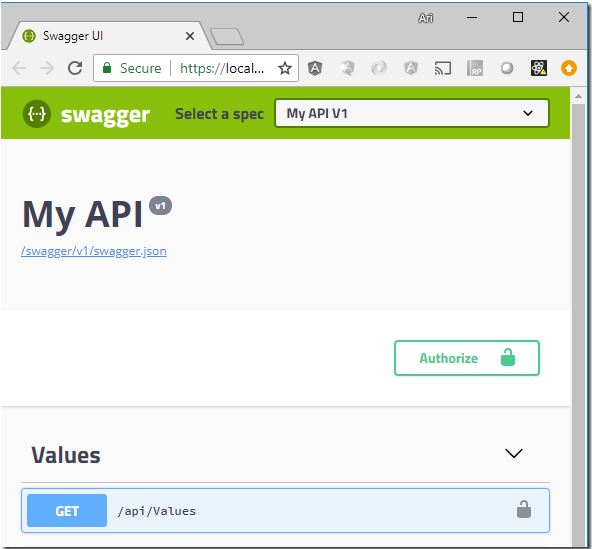
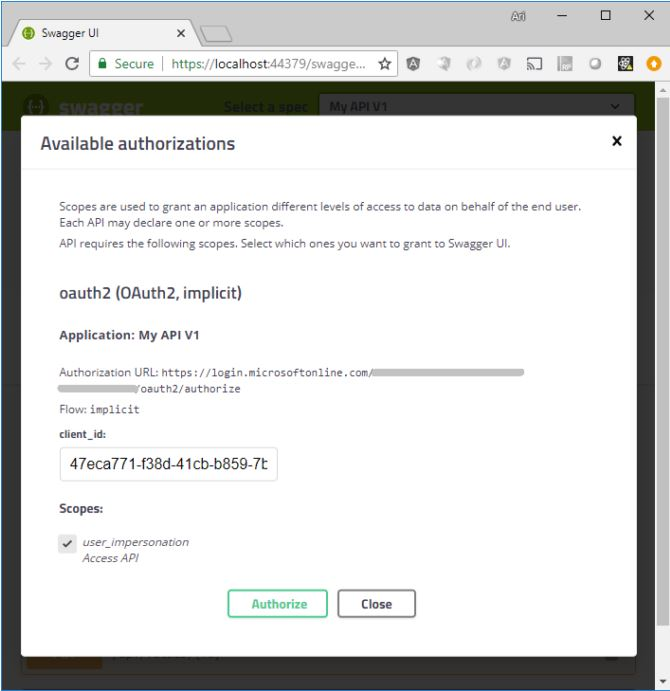
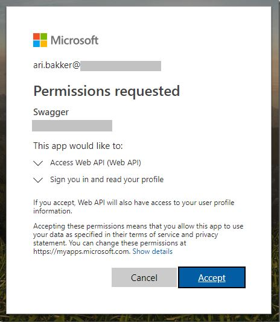
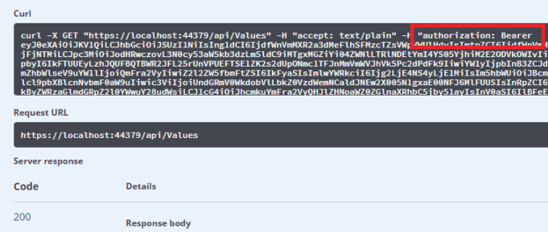

# Azure Digital Twins Swagger reference documentation

Each provisioned Azure Digital Twins instance includes its own automatically generated Swagger reference documentation.

[Swagger](https://swagger.io/), or [OpenAPI](https://www.openapis.org/), unites complex API information into an interactive and language-agnostic reference resource. Swagger provides critical reference material about which JSON payloads, HTTP methods, and specific endpoints to use to perform operations against an API.

## Swagger summary

Swagger provides an interactive summary of your API, which includes:

* API and object model information.
* REST API endpoints that specify the required request payloads, headers, parameters, context paths, and HTTP methods.
* Testing of API functionalities.
* Example response information used to validate and confirm HTTP responses.
* Error code information.

Swagger is a convenient tool to assist with development and testing calls made to the Azure Digital Twins Management APIs.

[!INCLUDE [Digital Twins Swagger](../../includes/digital-twins-swagger.md)]

## Reference material

The automatically generated Swagger reference material supplies a quick overview of important concepts, available Management API endpoints, and a description of each object model to assist development and testing.

A concise summary describes the API.

![Swagger top][1]

Management API object models are also listed.

![Swagger models][2]

You can select each listed object model for a more detailed summary of key attributes.

![Swagger model][3]

The generated Swagger object models are convenient to see all available Azure Digital Twins [objects and APIs](./concepts-objectmodel-spatialgraph.md). Developers can use this resource when they build solutions on Azure Digital Twins.

## Endpoint summary

Swagger also provides a thorough overview of all endpoints that compose the Management APIs.

Each listed endpoint also includes the required request information, such as the:

* Required parameters.
* Required parameter data types.
* HTTP method to access the resource.

![Swagger endpoints][4]

To see a more detailed overview, select each resource.

## Use Swagger to test endpoints

One of the powerful functionalities Swagger provides is the ability to test an API endpoint directly through the documentation UI.

After you select a specific endpoint, you see **Try it out**.

![Swagger try][5]

Expand that section to bring up input fields for each required and optional parameter. Enter the correct values, and select **Execute**.

![Swagger tried][6]

After you execute the test, you can validate the response data.

## Swagger response data

Each listed endpoint also includes response body data to validate your development and tests. These examples include the status codes and JSON you want to see for successful HTTP requests.

![Swagger response][7]

The examples also include error codes to help debug or improve failing tests.

## Swagger OAuth 2.0 authorization

To learn more about interactively testing requests protected by OAuth 2.0, see the [official documentation](https://swagger.io/docs/specification/authentication/oauth2/).

> [!NOTE]
> The user principal that created the Azure Digital Twins resource will have a Space Administrator role assignment and will be able to create additional role assignments for other users.

1. Follow the steps in [this quickstart](https://docs.microsoft.com/azure/active-directory/develop/quickstart-v1-integrate-apps-with-azure-ad) to create an Azure AD application of type ***Web app / API***. Or you can reuse an existing app registration.

2. Add the following reply url to the app registration:

    ```plaintext
    https://YOUR_SWAGGER_URL/ui/oauth2-redirect-html
    ```
    | Name  | Replace with | Example |
    |---------|---------|---------|
    | YOUR_SWAGGER_URL | Your Management REST API documentation URL found in the portal  | `https://yourDigitalTwinsName.yourLocation.azuresmartspaces.net/management/swagger` |

3. Grant permissions for your app to access Azure Digital Twins. Under **Required permissions**, enter `Azure Digital Twins` and select **Delegated Permissions**. Then select **Grant Permissions**.

    

4. Configure the application manifest to allow OAuth 2.0 implicit flow. Click **Manifest** to open the application manifest for your app. Set *oauth2AllowImplicitFlow* to `true`.

    

5. Copy the ID of your Azure AD app.

6. Click the Authorize button on your swagger page.

    

7. Paste the application ID into the client_id field.

    

    

8. You should now see the Bearer authentication token passed in the authorization header and the identity of the logged in user displayed in the result.

    

## Next steps

- To read more about Azure Digital Twins object models and the spatial intelligence graph, read [Understand Azure Digital Twins object models](./concepts-objectmodel-spatialgraph.md).

- To learn how to authenticate with your Management API, read [Authenticate with APIs](./security-authenticating-apis.md).

<!-- Images -->
[1]: media/how-to-use-swagger/swagger_management_top.PNG
[2]: media/how-to-use-swagger/swagger_management_models.PNG
[3]: media/how-to-use-swagger/swagger_management_model.PNG
[4]: media/how-to-use-swagger/swagger_management_endpoints.PNG
[5]: media/how-to-use-swagger/swagger_management_try.PNG
[6]: media/how-to-use-swagger/swagger_management_tried.PNG
[7]: media/how-to-use-swagger/swagger_management_response.PNG
