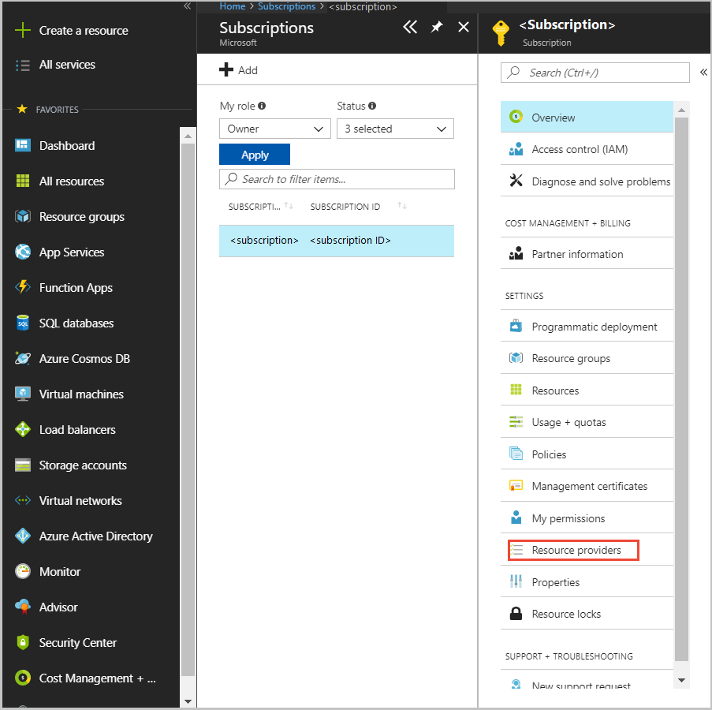
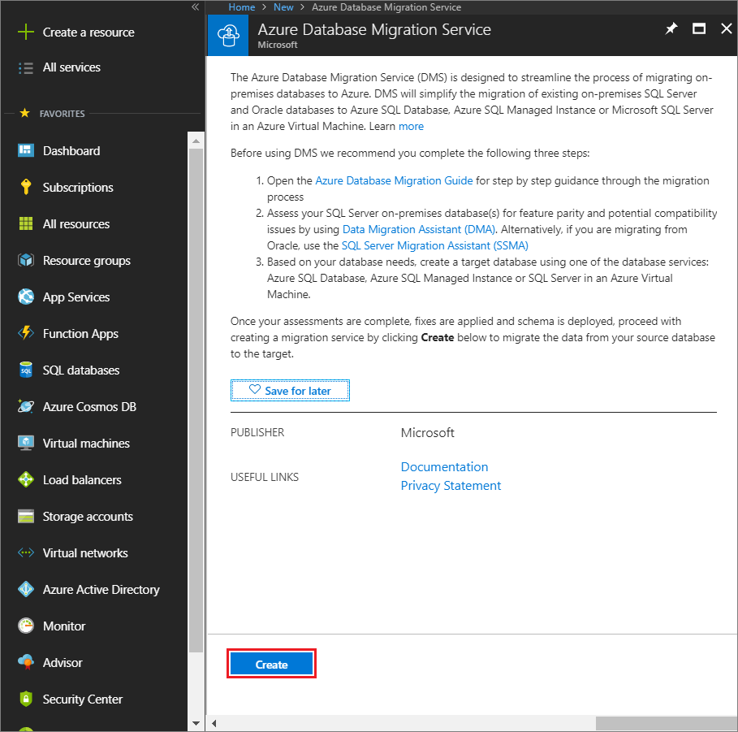
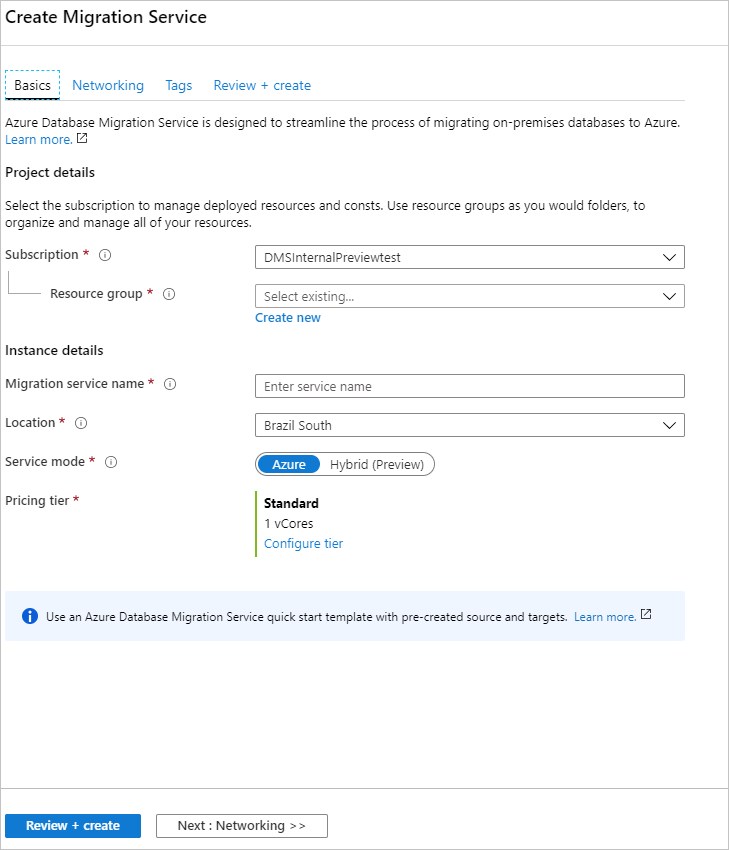
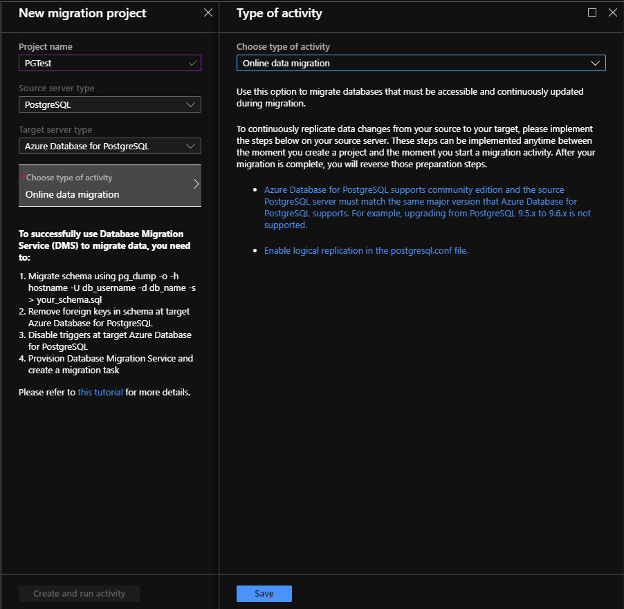
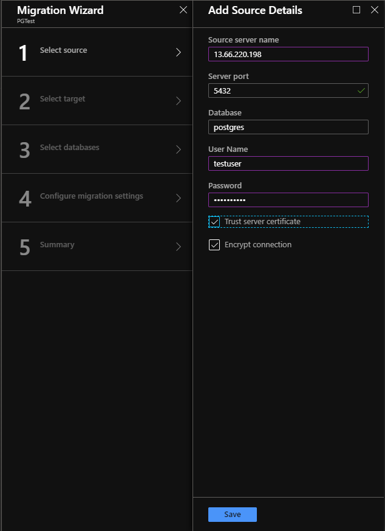
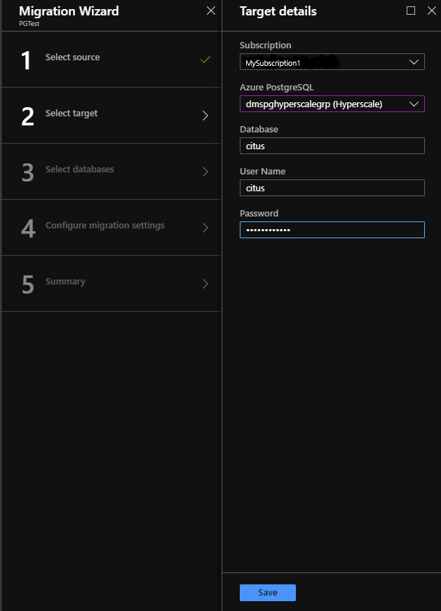
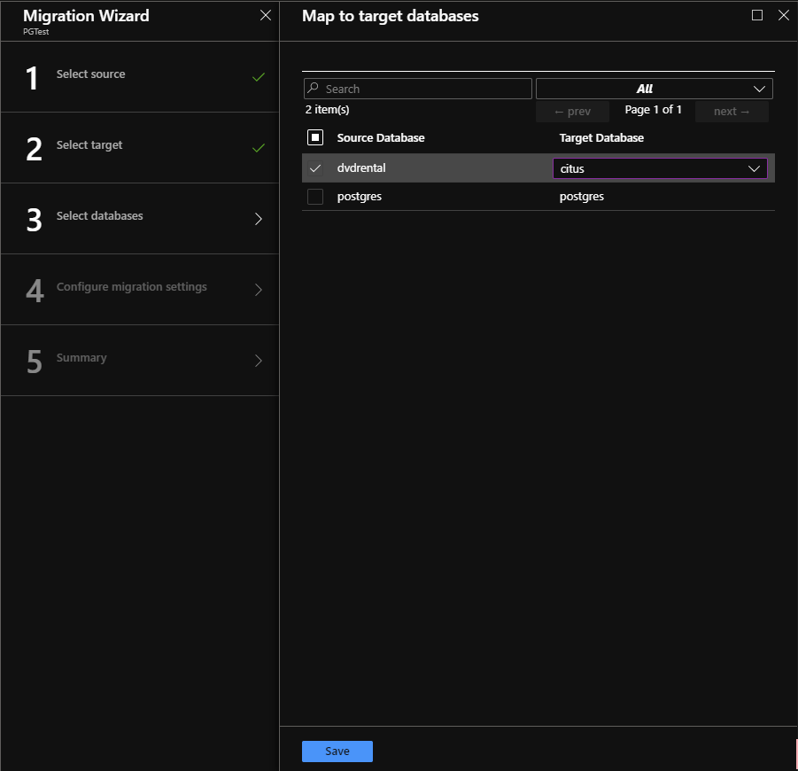
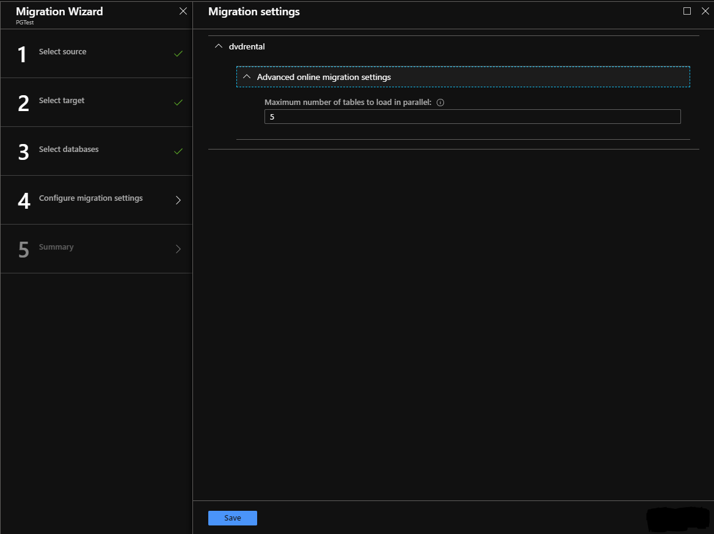
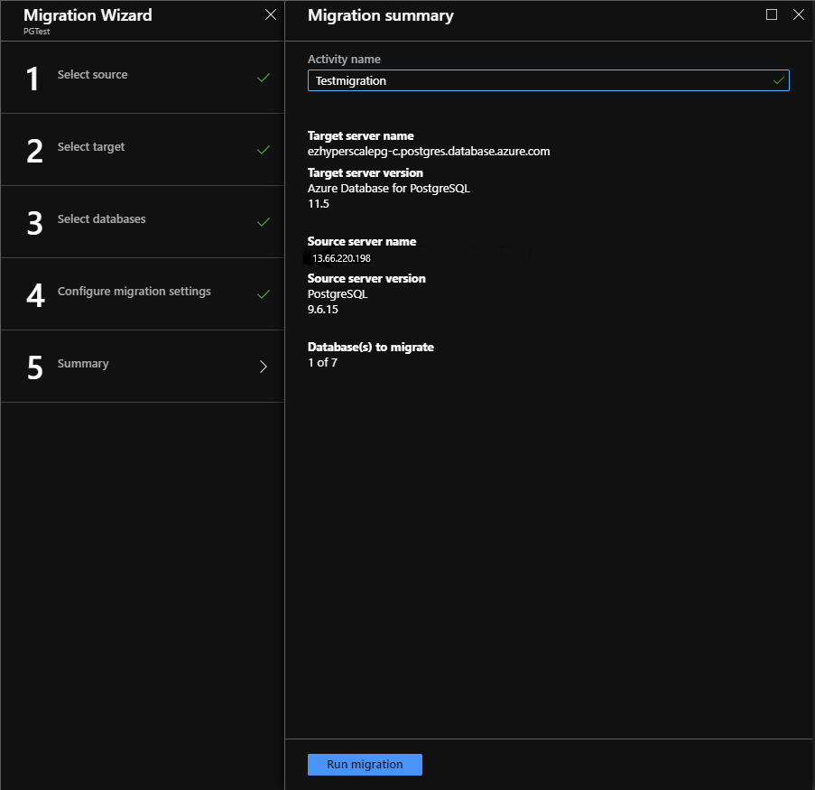
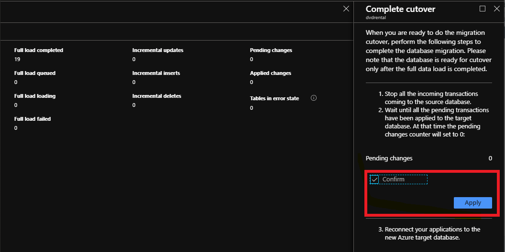

# Tutorial: Migrate/Upgrade Azure DB for PostgreSQL - Single Server to Azure DB for PostgreSQL - Single Server  online using DMS via the Azure portal

You can use Azure Database Migration Service to migrate the databases from an [Azure Database for PostgreSQL - Single Server](../postgresql/overview.md#azure-database-for-postgresql---single-server) instance to same or different version of Azure Database for PostgreSQL - Single Server instance or Azure Database for PostgreSQL - Flexible Server with minimal downtime. In this tutorial, you migrate the **DVD Rental** sample database from an Azure Database for PostgreSQL v10 to Azure Database for PostgreSQL - Single Server by using the online migration activity in Azure Database Migration Service.

In this tutorial, you learn how to:
> [!div class="checklist"]
>
> * Migrate the sample schema using the pg_dump utility.
> * Create an instance of Azure Database Migration Service.
> * Create a migration project in Azure Database Migration Service.
> * Run the migration.
> * Monitor the migration.
> * Perform migration cutover.

> [!NOTE]
> Using Azure Database Migration Service to perform an online migration requires creating an instance based on the Premium pricing tier. We encrypt disk to prevent data theft during the process of migration

> [!IMPORTANT]
> For an optimal migration experience, Microsoft recommends creating an instance of Azure Database Migration Service in the same Azure region as the target database. Moving data across regions or geographies can slow down the migration process and introduce errors.

> [!IMPORTANT]
> Migration from Azure Database for PostgreSQL is supported for PostgreSQL version 10 and later. You can also use this tutorial to migrate from one Azure Database for PostgreSQL instance to another Azure Database for PostgreSQL instance or Hyperscale (Citus) instance.

## Prerequisites

To complete this tutorial, you need to:

* Check [status of migration scenarios supported by Azure Database Migration Service](./resource-scenario-status.md) for supported migration and version combinations. 
* An existing [Azure Database for PostgreSQL](../postgresql/index.yml) version 10 and later instance with the **DVD Rental** database. 

    Also note that the target Azure Database for PostgreSQL version must be equal to or later than the on-premises PostgreSQL version. For example, PostgreSQL 10 can migrate to Azure Database for PostgreSQL 10, or 11, but not to Azure Database for PostgreSQL 9.6.

* [Create an Azure Database for PostgreSQL server](../postgresql/quickstart-create-server-database-portal.md) or [Create an Azure Database for PostgreSQL - Hyperscale (Citus) server](../postgresql/quickstart-create-hyperscale-portal.md) as the target database server to migrate data into.
* Create a Microsoft Azure Virtual Network for Azure Database Migration Service by using the Azure Resource Manager deployment model. For more information about creating a virtual network, see the [Virtual Network Documentation](../virtual-network/index.yml), and especially the quickstart articles with step-by-step details.

* Ensure that the Network Security Group (NSG) rules for your virtual network don't block the outbound port 443 of ServiceTag for ServiceBus, Storage and AzureMonitor. For more detail on virtual network NSG traffic filtering, see the article [Filter network traffic with network security groups](../virtual-network/virtual-network-vnet-plan-design-arm.md).
* Create a server-level [firewall rule](../azure-sql/database/firewall-configure.md) for Azure Database for PostgreSQL source to allow Azure Database Migration Service to access to the source databases. Provide the subnet range of the virtual network used for Azure Database Migration Service.
* Create a server-level [firewall rule](../azure-sql/database/firewall-configure.md) for Azure Database for PostgreSQL target to allow Azure Database Migration Service to access to the target databases. Provide the subnet range of the virtual network used for Azure Database Migration Service.
* [Enable logical replication](../postgresql/concepts-logical.md) in the Azure DB for PostgreSQL source. 
* Set the following Server parameters in the Azure Database for PostgreSQL instance being used as a source:

  * max_replication_slots = [number of slots], recommend setting to **ten slots**
  * max_wal_senders =[number of concurrent tasks] - The max_wal_senders parameter sets the number of concurrent tasks that can run, recommend setting to **10 tasks**

> [!NOTE]
> The above server parameters are static and will require a reboot of your Azure Database for PostgreSQL instance for them to take effect. For more information on toggling server parameters, see [Configure Azure Database for PostgreSQL Server Parameters](../postgresql/howto-configure-server-parameters-using-portal.md).

> [!IMPORTANT]
> All tables in your existing database need a primary key to ensure that changes can be synced to the target database.

## Migrate the sample schema

To complete all the database objects like table schemas, indexes and stored procedures, we need to extract schema from the source database and apply to the database.

1. Use pg_dump -s command to create a schema dump file for a database.

    ```
    pg_dump -o -h hostname -U db_username -d db_name -s > your_schema.sql
    ```

    For example, to create a schema dump file for the **dvdrental** database:

    ```
    pg_dump -o -h mypgserver-source.postgres.database.azure.com -U pguser@mypgserver-source -d dvdrental -s -O -x > dvdrentalSchema.sql
    ```

    For more information about using the pg_dump utility, see the examples in the [pg-dump](https://www.postgresql.org/docs/9.6/static/app-pgdump.html#PG-DUMP-EXAMPLES) tutorial.

2. Create an empty database in your target environment, which is Azure Database for PostgreSQL.

    For details on how to connect and create a database, see the article [Create an Azure Database for PostgreSQL server in the Azure portal](../postgresql/quickstart-create-server-database-portal.md) or [Create an Azure Database for PostgreSQL - Hyperscale (Citus) server in the Azure portal](../postgresql/quickstart-create-hyperscale-portal.md).

    > [!NOTE]
    > An instance of Azure Database for PostgreSQL - Hyperscale (Citus) has only a single database: **citus**.

3. Import the schema into the target database you created by restoring the schema dump file.

    ```
    psql -h hostname -U db_username -d db_name < your_schema.sql
    ```

    For example:

    ```
    psql -h mypgserver-source.postgres.database.azure.com  -U pguser@mypgserver-source -d dvdrental citus < dvdrentalSchema.sql
    ```

4. To extract the drop foreign key script and add it at the destination (Azure Database for PostgreSQL), in PgAdmin or in psql, run the following script.

   > [!IMPORTANT]
   > Foreign keys in your schema will cause the initial load and continuous sync of the migration to fail.

    ```
    SELECT Q.table_name
        ,CONCAT('ALTER TABLE ','"', table_schema,'"', '.','"', table_name ,'"', STRING_AGG(DISTINCT CONCAT(' DROP CONSTRAINT ','"', foreignkey,'"'), ','), ';') as DropQuery
            ,CONCAT('ALTER TABLE ','"', table_schema,'"', '.','"', table_name,'"', STRING_AGG(DISTINCT CONCAT(' ADD CONSTRAINT ','"', foreignkey,'"', ' FOREIGN KEY (','"', column_name,'"', ')', ' REFERENCES ','"', foreign_table_schema,'"', '.','"', foreign_table_name,'"', '(','"', foreign_column_name,'"', ')',' ON UPDATE ',update_rule,' ON DELETE ',delete_rule), ','), ';') as AddQuery
    FROM
        (SELECT
        S.table_schema,
        S.foreignkey,
        S.table_name,
        STRING_AGG(DISTINCT S.column_name, ',') AS column_name,
        S.foreign_table_schema,
        S.foreign_table_name,
        STRING_AGG(DISTINCT S.foreign_column_name, ',') AS foreign_column_name,
        S.update_rule,
        S.delete_rule
    FROM
        (SELECT DISTINCT
        tc.table_schema,
        tc.constraint_name AS foreignkey,
        tc.table_name,
        kcu.column_name,
        ccu.table_schema AS foreign_table_schema,
        ccu.table_name AS foreign_table_name,
        ccu.column_name AS foreign_column_name,
        rc.update_rule AS update_rule,
        rc.delete_rule AS delete_rule
        FROM information_schema.table_constraints AS tc
        JOIN information_schema.key_column_usage AS kcu ON tc.constraint_name = kcu.constraint_name AND tc.table_schema = kcu.table_schema
        JOIN information_schema.constraint_column_usage AS ccu ON ccu.constraint_name = tc.constraint_name AND ccu.table_schema = tc.table_schema
        JOIN information_schema.referential_constraints as rc ON rc.constraint_name = tc.constraint_name AND rc.constraint_schema = tc.table_schema
    WHERE constraint_type = 'FOREIGN KEY'
        ) S
        GROUP BY S.table_schema, S.foreignkey, S.table_name, S.foreign_table_schema, S.foreign_table_name,S.update_rule,S.delete_rule
        ) Q
        GROUP BY Q.table_schema, Q.table_name;
    ```

5. Run the drop foreign key (which is the second column) in the query result.

6. To disable triggers in target database, run the script below.

   > [!IMPORTANT]
   > Triggers (insert or update) in the data enforce data integrity in the target ahead of the data being replicated  from the source. As a result, it's recommended that you disable triggers in all the tables **at the target** during migration, and then re-enable the triggers after migration is complete.

    ```
    SELECT DISTINCT CONCAT('ALTER TABLE ', event_object_schema, '.', event_object_table, ' DISABLE TRIGGER ', trigger_name, ';')
    FROM information_schema.triggers
    ```

## Register the Microsoft.DataMigration resource provider

1. Sign in to the Azure portal, select **All services**, and then select **Subscriptions**.

   

2. Select the subscription in which you want to create the instance of Azure Database Migration Service, and then select **Resource providers**.

    

3. Search for migration, and then to the right of **Microsoft.DataMigration**, select **Register**.

    

## Create a DMS instance

1. In the Azure portal, select + **Create a resource**, search for Azure Database Migration Service, and then select **Azure Database Migration Service** from the drop-down list.

    

2. On the **Azure Database Migration Service** screen, select **Create**.

    
  
3. On the **Create Migration Service** screen, specify a name, the subscription, a new or existing resource group, and the location for the service.

4. Select an existing virtual network or create a new one.

    The virtual network provides Azure Database Migration Service with access to the source PostgreSQL server and the target Azure Database for PostgreSQL instance.

    For more information about how to create a virtual network in the Azure portal, see the article [Create a virtual network using the Azure portal](../virtual-network/quick-create-portal.md).

5. Select a pricing tier.

    For more information on costs and pricing tiers, see the [pricing page](https://aka.ms/dms-pricing).

    

6. Select **Review + create** to create the service.

   Service creation will complete within about 10 to 15 minutes.

## Create a migration project

After the service is created, locate it within the Azure portal, open it, and then create a new migration project.

1. In the Azure portal, select **All services**, search for Azure Database Migration Service, and then select **Azure Database Migration Services**.

      

2. On the **Azure Database Migration Services** screen, search for the name of Azure Database Migration Service instance that you created, select the instance, and then select + **New Migration Project**.

3. On the **New migration project** screen, specify a name for the project, in the **Source server type** text box, select **PostgreSQL**, in the **Target server type** text box, select **Azure Database for PostgreSQL**.
    > [!NOTE]
    > Choose **PostgreSQL** in the **Source server type** even though the source server is an **Azure Database for PostgreSQL** instance.  

4. In the **Choose type of activity** section, select **Online data migration**.

    

    > [!NOTE]
    > Alternately, you can choose **Create project only** to create the migration project now and execute the migration later.

5. Select **Save**, note the requirements to successfully use Azure Database Migration Service to migrate data, and then select **Create and run activity**.

## Specify source details

1. On the **Add Source Details** screen, specify the connection details for the source PostgreSQL instance.

    

    > [!NOTE]
    > You can find details such as "Server name", "Server port", "Database name", etc. in the **Azure Database for PostgreSQL** portal.

2. Select **Save**.

## Specify target details

1. On the **Target details** screen, specify the connection details for the target Hyperscale (Citus) server, which is the pre-provisioned instance of Hyperscale (Citus) to which the **DVD Rentals** schema was deployed by using pg_dump.

    

    > [!NOTE]
    > You can migrate from an Azure Database for PostgreSQL instance to another Azure Database for PostgreSQL single-server instance or to a Hyperscale (Citus) server.

2. Select **Save**, and then on the **Map to target databases** screen, map the source and the target database for migration.

    If the target database contains the same database name as the source database, Azure Database Migration Service selects the target database by default.

    

3. Select **Save**, and then on the **Migration settings** screen, accept the default values.

    

4. Select **Save**, on the **Migration summary** screen, in the **Activity name** text box, specify a name for the migration activity, and then review the summary to ensure that the source and target details match what you previously specified.

    

## Run the migration

* Select **Run migration**.

The migration activity window appears, and the **Status** of the activity should update to show as **Backup in Progress**. You may encounter the following error when upgrading from Azure DB for PostgreSQL 9.5 or 9.6:

**A scenario reported an unknown error. 28000: no pg_hba.conf entry for replication connection from host "40.121.141.121", user "sr"**

This is because the PostgreSQL does not have appropriate privileges to create required logical replication artifacts. To enable required privileges, you can do the following:

1. Open "Connection security" settings for the source Azure DB for PostgreSQL server you are trying to migrate/upgrade from.
2. Add a new firewall rule with a name ending with "_replrule" and add the IP address from the error message to the start IP and End IP fields. For the above error example -
> Firewall rule name = sr_replrule;
> Start IP = 40.121.141.121;
> End IP = 40.121.141.121

3. Click save and let the change complete. 
4. Retry DMS activity. 

## Monitor the migration

1. On the migration activity screen, select **Refresh** to update the display until the **Status** of the migration shows as **Complete**.

     

2. When the migration is complete, under **Database Name**, select a specific database to get to the migration status for **Full data load** and **Incremental data sync** operations.

   > [!NOTE]
   > **Full data load** shows the initial load migration status, while **Incremental data sync** shows change data capture (CDC) status.

     

     

## Perform migration cutover

After the initial Full load is completed, the databases are marked **Ready to cutover**.

1. When you're ready to complete the database migration, select **Start Cutover**.

2. Wait until the **Pending changes** counter shows **0** to ensure that all incoming transactions to the source database are stopped, select the **Confirm** checkbox, and then select **Apply**.

    

3. When the database migration status shows **Completed**, [recreate sequences](https://wiki.postgresql.org/wiki/Fixing_Sequences) (if applicable), and connect your applications to the new target instance of Azure Database for PostgreSQL.
 
> [!NOTE]
> Azure Database Migration Service can be used to perform major version upgrades with reduced downtime in Azure Database for PostgreSQL - Single Server. You first configure a target database with desired higher PostgreSQL version, network settings and parameters. Then, you can initiate the migration to the target databases using the procedure explained above. After you cutover to the target database server, you can update your application connection string to point to the target database server. 

## Next steps

* For information about known issues and limitations when performing online migrations to Azure Database for PostgreSQL, see the article [Known issues and workarounds with Azure Database for PostgreSQL online migrations](known-issues-azure-postgresql-online.md).
* For information about the Azure Database Migration Service, see the article [What is the Azure Database Migration Service?](./dms-overview.md).
* For information about Azure Database for PostgreSQL, see the article [What is Azure Database for PostgreSQL?](../postgresql/overview.md).
