# Tutorial: Migrate SQL Server to an Azure SQL Managed Instance offline using DMS

You can use Azure Database Migration Service to migrate the databases from a SQL Server instance to an [Azure SQL Managed Instance](../azure-sql/managed-instance/sql-managed-instance-paas-overview.md). For additional methods that may require some manual effort, see the article [SQL Server instance migration to SQL Managed Instance](../azure-sql/managed-instance/migrate-to-instance-from-sql-server.md).

In this tutorial, you migrate the **Adventureworks2012** database from an on-premises instance of SQL Server to a SQL Managed Instance by using Azure Database Migration Service.

In this tutorial, you learn how to:
> [!div class="checklist"]
>
> - Create an instance of Azure Database Migration Service.
> - Create a migration project by using Azure Database Migration Service.
> - Run the migration.
> - Monitor the migration.
> - Download a migration report.

> [!IMPORTANT]
> For offline migrations from SQL Server to SQL Managed Instance, Azure Database Migration Service can create the backup files for you. Alternately, you can provide the latest full database backup in the SMB network share that the service will use to migrate your databases. Do not append multiple backups into a single backup media; take each backup on a separate backup file. Note that you can use compressed backups as well, to reduce the likelihood of experiencing potential issues with migrating large backups.

[!INCLUDE [online-offline](../../includes/database-migration-service-offline-online.md)]

This article describes an offline migration from SQL Server to a SQL Managed Instance. For an online migration, see [Migrate SQL Server to an SQL Managed Instance online using DMS](tutorial-sql-server-managed-instance-online.md).

## Prerequisites

To complete this tutorial, you need to:

- Create a Microsoft Azure Virtual Network for Azure Database Migration Service by using the Azure Resource Manager deployment model, which provides site-to-site connectivity to your on-premises source servers by using either [ExpressRoute](https://docs.microsoft.com/azure/expressroute/expressroute-introduction) or [VPN](https://docs.microsoft.com/azure/vpn-gateway/vpn-gateway-about-vpngateways). [Learn network topologies for SQL Managed Instance migrations using Azure Database Migration Service](https://aka.ms/dmsnetworkformi). For more information about creating a virtual network, see the [Virtual Network Documentation](https://docs.microsoft.com/azure/virtual-network/), and especially the quickstart articles with step-by-step details.

    > [!NOTE]
    > During virtual network setup, if you use ExpressRoute with network peering to Microsoft, add the following service [endpoints](https://docs.microsoft.com/azure/virtual-network/virtual-network-service-endpoints-overview) to the subnet in which the service will be provisioned:
    > - Target database endpoint (for example, SQL endpoint, Cosmos DB endpoint, and so on)
    > - Storage endpoint
    > - Service bus endpoint
    >
    > This configuration is necessary because Azure Database Migration Service lacks internet connectivity.

- Ensure that your virtual network Network Security Group rules don't block the following inbound communication ports to Azure Database Migration Service: 443, 53, 9354, 445, 12000. For more detail on virtual network NSG traffic filtering, see the article [Filter network traffic with network security groups](https://docs.microsoft.com/azure/virtual-network/virtual-networks-nsg).
- Configure your [Windows Firewall for source database engine access](https://docs.microsoft.com/sql/database-engine/configure-windows/configure-a-windows-firewall-for-database-engine-access).
- Open your Windows Firewall to allow Azure Database Migration Service to access the source SQL Server, which by default is TCP port 1433. If your default instance is listening on some other port, add that to the firewall.
- If you're running multiple named SQL Server instances using dynamic ports, you may wish to enable the SQL Browser Service and allow access to UDP port 1434 through your firewalls so that Azure Database Migration Service can connect to a named instance on your source server.
- If you're using a firewall appliance in front of your source databases, you may need to add firewall rules to allow Azure Database Migration Service to access the source database(s) for migration, as well as files via SMB port 445.
- Create a SQL Managed Instance by following the detail in the article [Create a SQL Managed Instance in the Azure portal](https://aka.ms/sqldbmi).
- Ensure that the logins used to connect the source SQL Server and target SQL Managed Instance are members of the sysadmin server role.

    >[!NOTE]
    >By default, Azure Database Migration Service only supports migrating SQL logins. However, you can enable the ability to migrate Windows logins by:
    >
    >- Ensuring that the target SQL Managed Instance has AAD read access, which can be configured via the Azure portal by a user with the **Company Administrator**or a **Global Administrator**" role.
    >- Configuring your Azure Database Migration Service instance to enable Windows user/group login migrations, which is set up via the Azure portal, on the Configuration page. After enabling this setting, restart the service for the changes to take effect.
    >
    > After restarting the service, Windows user/group logins appear in the list of logins available for migration. For any Windows user/group logins you migrate, you are prompted to provide the associated domain name. Service user accounts (account with domain name NT AUTHORITY) and virtual user accounts (account name with domain name NT SERVICE) are not supported.

- Create a network share that Azure Database Migration Service can use to back up the source database.
- Ensure that the service account running the source SQL Server instance has write privileges on the network share that you created and that the computer account for the source server has read/write access to the same share.
- Make a note of a Windows user (and password) that has full control privilege on the network share that you previously created. Azure Database Migration Service impersonates the user credential to upload the backup files to Azure Storage container for restore operation.
- Create a blob container and retrieve its SAS URI by using the steps in the article [Manage Azure Blob Storage resources with Storage Explorer](https://docs.microsoft.com/azure/vs-azure-tools-storage-explorer-blobs#get-the-sas-for-a-blob-container), be sure to select all permissions (Read, Write, Delete, List) on the policy window while creating the SAS URI. This detail provides Azure Database Migration Service with access to your storage account container for uploading the backup files used for migrating databases to SQL Managed Instance.

    > [!NOTE]
    > Azure Database Migration Service does not support using an account level SAS token when configuring the Storage Account settings during the [Configure Migration Settings](https://docs.microsoft.com/azure/dms/tutorial-sql-server-to-managed-instance#configure-migration-settings) step.
    
## Register the Microsoft.DataMigration resource provider

1. Sign in to the Azure portal, select **All services**, and then select **Subscriptions**.

    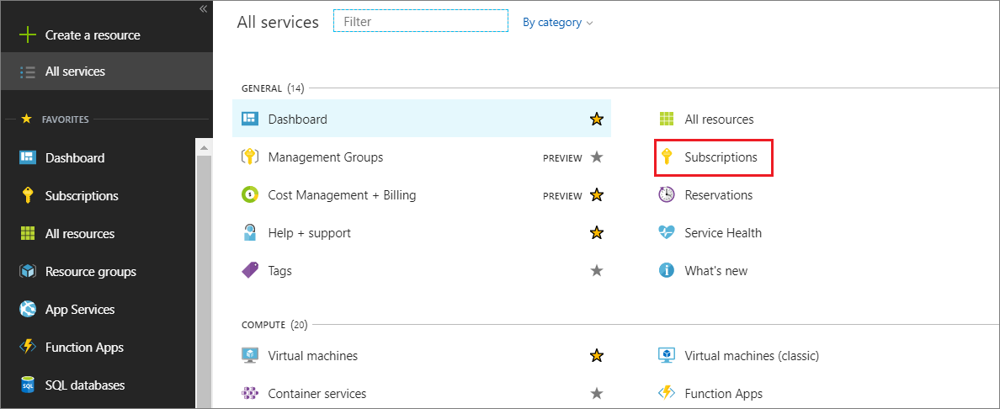

2. Select the subscription in which you want to create the instance of Azure Database Migration Service, and then select **Resource providers**.

    

3. Search for migration, and then to the right of **Microsoft.DataMigration**, select **Register**.

    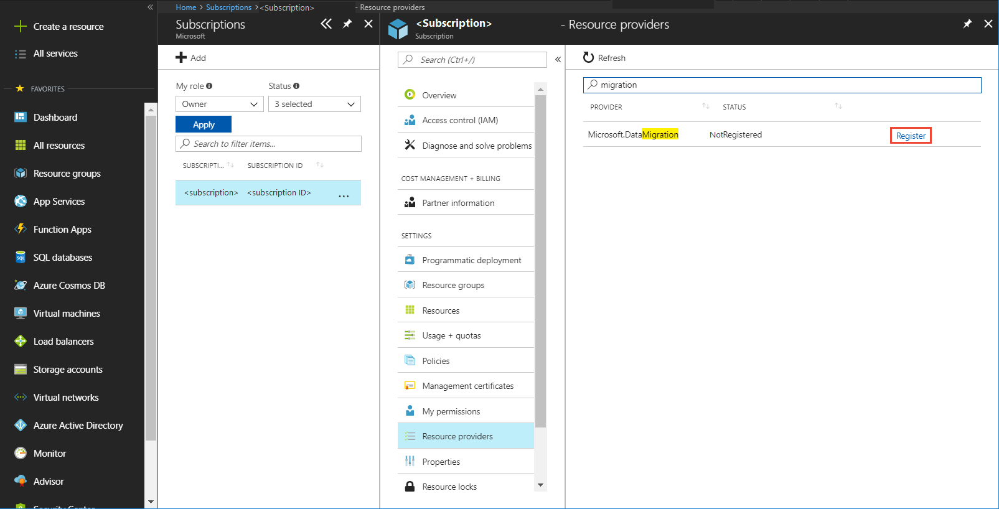

## Create an Azure Database Migration Service instance

1. In the Azure portal, select + **Create a resource**, search for **Azure Database Migration Service**, and then select **Azure Database Migration Service** from the drop-down list.

    

2. On the **Azure Database Migration Service** screen, select **Create**.

    

3. On the **Create Migration Service** screen, specify a name for the service, the subscription, and a new or existing resource group.

4. Select the location in which you want to create the instance of DMS.

5. Select an existing virtual network or create one.

    The virtual network provides Azure Database Migration Service with access to the source SQL Server and target SQL Managed Instance.

    For more information on how to create a virtual network in Azure portal, see the article [Create a virtual network using the Azure portal](https://aka.ms/DMSVnet).

    For additional detail, see the article [Network topologies for Azure SQL Managed Instance migrations using Azure Database Migration Service](https://aka.ms/dmsnetworkformi).

6. Select a pricing tier.

    For more information on costs and pricing tiers, see the [pricing page](https://aka.ms/dms-pricing).

    

7. Select **Create** to create the service.

## Create a migration project

After an instance of the service is created, locate it within the Azure portal, open it, and then create a new migration project.

1. In the Azure portal, select **All services**, search for Azure Database Migration Service, and then select **Azure Database Migration Services**.

    

2. On the **Azure Database Migration Service** screen, search for the name of the instance that you created, and then select the instance.

3. Select + **New Migration Project**.

4. On the **New migration project** screen, specify a name for the project, in the **Source server type** text box, select **SQL Server**, in the **Target server type** text box, select **Azure SQL Managed Instance**, and then for **Choose type of activity**, select **Offline data migration**.

   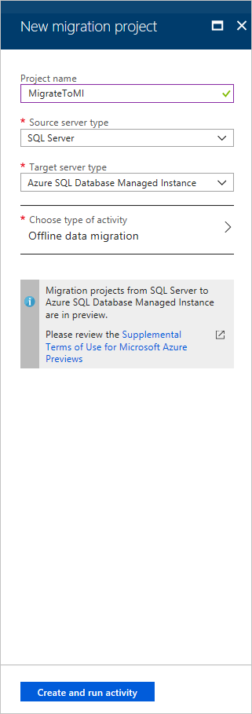

5. Select **Create** to create the project.

## Specify source details

1. On the **Migration source detail** screen, specify the connection details for the source SQL Server.

2. If you haven't installed a trusted certificate on your server, select the **Trust server certificate** check box.

    When a trusted certificate isn't installed, SQL Server generates a self-signed certificate when the instance is started. This certificate is used to encrypt the credentials for client connections.

    > [!CAUTION]
    > TLS connections that are encrypted using a self-signed certificate does not provide strong security. They are susceptible to man-in-the-middle attacks. You should not rely on TLS using self-signed certificates in a production environment or on servers that are connected to the internet.

   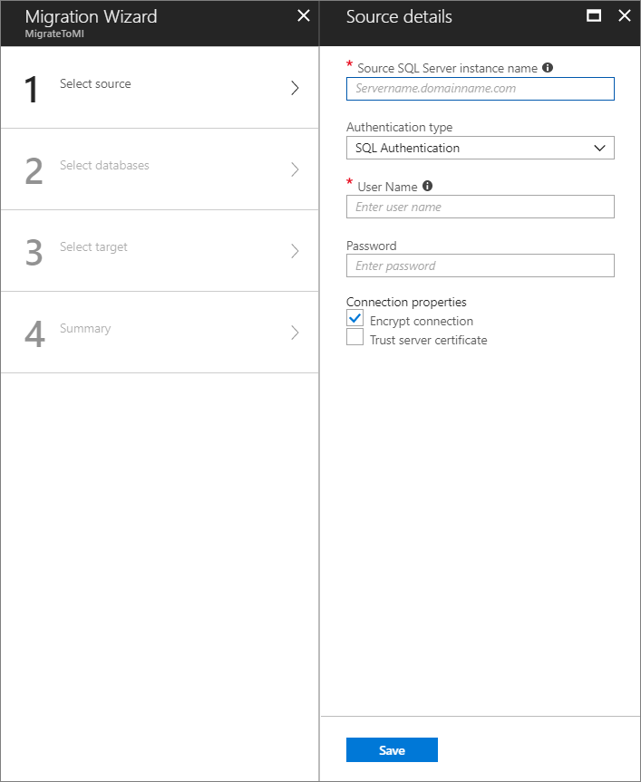

3. Select **Save**.

4. On the **Select source databases** screen, select the **Adventureworks2012** database for migration.

   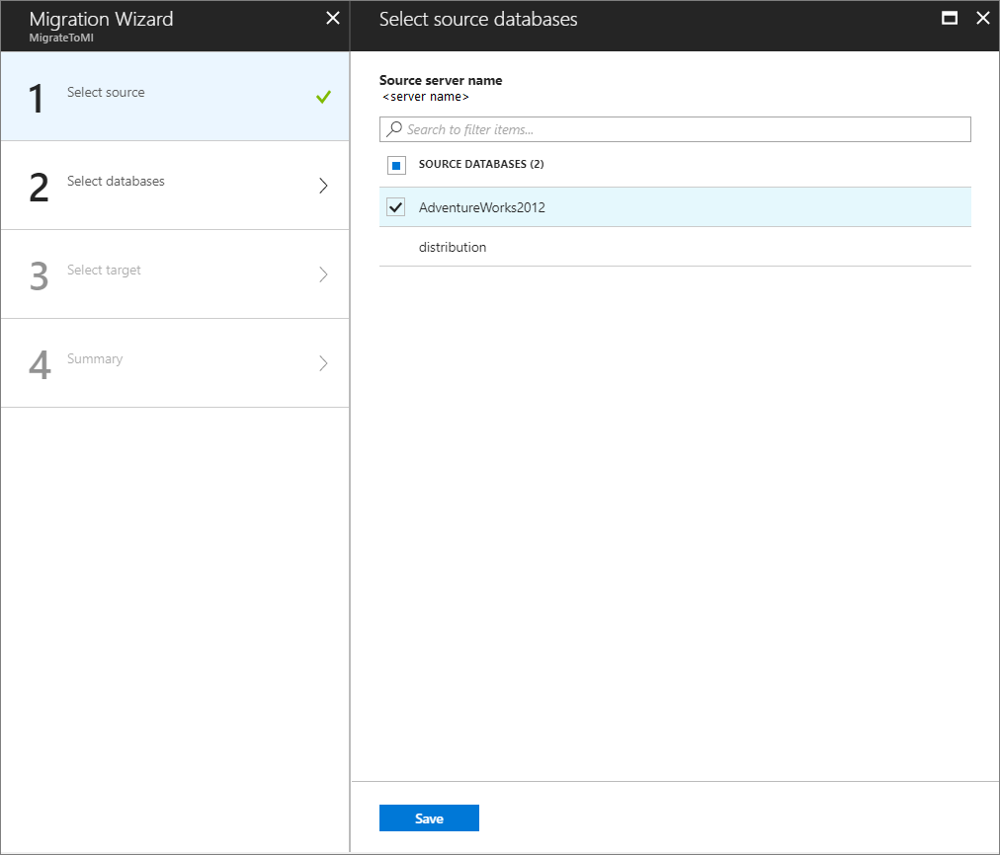

    > [!IMPORTANT]
    > If you use SQL Server Integration Services (SSIS), DMS does not currently support migrating the catalog database for your SSIS projects/packages (SSISDB) from SQL Server to SQL Managed Instance. However, you can provision SSIS in Azure Data Factory (ADF) and redeploy your SSIS projects/packages to the destination SSISDB hosted by SQL Managed Instance. For more information about migrating SSIS packages, see the article [Migrate SQL Server Integration Services packages to Azure](https://docs.microsoft.com/azure/dms/how-to-migrate-ssis-packages).

5. Select **Save**.

## Specify target details

1. On the **Migration target details** screen, specify the connection details for the target, which is the pre-provisioned SQL Managed Instance to which you're migrating the **AdventureWorks2012** database.

    If you haven't already provisioned the SQL Managed Instance, select the [link](https://docs.microsoft.com/azure/sql-database/sql-database-managed-instance-get-started) to help you provision the instance. You can still continue with project creation and then, when the SQL Managed Instance is ready, return to this specific project to execute the migration.

    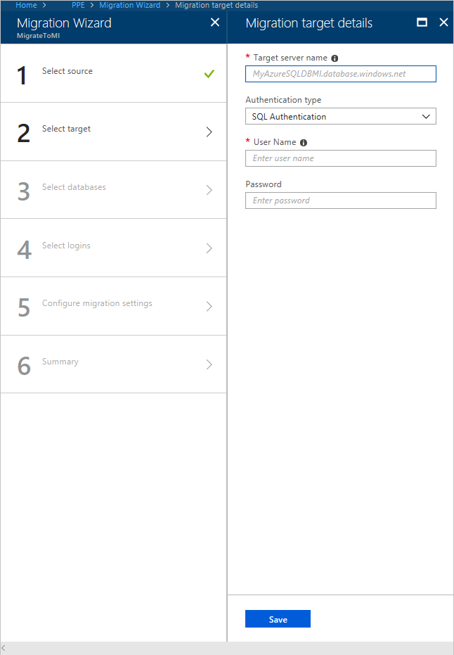

2. Select **Save**.

## Select source databases

1. On the **Select source databases** screen, select the source database that you want to migrate.

    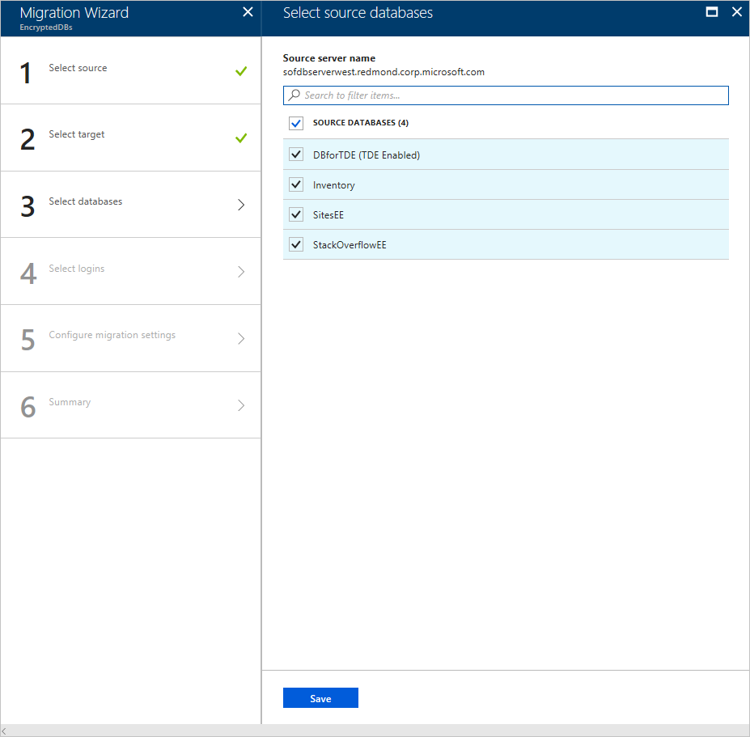

2. Select **Save**.

## Select logins

1. On the **Select logins** screen, select the logins that you want to migrate.

    >[!NOTE]
    >By default, Azure Database Migration Service only supports migrating SQL logins. To enable support for migrating Windows logins, see the **Prerequisites** section of this tutorial.

    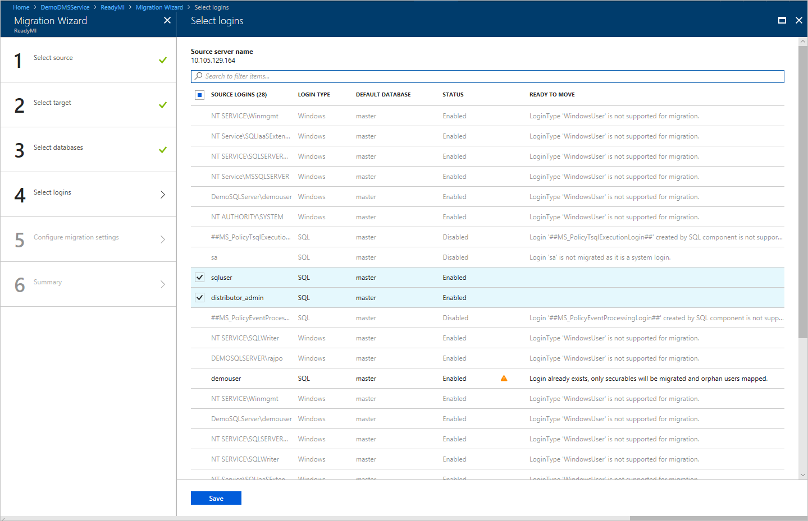

2. Select **Save**.

## Configure migration settings

1. On the **Configure migration settings** screen, provide the following detail:

    | | |
    |--------|---------|
    |**Choose source backup option** | Choose the option **I will provide latest backup files** when you already have full backup files available for DMS to use for database migration. Choose the option **I will let Azure Database Migration Service create backup files** when you want DMS to take the source database full backup at first and use it for migration. |
    |**Network location share** | The local SMB network share that Azure Database Migration Service can take the source database backups to. The service account running source SQL Server instance must have write privileges on this network share. Provide an FQDN or IP addresses of the server in the network share, for example, '\\\servername.domainname.com\backupfolder' or '\\\IP address\backupfolder'.|
    |**User name** | Make sure that the Windows user has full control privilege on the network share that you provided above. Azure Database Migration Service will impersonate the user credential to upload the backup files to Azure Storage container for restore operation. If TDE-enabled databases are selected for migration, the above windows user must be the built-in administrator account and [User Account Control](https://docs.microsoft.com/windows/security/identity-protection/user-account-control/user-account-control-overview) must be disabled for Azure Database Migration Service to upload and delete the certificates files.) |
    |**Password** | Password for the user. |
    |**Storage account settings** | The SAS URI that provides Azure Database Migration Service with access to your storage account container to which the service uploads the backup files and that is used for migrating databases to SQL Managed Instance. [Learn how to get the SAS URI for blob container](https://docs.microsoft.com/azure/vs-azure-tools-storage-explorer-blobs#get-the-sas-for-a-blob-container). This SAS URI must be for the blob container, not for the storage account.|
    |**TDE Settings** | If you're migrating the source databases with Transparent Data Encryption (TDE) enabled, you need to have write privileges on the target SQL Managed Instance.  Select the subscription in which the SQL Managed Instance provisioned from the drop-down menu.  Select the target **Azure SQL Database Managed Instance** in the drop-down menu. |

    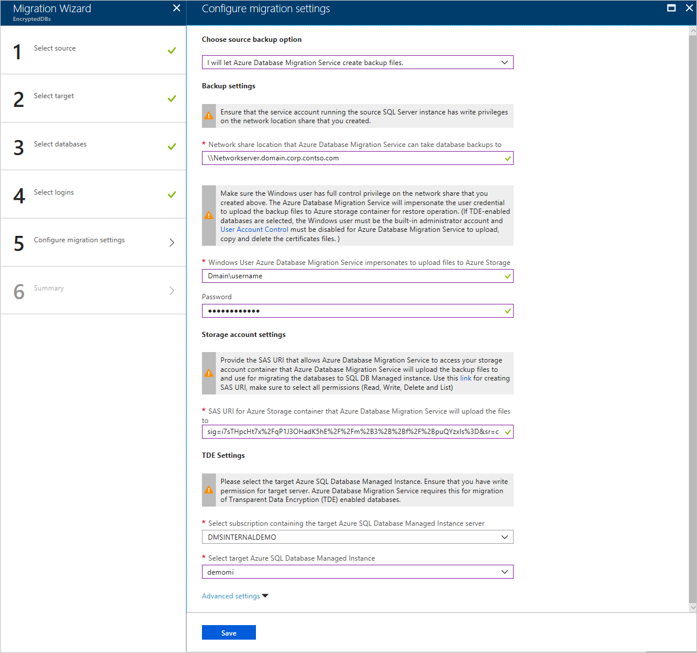

2. Select **Save**.

## Review the migration summary

1. On the **Migration summary** screen, in the **Activity name** text box, specify a name for the migration activity.

2. Expand the **Validation option** section to display the **Choose validation option** screen, specify whether to validate the migrated database for query correctness, and then select **Save**.

3. Review and verify the details associated with the migration project.

    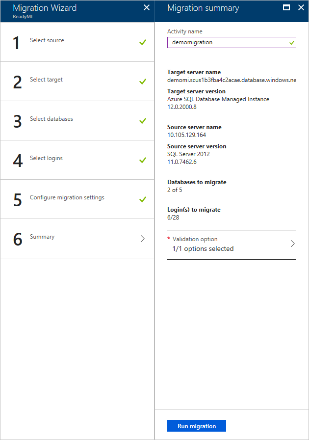

4. Select **Save**.

## Run the migration

- Select **Run migration**.

  The migration activity window appears, and the status of the activity is **Pending**.

## Monitor the migration

1. In the migration activity screen, select **Refresh** to update the display.

   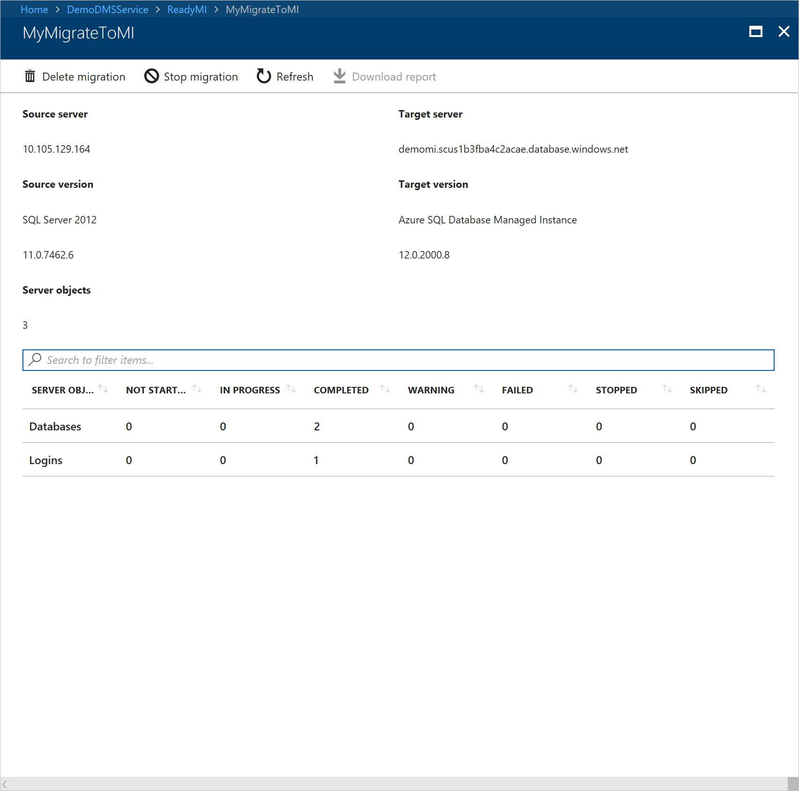

    You can further expand the databases and logins categories to monitor the migration status of the respective server objects.

   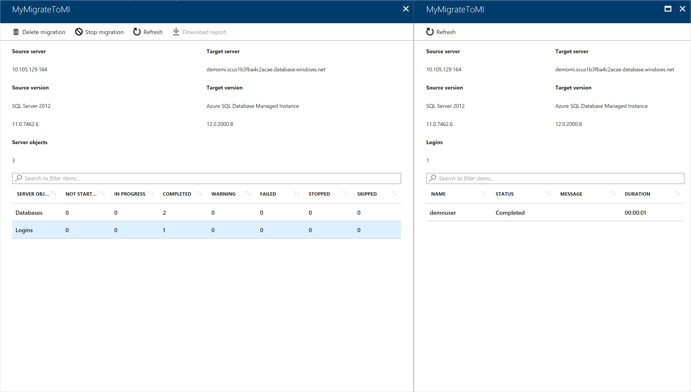

2. After the migration completes, select **Download report** to get a report listing the details associated with the migration process.

3. Verify that the target database on the target SQL Managed Instance environment.

## Next steps

- For a tutorial showing you how to migrate a database to SQL Managed Instance using the T-SQL RESTORE command, see [Restore a backup to SQL Managed Instance using the restore command](../sql-database/sql-database-managed-instance-restore-from-backup-tutorial.md).
- For information about SQL Managed Instance, see [What is SQL Managed Instance](../azure-sql/managed-instance/sql-managed-instance-paas-overview.md).
- For information about connecting apps to SQL Managed Instance, see [Connect applications](../azure-sql/managed-instance/connect-application-instance.md).
