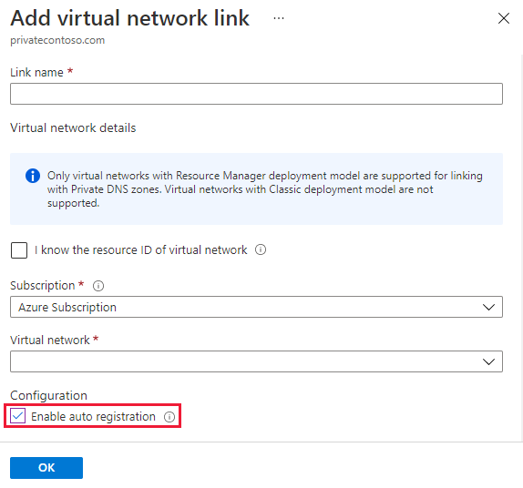

# What is the autoregistration feature of Azure DNS private zones

The Azure DNS private zones auto registration feature takes the pain out of DNS record management for virtual machines deployed in a virtual network. When you [link a virtual network](./private-dns-virtual-network-links.md) with a private DNS zone and enable auto registration for all the virtual machines, the DNS records for the virtual machines deployed in the virtual network are automatically created in the private DNS zone. In addition to forward look records (A records), reverse lookup records (PTR records) are also automatically created for the virtual machines.
If you add more virtual machines to the virtual network, DNS records for these virtual machines are also automatically created in the linked private DNS zone.

When you delete a virtual machine, the DNS records for the virtual machine are automatically deleted from the private DNS zone.

You can enable autoregistration by selecting "Enable auto registration" option while creating a virtual network link.

## Restrictions

* Autoregistration works only for virtual machines. For all other resources like internal load balancers etc., you can create DNS records manually in the private DNS zone linked to the virtual network.
* DNS records are created automatically only for the primary virtual machine NIC . If your virtual machines have more than one NIC, you can manually create the DNS records for other network interfaces.
* DNS records are created automatically only if the primary virtual machine NIC is using DHCP. If static IP addresses are configured (for example, to use [multiple IP addresses in Azure](../virtual-network/virtual-network-multiple-ip-addresses-portal.md#os-config)), autoregistration doesn't create records for that virtual machine.
* Autoregistration for IPv6 (AAAA records) is not supported.

## Next steps

* Learn how to create a private zone in Azure DNS using [Azure PowerShell](./private-dns-getstarted-powershell.md) or [Azure CLI](./private-dns-getstarted-cli.md).

* Read about some common [private zone scenarios](./private-dns-scenarios.md) that can be realized with private zones in Azure DNS.

* For common questions and answers about private zones in Azure DNS, including specific behavior you can expect for certain kinds of operations, see [Private DNS FAQ](./dns-faq-private.md).
