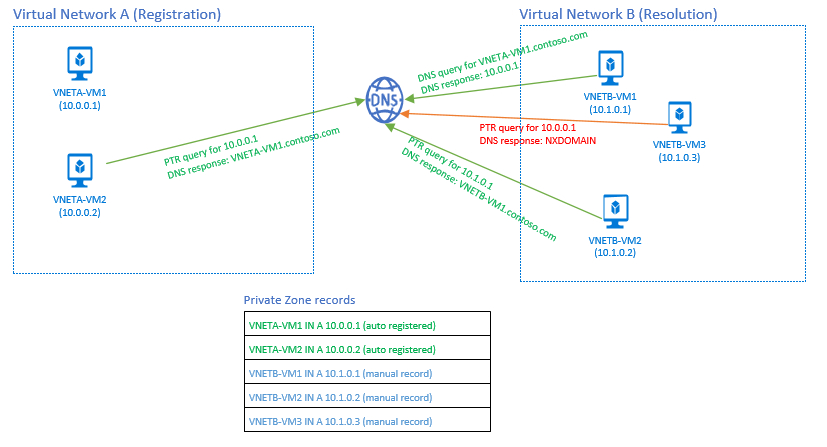
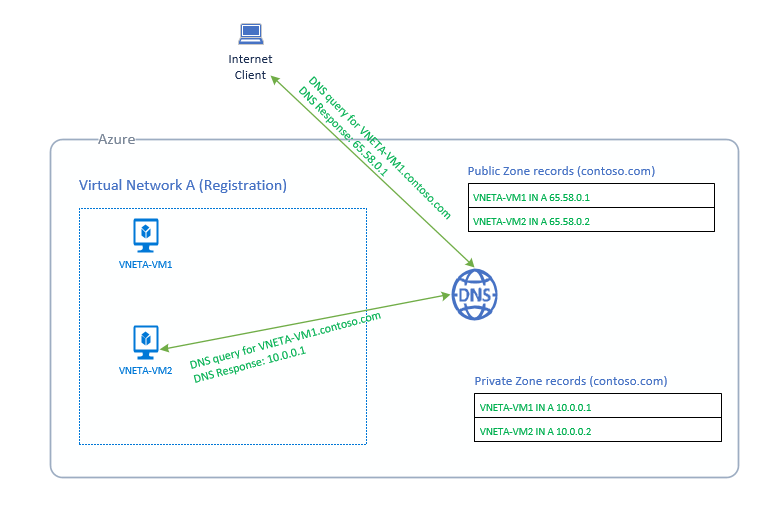

# Azure DNS Private zones scenarios

Azure DNS Private Zones provide name resolution within a virtual network as well as between virtual networks. In this article, we look at some common scenarios that can be realized using this feature.

## Scenario: Name Resolution scoped to a single virtual network
In this scenario, you have a virtual network in Azure that has a number of Azure resources in it, including virtual machines (VMs). You want to resolve the resources from within the virtual network via a specific domain name (DNS zone), and you need the name resolution to be private and not accessible from the internet. Furthermore, for the VMs within the VNET, you need Azure to automatically register them into the DNS zone. 

This scenario is depicted below. Virtual Network named "A" contains two VMs (VNETA-VM1 and VNETA-VM2). Each of these have Private IPs associated. Once you create a Private Zone named contoso.com and link this virtual network as a Registration virtual network, Azure DNS will automatically create two A records in the zone as depicted. Now, DNS queries from VNETA-VM1 to resolve VNETA-VM2.contoso.com will receive a DNS response that contains the Private IP of VNETA-VM2. Furthermore, a Reverse DNS query (PTR) for the Private IP of VNETA-VM1 (10.0.0.1) issued from VNETA-VM2 will receive a DNS response that contains the name of VNETA-VM1, as expected. 

## Scenario: Name Resolution across virtual networks

This scenario is the more common case where you need to associate a Private Zone with multiple virtual networks. This scenario can fit architectures such as the Hub-and-Spoke model where there is a central Hub virtual network to which multiple other Spoke virtual networks are connected. The central Hub virtual network can be linked as the Registration virtual network to a private zone, and the Spoke virtual networks can be linked as Resolution virtual networks. 

The following diagram shows a simple version of this scenario where there are only two virtual networks - A and B. A is designated as a Registration virtual network and B is designated as a Resolution virtual network. The intent is for both virtual networks to share a common zone contoso.com. When the zone is created and the Resolution and Registration virtual networks are linked to the zone, Azure will automatically register DNS records for the VMs (VNETA-VM1 and VNETA-VM2) from the virtual network A. You can also manually add DNS records into the zone for VMs in the Resolution virtual network B. With this setup, you will observe the following behavior for forward and reverse DNS queries:
* A DNS query from VNETB-VM1 in the Resolution virtual network B, for VNETA-VM1.contoso.com, will receive a DNS response containing the Private IP of VNETA-VM1.
* A Reverse DNS (PTR) query from VNETB-VM2 in the Resolution virtual network B, for 10.1.0.1, will receive a DNS response containing the FQDN VNETB-VM1.contoso.com.  
* A Reverse DNS (PTR) query from VNETB-VM3 in the Resolution virtual network B, for 10.0.0.1, will receive NXDOMAIN. The reason is that Reverse DNS queries are only scoped to the same virtual network. 

## Scenario: Split-Horizon functionality

In this scenario, you have a use case where you want to realize different DNS resolution behavior depending on where the client sits (inside of Azure or out on the internet), for the same DNS zone. For example, you may have a private and public version of your application that has different functionality or behavior, but you want to use the same domain name for both versions. This scenario can be realized with Azure DNS by creating a Public DNS zone as well as a Private Zone, with the same name.

The following diagram depicts this scenario. You have a virtual network A that has two VMs (VNETA-VM1 and VNETA-VM2) which have both Private IPs and Public IPs allocated. You create a Public DNS zone called contoso.com and register the Public IPs for these VMs as DNS records within the zone. You also create a Private DNS zone also called contoso.com specifying A as the Registration virtual network. Azure automatically registers the VMs as A records into the Private Zone, pointing to their Private IPs.

Now when an internet client issues a DNS query to look up VNETA-VM1.contoso.com, Azure will return the Public IP record from the public zone. If the same DNS query is issued from another VM (for example: VNETA-VM2) in the same virtual network A, Azure will return the Private IP record from the private zone. 

## Next steps
To learn more about private DNS zones, see [Using Azure DNS for private domains](private-dns-overview.md).

Learn how to [create a private DNS zone](./private-dns-getstarted-powershell.md) in Azure DNS.

Learn about DNS zones and records by visiting: [DNS zones and records overview](dns-zones-records.md).

Learn about some of the other key [networking capabilities](../networking/networking-overview.md) of Azure.

