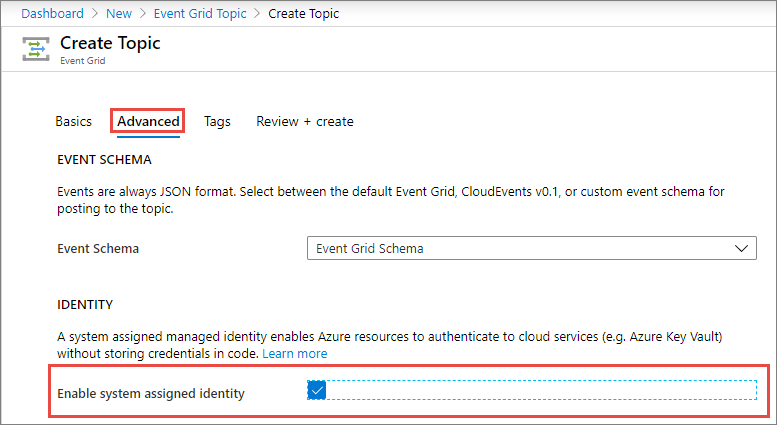

# Assign a system-managed identity to an Event Grid custom topic or domain 
This article shows you how to enable a system-managed identity for an Event Grid custom topic or a domain. To learn about managed identities, see [What are managed identities for Azure resources](../active-directory/managed-identities-azure-resources/overview.md).

## Enable identity at the time of creation

### Using Azure portal
You can enable system-assigned identity for a custom topic or a domain while creating it in the Azure portal. The following image shows how to enable a system-managed identity for a custom topic. Basically, you select the option **Enable system assigned identity** on the **Advanced** page of the topic creation wizard. You'll see this option on the **Advanced** page of the domain creation wizard too. 



### Using Azure CLI
You can also use the Azure CLI to create a custom topic or domain with a system-assigned identity. Use the `az eventgrid topic create` command with the `--identity` parameter set to `systemassigned`. If you don't specify a value for this parameter, the default value `noidentity` is used. 

```azurecli-interactive
# create a custom topic with a system-assigned identity
az eventgrid topic create -g <RESOURCE GROUP NAME> --name <TOPIC NAME> -l <LOCATION>  --identity systemassigned
```

Similarly, you can use the `az eventgrid domain create` command to create a domain with a system-managed identity.

## Enable identity for an existing custom topic or domain
In this section, you learn how to enable a system-managed identity for an existing custom topic or domain. 

### Using Azure portal
The following procedure shows you how to enable system-managed identity for a custom topic. The steps for enabling an identity for a domain are similar. 

1. Go to the [Azure portal](https://portal.azure.com).
2. Search for **event grid topics** in the search bar at the top.
3. Select the **custom topic** for which you want to enable the managed identity. 
4. Switch to the **Identity** tab. 
5. Turn **on** the switch to enable the identity. 
1. Select **Save** on the toolbar to save the setting. 

    :::image type="content" source="./media/managed-service-identity/identity-existing-topic.png" alt-text="Identity page for a custom topic"::: 

You can use similar steps to enable an identity for an event grid domain.

### Use the Azure CLI
Use the `az eventgrid topic update` command with `--identity` set to `systemassigned` to enable system-assigned identity for an existing custom topic. If you want to disable the identity, specify `noidentity` as the value. 

```azurecli-interactive
# Update the topic to assign a system-assigned identity. 
az eventgrid topic update -g $rg --name $topicname --identity systemassigned --sku basic 
```

The command for updating an existing domain is similar (`az eventgrid domain update`).


## Next steps
Add the identity to an appropriate role (for example, Service Bus Data Sender) on the destination (for example, a Service Bus queue). For detailed steps, see [Grant managed identity the access to Event Grid destination](add-identity-roles.md). 
