# Tutorial: Stream big data into a data warehouse
Azure [Event Grid](overview.md) is an intelligent event routing service that enables you to react to notifications (events) from apps and services. For example, it can trigger an Azure Function to process Event Hubs data that has been captured to an Azure Blob storage or Azure Data Lake Storage, and migrate the data to other data repositories. This [Event Hubs and Event Grid integration sample](https://github.com/Azure/azure-event-hubs/tree/master/samples/e2e/EventHubsCaptureEventGridDemo) shows you how to use Event Hubs with Event Grid to seamlessly migrate captured Event Hubs data from blob storage to a SQL Data Warehouse.


This diagram depicts the workflow of the solution you build in this tutorial: 

1. Data sent to an Azure event hub is captured in an Azure blob storage.
2. When the data capture is complete, an event is generated and sent to an Azure event grid. 
3. The event grid forwards this event data to an Azure function app.
4. The function app uses the blob URL in the event data to retrieve the blob from the storage. 
5. The function app migrates the blob data to an Azure SQL data warehouse. 

In this article, you take the following steps:

> [!div class="checklist"]
> * Use an Azure Resource Manager template to deploy the infrastructure: an event hub, a storage account, a function app, a SQL data warehouse.
> * Create a table in the data warehouse.
> * Add code to the function app.
> * Subscribe to the event. 
> * Run app that sends data to the event hub.
> * View migrated data in data warehouse.

## Prerequisites

[!INCLUDE [updated-for-az](../../includes/updated-for-az.md)]

To complete this tutorial, you must have:

* An Azure subscription. If you don't have an Azure subscription, create a [free account](https://azure.microsoft.com/free/) before you begin.
* [Visual studio 2019](https://www.visualstudio.com/vs/) with workloads for: .NET desktop development, Azure development, ASP.NET and web development, Node.js development, and Python development.
* Download the [EventHubsCaptureEventGridDemo sample project](https://github.com/Azure/azure-event-hubs/tree/master/samples/e2e/EventHubsCaptureEventGridDemo) to your computer.

## Deploy the infrastructure
In this step, you deploy the required infrastructure with a [Resource Manager template](https://github.com/Azure/azure-docs-json-samples/blob/master/event-grid/EventHubsDataMigration.json). When you deploy the template, the following resources are created:

* Event hub with the Capture feature enabled.
* Storage account for the captured files. 
* App service plan for hosting the function app
* Function app for processing the event
* SQL Server for hosting the data warehouse
* SQL Data Warehouse for storing the migrated data

### Launch Azure Cloud Shell in Azure portal

1. Sign in to the [Azure portal](https://portal.azure.com). 
2. Select **Cloud Shell** button at the top.

    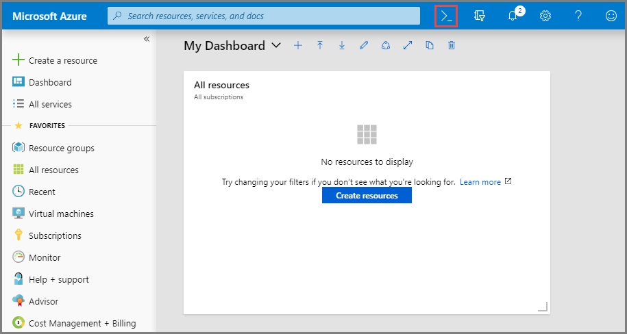
3. You see the Cloud Shell opened at the bottom of the browser.

    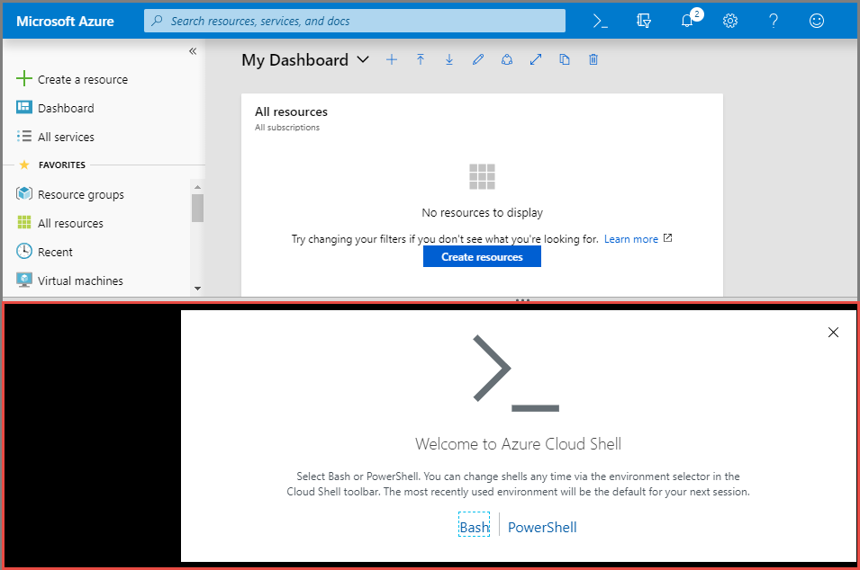 
4. In the Cloud Shell, if you see an option to select between **Bash** and **PowerShell**, select **Bash**. 
5. If you are using the Cloud Shell for the first time, create a storage account by selecting **Create storage**. Azure Cloud Shell requires an Azure storage account to store some files. 

    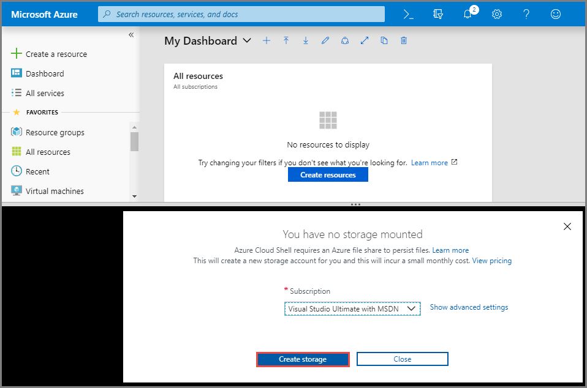
6. Wait until the Cloud Shell is initialized. 

    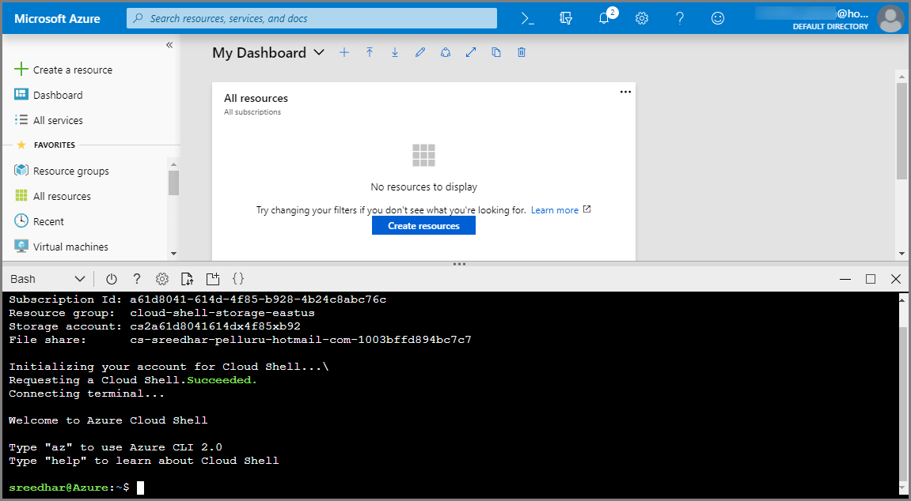


### Use Azure CLI

1. Create an Azure resource group by running the following CLI command: 
    1. Copy and paste the following command into the Cloud Shell window

        ```azurecli
        az group create -l eastus -n <Name for the resource group>
        ```
    1. Specify a name for the **resource group**
    2. Press **ENTER**. 

        Here is an example:
    
        ```azurecli
        user@Azure:~$ az group create -l eastus -n ehubegridgrp
        {
          "id": "/subscriptions/00000000-0000-0000-0000-0000000000000/resourceGroups/ehubegridgrp",
          "location": "eastus",
          "managedBy": null,
          "name": "ehubegridgrp",
          "properties": {
            "provisioningState": "Succeeded"
          },
          "tags": null
        }
        ```
2. Deploy all the resources mentioned in the previous section (event hub, storage account, functions app, SQL data warehouse) by running the following CLI command: 
    1. Copy and paste the command into the Cloud Shell window. Alternatively, you may want to copy/paste into an editor of your choice, set values, and then copy the command to the Cloud Shell. 

        ```azurecli
        az group deployment create \
            --resource-group rgDataMigrationSample \
            --template-uri https://raw.githubusercontent.com/Azure/azure-docs-json-samples/master/event-grid/EventHubsDataMigration.json \
            --parameters eventHubNamespaceName=<event-hub-namespace> eventHubName=hubdatamigration sqlServerName=<sql-server-name> sqlServerUserName=<user-name> sqlServerPassword=<password> sqlServerDatabaseName=<database-name> storageName=<unique-storage-name> functionAppName=<app-name>
        ```
    2. Specify values for the following entities:
        1. Name of the resource group you created earlier.
        2. Name for the event hub namespace. 
        3. Name for the event hub. You can leave the value as it is (hubdatamigration).
        4. Name for the SQL server.
        5. Name of the SQL user and password. 
        6. Name for the SQL data warehouse
        7. Name of the storage account. 
        8. Name for the function app. 
    3.  Press **ENTER** in the Cloud Shell window to run the command. This process may take a while since you are creating a bunch of resources. In the result of the command, ensure that there have been no failures. 
    

### Use Azure PowerShell

1. In Azure Cloud Shell, switch to PowerShell mode. Select down arrow in the top-left corner of Azure Cloud Shell, and select **PowerShell**.

    
2. Create an Azure resource group by running the following command: 
    1. Copy and paste the following command into the Cloud Shell window.

        ```powershell
        New-AzResourceGroup -Name rgDataMigration -Location westcentralus
        ```
    2. Specify a name for the **resource group**.
    3. Press ENTER. 
3. Deploy all the resources mentioned in the previous section (event hub, storage account, functions app, SQL data warehouse) by running the following command:
    1. Copy and paste the command into the Cloud Shell window. Alternatively, you may want to copy/paste into an editor of your choice, set values, and then copy the command to the Cloud Shell. 

        ```powershell
        New-AzResourceGroupDeployment -ResourceGroupName rgDataMigration -TemplateUri https://raw.githubusercontent.com/Azure/azure-docs-json-samples/master/event-grid/EventHubsDataMigration.json -eventHubNamespaceName <event-hub-namespace> -eventHubName hubdatamigration -sqlServerName <sql-server-name> -sqlServerUserName <user-name> -sqlServerDatabaseName <database-name> -storageName <unique-storage-name> -functionAppName <app-name>
        ```
    2. Specify values for the following entities:
        1. Name of the resource group you created earlier.
        2. Name for the event hub namespace. 
        3. Name for the event hub. You can leave the value as it is (hubdatamigration).
        4. Name for the SQL server.
        5. Name of the SQL user and password. 
        6. Name for the SQL data warehouse
        7. Name of the storage account. 
        8. Name for the function app. 
    3.  Press **ENTER** in the Cloud Shell window to run the command. This process may take a while since you are creating a bunch of resources. In the result of the command, ensure that there have been no failures. 

### Close the Cloud Shell 
Close the cloud shell by selecting the **Cloud Shell** button in the portal (or) **X** button in the top-right corner of the Cloud Shell window. 

### Verify that the resources are created

1. In the Azure portal, select **Resource groups** on the left menu. 
2. Filter the list of resource groups by entering the name of your resource group in the search box. 
3. Select your resource group in the list.

    
4. Confirm that you see the following resources in the resource group:

    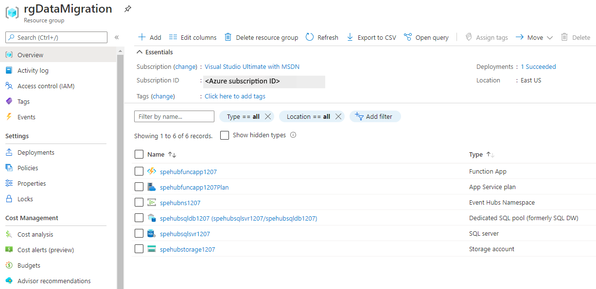

### Create a table in SQL Data Warehouse
Create a table in your data warehouse by running the [CreateDataWarehouseTable.sql](https://github.com/Azure/azure-event-hubs/blob/master/samples/e2e/EventHubsCaptureEventGridDemo/scripts/CreateDataWarehouseTable.sql) script. To run the script, you can use Visual Studio or the Query Editor in the portal. The following steps show you how to use the Query Editor: 

1. In the list of resources in the resource group, select your SQL data warehouse. 
2. In the SQL data warehouse page, select **Query editor (preview)** in the left menu. 

    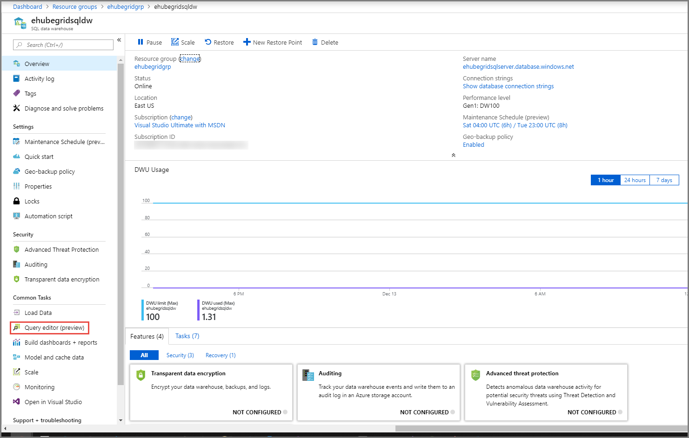
2. Enter the name of **user** and **password** for the SQL server, and select **OK**. 

    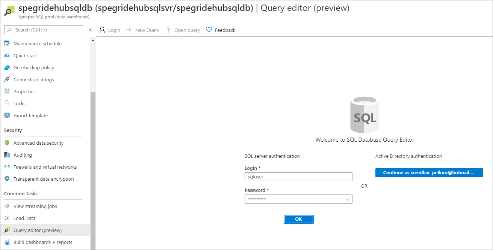
4. In the query window, copy and run the following SQL script: 

    ```sql
    CREATE TABLE [dbo].[Fact_WindTurbineMetrics] (
        [DeviceId] nvarchar(50) COLLATE SQL_Latin1_General_CP1_CI_AS NULL, 
        [MeasureTime] datetime NULL, 
        [GeneratedPower] float NULL, 
        [WindSpeed] float NULL, 
        [TurbineSpeed] float NULL
    )
    WITH (CLUSTERED COLUMNSTORE INDEX, DISTRIBUTION = ROUND_ROBIN);
    ```

    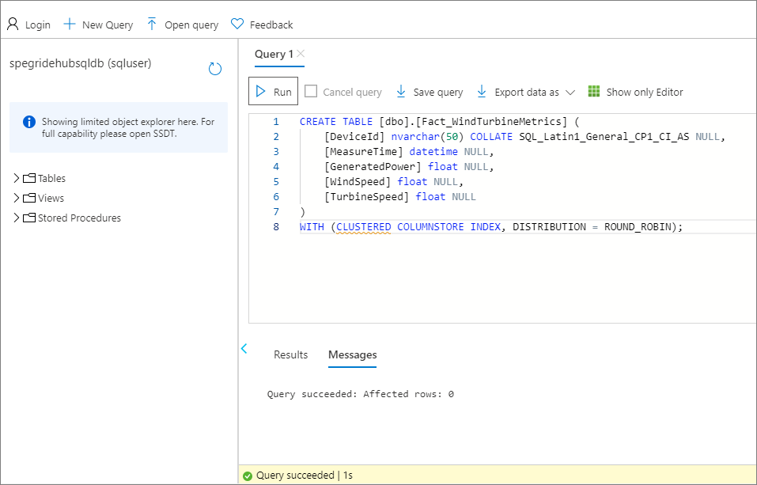
5. Keep this tab or window open so that you can verify that the data is created at the end of the tutorial. 


## Publish the Azure Functions app

1. Launch Visual Studio.
2. Open the **EventHubsCaptureEventGridDemo.sln** solution that you downloaded from the [GitHub](https://github.com/Azure/azure-event-hubs/tree/master/samples/e2e/EventHubsCaptureEventGridDemo) as part of the prerequisites.
3. In Solution Explorer, right-click **FunctionEGDWDumper**, and select **Publish**.

   
4. If you see the following screen, select **Start**. 

   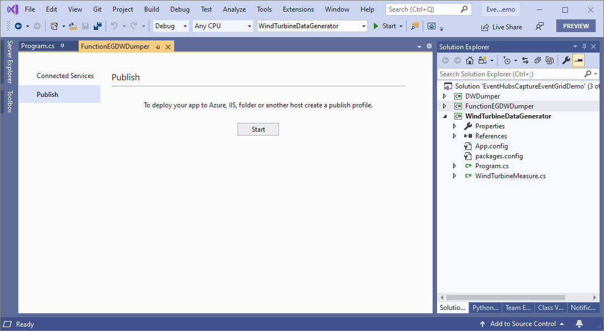 
5. In the **Pick a publish target** page, select the **Select existing** option, and select **Create Profile**. 

   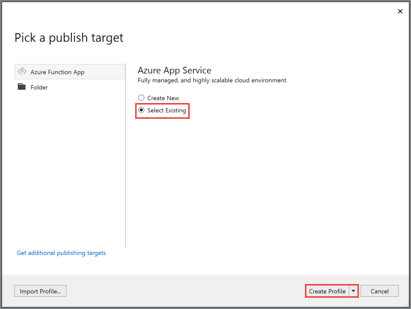
6. In the App Service page, select your **Azure subscription**, select the **function app** in your resource group, and select **OK**. 

   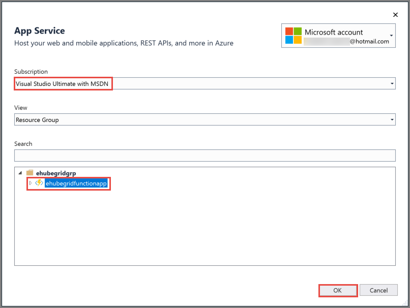 
1. When Visual Studio has configured the profile, select **Publish**.

   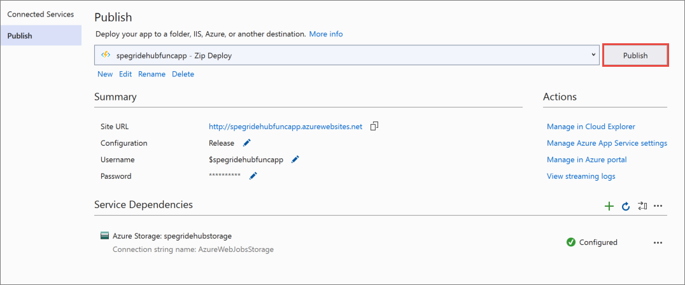

After publishing the function, you're ready to subscribe to the event.

## Subscribe to the event

1. In a new tab or new window of a web browser, navigate to the [Azure portal](https://portal.azure.com).
2. In the Azure portal, select **Resource groups** on the left menu. 
3. Filter the list of resource groups by entering the name of your resource group in the search box. 
4. Select your resource group in the list.

    
4. Select the App Service plan in the list. 
5. In the App Service Plan page, select **Apps** in the left menu, and select the function app. 

    
6. Expand the function app, expand functions, and then select your function. 

    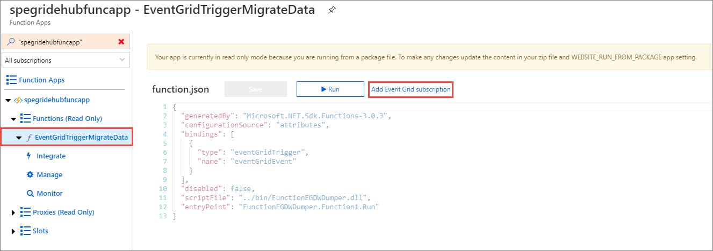
7. Select **Add Event Grid subscription** on the toolbar. 
8. In the **Create Event Grid Subscription** page, do the following actions: 
    1. In the **TOPIC DETAILS** section, do the following actions:
        1. Select your Azure subscription.
        2. Select the Azure resource group.
        3. Select the Event Hubs namespace.
    2. In the **EVENT SUBSCRIPTION DETAILS** page, enter a name for the subscription (for example: captureEventSub), and select **Create**. 

        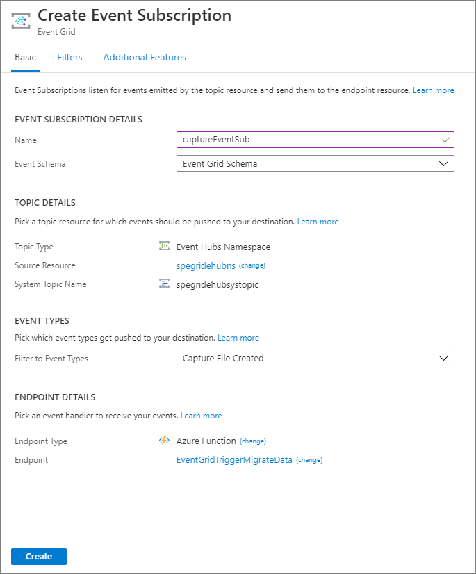

## Run the app to generate data
You've finished setting up your event hub, SQL data warehouse, Azure function app, and event subscription. Before running an application that generates data for event hub, you need to configure a few values.

1. In the Azure portal, navigate to your resource group as you did earlier. 
2. Select the Event Hubs namespace.
3. In the **Event Hubs Namespace** page, select **Shared access policies** on the left menu.
4. Select **RootManageSharedAccessKey** in the list of policies. 
5. Select the copy button next to the **Connection string-primary key** text box. 

    
1. Go back to your Visual Studio solution. 
2. In the WindTurbineDataGenerator project, open **program.cs**.
5. Replace the two constant values. Use the copied value for **EventHubConnectionString**. Use **hubdatamigration** the event hub name. If you used a different name for the event hub, specify that name. 

   ```cs
   private const string EventHubConnectionString = "Endpoint=sb://demomigrationnamespace.servicebus.windows.net/...";
   private const string EventHubName = "hubdatamigration";
   ```

6. Build the solution. Run the **WindTurbineGenerator.exe** application. 
7. After a couple of minutes, query the table in your data warehouse for the migrated data.

    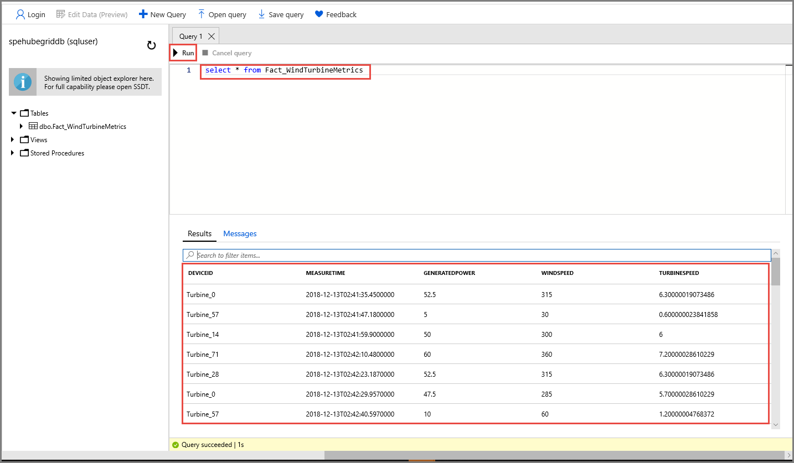

### Event data generated by the event hub
Event Grid distributes event data to the subscribers. The following example shows event data generated when data streaming through an event hub is captured in a blob. In particular, notice the `fileUrl` property in the `data` object points to the blob in the storage. The function app uses this URL to retrieve the blob file with captured data.

```json
[
    {
        "topic": "/subscriptions/<guid>/resourcegroups/rgDataMigrationSample/providers/Microsoft.EventHub/namespaces/tfdatamigratens",
        "subject": "eventhubs/hubdatamigration",
        "eventType": "Microsoft.EventHub.CaptureFileCreated",
        "eventTime": "2017-08-31T19:12:46.0498024Z",
        "id": "14e87d03-6fbf-4bb2-9a21-92bd1281f247",
        "data": {
            "fileUrl": "https://tf0831datamigrate.blob.core.windows.net/windturbinecapture/tfdatamigratens/hubdatamigration/1/2017/08/31/19/11/45.avro",
            "fileType": "AzureBlockBlob",
            "partitionId": "1",
            "sizeInBytes": 249168,
            "eventCount": 1500,
            "firstSequenceNumber": 2400,
            "lastSequenceNumber": 3899,
            "firstEnqueueTime": "2017-08-31T19:12:14.674Z",
            "lastEnqueueTime": "2017-08-31T19:12:44.309Z"
        }
    }
]
```


## Next steps

* To learn about differences in the Azure messaging services, see [Choose between Azure services that deliver messages](compare-messaging-services.md).
* For an introduction to Event Grid, see [About Event Grid](overview.md).
* For an introduction to Event Hubs Capture, see [Enable Event Hubs Capture using the Azure portal](../event-hubs/event-hubs-capture-enable-through-portal.md).
* For more information about setting up and running the sample, see [Event Hubs Capture and Event Grid sample](https://github.com/Azure/azure-event-hubs/tree/master/samples/e2e/EventHubsCaptureEventGridDemo).
