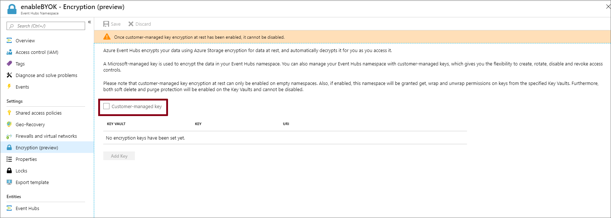
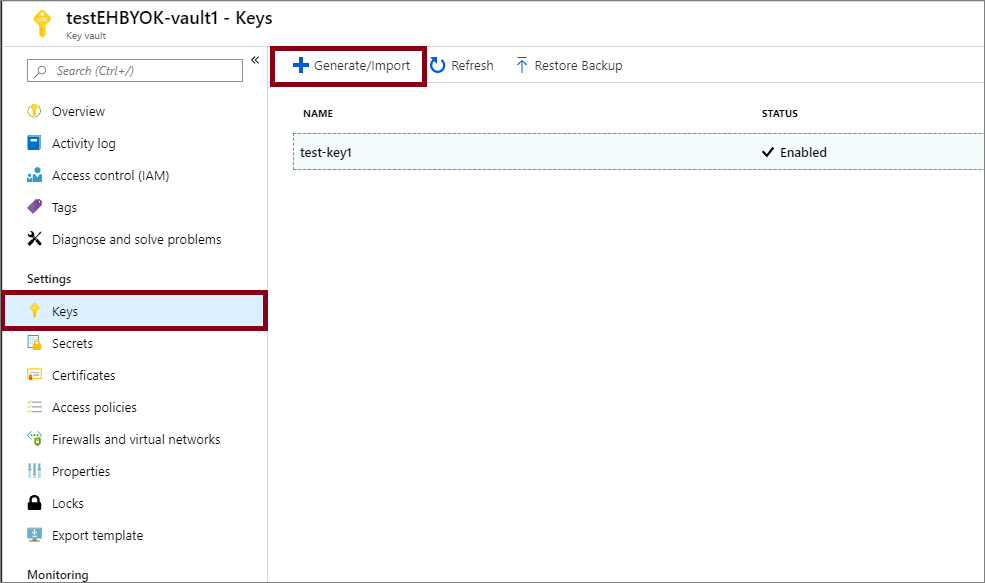
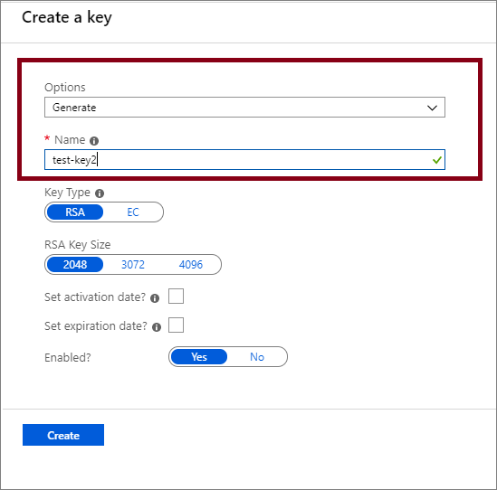
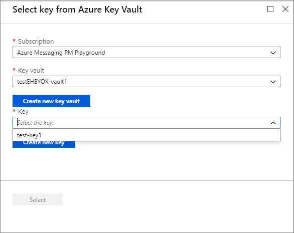
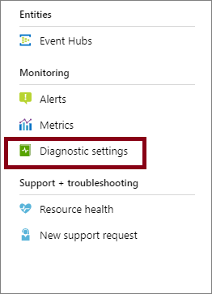
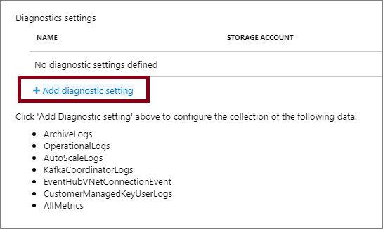
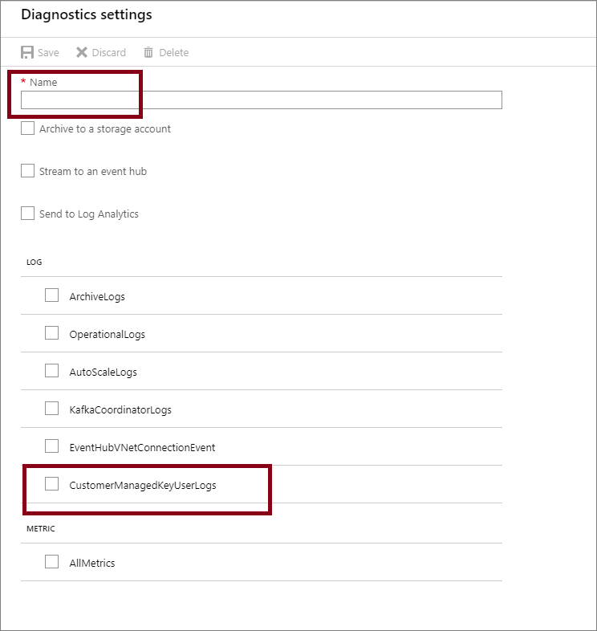

# Configure customer-managed keys for encrypting Azure Event Hubs data at rest by using the Azure portal (Preview)
Azure Event Hubs provides encryption of data at rest with Azure Storage Service Encryption (Azure SSE). Event Hubs relies on Azure Storage to store the data and by default, all the data that is stored with Azure Storage is encrypted using Microsoft-managed keys. 

>[!NOTE]
> This feature is currently in preview. We recommend that you don't use in in a production environment.

## Overview
Azure Event Hubs now supports the option of encrypting data at rest with either Microsoft-managed keys or customer-managed keys (Bring Your Own Key – BYOK). This feature enables you to create, rotate, disable, and revoke access to the customer-managed keys that are used for encrypting Azure Event Hubs data at rest.

Enabling the BYOK feature is a one time setup process on your namespace.

> [!NOTE]
> The BYOK capability is supported by [Event Hubs dedicated single-tenant](event-hubs-dedicated-overview.md) clusters. It can't be enabled for standard Event Hubs namespaces.

You can use Azure Key Vault to manage your keys and audit your key usage. You can either create your own keys and store them in a key vault, or you can use the Azure Key Vault APIs to generate keys. For more information about Azure Key Vault, see [What is Azure Key Vault?](../key-vault/key-vault-overview.md)

This article shows how to configure a key vault with customer-managed keys by using the Azure portal. To learn how to create a key vault using the Azure portal, see [Quickstart: Set and retrieve a secret from Azure Key Vault using the Azure portal](../key-vault/quick-create-portal.md).

> [!IMPORTANT]
> Using customer-managed keys with Azure Event Hubs requires that the key vault have two required properties configured. They are:  **Soft Delete** and **Do Not Purge**. These properties are enabled by default when you create a new key vault in the Azure portal. However, if you need to enable these properties on an existing key vault, you must use either PowerShell or Azure CLI.

## Enable customer-managed keys
To enable customer-managed keys in the Azure portal, follow these steps:

1. Navigate to your Event Hubs Dedicated cluster.
1. Select the namespace on which you want to enable BYOK.
1. On the **Settings** page of your Event Hubs namespace, select **Encryption (preview)**. 
1. Select the **Customer-managed key encryption at rest** as shown in the following image. 

    

## Set up a key vault with keys
After you enable customer-managed keys, you need to associate the customer managed key with your Azure Event Hubs namespace. Event Hubs supports only Azure Key Vault. If you enable the **Encryption with customer-managed key** option in the previous section, you need to have the key imported into Azure Key Vault. Also, the keys must have **Soft Delete** and **Do Not Purge** configured for the key. These settings can be configured using [PowerShell](../key-vault/key-vault-soft-delete-powershell.md) or [CLI](../key-vault/key-vault-soft-delete-cli.md#enabling-purge-protection).

1. To create a new key vault, follow the Azure Key Vault [Quickstart](../key-vault/key-vault-overview.md). For more information about importing existing keys, see [About keys, secrets, and certificates](../key-vault/about-keys-secrets-and-certificates.md).
1. To turn on both soft delete and purge protection when creating a vault, use the [az keyvault create](/cli/azure/keyvault?view=azure-cli-latest#az-keyvault-create) command.

    ```azurecli-interactive
    az keyvault create --name ContosoVault --resource-group ContosoRG --location westus --enable-soft-delete true --enable-purge-protection true
    ```    
1. To add purge protection to an existing vault (that already has soft delete enabled), use the [az keyvault update](/cli/azure/keyvault?view=azure-cli-latest#az-keyvault-update) command.

    ```azurecli-interactive
    az keyvault update --name ContosoVault --resource-group ContosoRG --enable-purge-protection true
    ```
1. Create keys by following these steps:
    1. To create a new key, select **Generate/Import** from the **Keys** menu under **Settings**.
        
        
    1. Set **Options** to **Generate** and give the key a name.

         
    1. You can now select this key to associate with the Event Hubs namespace for encrypting from the drop-down list. 

        
    1. Fill in the details for the key and click **Select**. This will enable the encryption of data at rest on the namespace with a customer managed key. 

        > [!NOTE]
        > For preview, you can only select a single key. 

## Rotate your encryption keys
You can rotate your key in the key vault by using the Azure Key Vaults rotation mechanism. For more information, see [Set up key rotation and auditing](../key-vault/key-vault-key-rotation-log-monitoring.md). Activation and expiration dates can also be set to automate key rotation. The Event Hubs service will detect new key versions and start using them automatically.

## Revoke access to keys
Revoking access to the encryption keys won't purge the data from Event Hubs. However, the data can't be accessed from the Event Hubs namespace. You can revoke the encryption key through access policy or by deleting the key. Learn more about access policies and securing your key vault from [Secure access to a key vault](../key-vault/key-vault-secure-your-key-vault.md).

Once the encryption key is revoked, the Event Hubs service on the encrypted namespace will become inoperable. If the access to the key is enabled or the delete key is restored, Event Hubs service will pick the key so you can access the data from the encrypted Event Hubs namespace.

> [!NOTE]
> If you delete an existing encryption key from your key vault and replace it with a new key on the Event Hubs namespace, since the delete key is still valid (as it is cached) for up to an hour, your old data (which was encrypted with the old key) may still be accessible along with the new data, which is now accessible only using the new key. This behavior is by design in the preview version of the feature. 

## Set up diagnostic logs 
Setting diagnostic logs for BYOK enabled namespaces gives you the required information about the operations when a namespace is encrypted with customer-managed keys. These logs can be enabled and later stream to an event hub or analyzed through log analytics or streamed to storage to perform customized analytics. To learn more about diagnostic logs, see [Overview of Azure Diagnostic logs](../azure-monitor/platform/resource-logs-overview.md).

## Enable user logs
Follow these steps to enable logs for customer-managed keys.

1. In the Azure portal, navigate to the namespace that has BYOK enabled.
1. Select **Diagnostic settings** under **Monitoring**.

    
1. Select **+Add diagnostic setting**. 

    
1. Provide a **name** and select where you want to stream the logs to.
1. Select **CustomerManagedKeyUserLogs** and **Save**. This action enables the logs for BYOK on the namespace.

    

## Log schema 
All logs are stored in JavaScript Object Notation (JSON) format. Each entry has string fields that use the format described in the following table. 

| Name | Description |
| ---- | ----------- | 
| TaskName | Description of the task that failed. |
| ActivityId | Internal ID that's used for tracking. |
| category | Defines the classification of the task. For example, if the key from your key vault is being disabled, then it would be an information category or if a key can't be unwrapped, it could fall under error. |
| resourceId | Azure Resource Manager resource ID |
| keyVault | Full name of key vault. |
| key | The key name that's used to encrypt the Event Hubs namespace. |
| version | The version of the key being used. |
| operation | The operation that's performed on the key in your key vault. For example, disable/enable the key, wrap, or unwrap |
| code | The code that's associated with the operation. Example: Error code, 404 means that key wasn't found. |
| message | Any error message associated with the operation |

Here's an example of the  log for a customer managed key:

```json
{
   "TaskName": "CustomerManagedKeyUserLog",
   "ActivityId": "11111111-1111-1111-1111-111111111111",
   "category": "error"
   "resourceId": "/SUBSCRIPTIONS/11111111-1111-1111-1111-11111111111/RESOURCEGROUPS/DEFAULT-EVENTHUB-CENTRALUS/PROVIDERS/MICROSOFT.EVENTHUB/NAMESPACES/FBETTATI-OPERA-EVENTHUB",
   "keyVault": "https://mykeyvault.vault-int.azure-int.net",
   "key": "mykey",
   "version": "1111111111111111111111111111111",
   "operation": "wrapKey",
   "code": "404",
   "message": "Key not found: ehbyok0/111111111111111111111111111111",
}


{
   "TaskName": "CustomerManagedKeyUserLog",
   "ActivityId": "11111111111111-1111-1111-1111111111111",
   "category": "info"
   "resourceId": "/SUBSCRIPTIONS/111111111-1111-1111-1111-11111111111/RESOURCEGROUPS/DEFAULT-EVENTHUB-CENTRALUS/PROVIDERS/MICROSOFT.EVENTHUB/NAMESPACES/FBETTATI-OPERA-EVENTHUB",
   "keyVault": "https://mykeyvault.vault-int.azure-int.net",
   "key": "mykey",
   "version": "111111111111111111111111111111",
   "operation": "disable" | "restore",
   "code": "",
   "message": "",
}
```

## Troubleshoot
As a best practice, always enable logs like shown in the previous section. It helps in tracking the activities when BYOK encryption is enabled. It also helps in scoping down the problems.

Following are the common errors codes to look for when BYOK encryption is enabled.

| Action | Error code |	Resulting state of data |
| ------ | ---------- | ----------------------- | 
| Remove wrap/unwrap permission from a key vault | 403 |	Inaccessible |
| Remove AAD role membership from an AAD principal that granted the wrap/unwrap permission | 403 |	Inaccessible |
| Delete an encryption key from the key vault | 404 | Inaccessible |
| Delete the key vault | 404 | Inaccessible (assumes soft-delete is enabled, which is a required setting.) |
| Changing the expiration period on the encryption key such that it's already expired | 403 |	Inaccessible  |
| Changing the NBF (not before) such that key encryption key isn't active | 403 | Inaccessible  |
| Selecting the **Allow MSFT Services** option for the key vault firewall or otherwise blocking network access to the key vault that has the encryption key | 403 | Inaccessible |
| Moving the key vault to a different tenant | 404 | Inaccessible |  
| Intermittent network issue or DNS/AAD/MSI outage |  | Accessible using cached data encryption key |

> [!IMPORTANT]
> To enable Geo-DR on a namespace that's using the BYOK encryption, the secondary namespace for pairing must be in a dedicated cluster and must have a system assigned managed identity enabled on it. To learn more, see [Managed Identities for Azure Resources](../active-directory/managed-identities-azure-resources/overview.md).

> [!NOTE]
> If virtual network (VNet) service endpoints are configured on Azure Key Vault for your Event Hubs namespace, BYOK will not be supported. 


## Next steps
See the following articles:
- [Event Hubs overview](event-hubs-about.md)
- [Key Vault overview](../key-vault/key-vault-overview.md)


