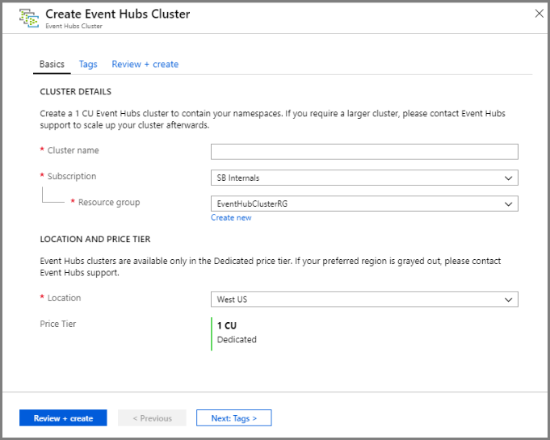
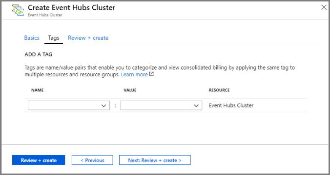
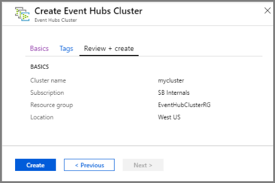
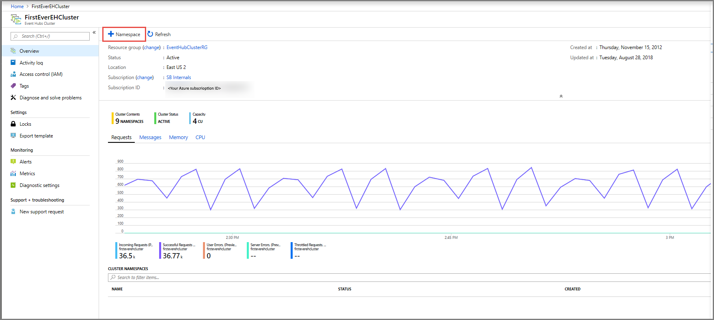
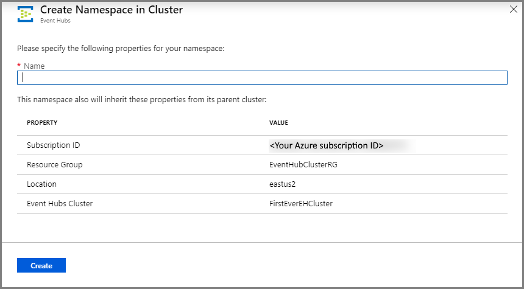
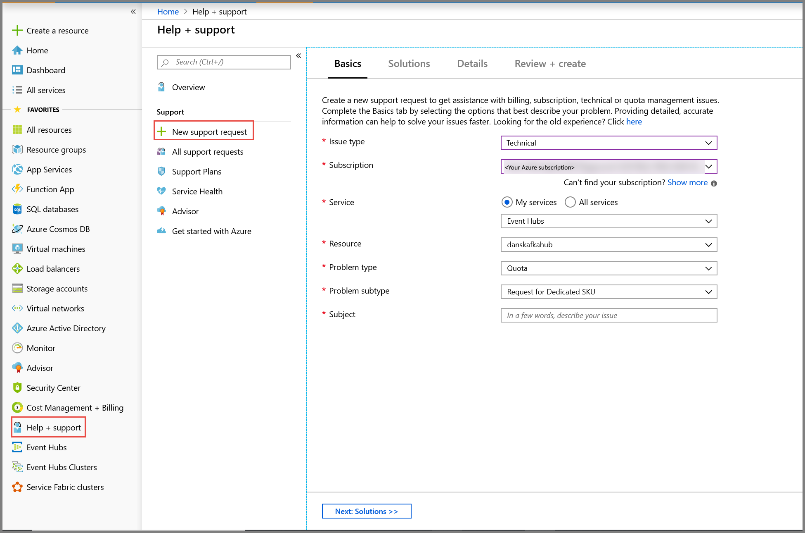
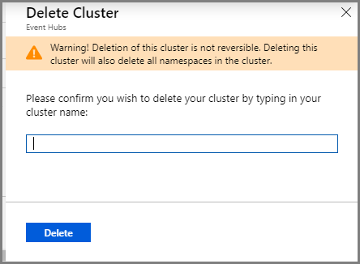

# Quickstart: Create a dedicated Event Hubs cluster using Azure portal 
Event Hubs clusters offer single-tenant deployments for customers with the most demanding streaming needs. This offering has a guaranteed 99.99% SLA and is available only on our Dedicated pricing tier. An [Event Hubs cluster](event-hubs-dedicated-overview.md) can ingress millions of events per second with guaranteed capacity and subsecond latency. Namespaces and event hubs created within a cluster include all features of the standard offering and more, but without any ingress limits. The Dedicated offering also includes the popular [Event Hubs Capture](event-hubs-capture-overview.md) feature at no additional cost, allowing you to automatically batch and log data streams to [Azure Blob Storage](../storage/blobs/storage-blobs-introduction.md) or [Azure Data Lake Storage Gen 1](../data-lake-store/data-lake-store-overview.md).

Dedicated clusters are provisioned and billed by **Capacity Units (CUs)**, a pre-allocated amount of CPU and memory resources. You can purchase 1, 2, 4, 8, 12, 16 or 20 CUs for each cluster. In this quickstart, we will walk you through creating a 1 CU Event Hubs cluster through the Azure portal.

> [!NOTE]
> This self-serve experience is currently available in preview on [Azure Portal](https://aka.ms/eventhubsclusterquickstart). If you have any questions about the Dedicated offering, please reach out to the [Event Hubs team](mailto:askeventhubs@microsoft.com).

## Prerequisites
To complete this quickstart, make sure that you have:

- An Azure account. If you don't have one, [purchase an account](https://azure.microsoft.com/pricing/purchase-options/pay-as-you-go/) before you begin. This feature isn't supported with a free Azure account. 
- [Visual Studio](https://visualstudio.microsoft.com/vs/) 2017 Update 3 (version 15.3, 26730.01) or later.
- [.NET Standard SDK](https://dotnet.microsoft.com/download), version 2.0 or later.
- [Created a resource group](../event-hubs/event-hubs-create.md#create-a-resource-group).

## Create an Event Hubs Dedicated Cluster
An Event Hubs cluster provides a unique scoping container in which you can create one or more namespaces. In this Preview phase of the portal self-serve experience, you can create 1 CU clusters in select regions. If you need a cluster larger than 1 CU, you can submit an Azure support request to scale up your cluster after its creation.

To create a cluster in your resource group using the Azure portal, please complete the following steps:

1. Follow [this link](https://aka.ms/eventhubsclusterquickstart) to create a cluster on Azure portal. Conversely, select **All services** from the left navigation pane, then type in "Event Hubs Clusters" in the search bar and select "Event Hubs Clusters" from the list of results.
2. On the **Create Cluster** page, configure the following:
    1. Enter a **name for the cluster**. The system immediately checks to see if the name is available.
    2. Select the **subscription** in which you want to create the cluster.
    3. Select the **resource group** in which you want to create the cluster.
    4. Select a **location** for the cluster. If your preferred region is grayed out, it is temporarily out of capacity and you can submit a [support request](#submit-a-support-request) to the Event Hubs team.
    5. Select the **Next: Tags** button at the bottom of the page. You may have to wait a few minutes for the system to fully provision the resources.

        
3. On the **Tags** page, configure the following:
    1. Enter a **name** and a **value** for the tag you want to add. This step is **optional**.  
    2. Select the **Review + Create** button.

        
4. On the **Review + Create** page, review the details, and select **Create**. 

    

## Create a namespace and event hub within a cluster

1. To create a namespace within a cluster, on the **Event Hubs Cluster** page for your cluster, select **+Namespace** from the top menu.

    
2. On the create a namespace page, do the following steps:
    1. Enter a **name for the namespace**.  The system checks to see if the name is available.
    2. The namespace inherits the following properties:
        1. Subscription ID
        2. Resource Group
        3. Location
        4. Cluster Name
    3. Select **Create** to create the namespace. Now you can manage your cluster.  

        
3. Once your namespace is created, you can [create an event hub](event-hubs-create.md#create-an-event-hub) as you would normally create one within a namespace. 

## Submit a support request

If you wish to change the size of your cluster after creation or if your preferred region is not available, please submit a support request by following these steps:

1. In [Azure portal](https://portal.azure.com), select **Help + support** from the left menu.
2. Select **+ New support request** from the Support menu.
3. On the support page, follow these steps:
    1. For **Issue Type**, select **Technical** from the drop-down list.
    2. For **Subscription**, select your subscription.
    3. For **Service**, select **My services**, and then select **Event Hubs**.
    4. For **Resource**, select your cluster if it exists already, otherwise select **General Question/Resource Not Available**.
    5. For **Problem type**, select **Quota**.
    6. For **Problem subtype**, select one of the following values from the drop-down list:
        1. Select **Request for Dedicated SKU** to request for the feature to be supported in your region.
        2. Select **Request to Scale Up or Scale Down Dedicated Cluster** if you want to scale up or scale down your dedicated cluster. 
    7. For **Subject**, describe the issue.

        

 ## Delete a dedicated cluster
 
1. To delete the cluster, select **Delete** from the top menu. Please note that your cluster will be billed for a minimum of 4 hours of usage after creation. 
2. A message will appear confirming your wish to delete the cluster.
3. Type the **name of the cluster** and select **Delete** to delete the cluster.

    

## Next steps
In this article, you created an Event Hubs cluster. For step-by-step instructions to send and receive events from an event hub, and capture events to an Azure storage or Azure Data Lake Store, see the following tutorials:

- Send and receive events 
    - [.NET Core](get-started-dotnet-standard-send-v2.md)
    - [Java](get-started-java-send-v2.md)
    - [Python](get-started-python-send-v2.md)
    - [JavaScript](get-started-java-send-v2.md)
- [Use Azure portal to enable Event Hubs Capture](event-hubs-capture-enable-through-portal.md)
- [Use Azure Event Hubs for Apache Kafka](event-hubs-for-kafka-ecosystem-overview.md)
