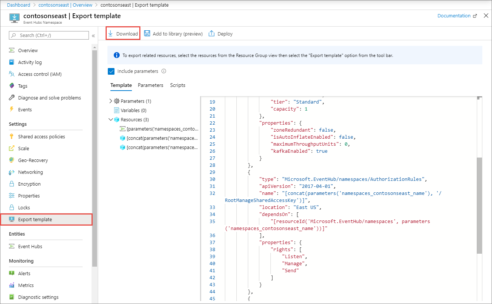

# Move an Azure Event Hubs namespace to another region
There are various scenarios in which you'd want to move your existing Event Hubs namespace from one region to another. For example, you may want to create a namespace with the same configuration for testing. You may also want to create a secondary namespace in another region as part of [disaster recovery planning](event-hubs-geo-dr.md#setup-and-failover-flow).

> [!NOTE]
> This article shows you how to export an Azure Resource Manager template for an existing Event Hubs namespace and then use the template to create a namespace with same configuration settings in another region. However, this process doesn't move events that aren't processed yet. You need to process the events from the original namespace before deleting it.

## Prerequisites

- Ensure that the services and features that your account uses are supported in the target region.
- For preview features, ensure that your subscription is whitelisted for the target region.
- If you have **capture feature** enabled for event hubs in the namespace, move [Azure Storage or Azure Data Lake Store Gen 2](../storage/common/storage-account-move.md) or [Azure Data Lake Store Gen 1](../data-lake-store/data-lake-store-migration-cross-region.md) accounts before moving the Event Hubs namespace. You can also move the resource group that contains both Storage and Event Hubs namespaces to the other region by following steps similar to the ones described in this article. 
- If the Event Hubs namespace is in an **Event Hubs cluster**, [create a dedicated cluster](event-hubs-dedicated-cluster-create-portal.md) in the **target region** before you go through steps in this article. 

## Prepare
To get started, export a Resource Manager template. This template contains settings that describe your Event Hubs namespace.

1. Sign in to the [Azure portal](https://portal.azure.com).

2. Select **All resources** and then select your Event Hubs namespace.

3. Select > **Settings** > **Export template**.

4. Choose **Download** in the **Export template** page.

    

5. Locate the .zip file that you downloaded from the portal, and unzip that file to a folder of your choice.

   This zip file contains the .json files that include the template and scripts to deploy the template.


## Move

Deploy the template to create an Event Hubs namespace in the target region. 


1. In the Azure portal, select **Create a resource**.

2. In **Search the Marketplace**, type **template deployment**, and then press **ENTER**.

3. Select **Template deployment**.

4. Select **Create**.

5. Select **Build your own template in the editor**.

6. Select **Load file**, and then follow the instructions to load the **template.json** file that you downloaded in the last section.

7. Select **Save** to save the template. 

8. On the **Custom deployment** page, follow these steps: 

    1. Select an Azure **subscription**. 

    2. Select an existing **resource group** or create one. If the source namespace was in an Event Hubs cluster, select the resource group that contains cluster in the target region. 

    3. Select the target **location** or region. If you selected an existing resource group, this setting is read-only. 

    4. In the **SETTINGS** section, do the following steps:
    
        1. enter the new **namespace name**. 

            

        2. If your source namespace was in an **Event Hubs cluster**, enter names of **resource group** and **Event Hubs cluster** as part of **external ID**. 

              ```
              /subscriptions/<AZURE SUBSCRIPTION ID>/resourceGroups/<CLUSTER'S RESOURCE GROUP>/providers/Microsoft.EventHub/clusters/<CLUSTER NAME>
              ```   
        3. If event hub in your namespace uses a Storage account for capturing events, specify the resource group name and the storage account for `StorageAccounts_<original storage account name>_external` field. 
            
            ```
            /subscriptions/0000000000-0000-0000-0000-0000000000000/resourceGroups/<STORAGE'S RESOURCE GROUP>/providers/Microsoft.Storage/storageAccounts/<STORAGE ACCOUNT NAME>
            ```    
    5. Select the **I agree to the terms and conditions stated above** checkbox. 
    
    6. Now, select **Select Purchase** to start the deployment process. 

## Discard or clean up
After the deployment, if you want to start over, you can delete the **target Event Hubs namespace**, and repeat the steps described in the [Prepare](#prepare) and [Move](#move) sections of this article.

To commit the changes and complete the move of an Event Hubs namespace, delete the **source Event Hubs namespace**. Make sure that you processed all the events in the namespace before deleting the namespace. 

To delete an Event Hubs namespace (source or target) by using the Azure portal:

1. In the search window at the top of Azure portal, type **Event Hubs**, and select **Event Hubs** from search results. You see the Event Hubs namespaces in a list.

2. Select the target namespace to delete, and select **Delete** from the toolbar. 

    

3. On the **Delete Resources*** page, verify the selected resources, and confirm the deletion by typing **yes**, and then select **Delete**. 

## Next steps

In this tutorial, you moved an Azure Event Hubs namespace from one region to another and cleaned up the source resources.  To learn more about moving resources between regions and disaster recovery in Azure, refer to:


- [Move resources to a new resource group or subscription](https://docs.microsoft.com/azure/azure-resource-manager/resource-group-move-resources)
- [Move Azure VMs to another region](https://docs.microsoft.com/azure/site-recovery/azure-to-azure-tutorial-migrate)
