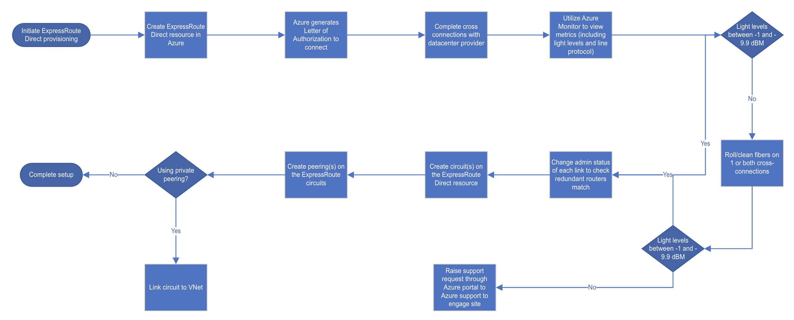

# About ExpressRoute Direct

ExpressRoute Direct gives you the ability to connect directly into Microsoft’s global network at peering locations strategically distributed across the world. ExpressRoute Direct provides dual 100-Gbps connectivity, which supports Active/Active connectivity at scale.

Key features that ExpressRoute Direct provides include, but aren't limited to:

* Massive Data Ingestion into services like Storage and Cosmos DB
* Physical isolation for industries that are regulated and require dedicated and isolated connectivity like: Banking, Government, and Retail
* Granular control of circuit distribution based on business unit

## Onboard to ExpressRoute Direct

Before using ExpressRoute Direct, you must first enroll your subscription. To enroll, send an Email to <ExpressRouteDirect@microsoft.com> with your subscription ID, including the following details:

* Scenarios you're looking to accomplish with **ExpressRoute Direct**
* Location preferences - see [Partners and peering locations](expressroute-locations-providers.md) for a complete list of all locations
* Timeline for implementation
* Any other questions

## ExpressRoute using a service provider and ExpressRoute Direct

| **ExpressRoute using a service provider** | **ExpressRoute Direct** | 
| --- | --- |
| Utilizes service providers to enable fast onboarding and connectivity into existing infrastructure | Requires 100-Gbps infrastructure and full management of all layers
| Integrates with hundreds of providers including Ethernet and MPLS | Direct/Dedicated capacity for regulated industries and massive data ingestion |
| Circuits SKUs from 50 Mbps to 10 Gbps | Customer may select a combination of the following circuit SKUs: 5 Gbps, 10 Gbps, 40 Gbps, 100 Gbps - limited to a total of 200 Gbps
| Optimized for single tenant | Optimized for single tenant/Cloud Service providers/multiple business units

## ExpressRoute Direct circuits

Microsoft Azure ExpressRoute lets you extend your on-premises networks into the Microsoft cloud over a private connection facilitated by a connectivity provider. With ExpressRoute, you can establish connections to Microsoft cloud services, such as Microsoft Azure, Office 365, and Dynamics 365.  

Each peering location has access to Microsoft’s global network and can access any region in a geopolitical zone by default and can access all global regions with a premium circuit.  

The functionality in most scenarios is equivalent to circuits that utilize an ExpressRoute service provider to operate. To support further granularity and new capabilities offered using ExpressRoute Direct, there are certain key capabilities that exist on ExpressRoute Direct Circuits.

## Circuit SKUs

ExpressRoute Direct supports massive data ingestion scenarios into Azure storage and other big data services. ExpressRoute circuits on ExpressRoute Direct now also support **40 Gbps** and **100 Gbps** circuit SKUs. The physical port pairs are **100 Gbps** only and can have multiple virtual circuits with bandwidths of 5 Gbps, 10 Gbps, 40 Gbps, 100 Gbps - up to 200 Gbps in any combination. 

## VLAN Tagging

ExpressRoute Direct supports both QinQ and Dot1Q VLAN tagging.

* **QinQ VLAN Tagging** allows for isolated routing domains on a per ExpressRoute circuit basis. Azure dynamically allocates an S-Tag at circuit creation and cannot be changed. Each peering on the circuit (Private and Microsoft) will utilize a unique C-Tag as the VLAN. The C-Tag is not required to be unique across circuits on the ExpressRoute Direct ports.

* **Dot1Q VLAN Tagging** allows for a single tagged VLAN on a per ExpressRoute Direct port pair basis. A C-Tag used on a peering must be unique across all circuits and peerings on the ExpressRoute Direct port pair.

## Workflow

## SLA

ExpressRoute Direct provides the same enterprise-grade SLA with Active/Active redundant connections into the Microsoft Global Network. ExpressRoute infrastructure is redundant and connectivity into the Microsoft Global Network is redundant and diverse and scales accordingly with customer requirements. 

## Next steps

[Configure ExpressRoute Direct](expressroute-howto-erdirect.md)
