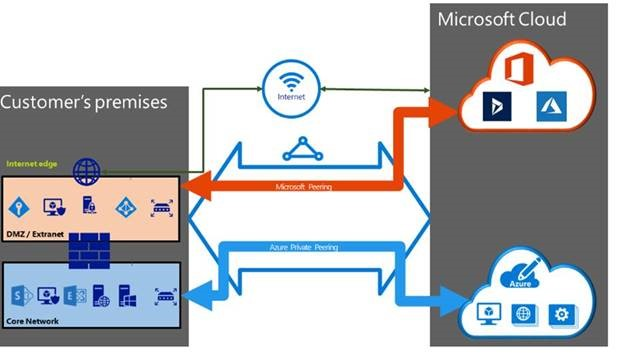
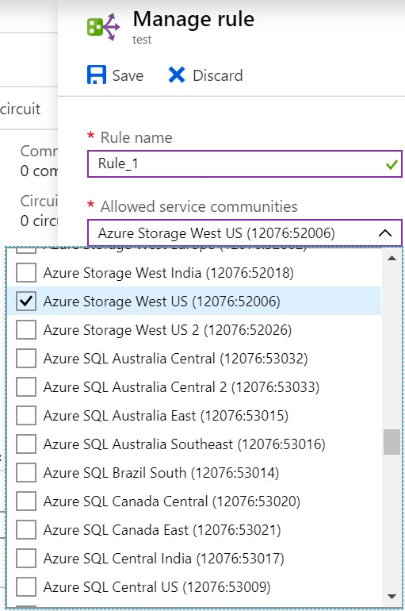

# Move a public peering to Microsoft peering

This article helps you move a public peering configuration to Microsoft peering with no downtime. ExpressRoute supports using Microsoft peering with route filters for Azure PaaS services, such as Azure storage and Azure SQL Database. You now need only one routing domain to access Microsoft PaaS and SaaS services. You can use route filters to selectively advertise the PaaS service prefixes for Azure regions you want to consume.

Azure public peering has 1 NAT IP address associated to each BGP session. Microsoft peering allows you to configure your own NAT allocations, as well as use route filters for selective prefix advertisements. Public Peering is a unidirectional service using which Connectivity is always initiated from your WAN to Microsoft Azure services. Microsoft Azure services will not be able to initiate connections into your network through this routing domain.

Once public peering is enabled, you can connect to all Azure services. We do not allow you to selectively pick services for which we advertise routes to. While Microsoft peering is a bi-directional connectivity where connection can be initiated from Microsoft Azure service along with your WAN. For more information about routing domains and peering, see [ExpressRoute circuits and routing domains](expressroute-circuit-peerings.md).

## Before you begin

To connect to Microsoft peering, you need to set up and manage NAT. Your connectivity provider may set up and manage the NAT as a managed service. If you are planning to access the Azure PaaS and Azure SaaS services on Microsoft peering, it's important to size the NAT IP pool correctly. For more information about NAT for ExpressRoute, see the [NAT requirements for Microsoft peering](expressroute-nat.md#nat-requirements-for-microsoft-peering). When you connect to Microsoft through Azure ExpressRoute(Microsoft peering), you have multiple links to Microsoft. One link is your existing Internet connection, and the other is via ExpressRoute. Some traffic to Microsoft might go through the Internet but come back via ExpressRoute, or vice versa.

> [!Warning]
> The NAT IP pool advertised to Microsoft must not be advertised to the Internet. This will break connectivity to other Microsoft services.

Refer to [Asymmetric routing with multiple network paths](./expressroute-asymmetric-routing.md) for caveats of asymmetric routing before configuring Microsoft peering.

* If you are using public peering and currently have IP Network rules for public IP addresses that are used to access [Azure Storage](../storage/common/storage-network-security.md) or [Azure SQL Database](../azure-sql/database/vnet-service-endpoint-rule-overview.md), you need to make sure that the NAT IP pool configured with Microsoft peering is included in the list of public IP addresses for the Azure storage account or Azure SQL account.
* Note that legacy Public peering makes use of Source Network Address Translation (SNAT) to a Microsoft-registered public IP, while Microsoft peering does not.
* In order to move to Microsoft peering with no downtime, use the steps in this article in the order that they are presented.

## 1. Create Microsoft peering

If Microsoft peering has not been created, use any of the following articles to create Microsoft peering. If your connectivity provider offers managed layer 3 services, you can ask the connectivity provider to enable Microsoft peering for your circuit.

If the layer 3 is managed by you the following information is required before you proceed:

* A /30 subnet for the primary link. This must be a valid public IPv4 prefix owned by you and registered in an RIR / IRR. From this subnet you will assign the first useable IP address to your router as Microsoft uses the second useable IP for its router. 
* A /30 subnet for the secondary link. This must be a valid public IPv4 prefix owned by you and registered in an RIR / IRR. From this subnet you will assign the first useable IP address to your router as Microsoft uses the second useable IP for its router. 
* A valid VLAN ID to establish this peering on. Ensure that no other peering in the circuit uses the same VLAN ID. For both Primary and Secondary links you must use the same VLAN ID. 
* AS number for peering. You can use both 2-byte and 4-byte AS numbers. 
* Advertised prefixes: You must provide a list of all prefixes you plan to advertise over the BGP session. Only public IP address prefixes are accepted. If you plan to send a set of prefixes, you can send a comma-separated list. These prefixes must be registered to you in an RIR / IRR. 
* Routing Registry Name: You can specify the RIR / IRR against which the AS number and prefixes are registered.

* **Optional** - Customer ASN: If you are advertising prefixes that are not registered to the peering AS number, you can specify the AS number to which they are registered. 
* **Optional** - An MD5 hash if you choose to use one.

Detailed instructions to enable Microsoft peering can be found in the following articles:

* [Create Microsoft peering using Azure portal](expressroute-howto-routing-portal-resource-manager.md#msft) 
* [Create Microsoft peering using Azure Powershell](expressroute-howto-routing-arm.md#msft) 
* [Create Microsoft peering using Azure CLI](howto-routing-cli.md#msft)

## 2. Validate Microsoft peering is enabled

Verify that the Microsoft peering is enabled and the advertised public prefixes are in the configured state.

* [Azure portal](expressroute-howto-routing-portal-resource-manager.md#getmsft) 
* [Azure PowerShell](expressroute-howto-routing-arm.md#getmsft) 
* [Azure CLI](howto-routing-cli.md#getmsft)

## 3. Configure and attach a route filter to the circuit

By default, new Microsoft peering do not advertise any prefixes until a route filter is attached to the circuit. When you create a route filter rule, you can specify the list of service communities for Azure regions that you want to consume for Azure PaaS services. This provides you the flexibility to filter the routes as per your requirement, as shown in the following screenshot:

Configure route filters using any of the following articles:

* [Configure route filters for Microsoft peering using Azure portal](how-to-routefilter-portal.md) 
* [Configure route filters for Microsoft peering using Azure PowerShell](how-to-routefilter-powershell.md) 
* [Configure route filters for Microsoft peering using Azure CLI](how-to-routefilter-cli.md)

## 4. Delete the public peering

After verifying that the Microsoft peering is configured and the prefixes you wish to consume are correctly advertised on Microsoft peering, you can then delete the public peering. To delete the public peering, use any of the following articles:

* [Delete Azure public peering using Azure PowerShell](about-public-peering.md#powershell)
* [Delete Azure public peering using CLI](about-public-peering.md#cli)
  
## 5. View peerings
  
You can see a list of all ExpressRoute circuits and peerings in the Azure portal. For more information, see [View Microsoft peering details](expressroute-howto-routing-portal-resource-manager.md#getmsft).

## Next steps

For more information about ExpressRoute, see the [ExpressRoute FAQ](expressroute-faqs.md).
