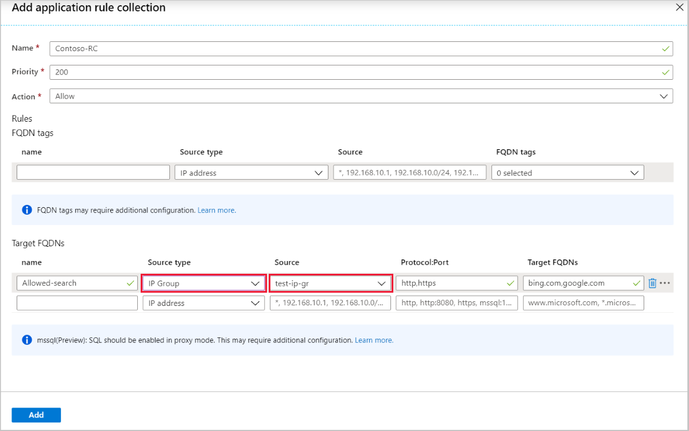

# IP Groups in Azure Firewall

IP Groups allow you to group and manage IP addresses for Azure Firewall rules in the following ways:

- As a source address in DNAT rules
- As a source or destination address in network rules
- As a source address in application rules

An IP Group can have a single IP address, multiple IP addresses, or one or more IP address ranges.

IP Groups can be reused in Azure Firewall DNAT, network, and application rules for multiple firewalls across regions and subscriptions in Azure. Group names must be unique. You can configure an IP Group in the Azure portal, Azure CLI, or REST API. A sample template is provided to help you get started.

## Sample format

The following IPv4 address format examples are valid to use in IP Groups:

- Single address: 10.0.0.0
- CIDR notation: 10.1.0.0/32
- Address range: 10.2.0.0-10.2.0.31

## Create an IP Group

An IP Group can be created using the Azure portal, Azure CLI, or REST API. For more information, see [Create an IP Group](create-ip-group.md).

## Browse IP Groups
1. In the Azure portal search bar, type **IP Groups** and select it. You can see the list of the IP Groups, or you can select **Add** to create a new IP Group.
2. Select an IP Group to open the overview page. You can edit, add, or delete IP addresses or IP Groups.

   

## Manage an IP Group

You can see all the IP addresses in the IP Group and the rules or resources that are associated with it. To delete an IP Group, you must first dissociate the IP Group from the resource that is using it.

1. To view or edit the IP addresses, select **IP Addresses** under **Settings** on the left pane.
2. To add a single or multiple IP address(es), select **Add IP Addresses**. This opens the **Drag or Browse** page for an upload, or you can enter the address manually.
3.    Selecting the ellipses (**…**) to the right to edit or delete IP addresses. To edit or delete multiple IP addresses, select the boxes and select **Edit** or **Delete** at the top.
4. Finally, can export the file in the CSV file format.

> [!NOTE]
> If you delete all the IP addresses in an IP Group while it is still in use in a rule, that rule is skipped.

## Use an IP Group

You can now select **IP Group** as a **Source type** or **Destination type** for the IP address(es) when you create Azure Firewall DNAT, application, or network rules.

## Region availability

IP Groups are available in all public cloud regions.

## IP address limits

For 50 IP Groups or less, you can have a maximum of 5000 individual IP addresses each per firewall instance. For 51 to 100 IP Groups, you can have 500 individual IP address each per firewall instance.

### Examples

#### Example 1: supported

|IP Groups  |# IP addresses  |Notation  |Rule  |
|---------|---------|---------|---------|
|IPGroup1 |4096     |10.0.0.0/20  |Rule1|
|IPGroup2     |3|196.0.0.0 - 196.0.0.2|Rule1|
|IPGroup3     |1|1.2.3.4|Rule1|
|     |**Total 4100**|         |         |
|     |         |         |         |

#### Example 2: supported

|IP Groups  |# IP addresses  |Notation  |Rule  |
|---------|---------|---------|---------|
|IPGroup1 |4096     |10.0.0.0/20  |Rule1|
|IPGroup2     |4096|11.0.0.0/20|Rule1|
|     |**Total 8192**|         |         |

#### Example 3: not supported

|IP Groups  |# IP addresses  |Notation  |Rule  |
|---------|---------|---------|---------|
|IPGroup1 |8192     |10.0.0.0/20, 11.0.0.0/20  |Rule1|
|     |**Total 8192**|||

#### Example 4: supported

|IP Groups  |# IP addresses  |Notation  |Rule  |
|---------|---------|---------|---------|
|IPGroup1 |4096     |10.0.0.0/20  |Rule1|
|IPGroup2     |4096|11.0.0.0/20|Rule2|
|     |**Total 8192**|         |         |

## Related Azure PowerShell cmdlets

The following Azure PowerShell cmdlets can be used to create and manage IP Groups:

- [New-AzIpGroup](https://docs.microsoft.com/powershell/module/az.network/new-azipgroup?view=azps-3.4.0)
- [Remove-AzIPGroup](https://docs.microsoft.com/powershell/module/az.network/remove-azipgroup?view=azps-3.4.0)
- [Get-AzIpGroup](https://docs.microsoft.com/powershell/module/az.network/get-azipgroup?view=azps-3.4.0)
- [Set-AzIpGroup](https://docs.microsoft.com/powershell/module/az.network/set-azipgroup?view=azps-3.4.0)
- [New-AzFirewallNetworkRule](https://docs.microsoft.com/powershell/module/az.network/new-azfirewallnetworkrule?view=azps-3.4.0)
- [New-AzFirewallApplicationRule](https://docs.microsoft.com/powershell/module/az.network/new-azfirewallapplicationrule?view=azps-3.4.0)
- [New-AzFirewallNatRule](https://docs.microsoft.com/powershell/module/az.network/new-azfirewallnatrule?view=azps-3.4.0)

## Next steps

- Learn how to [deploy and configure an Azure Firewall](tutorial-firewall-deploy-portal.md).