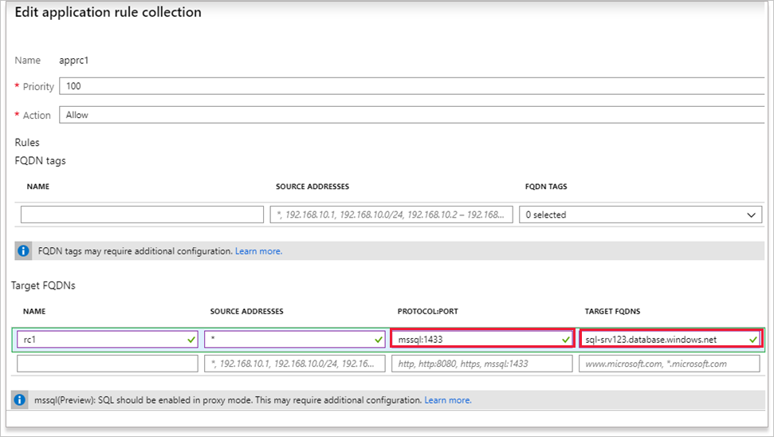

# Configure Azure Firewall application rules with SQL FQDNs

> [!IMPORTANT]
> Azure Firewall application rules with SQL FQDNs is currently in public preview.
> This preview version is provided without a service level agreement, and it's not recommended for production workloads. Certain features might not be supported or might have constrained capabilities.
> For more information, see [Supplemental Terms of Use for Microsoft Azure Previews](https://azure.microsoft.com/support/legal/preview-supplemental-terms/).

You can now configure Azure Firewall application rules with SQL FQDNs. This allows you to limit access from your virtual networks to only the specified SQL server instances.

With SQL FQDNs, you can filter traffic:

- From your VNets to an Azure SQL Database or an Azure SQL Data Warehouse. For example: Only allow access to *sql-server1.database.windows.net*.
- From on-premises to Azure SQL Managed Instances or SQL IaaS running in your VNets.
- From spoke-to-spoke to Azure SQL Managed Instances or SQL IaaS running in your VNets.

During the public preview, SQL FQDN filtering is supported in [proxy-mode](https://docs.microsoft.com/azure/sql-database/sql-database-connectivity-architecture#connection-policy) only (port 1433). If you use SQL in the default redirect mode, you can filter access using the SQL service tag as part of [network rules](overview.md#network-traffic-filtering-rules).
If you use non-default ports for SQL IaaS traffic, you can configure those ports in the firewall application rules.

Application rules with SQL FQDNs is currently available in all regions via the Azure portal, Azure CLI, REST, and templates.

## Configure using Azure CLI

1. Deploy an [Azure Firewall using Azure CLI](deploy-cli.md).
2. If you filter traffic to Azure SQL Database, SQL Data Warehouse, or SQL Managed Instance, ensure the SQL connectivity mode is set to **Proxy**. To learn how to switch SQL connectivity mode, see [Azure SQL Connectivity Architecture](https://docs.microsoft.com/azure/sql-database/sql-database-connectivity-architecture#change-azure-sql-database-connection-policy). 

   > [!NOTE]
   > SQL *proxy* mode can result in more latency compared to *redirect*. If you want to continue using redirect mode, which is the default for clients connecting within Azure, you can filter access using the SQL [service tag](service-tags.md) in firewall [network rules](tutorial-firewall-deploy-portal.md#configure-a-network-rule).

3. Configure an application rule with SQL FQDN to allow access to a SQL server:

   ```azurecli
   az extension add -n azure-firewall

   az network firewall application-rule create \
   -g FWRG \
   -f azfirewall \
   -c FWAppRules \
   -n srule \
   --protocols mssql=1433 \
   --source-addresses 10.0.0.0/24 \
   --target-fqdns sql-serv1.database.windows.net
   ```

## Configure using the Azure portal
1. Deploy an [Azure Firewall using Azure CLI](deploy-cli.md).
2. If you filter traffic to Azure SQL Database, SQL Data Warehouse, or SQL Managed Instance, ensure the SQL connectivity mode is set to **Proxy**. To learn how to switch SQL connectivity mode, see [Azure SQL Connectivity Architecture](../sql-database/sql-database-connectivity-architecture.md#change-azure-sql-database-connection-policy). 

   > [!NOTE]
   > SQL *proxy* mode can result in more latency compared to *redirect*. If you want to continue using redirect mode, which is the default for clients connecting within Azure, you can filter access using the SQL [service tag](service-tags.md) in firewall [network rules](tutorial-firewall-deploy-portal.md#configure-a-network-rule).
3. Add the application rule with the appropriate protocol, port, and SQL FQDN and then select **Save**.
   
4. Access SQL from a virtual machine in a VNet that filters the traffic through the firewall. 
5. Validate that [Azure Firewall logs](log-analytics-samples.md) show the traffic is allowed.

## Next steps

To learn about SQL proxy and redirect modes, see [Azure SQL database connectivity architecture](../sql-database/sql-database-connectivity-architecture.md).