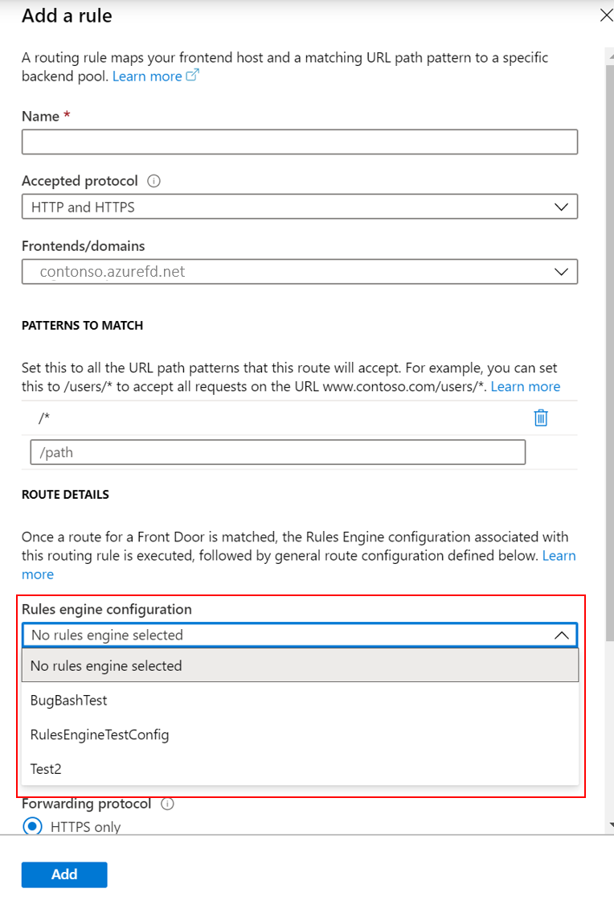

# Configure your Rules Engine

This article provides steps to create a Rules Engine configuration and your first rule in both Azure portal and CLI. 

## Configure Rules Engine in Azure portal
1. Before creating a Rules engine configuration, [create a Front door](quickstart-create-front-door.md).

2. Within your Front door resource, go to **Settings** and select **Rule Engine configuration**. Click **Add**, give your configuration a name, and start creating your first Rules Engine configuration.

    

3. Click **Add Rule** to create your first rule. Then, by clicking **Add condition** or **Add action** you can define your rule.
    
    > [!NOTE]
    >- To delete a condition or action from rule, use the trash can on the right-hand side of the specific condition or action.
    > - To create a rule that applies to all incoming traffic, do not specify any conditions.
    > - To stop evaluating rules once the first match condition is met, check **Stop evaluating remaining rule**. If this is checked and all of the match conditions of a particular rule are met, then the remaining rules in the configuration will not be executed.  

     

4. Determine the priority of the rules within your configuration by using the Move up, Move down, and Move to top buttons. The priority is in ascending order, meaning the rule first listed is the most important rule.

5. Once you have created one or more rules, press **Save**. This action creates your Rules Engine configuration.

6. Once you have created one or more configurations, associate a Rules Engine configuration with a Route Rule. While a single configuration can be applied to many route rules, a Route rule may only contain one Rules Engine configuration. To make the association, go to your **Front Door designer** > **Route rules**. Select the Route rule you'd like to add the Rules engine configuration to, go to **Route details** > **Rules engine configuration**, and select the configuration you'd like to associate.

    


## Configure Rules Engine in Azure CLI

1. If you haven't already, install [Azure CLI](https://docs.microsoft.com/cli/azure/install-azure-cli?view=azure-cli-latest). Add “front-door” extension:- az extension add --name front-door. Then, login and switch to your subscription az account set --subscription <name_or_Id>.

2. Start by creating a Rules Engine - this example shows one rule with one header-based action and one match condition. 

```azurecli-interactive
az network front-door rules-engine rule create -f {front_door} -g {resource_group} --rules-engine-name {rules_engine} --name {rule1} --priority 1 --action-type RequestHeader --header-action Overwrite --header-name Rewrite --header-value True --match-variable RequestFilenameExtension --operator Contains --match-values jpg png --transforms Lowercase
```

3. List all the rules. 

```azurecli-interactive
az network front-door rules-engine rule list -f {front_door} -g {rg} --name {rules_engine}
```

4. Add a forwarding route override action. 

```azurecli-interactive
az network front-door rules-engine rule action add -f {front_door} -g {rg} --rules-engine-name {rules_engine} --name {rule1} --action-type ForwardRouteOverride --backend-pool {backend_pool_name} --caching Disabled
```

5. List all the actions in a rule. 

```azurecli-interactive
az network front-door rules-engine rule action list -f {front_door} -g {rg} -r {rules_engine} --name {rule1}
```

6. Link a rules engine configuration to a routing rule.  

```azurecli-interactive
az network front-door routing-rule update -g {rg} -f {front_door} -n {routing_rule_name} --rules-engine {rules_engine}
```

7. Unlink rules engine. 

```azurecli-interactive
az network front-door routing-rule update -g {rg} -f {front_door} -n {routing_rule_name} --remove rulesEngine # case sensitive word ‘rulesEngine’
```

For more information, a full list of AFD Rules Engine commands can be found [here](https://docs.microsoft.com/cli/azure/ext/front-door/network/front-door/rules-engine?view=azure-cli-latest).   

## Next steps

- Learn more about [AFD Rules Engine](front-door-rules-engine.md). 
- Learn how to [create a Front Door](quickstart-create-front-door.md).
- Learn [how Front Door works](front-door-routing-architecture.md).
- Check out more in AFD Rules Engine [CLI reference](https://docs.microsoft.com/cli/azure/ext/front-door/network/front-door/rules-engine?view=azure-cli-latest). 
- Check out more in AFD Rules Engine [PowerShell reference](https://docs.microsoft.com/powershell/module/az.frontdoor/?view=azps-3.8.0). 
