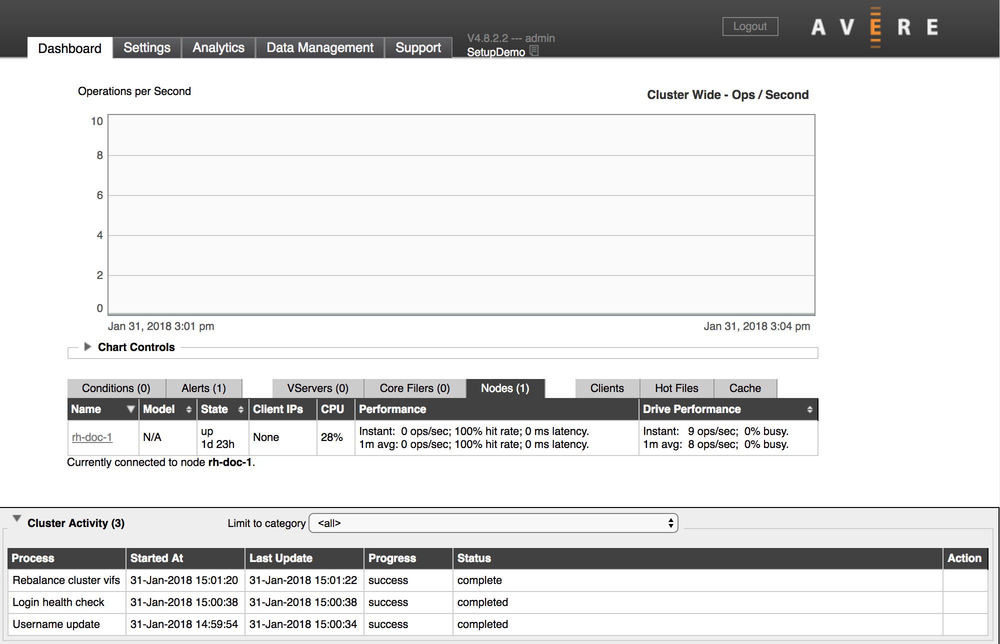
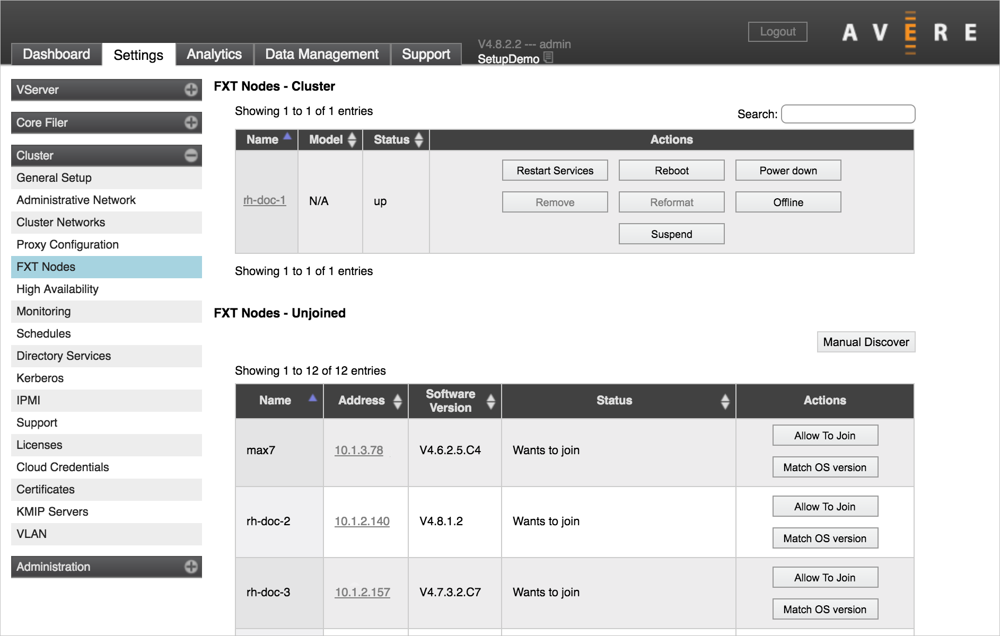
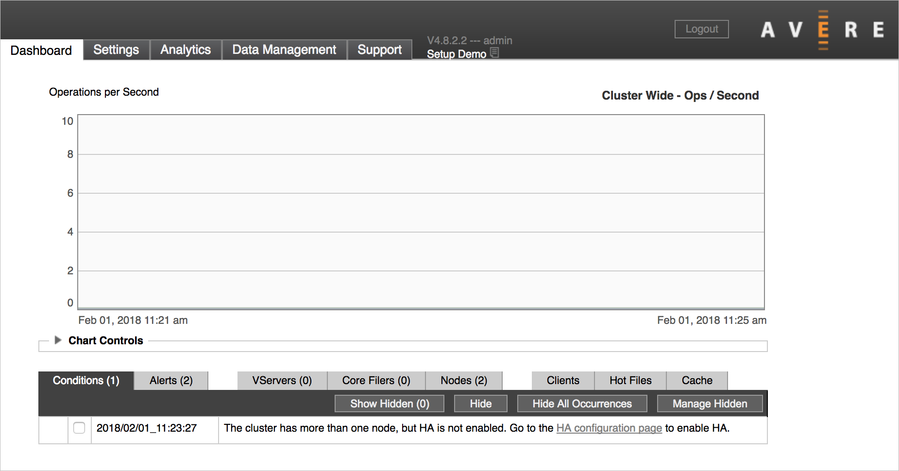
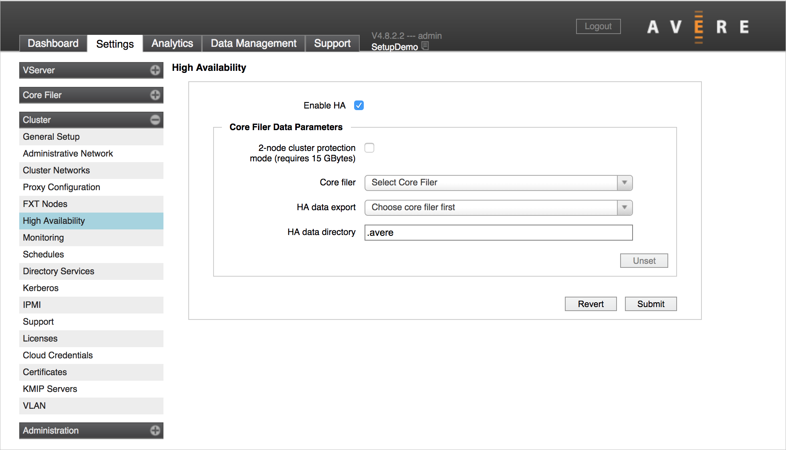

# Tutorial: Add cluster nodes 

A new Azure FXT Edge Filer cluster is created with only one node. You should add at least two more nodes and enable high availability before doing other configuration. 

This tutorial explains how to add cluster nodes and enable the High Availability (HA) feature. 

In this tutorial, you will learn: 

> [!div class="checklist"]
> * How to add nodes to the FXT cluster
> * How to enable HA

The steps in this tutorial take approximately 45 minutes to complete.

Before you start this tutorial, power on the nodes that you want to add and [set their initial passwords](fxt-node-password.md). 

## 1. Load the Cluster Nodes page

Open the cluster's Control Panel in a web browser, and sign in as an administrator. (Detailed instructions are in the overview article, under [Open the Settings pages](fxt-cluster-create.md#open-the-settings-pages).)

The Control Panel shows the **Dashboard** tab when it opens. 

This image shows the dashboard of a newly created cluster, with a single node.

## 2. Locate the node to add

To add nodes, click the **Settings** tab and choose the **FXT Nodes** page in the **Cluster** section.

The **FXT Nodes - Unjoined** list shows all unassigned FXT nodes (most data centers have only a few. Find the FXT nodes that you want to add to the cluster.

> [!Tip] 
> If you cannot find the node you want on the **Unjoined** list, check that it meets these requirements:
> 
> * It is powered on and has had a [root password set](fxt-node-password.md).
> * It is connected to a network you can access. If you use VLANs , it must be on the same VLAN as the cluster.
> * It can be detected with the Bonjour protocol. 
>
>   Some firewall settings block the TCP/UDP ports used by Bonjour, which prevents the FXT operating system from automatically detecting the nodes.
> 
> If the node that you want to add isn’t on the list, try these solutions: 
> 
> * Click the **Manual Discover** button to find it by IP address.
> 
> * Manually assign temporary IP addresses. This is rare but might be needed if you use tagged VLANs and the nodes are not on the correct network, or your network does not allow self-assigned IP addresses. Follow the instructions in the legacy version of this document to [manually set a static IP address](https://azure.github.io/Avere/legacy/create_cluster/4_8/html/static_ip.html).

The node name, IP address, software version, and eligibility status are displayed in the list. Typically, the **Status** column either says “Wants to join” or describes a system or hardware problem that makes the node ineligible to join the cluster.

The **Actions** column has buttons that let you add the node to the cluster or update its software. The update button automatically installs the software version that matches the nodes already in the cluster.

All of the nodes in a cluster must use the same version of the OS, but you don’t need to update software before adding a node. After you click the **Allow To Join** button, the cluster join process automatically checks and installs the OS software that matches the version on the cluster.

To learn more about the options on this page, read [**Cluster** > **FXT Nodes**](https://azure.github.io/Avere/legacy/ops_guide/4_7/html/gui_fxt_nodes.html) in the Cluster Configuration Guide.

## 3. Click the "Allow to Join" button 

Click the **Allow To Join*** button in the **Actions** column for the node that you want to add.

After you click the button, the node's status might change as its software is updated in preparation for adding it to the cluster. 

The image below shows a node that is in the process of joining the cluster (most likely, it’s getting an OS update before being added). No buttons appear in the **Actions** column for nodes that are in the process of being added to the cluster.

After a few moments, the new node should appear in the list of cluster nodes at the top of the **FXT Nodes** settings page. 

Repeat this process to add the other nodes to your cluster. You don’t need to wait for one node to finish joining the cluster before starting another.

## Enable High Availability

After you’ve added a second node to your cluster, you might see a warning message on the control panel Dashboard that the high availability feature is not configured. 

High availability (HA) allows the cluster nodes to compensate for each other if one goes down. HA is not enabled by default.

> [!Note] 
> Do not enable HA until you have at least three nodes in the cluster.

Follow this procedure to turn on HA: 

1. Load the **High Availability** page in the **Cluster** section of the **Settings** tab.

   

2. Click the box labeled **Enable HA** and click the **Submit** button. 

An alert appears on the **Dashboard** to confirm that HA is enabled.

## Next steps

After adding all of the nodes in your cluster, continue the setup by configuring your cluster's long-term storage.

> [!div class="nextstepaction"]
> [Add back-end storage and set up the virtual namespace](fxt-add-storage.md)