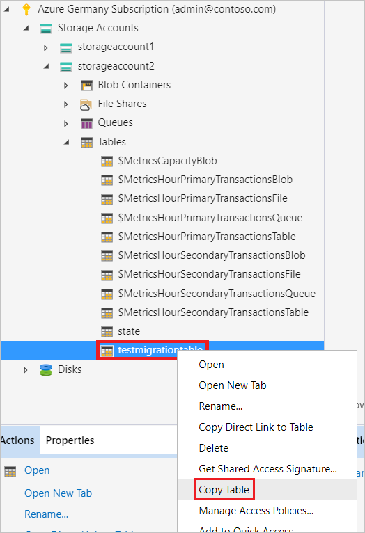
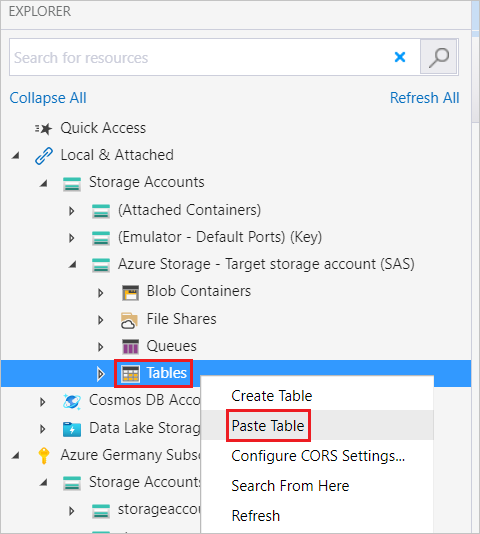

# Migrate storage resources to global Azure

[!INCLUDE [closureinfo](../../includes/germany-closure-info.md)]

This article has information that can help you migrate Azure storage resources from Azure Germany to global Azure.

[!INCLUDE [updated-for-az](../../includes/updated-for-az.md)]

## Blobs

AzCopy is a free tool you can use to copy blobs, files, and tables. AzCopy works for Azure-to-Azure, on-premises-to-Azure, and Azure-to-on-premises migrations. Use AzCopy for your migration to copy blobs directly from Azure Germany to global Azure.

If you don't use managed disks for your source VM, use AzCopy to copy the .vhd files to the target environment. Otherwise, you must complete some steps in advance. For more information, see [Recommendations for managed disks](#managed-disks).

The following example shows how AzCopy works. For a complete reference, see the [AzCopy documentation](../storage/common/storage-use-azcopy-v10.md).

AzCopy uses the terms **Source** and **Dest**, expressed as URIs. URIs for Azure Germany always have this format:

```http
https://<storageaccountname>.blob.core.cloudapi.de/<containername>/<blobname>
```

URIs for global Azure always have this format:

```http
https://<storageaccountname>.blob.core.windows.net/<containername>/<blobname>
```

You get the three parts of the URI (*storageaccountname*, *containername*, *blobname*) from the portal, by using PowerShell, or by using the Azure CLI. The name of the blob can be part of the URI or it can be given as a pattern, like *vm121314.vhd*.

You also need the storage account keys to access the Azure Storage account. Get them from the portal, by using PowerShell, or by using the CLI. For example:

```powershell
Get-AzStorageAccountKey -Name <saname> -ResourceGroupName <rgname>
```

As always, you need only one of the two keys for each storage account.

Example:

URI part | example value
-------- | --------------
Source storageAccount | `migratetest`
Source container | `vhds`
Source blob | `vm-121314.vhd`
Target storageAccount | `migratetarget`
Target container | `targetcontainer`

This command copies a virtual hard disk from Azure Germany to global Azure (keys are shortened to improve readability):

```cmd
azcopy -v /source:https://migratetest.blob.core.cloudapi.de/vhds /sourcekey:"0LN...w==" /dest:https://migratetarget.blob.core.windows.net/targetcontainer /DestKey:"o//ucDi5TN...w==" /Pattern:vm-121314.vhd
```

To get a consistent copy of the VHD, shut down the VM before you copy the VHD. Plan some downtime for the copy activity. When the VHD is copied, [rebuild your VM in the target environment](../backup/backup-azure-vms-automation.md#create-a-vm-from-restored-disks).

For more information:

- Review the [AzCopy documentation](../storage/common/storage-use-azcopy-v10.md).
- Learn how to [create a VM from restored disks](../backup/backup-azure-vms-automation.md#create-a-vm-from-restored-disks).

## Managed Disks

Azure Managed Disks simplifies disk management for Azure infrastructure as a service (IaaS) VMs by managing the storage accounts that are associated with the VM disk. 

Because you don't have direct access to the .vhd file, you can't directly use tools like AzCopy to copy your files (see [Blobs](#blobs)). The workaround is to first export the managed disk by getting a temporary shared access signature URI, and then download it or copy it by using this information. The following sections show an example of how to get the shared access signature URI and what to do with it.

### Step 1: Get the shared access signature URI

1. In the portal, search for your managed disk. (It's in the same resource group as your VM. The resource type is **Disk**.)
1. On the **Overview** page, select the **Export** button in the top menu (you have to shut down and deallocate your VM first, or unattach the VM).
1. Define a time for the URI to expire (the default is 3,600 seconds).
1. Generate a URL (this step should take only a few seconds).
1. Copy the URL (it appears only once).

### Step 2: AzCopy

For examples of how to use AzCopy, see [Blobs](#blobs). Use AzCopy (or a similar tool) to copy the disk directly from your source environment to the target environment. In AzCopy, you have to split the URI into the base URI and the shared access signature part. The shared access signature part of the URI begins with the character "**?**". The portal provides this URI for the shared access signature URI:

```http
https://md-kp4qvrzhj4j5.blob.core.cloudapi.de/r0pmw4z3vk1g/abcd?sv=2017-04-17&sr=b&si=22970153-4c56-47c0-8cbb-156a24b6e4b5&sig=5Hfu0qMw9rkZf6mCjuCE4VMV6W3IR8FXQSY1viji9bg%3D>
```

The following commands show the source parameters for AzCopy:

```cmd
/source:"https://md-kp4qvrzhj4j5.blob.core.cloudapi.de/r0pmw4z3vk1g/abcd"
```

```cmd
/sourceSAS:" ?sv=2017-04-17&sr=b&si=22970153-4c56-47c0-8cbb-156a24b6e4b5&sig=5Hfu0qMw9rkZf6mCjuCE4VMV6W3IR8FXQSY1viji9bg%3D"
```

Here's the complete command:

```cmd
azcopy -v /source:"https://md-kp4qvrzhj4j5.blob.core.cloudapi.de/r0pmw4z3vk1g/abcd" /sourceSAS:"?sv=2017-04-17&sr=b&si=22970153-4c56-47c0-8cbb-156a24b6e4b5&sig=5Hfu0qMw9rkZf6mCjuCE4VMV6W3IR8FXQSY1viji9bg%3D" /dest:"https://migratetarget.blob.core.windows.net/targetcontainer/newdisk.vhd" /DestKey:"o//ucD... Kdpw=="
```

### Step 3: Create a new managed disk in the target environment

You have several options for creating a new managed disk. Here's how to do it in the Azure portal:

1. In the portal, select **New** > **Managed Disk** > **Create**.
1. Enter a name for the new disk.
1. Select a resource group.
1. Under **Source type**, select **Storage blob**. Then, either copy the destination URI from the AzCopy command or browse to select the destination URI.
1. If you copied an OS disk, select the **OS** type. For other disk types, select **Create**.

### Step 4: Create the VM

As noted earlier, there are multiple ways to create a VM by using this new managed disk. Here are two options:

- In the portal, select the disk, and then select **Create VM**. Define the other parameters of your VM as usual.
- For PowerShell, see [Create a VM from restored disks](../backup/backup-azure-vms-automation.md#create-a-vm-from-restored-disks).

For more information:

- Learn how to export to disk [via API](/rest/api/compute/disks/grantaccess) by getting a shared access signature URI. 
- Learn how to create a managed disk [via API](/rest/api/compute/disks/createorupdate#create-a-managed-disk-by-importing-an-unmanaged-blob-from-a-different-subscription.) from an unmanaged blob.

## Tables

You can migrate tables in Azure using Storage Explorer. Storage Explorer is a tool to manage your Azure cloud storage resources. Using Storage Explorer, you can connect to the source Germany storage account and copy tables to the target Azure global storage account.

To begin, install [Azure Storage Explorer](https://azure.microsoft.com/features/storage-explorer/).

### Connect to source

You use Storage Explorer to copy tables from the source Azure Storage account. 

Connect Storage Explorer to the your source table resources in Microsoft Azure Germany. You can [sign in to access resources in your subscription](../vs-azure-tools-storage-manage-with-storage-explorer.md?tabs=windows#sign-in-to-azure) or you can [attach to specific Storage resources](../vs-azure-tools-storage-manage-with-storage-explorer.md?tabs=windows#attach-to-an-individual-resource). 

### Connect to target

You use Storage Explorer to paste tables to the target Azure Storage account.

Connect Storage Explorer to your target Microsoft Azure subscription or Azure Storage. You can [sign in to access resources in your subscription](../vs-azure-tools-storage-manage-with-storage-explorer.md?tabs=windows#sign-in-to-azure) or you can [attach to specific Storage resources](../vs-azure-tools-storage-manage-with-storage-explorer.md?tabs=windows#attach-to-an-individual-resource). 


### Migrate tables

Copy tables from Azure Germany to an Azure global using Storage Explorer. You can copy tables by right clicking the table you want to copy and choosing **Copy table** from the shortcut menu. The following example shows copying the *testmigrationtable* from an *Azure Germany subscription*.



Paste the table into the target Azure Storage account using Storage Explorer. You can past tables by right clicking the *Tables* node within the target Azure Storage account. The following example shows pasting the *testmigrationtable* to a connected Azure Storage account.
 


Repeat the copy and paste steps for each table you want to migrate.

## File shares

Use AzCopy for your migration to copy file shares directly from Azure Germany to global Azure. AzCopy is a free tool you can use to copy blobs, files, and tables.

To begin, [download AzCopy](https://aka.ms/downloadazcopy) and install.

AzCopy uses the terms **Source** and **Dest**, expressed as URIs. URIs for Azure Germany always have this format:

```http
https://<storageaccountname>.blob.core.cloudapi.de/<filesharename>
```

URIs for global Azure always have this format:

```http
https://<storageaccountname>.blob.core.windows.net/<filesharename>
```
You need a storage account SAS token to access the Azure Storage account. 

The following example command copies all file shares, directories, and files from an Azure Germany storage account to a global Azure storage account. For a complete reference, see the [AzCopy documentation](../storage/common/storage-use-azcopy-v10.md).

URI part | Example value
-------- | --------------
Source storageAccount | `migratetest`
Source file share | `sourcefileshare`
Target storageAccount | `migratetarget`
Target fileshare | `targetfileshare`

```cmd
azcopy copy "https://migratetest.blob.core.cloudapi.de/sourcefileshare?<SAS-token>" "https://migratetarget.blob.core.windows.net/targetfileshare?<SAS-token>" --recursive=true
```

For more information about AzCopy, see the [AzCopy documentation](../storage/common/storage-use-azcopy-v10.md) and [Transfer data with AzCopy and file storage](../storage/common/storage-use-azcopy-files.md#copy-files-between-storage-accounts).

## Next steps

Learn about tools, techniques, and recommendations for migrating resources in the following service categories:

- [Compute](./germany-migration-compute.md)
- [Networking](./germany-migration-networking.md)
- [Web](./germany-migration-web.md)
- [Databases](./germany-migration-databases.md)
- [Analytics](./germany-migration-analytics.md)
- [IoT](./germany-migration-iot.md)
- [Integration](./germany-migration-integration.md)
- [Identity](./germany-migration-identity.md)
- [Security](./germany-migration-security.md)
- [Management tools](./germany-migration-management-tools.md)
- [Media](./germany-migration-media.md)