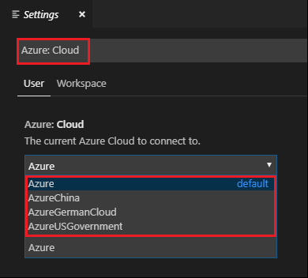
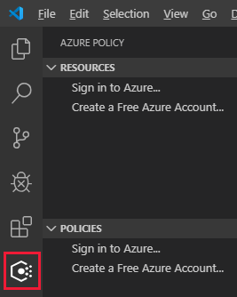

# Use Azure Policy extension for Visual Studio Code

> Applies to Azure Policy extension version **0.0.21** and newer

Learn how to use the Azure Policy extension for Visual Studio Code to look up
[aliases](../concepts/definition-structure.md#aliases) and review resources and policies. First,
we'll describe how to install the Azure Policy extension in Visual Studio Code. Then we'll walk
through how to look up aliases.

Azure Policy extension for Visual Studio Code can be installed on all platforms that are supported
by Visual Studio Code. This support includes Windows, Linux, and macOS.

> [!NOTE]
> Changes made locally to policies viewed in the Azure Policy extension for Visual Studio Code
> aren't synced to Azure.

## Prerequisites

The following items are required for completing the steps in this article:

- An Azure subscription. If you don't have an Azure subscription, create a
  [free account](https://azure.microsoft.com/free/) before you begin.
- [Visual Studio Code](https://code.visualstudio.com).

## Install Azure Policy extension

After you meet the prerequisites, you can install Azure Policy extension for Visual Studio Code by
following these steps:

1. Open Visual Studio Code.

1. From the menu bar, go to **View** > **Extensions**.

1. In the search box, enter **Azure Policy**.

1. Select **Azure Policy** from the search results, and then select **Install**.

1. Select **Reload** when necessary.

## Set the Azure environment

For a national cloud user, follow these steps to set the Azure environment first:

1. Select **File\Preferences\Settings**.

1. Search on the following string: _Azure: Cloud_

1. Select the nation cloud from the list:

   

## Connect to an Azure account

To evaluate resources and lookup aliases, you must connect to your Azure account. Follow these steps
to connect to Azure from Visual Studio Code:

1. Sign in to Azure from the Azure Policy extension or the Command Palette.

   - Azure Policy extension

     From the Azure Policy extension, select **Sign in to Azure**.

     

   - Command Palette

     From the menu bar, go to **View** > **Command Palette**, and enter **Azure: Sign In**.

     

1. Follow the sign in instructions to sign in to Azure. After you're connected, your Azure account
   name is shown on the status bar at the bottom of the Visual Studio Code window.

## Select subscriptions

When you first sign in, only the default subscription resources and policies are loaded by the Azure
Policy extension. To add or remove subscriptions from displaying resources and policies, follow
these steps:

1. Start the subscription command from the Command Palette or the window footer.

   - Command Palette: 

     From the menu bar, go to **View** > **Command Palette**, and enter **Azure Policy: Select Subscriptions**.

   - Window footer

     In the window footer at the bottom of the screen, select the segment that matches **Azure: \<your account\>**.

1. Use the filter box to quickly find subscriptions by name. Then, check or remove the check from
   each subscription to set the subscriptions shown by the Azure Policy extension. When done adding
   or removing subscriptions to display, select **OK**.

## Search for and view resources

The Azure Policy extension lists resources in the selected subscriptions by Resource Provider and by
resource group in the **Resources** pane. The treeview includes the following groupings of resources
within the selected subscription or at the subscription level:

- **Resource Providers**
  - Each registered Resource Provider with resources and related child resources that have policy
    aliases
- **Resource Groups**
  - All resources by the resource group they're in

By default, the extension filters the 'Resource Provider' portion by existing resources and
resources that have policy aliases. Change this behavior in **Settings** > **Extensions** > **Azure
Policy** to see all Resource Providers without filtering.

Customers with hundreds or thousands of resources in a single subscription may prefer a searchable
way to locate their resources. The Azure Policy extension makes it possible to search for a specific
resource with the following steps:

1. Start the search interface from the Azure Policy extension or the Command Palette.

   - Azure Policy extension

     From the Azure Policy extension, hover over the **Resources** panel and select the ellipsis,
     then select **Search Resources**.

   - Command Palette:

     From the menu bar, go to **View** > **Command Palette**, and enter **Resources: Search
     Resources**.

1. If more than one subscription is selected for display, use the filter to select which
   subscription to search.

1. Use the filter to select which resource group to search that is part of the previously chosen
   subscription.

1. Use the filter to select which resource to display. The filter works for both the resource name
   and the resource type.

## Discover aliases for resource properties

When a resource is selected, whether through the search interface or by selecting it in the
treeview, the Azure Policy extension opens the JSON file representing that resource and all it's
Resource Manager property values.

Once a resource is open, hovering over the Resource Manager property name or value displays the
Azure Policy alias if one exists. In this example, the resource is a
`Microsoft.Compute/virtualMachines` resource type and the
**properties.storageProfile.imageReference.offer** property is hovered over. Hovering shows the
matching aliases.

## Search for and view policies and assignments

The Azure Policy extension lists policy types and policy assignments as a treeview for the
subscriptions selected to be displayed in the **Policies** pane. Customers with hundreds or
thousands of policies or assignments in a single subscription may prefer a searchable way to locate
their policies or assignments. The Azure Policy extension makes it possible to search for a specific
policy or assignment with the following steps:

1. Start the search interface from the Azure Policy extension or the Command Palette.

   - Azure Policy extension

     From the Azure Policy extension, hover over the **Policies** panel and select the ellipsis,
     then select **Search Policies**.

   - Command Palette:

     From the menu bar, go to **View** > **Command Palette**, and enter **Policies: Search
     Policies**.

1. If more than one subscription is selected for display, use the filter to select which
   subscription to search.

1. Use the filter to select which policy type or assignment to search that is part of the previously
   chosen subscription.

1. Use the filter to select which policy or to display. The filter works for _displayName_ for the
   policy definition or policy assignment.

When selecting a policy or assignment, whether through the search interface or by selecting it in
the treeview, the Azure Policy extension opens the JSON that represents the policy or assignment and
all its Resource Manager property values. The extension can validate the opened Azure Policy JSON
schema.

## Sign out

From the menu bar, go to **View** > **Command Palette**, and then enter **Azure: Sign Out**.

## Next steps

- Review examples at [Azure Policy samples](../samples/index.md).
- Review the [Azure Policy definition structure](../concepts/definition-structure.md).
- Review [Understanding policy effects](../concepts/effects.md).
- Understand how to [programmatically create policies](programmatically-create.md).
- Learn how to [remediate non-compliant resources](remediate-resources.md).
- Review what a management group is with [Organize your resources with Azure management groups](../../management-groups/overview.md).