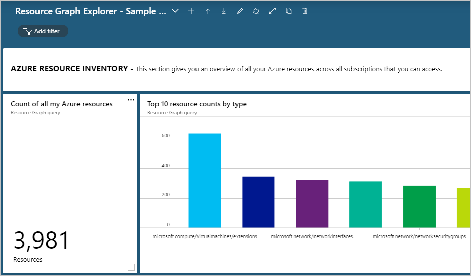
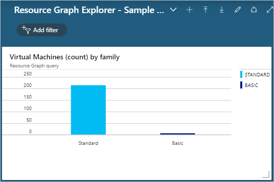

# Quickstart: Run your first Resource Graph query using Azure Resource Graph Explorer

The power of Azure Resource Graph is available directly in Azure portal through Azure Resource Graph
Explorer. Resource Graph Explorer provides browsable information about the Azure Resource Manager
resource types and properties that you can query. Resource Graph Explorer also provides a clean
interface for working with multiple queries, evaluating the results, and even converting the results
of some queries into a chart that can be pinned to an Azure dashboard.

At the end of this quickstart, you'll have used Azure portal and Resource Graph Explorer to run your
first Resource Graph query and pinned the results to a dashboard.

If you don't have an Azure subscription, create a [free](https://azure.microsoft.com/free/) account
before you begin.

## Run your first Resource Graph query

Open the [Azure portal](https://portal.azure.com) to find and use the Resource Graph Explorer
following these steps to run your first Resource Graph query:

1. Select **All services** in the left pane. Search for and select **Resource Graph Explorer**.

1. In the **Query 1** portion of the window, enter the query
   `Resources | project name, type | limit 5` and select **Run query**.

   > [!NOTE]
   > As this query example doesn't provide a sort modifier such as `order by`, running this query
   > multiple times is likely to yield a different set of resources per request.

1. Review the query response in the **Results** tab. Select the **Messages** tab to see details
   about the query, including the count of results and duration of the query. Errors, if any, are
   displayed under this tab.

1. Update the query to `order by` the **Name** property:
   `Resources | project name, type | limit 5 | order by name asc`. Then, select **Run query**.

   > [!NOTE]
   > Just as with the first query, running this query multiple times is likely to yield a different
   > set of resources per request. The order of the query commands is important. In this example,
   > the `order by` comes after the `limit`. This will first limit the query results and then order
   > them.

1. Update the query to first `order by` the **Name** property and then `limit` to the top five
   results: `Resources | project name, type | order by name asc | limit 5`. Then, select **Run
   query**.

When the final query is run several times, assuming that nothing in your environment is changing,
the results returned are consistent and as expected -- ordered by the **Name** property, but still
limited to the top five results.

### Schema browser

The schema browser is located in the left pane of Resource Graph Explorer. This list of resources
shows all the _resource types_ of Azure resources that are both supported by Azure Resource Graph
and that exist in a tenant that you have access to. Expanding a resource type or subproperties show
child properties that can be used to create a Resource Graph query.

Selecting the resource type places `where type =="<resource type>"` into the query box. Selecting
one of the child properties adds `where <propertyName> == "INSERT_VALUE_HERE"` into the query box.
The schema browser is a great way to discover properties for use in queries. Be sure to replace
_INSERT\_VALUE\_HERE_ with your own value, adjust the query with conditions, operators, and
functions to achieve your intended results.

## Create a chart from the Resource Graph query

After running the last query above, if you select the **Charts** tab, you get a message that "the
result set isn't compatible with a pie chart visualization." Queries that list results can't be made
into a chart, but queries that provide counts of resources can. Using the
[Sample query - Count virtual machines by OS type](./samples/starter.md#count-virtual-machines-by-os-type),
let's create a visualization from the Resource Graph query.

1. In the **Query 1** portion of the window, enter the following query and select **Run query**.

   ```kusto
   Resources
   | where type =~ 'Microsoft.Compute/virtualMachines'
   | summarize count() by tostring(properties.storageProfile.osDisk.osType)
   ```

1. Select the **Results** tab and note that the response for this query provides counts.

1. Select the **Charts** tab. Now, the query results in visualizations. Change the type from _Select
   chart type..._ to either _Bar chart_ or _Donut chart_ to experiment with the available
   visualization options.

## Pin the query visualization to a dashboard

When you have results from a query that can be visualized, that data visualization can then be
pinned to one of your dashboards. After running the query above, follow these steps:

1. Select **Save** and provide the name "VMs by OS Type". Then select **Save** at the bottom of the
   right pane.

1. Select **Run query** to rerun the query now that it's been saved.

1. On the **Charts** tab, select a data visualization. Then select **Pin to dashboard**.

1. Either select the portal notification that appears or select **Dashboard** from the left pane.

The query is now available on your dashboard with the title of the tile matching the query name. If
the query was unsaved when it was pinned, it's named 'Query 1' instead.

The query and resulting data visualization run and update each time the dashboard loads, providing
real-time and dynamic insights to your Azure environment directly in your workflow.

> [!NOTE]
> Queries that result in a list can also be pinned to the dashboard. The feature isn't limited to
> data visualizations of queries.

## Import example Resource Graph Explorer dashboards

To provide examples of Resource Graph queries and how Resource Graph Explorer can be used to enhance
your Azure portal workflow, try out these example dashboards.

- [Resource Graph Explorer - Sample Dashboard #1](https://github.com/Azure-Samples/Governance/blob/master/src/resource-graph/portal-dashboards/sample-1/resourcegraphexplorer-sample-1.json)

  [](./media/arge-sample1-large.png#lightbox)

- [Resource Graph Explorer - Sample Dashboard #2](https://github.com/Azure-Samples/Governance/blob/master/src/resource-graph/portal-dashboards/sample-2/resourcegraphexplorer-sample-2.json)

  [](./media/arge-sample2-large.png#lightbox)

> [!NOTE]
> Counts and charts in the above example dashboard screenshots will vary depending on your Azure
> environment.

1. Select and download the sample dashboard you want to evaluate.

1. In Azure portal, select **Dashboard** from the left pane.

1. Select **Upload**, then locate and select the downloaded sample dashboard file. Then select **Open**.

The imported dashboard is automatically displayed. Since it now exists in your Azure portal, you may
explore and make changes as needed or create new dashboards from the example to share with your
teams. For more information about working with dashboards, see [Create and share dashboards in the Azure portal](../../azure-portal/azure-portal-dashboards.md).

## Clean-up resources

If you wish to remove the sample Resource Graph dashboards from your Azure portal environment, you
can do so with the following steps:

1. Select **Dashboard** from the left pane.

1. From the dashboard drop-down, select the sample Resource Graph dashboard you wish to delete.

1. Select **Delete** from the dashboard menu at the top of the dashboard and select **Ok** to
   confirm.

## Next steps

- Get more information about the [query language](./concepts/query-language.md)
- Learn to [explore resources](./concepts/explore-resources.md)
- Run your first query with [Azure CLI](first-query-azurecli.md)
- See samples of [Starter queries](./samples/starter.md)
- See samples of [Advanced queries](./samples/advanced.md)
- Provide feedback on [UserVoice](https://feedback.azure.com/forums/915958-azure-governance)