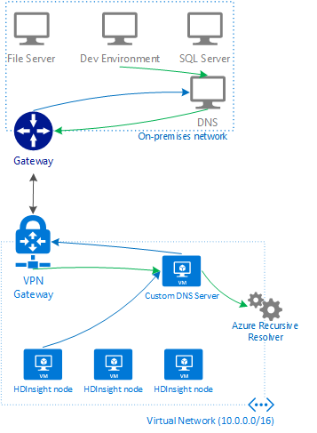
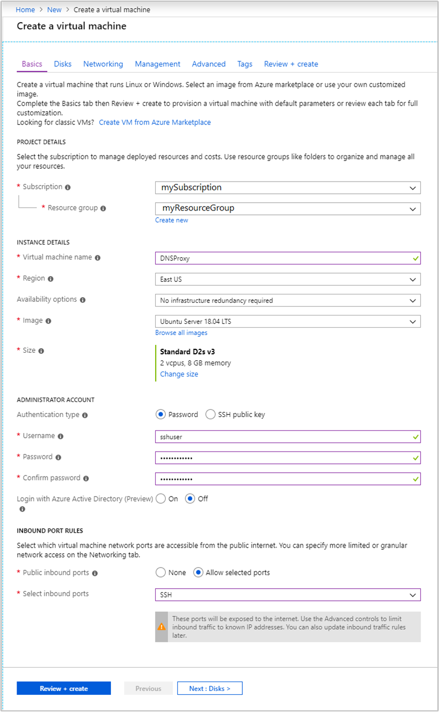
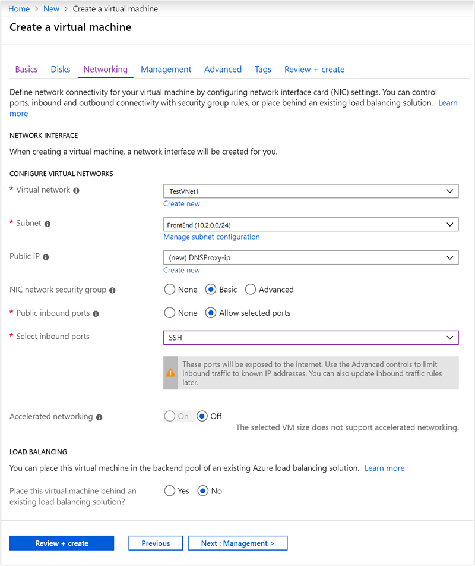
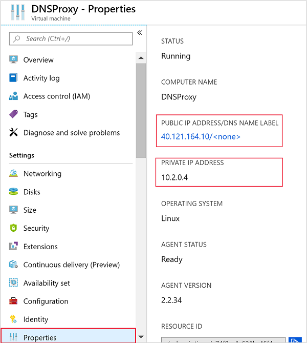
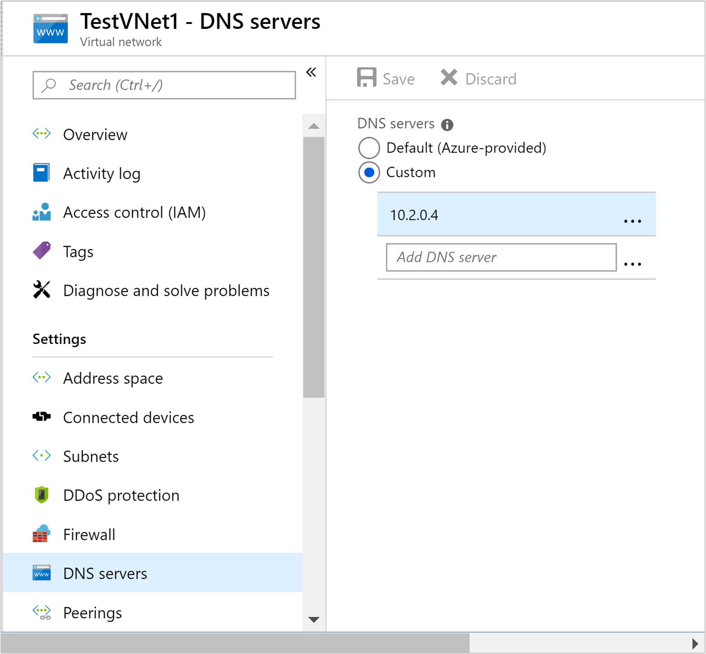

# Connect HDInsight to your on-premises network

Learn how to connect HDInsight to your on-premises network by using Azure Virtual Networks and a VPN gateway. This document provides planning information on:

* Using HDInsight in an Azure Virtual Network that connects to your on-premises network.
* Configuring DNS name resolution between the virtual network and your on-premises network.
* Configuring network security groups to restrict internet access to HDInsight.
* Ports provided by HDInsight on the virtual network.

## Overview

To allow HDInsight and resources in the joined network to communicate by name, you must perform the following actions:

1. Create Azure Virtual Network.
1. Create a custom DNS server in the Azure Virtual Network.
1. Configure the virtual network to use the custom DNS server instead of the default Azure Recursive Resolver.
1. Configure forwarding between the custom DNS server and your on-premises DNS server.

These configurations enable the following behavior:

* Requests for fully qualified domain names that have the DNS suffix __for the virtual network__ are forwarded to the custom DNS server. The custom DNS server then forwards these requests to the Azure Recursive Resolver, which returns the IP address.
* All other requests are forwarded to the on-premises DNS server. Even requests for public internet resources such as microsoft.com are forwarded to the on-premises DNS server for name resolution.

In the following diagram, green lines are requests for resources that end in the DNS suffix of the virtual network. Blue lines are requests for resources in the on-premises network or on the public internet.



## Prerequisites

* An SSH client. For more information, see [Connect to HDInsight (Apache Hadoop) using SSH](./hdinsight-hadoop-linux-use-ssh-unix.md).
* If using PowerShell, you'll need the [AZ Module](https://docs.microsoft.com/powershell/azure/).
* If wanting to use Azure CLI and you haven't yet installed it, see [Install the Azure CLI](/cli/azure/install-azure-cli).

## Create virtual network configuration

Use the following documents to learn how to create an Azure Virtual Network that is connected to your on-premises network:

* [Using Azure portal](../vpn-gateway/vpn-gateway-howto-site-to-site-resource-manager-portal.md)
* [Using Azure PowerShell](../vpn-gateway/vpn-gateway-create-site-to-site-rm-powershell.md)
* [Using Azure CLI](../vpn-gateway/vpn-gateway-howto-site-to-site-resource-manager-cli.md)

## Create custom DNS server

> [!IMPORTANT]  
> You must create and configure the DNS server before installing HDInsight into the virtual network.

These steps use the [Azure portal](https://portal.azure.com) to create an Azure Virtual Machine. For other ways to create a virtual machine, see [Create VM - Azure CLI](../virtual-machines/linux/quick-create-cli.md) and [Create VM - Azure PowerShell](../virtual-machines/linux/quick-create-powershell.md).  To create a Linux VM that uses the [Bind](https://www.isc.org/downloads/bind/) DNS software, use the following steps:

1. Sign in to the [Azure portal](https://portal.azure.com).
  
1. From the top menu, select **+ Create a resource**.

    

1. Select **Compute** > **Virtual machine** to go to the **Create a virtual machine** page.

1. From the __Basics__ tab, enter the following information:  
  
    | Field | Value |
    | --- | --- |
    |Subscription |Select your appropriate subscription.|
    |Resource group |Select the resource group that contains the virtual network created earlier.|
    |Virtual machine name | Enter a friendly name that identifies this virtual machine. This example uses **DNSProxy**.|
    |Region | Select the same region as the virtual network created earlier.  Not all VM sizes are available in all regions.  |
    |Availability options |  Select your desired level of availability.  Azure offers a range of options for managing availability and resiliency for your applications.  Architect your solution to use replicated VMs in Availability Zones or Availability Sets to protect your apps and data from datacenter outages and maintenance events. This example uses **No infrastructure redundancy required**. |
    |Image | Leave at **Ubuntu Server 18.04 LTS**. |
    |Authentication type | __Password__ or __SSH public key__: The authentication method for the SSH account. We recommend using public keys, as they're more secure. This example uses **Password**.  For more information, see the [Create and use SSH keys for Linux VMs](../virtual-machines/linux/mac-create-ssh-keys.md) document.|
    |User name |Enter the administrator username for the VM.  This example uses **sshuser**.|
    |Password or SSH public key | The available field is determined by your choice for **Authentication type**.  Enter the appropriate value.|
    |Public inbound ports|Select **Allow selected ports**. Then select **SSH (22)** from the **Select inbound ports** drop-down list.|

    

    Leave other entries at the default values and then select the **Networking** tab.

4. From the **Networking** tab, enter the following information:

    | Field | Value |
    | --- | --- |
    |Virtual network | Select the virtual network that you created earlier.|
    |Subnet | Select the default subnet for the virtual network that you created earlier. Do __not__ select the subnet used by the VPN gateway.|
    |Public IP | Use the autopopulated value.  |

    

    Leave other entries at the default values and then select the **Review + create**.

5. From the **Review + create** tab, select **Create** to create the virtual machine.

### Review IP Addresses

Once the virtual machine has been created, you'll receive a **Deployment succeeded** notification with a **Go to resource** button.  Select **Go to resource** to go to your new virtual machine.  From the default view for your new virtual machine, follow these steps to identify the associated IP Addresses:

1. From **Settings**, select **Properties**.

2. Note the values for **PUBLIC IP ADDRESS/DNS NAME LABEL** and **PRIVATE IP ADDRESS** for later use.

   

### Install and configure Bind (DNS software)

1. Use SSH to connect to the __public IP address__ of the virtual machine. Replace `sshuser` with the SSH user account you specified when creating the VM. The following example connects to a virtual machine at 40.68.254.142:

    ```bash
    ssh sshuser@40.68.254.142
    ```

2. To install Bind, use the following commands from the SSH session:

    ```bash
    sudo apt-get update -y
    sudo apt-get install bind9 -y
    ```

3. To configure Bind to forward name resolution requests to your on premises DNS server, use the following text as the contents of the `/etc/bind/named.conf.options` file:

    ```DNS Zone file
    acl goodclients {
        10.0.0.0/16; # Replace with the IP address range of the virtual network
        10.1.0.0/16; # Replace with the IP address range of the on-premises network
        localhost;
        localnets;
    };

    options {
            directory "/var/cache/bind";

            recursion yes;

            allow-query { goodclients; };

            forwarders {
            192.168.0.1; # Replace with the IP address of the on-premises DNS server
            };

            dnssec-validation auto;

            auth-nxdomain no;    # conform to RFC1035
            listen-on { any; };
    };
    ```

    > [!IMPORTANT]  
    > Replace the values in the `goodclients` section with the IP address range of the virtual network and on-premises network. This section defines the addresses that this DNS server accepts requests from.
    >
    > Replace the `192.168.0.1` entry in the `forwarders` section with the IP address of your on-premises DNS server. This entry routes DNS requests to your on-premises DNS server for resolution.

    To edit this file, use the following command:

    ```bash
    sudo nano /etc/bind/named.conf.options
    ```

    To save the file, use __Ctrl+X__, __Y__, and then __Enter__.

4. From the SSH session, use the following command:

    ```bash
    hostname -f
    ```

    This command returns a value similar to the following text:

    ```output
    dnsproxy.icb0d0thtw0ebifqt0g1jycdxd.ex.internal.cloudapp.net
    ```

    The `icb0d0thtw0ebifqt0g1jycdxd.ex.internal.cloudapp.net` text is the __DNS suffix__ for this virtual network. Save this value, as it's used later.

5. To configure Bind to resolve DNS names for resources within the virtual network, use the following text as the contents of the `/etc/bind/named.conf.local` file:

    ```DNS Zone file
    // Replace the following with the DNS suffix for your virtual network
    zone "icb0d0thtw0ebifqt0g1jycdxd.ex.internal.cloudapp.net" {
        type forward;
        forwarders {168.63.129.16;}; # The Azure recursive resolver
    };
    ```

    > [!IMPORTANT]  
    > You must replace the `icb0d0thtw0ebifqt0g1jycdxd.ex.internal.cloudapp.net` with the DNS suffix you retrieved earlier.

    To edit this file, use the following command:

    ```bash
    sudo nano /etc/bind/named.conf.local
    ```

    To save the file, use __Ctrl+X__, __Y__, and then __Enter__.

6. To start Bind, use the following command:

    ```bash
    sudo service bind9 restart
    ```

7. To verify that bind can resolve the names of resources in your on-premises network, use the following commands:

    ```bash
    sudo apt install dnsutils
    nslookup dns.mynetwork.net 10.0.0.4
    ```

    > [!IMPORTANT]  
    > Replace `dns.mynetwork.net` with the fully qualified domain name (FQDN) of a resource in your on-premises network.
    >
    > Replace `10.0.0.4` with the __internal IP address__ of your custom DNS server in the virtual network.

    The response appears similar to the following text:

    ```output
    Server:         10.0.0.4
    Address:        10.0.0.4#53

    Non-authoritative answer:
    Name:   dns.mynetwork.net
    Address: 192.168.0.4
    ```

## Configure virtual network to use the custom DNS server

To configure the virtual network to use the custom DNS server instead of the Azure recursive resolver, use the following steps from the [Azure portal](https://portal.azure.com):

1. From the left menu, navigate to  **All services** > **Networking** > **Virtual networks**.

2. Select your virtual network from the list, which will open the default view for your virtual network.  

3. From the default view, under **Settings**, select **DNS servers**.  

4. Select __Custom__, and enter the **PRIVATE IP ADDRESS** of the custom DNS server.

5. Select __Save__.  <br />  

    

## Configure on-premises DNS server

In the previous section, you configured the custom DNS server to forward requests to the on-premises DNS server. Next, you must configure the on-premises DNS server to forward requests to the custom DNS server.

For specific steps on how to configure your DNS server, consult the documentation for your DNS server software. Look for the steps on how to configure a __conditional forwarder__.

A conditional forward only forwards requests for a specific DNS suffix. In this case, you must configure a forwarder for the DNS suffix of the virtual network. Requests for this suffix should be forwarded to the IP address of the custom DNS server. 

The following text is an example of a conditional forwarder configuration for the **Bind** DNS software:

```DNS Zone file
zone "icb0d0thtw0ebifqt0g1jycdxd.ex.internal.cloudapp.net" {
    type forward;
    forwarders {10.0.0.4;}; # The custom DNS server's internal IP address
};
```

For information on using DNS on **Windows Server 2016**, see the [Add-DnsServerConditionalForwarderZone](https://technet.microsoft.com/itpro/powershell/windows/dnsserver/add-dnsserverconditionalforwarderzone) documentation...

Once you've configured the on-premises DNS server, you can use `nslookup` from the on-premises network to verify that you can resolve names in the virtual network. The following example 

```bash
nslookup dnsproxy.icb0d0thtw0ebifqt0g1jycdxd.ex.internal.cloudapp.net 196.168.0.4
```

This example uses the on-premises DNS server at 196.168.0.4 to resolve the name of the custom DNS server. Replace the IP address with the one for the on-premises DNS server. Replace the `dnsproxy` address with the fully qualified domain name of the custom DNS server.

## Optional: Control network traffic

You can use network security groups (NSG) or user-defined routes (UDR) to control network traffic. NSGs allow you to filter inbound and outbound traffic, and allow or deny the traffic. UDRs allow you to control how traffic flows between resources in the virtual network, the internet, and the on-premises network.

> [!WARNING]  
> HDInsight requires inbound access from specific IP addresses in the Azure cloud, and unrestricted outbound access. When using NSGs or UDRs to control traffic, you must perform the following steps:

1. Find the IP addresses for the location that contains your virtual network. For a list of required IPs by location, see [Required IP addresses](./hdinsight-management-ip-addresses.md).

2. For the IP addresses identified in step 1, allow inbound traffic from that IP addresses.

   * If you're using __NSG__: Allow __inbound__ traffic on port __443__ for the IP addresses.
   * If you're using __UDR__: Set the __Next Hop__ type of the route to __Internet__ for the IP addresses.

For an example of using Azure PowerShell or the Azure CLI to create NSGs, see the [Extend HDInsight with Azure Virtual Networks](hdinsight-create-virtual-network.md#hdinsight-nsg) document.

## Create the HDInsight cluster

> [!WARNING]  
> You must configure the custom DNS server before installing HDInsight in the virtual network.

Use the steps in the [Create an HDInsight cluster using the Azure portal](./hdinsight-hadoop-create-linux-clusters-portal.md) document to create an HDInsight cluster.

> [!WARNING]  
> * During cluster creation, you must choose the location that contains your virtual network.
> * In the __Advanced settings__ part of configuration, you must select the virtual network and subnet that you created earlier.

## Connecting to HDInsight

Most documentation on HDInsight assumes that you have access to the cluster over the internet. For example, that you can connect to the cluster at `https://CLUSTERNAME.azurehdinsight.net`. This address uses the public gateway, which isn't available if you have used NSGs or UDRs to restrict access from the internet.

Some documentation also references `headnodehost` when connecting to the cluster from an SSH session. This address is only available from nodes within a cluster, and isn't usable on clients connected over the virtual network.

To directly connect to HDInsight through the virtual network, use the following steps:

1. To discover the internal fully qualified domain names of the HDInsight cluster nodes, use one of the following methods:

    ```powershell
    $resourceGroupName = "The resource group that contains the virtual network used with HDInsight"

    $clusterNICs = Get-AzNetworkInterface -ResourceGroupName $resourceGroupName | where-object {$_.Name -like "*node*"}

    $nodes = @()
    foreach($nic in $clusterNICs) {
        $node = new-object System.Object
        $node | add-member -MemberType NoteProperty -name "Type" -value $nic.Name.Split('-')[1]
        $node | add-member -MemberType NoteProperty -name "InternalIP" -value $nic.IpConfigurations.PrivateIpAddress
        $node | add-member -MemberType NoteProperty -name "InternalFQDN" -value $nic.DnsSettings.InternalFqdn
        $nodes += $node
    }
    $nodes | sort-object Type
    ```

    ```azurecli
    az network nic list --resource-group <resourcegroupname> --output table --query "[?contains(name,'node')].{NICname:name,InternalIP:ipConfigurations[0].privateIpAddress,InternalFQDN:dnsSettings.internalFqdn}"
    ```

2. To determine the port that a service is available on, see the [Ports used by Apache Hadoop services on HDInsight](./hdinsight-hadoop-port-settings-for-services.md) document.

    > [!IMPORTANT]  
    > Some services hosted on the head nodes are only active on one node at a time. If you try accessing a service on one head node and it fails, switch to the other head node.
    >
    > For example, Apache Ambari is only active on one head node at a time. If you try accessing Ambari on one head node and it returns a 404 error, then it is running on the other head node.

## Next steps

* For more information on using HDInsight in a virtual network, see [Plan a virtual network deployment for Azure HDInsight clusters](./hdinsight-plan-virtual-network-deployment.md).

* For more information on Azure virtual networks, see the [Azure Virtual Network overview](../virtual-network/virtual-networks-overview.md).

* For more information on network security groups, see [Network security groups](../virtual-network/security-overview.md).

* For more information on user-defined routes, see [User-defined routes and IP forwarding](../virtual-network/virtual-networks-udr-overview.md).
