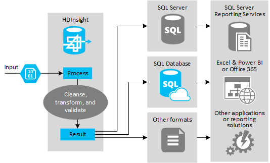

# Use Apache Hive as an Extract, Transform, and Load (ETL) tool

You typically need to clean and transform incoming data before loading it into a destination suitable for analytics. Extract, Transform, and Load (ETL) operations are used to prepare data and load it into a data destination.  Apache Hive on HDInsight can read in unstructured data, process the data as needed, and then load the data into a relational data warehouse for decision support systems. In this approach, data is extracted from the source and stored in scalable storage, such as Azure Storage blobs or Azure Data Lake Storage. The data is then transformed using a sequence of Hive queries and is finally staged within Hive in preparation for bulk loading into the destination data store.

## Use case and model overview

The following figure shows an overview of the use case and model for ETL automation. Input data is transformed to generate the appropriate output.  During that transformation, the data can change shape, data type, and even language.  ETL processes can convert Imperial to metric, change time zones, and improve precision to properly align with existing data in the destination.  ETL processes can also combine new data with existing data to keep reporting up to date, or to provide further insight into existing data.  Applications such as reporting tools and services can then consume this data in the desired format.



Hadoop is typically used in ETL processes that import either a massive number of text files (like CSVs) or a smaller but frequently changing number of text files, or both.  Hive is a great tool to use to prepare the data before loading it into the data destination.  Hive allows you to create a schema over the CSV and use a SQL-like language to generate MapReduce programs that interact with the data.

The typical steps to using Hive to perform ETL are as follows:

1. Load data into Azure Data Lake Storage or Azure Blob Storage.
2. Create a Metadata Store database (using Azure SQL Database) for use by Hive in storing your schemas.
3. Create an HDInsight cluster and connect the data store.
4. Define the schema to apply at read-time over data in the data store:

    ```
    DROP TABLE IF EXISTS hvac;

    --create the hvac table on comma-separated sensor data stored in Azure Storage blobs

    CREATE EXTERNAL TABLE hvac(`date` STRING, time STRING, targettemp BIGINT,
        actualtemp BIGINT,
        system BIGINT,
        systemage BIGINT,
        buildingid BIGINT)
    ROW FORMAT DELIMITED FIELDS TERMINATED BY ','
    STORED AS TEXTFILE LOCATION 'wasbs://{container}@{storageaccount}.blob.core.windows.net/HdiSamples/SensorSampleData/hvac/';
    ```

5. Transform the data and load it into the destination.  There are several ways to use Hive during the transformation and loading:

    * Query and prepare data using Hive and save it as a CSV in Azure Data Lake Storage or Azure blob storage.  Then use a tool like SQL Server Integration Services (SSIS) to acquire those CSVs and load the data into a destination relational database such as SQL Server.
    * Query the data directly from Excel or C# using the Hive ODBC driver.
    * Use [Apache Sqoop](apache-hadoop-use-sqoop-mac-linux.md) to read the prepared flat CSV files and load them into the destination relational database.

## Data sources

Data sources are typically external data that can be matched to existing data in your data store, for example:

* Social media data, log files, sensors, and applications that generate data files.
* Datasets obtained from data providers, such as weather statistics or vendor sales numbers.
* Streaming data captured, filtered, and processed through a suitable tool or framework.

<!-- TODO: (see Collecting and loading data into HDInsight). -->

## Output targets

You can use Hive to output data to a variety of targets including:

* A relational database, such as SQL Server or Azure SQL Database.
* A data warehouse, such as Azure SQL Data Warehouse.
* Excel.
* Azure table and blob storage.
* Applications or services that require data to be processed into specific formats, or as files that contain specific types of information structure.
* A JSON Document Store like [Azure Cosmos DB](https://azure.microsoft.com/services/cosmos-db/).

## Considerations

The ETL model is typically used when you want to:

* Load stream data or large volumes of semi-structured or unstructured data from external sources into an existing database or information system.
* Clean, transform, and validate the data before loading it, perhaps by using more than one transformation pass through the cluster.
* Generate reports and visualizations that are regularly updated.  For example, if the report takes too long to generate during the day,  you can schedule the report to run at night.  You can use Azure Scheduler and PowerShell to automatically run a Hive query.

If the target for the data isn't a database, you can generate a file in the appropriate format within the query, for example a CSV. This file can then be imported into Excel or Power BI.

If you need to execute several operations on the data as part of the ETL process, consider how you manage them. If the operations are controlled by an external program, rather than as a workflow within the solution, you need to decide whether some operations can be executed in parallel, and to detect when each job  completes. Using a workflow mechanism such as Oozie within Hadoop may be easier than trying to orchestrate a sequence of operations using external scripts or custom programs. For more information about Oozie, see [Workflow and job orchestration](https://msdn.microsoft.com/library/dn749829.aspx).

## Next steps

* [ETL at scale](apache-hadoop-etl-at-scale.md)
* [Operationalize a data pipeline](../hdinsight-operationalize-data-pipeline.md)

<!-- * [ETL Deep Dive](../hdinsight-etl-deep-dive.md) -->
